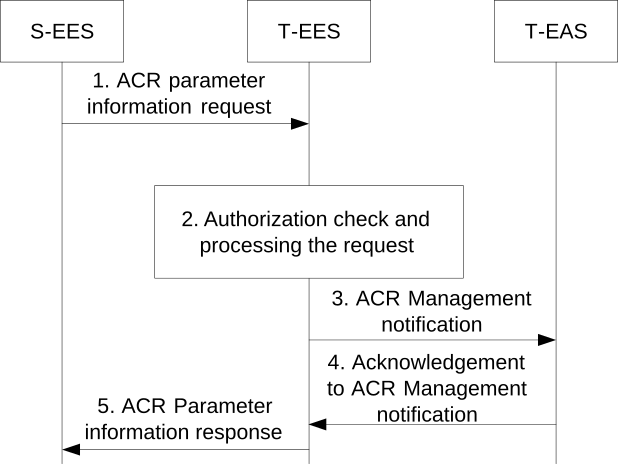

# 8.8.3.9 ACR parameter information procedure

Figure 8.8.3.9-1 illustrates the procedure for sending ACR parameters from S-EES to the T-EES and T-EAS. The procedure may be used by the S-EES at the beginning of the ACR execution to provide ACR parameters, e.g. prediction expiration time, to the T-EES and T-EAS. The procedure may also be used during an ongoing ACR to update ACR parameters. This procedure is also applicable for the CES to send ACR parameter information to the T-EES.

Pre-condition:

1\. The ACR has been launched to the S-EES.

Figure 8.8.3.9-1: ACR parameter information procedure

1\. The S-EES sends the ACR parameter information request to the T-EES.

2\. The T-EES checks if the requestor is authorized for this operation. If authorized, the T-EES processes the request.

3\. If the request is authorized and if the T-EAS has subscribed to receive ACR notifications, the EES shall notify the T-EAS by sending an ACR management notification, with "ACT start" event including ACR parameters from the request in step 1, e.g. Prediction expiration time.

4\. In case of service continuity planning, if the T-EAS had included indication of EAS Acknowledgement within ACR management subscribe request, the T-EAS sends EAS Acknowledgement as a response to the ACR management notification. In the Acknowledgement, the T-EAS indicates the acceptance or rejection of the ACT considering ACR parameters (e.g. prediction expiration time).

NOTE: The T-EAS can use the ACR parameters to handle the ACR. For example, the T-EAS can consider prediction expiration time in deciding whether and for how long to wait for the AC of the UE to connect to it. If the ACT is performed, and the AC does not connect to the T-EAS by "Prediction expiration time", the EAS can send ACT failure with the appropriate cause to the EES. In that case, the T-EAS can delete the transferred application context.

5\. The EES responds to the requestor's request with an ACR parameter information response message.
