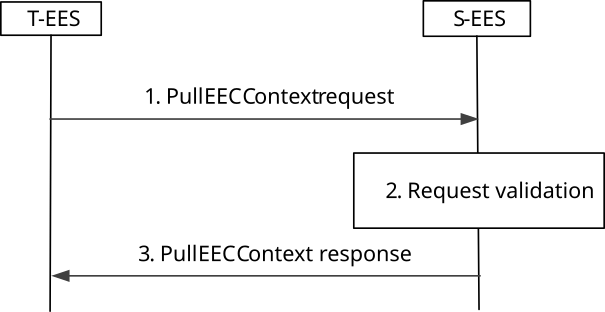
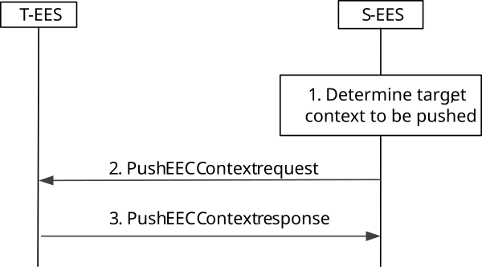

# 8.9 EEC Context and EEC Context relocation

## 8.9.1 General

EEC Context contains information related to an EEC which is used by EESs to provide the Edge Enabler Layer services. The EEC Context may include information about the EEC-hosting UE and the ACs to which the EEC provides services. The EEC Context information may be collected and maintained at the EES in an EDN while the respective ACs are connected to EASs in that EDN.

EEC Context relocation procedures allow the EEC Context information to be shared between EESs (via EDGE-9 interactions).

The EEC Context information may contain List of EDGE-1 subscriptions (i.e., list of subscription IDs for an EEC). The corresponding EDGE-1 subscription information includes EEC ID, Event ID, subscription ID, 3GPP CN subscription information (optional), notification target address (optional) and filter information (optional).

### 8.9.1.1 EEC Context handling at EEC registration

An EEC Context shall be created for each registered EEC, after a successful registration, by the receiver EES, as follows:

\- If the EEC registration request does not include a previously assigned EEC Context ID value, the receiver EES creates an EEC Context as described in clause 8.2.8. The receiver EES shall assign an EEC context ID and set the source EES Endpoint to its own Endpoint. The EEC ID and UE Identifier shall be set based on the corresponding registration request parameters.

\- If the EEC registration request contains an EEC context ID and source EES Endpoint, the receiver (i.e., target) EES performs an EEC Context Pull relocation (clause 8.9.2.2). After a successful EEC Context relocation, the target EES updates the source EES Endpoint with its own Endpoint. The target EES may preserve the EEC Context ID received in the request or assign a new EEC Context ID, subject to EES implementation and local policies.

If the EEC Context relocation is not successful, the target EES creates an EEC Context as described in clause 8.2.8. The target EES shall assign an EEC context ID and set the source EES Endpoint to its own endpoint. The EEC ID and UE ID shall be set based on the corresponding registration request parameters.

After a successful EEC Context Relocation procedure is performed at EEC (re-)registration to a target EES, the source EES shall determine to be stale the EEC Context identified by the EEC Context ID included in the request (i.e., relocated) and the EEC to be de-registered.

### 8.9.1.2 EEC Context handling at EEC registration update

An EEC Context shall be updated when EEC Registration update requests targeting the corresponding EEC ID are received.

### 8.9.1.3 EEC Context handling at EEC de-registration

An EEC Context, including the list of Service Session Context(s) information, shall be determined to be stale after a successful EEC de-registration procedure.

NOTE: Stale EEC Context(s) are subject to information persistence policies and privacy policies. Mechanisms for re-use of stale EEC Context(s) are not in scope of the current version of specification.

### 8.9.1.4 EEC Context handling at Application Context Relocation

The EEC Context provided to a target EES in an EEC Context Pull relocation or an EEC context Push relocation shall be stored at the target EES, as follows:

\- If an EEC context with the same EEC ID, EEC Context ID and source Endpoint already exists at the target EES, the EEC Context is updated.

\- If an EEC context with the same EEC ID, EEC Context ID and source Endpoint does not exist at the target EES, the EEC Context is stored.

After a successful EEC Context Relocation procedure is performed at ACR, the source EES shall determine to be stale the element(s) of the list of Service Session Context(s) information included in the request (i.e., relocated). If all Service Session Context(s) information in the EEC Context are stale, the EEC Context is determined to be stale and the EEC to be de-registered.

### 8.9.1.5 Other EEC Context handling

Elements of the list of Service Session Context(s) information shall be created by the EES when it determines that a registered EAS is providing services to an AC on the served EEC.

Elements of the list of Service Session Context(s) information shall be determined to be stale when the EES determines that a registered EAS is no longer providing services to an AC on the served EEC.

NOTE: In this version of specification, mechanisms used by EES to determine that a registered EAS is no longer providing services to an AC on a served EEC are implementation-dependent.

An EEC Context shall be updated as follows:

\- When EEC Context(s) are created, either after a registration request or based on EEC Context relocation procedure, the EES shall check whether the UE Identifier corresponds to an existing EEC Context and update the EEC Context accordingly.

\- When EEC subscription requests corresponding to the EEC ID are processed, the "List of EDGE-1 subscriptions" shall be updated accordingly

## 8.9.2 Procedures

### 8.9.2.1 General

The following procedures are supported for EEC Context relocation:

\- EEC Context Push; and

\- EEC Context Pull.

### 8.9.2.2 EEC Context Pull relocation

An EEC Context is relocated via an EEC Context Pull request initiated by the target EES.

Figure 8.9.2.2-1 illustrates the EEC Context Pull.

Pre-conditions:

1\. The source EES has provided the EEC with an EEC Context ID; and

2\. The target EES has received the EEC Context ID, source EES Endpoint.

Figure 8.9.2.2-1: EEC Context Pull procedure

1\. The target EES requests an EEC Context from the source EES. The request includes EEC Context ID.

2\. Upon receiving the request from the target EES, the source EES validates the request and verifies the security credentials of the requester. The source EES uses the EEC Context ID provided to identify and authorize the EEC Context to be relocated.

3\. The source EES sends a successful EEC Context response. The target EES stores the received EEC Context.

### 8.9.2.3 EEC Context Push relocation

An EEC Context is relocated via an EEC Context Push request initiated by the source EES. This procedure is also applicable for the CES to push EEC Context to the T-EES.

Pre-conditions:

1\. The source EES has provided the EEC with an EEC Context ID.

Figure 8.9.2.3-2: EEC Context relocation procedure initiated by source EES

1\. The source EES determines to forward EEC Context for relocation to a target EES. The source EES determines the target and the EEC Context to be forwarded.

2\. The source EES sends EEC Context Push request to the target EES including the EEC Context determined.

3\. Upon receiving the request from the source EES, the target EES validates the request and verifies the security credentials. The target EES uses the EEC Context ID provided to authorize the EEC Context to be stored and managed. Then the target EES sends an EEC Context response indicating success. The T-EES performs implicit registration and creates the registration ID for the registration and includes it in the EEC context push response message for S-EAS decided ACR or S-EES executed ACR scenarios. The S-EES stores the registration details, and when required, notifies the EEC about registration details while sending ACR information notification.

If the request in step 2 includes the list of selected ACR scenarios within the EEC context, and if the list cannot be supported by T-EES or T-EAS, new list of selected ACR scenarios needs to be selected based on the request from S-EES. The T-EES selects a list of selected ACR scenarios based on T-EES and T-EAS capabilities and "EEC Service Continuity Support" if the IE has been provided in the EEC context and includes it in the Push EEC context response.

NOTE 1: In this release, ACR scenario list transfer is not supported if EEC is not registered. The EEC can perform EEC Context establishment and ACR scenario selection with the target EES.

NOTE 2: The new list of selected ACR scenarios selected by the T-EES based on the T-EES and T-EAS capabilities and the received "EEC Service Continuity Support" can be used for handling future ACR scenarios.

## 8.9.3 Information flows

### 8.9.3.1 General

The following information flows are specified for EEC Context relocation:

\- EEC Context Pull request and response; and

\- EEC Context Push request and response.

### 8.9.3.2 EEC Context Pull request

Table 8.9.3.2-1 describes information elements in the EEC Context Pull request between two EES.

Table 8.9.3.2-1: EEC Context Pull request

|                                            |            |                                                                                                |
|--------------------------------------------|------------|------------------------------------------------------------------------------------------------|
| **Information element**                    | **Status** | **Description**                                                                                |
| EES ID                                     | M          | Unique identifier of the requesting EES.                                                       |
| Security credentials                       | M          | Security credentials resulting from a successful authorization for the edge computing service. |
| EEC Context ID                             | M          | Unique identifier of the EEC Context used to authorize the transfer.                           |
| List of Service Session Contexts requested | O          | List of Service Session Context IEs requested to be pulled                                     |
| \> EAS ID                                  | M          | Identifier of the EAS providing the application services                                       |
| \> EAS Endpoint                            | M          | Endpoint information of the EAS.                                                               |
| \> EEC ID                                  | O          | Unique identifier of the EEC.                                                                  |

### 8.9.3.3 EEC Context Pull response

Table 8.9.3.3-1 describes information elements in the EEC Context Pull response between two EESs.

Table 8.9.3.3-1: EEC Context Pull response

|                     |        |                                                                          |
|---------------------|--------|--------------------------------------------------------------------------|
| Information element | Status | Description                                                              |
| Successful response | O      | Indicates that the request was successful.                               |
| \>EEC Context       | O      | EEC Context, mandatory if the request was successful                     |
| Failure response    | O      | Indicates that the request failed.                                       |
| \> Cause            | O      | Indicates the cause of request failure, mandatory if the request failed. |

### 8.9.3.4 EEC Context Push request

Table 8.9.3.4-1 describes information elements in the EEC Context Push request between two EESs or between CES and EES.

Table 8.9.3.4-1: EEC Context Push request

<table>
<colgroup>
<col style="width: 33%" />
<col style="width: 16%" />
<col style="width: 50%" />
</colgroup>
<tbody>
<tr class="odd">
<td><strong>Information element</strong></td>
<td><strong>Status</strong></td>
<td><strong>Description</strong></td>
</tr>
<tr class="even">
<td>EES ID</td>
<td>M</td>
<td>Unique identifier of the requesting EES or CES.</td>
</tr>
<tr class="odd">
<td>Security credentials</td>
<td>M</td>
<td>Security credentials resulting from a successful authorization for the edge computing service.</td>
</tr>
<tr class="even">
<td>EEC Context(s)</td>
<td>
M

(NOTE)
</td>
<td>EEC Context list</td>
</tr>
<tr class="odd">
<td>T-EAS Endpoint</td>
<td>O</td>
<td>The endpoint of the selected T-EAS</td>
</tr>
<tr class="even">
<td>ACR scenario selection request</td>
<td>O</td>
<td>Indicates T-EES to select the ACR scenario.</td>
</tr>
<tr class="odd">
<td colspan="3">NOTE: This IE contains list only when EEC context push is initiated for more than one UEs connected to common EAS. Otherwise, it contains single EEC context to be pushed to T-EES.</td>
</tr>
</tbody>
</table>

### 8.9.3.5 EEC Context Push response

Table 8.9.3.5-1 describes information elements in the EEC Context Push response between two EES or between CES and EES.

Table 8.9.3.5-1: EEC Context Push response

|                                                                                 |        |                                                                          |
|---------------------------------------------------------------------------------|--------|--------------------------------------------------------------------------|
| Information element                                                             | Status | Description                                                              |
| Successful response                                                             | O      | Indicates that the request was successful.                               |
| \> registration ID (NOTE)                                                       | O      | Identifier of the registration for the EEC                               |
| \> expiration time (NOTE)                                                       | O      | Indicates the expiration time of the EEC registration.                   |
| \> Selected ACR scenario list                                                   | O      | The list of ACR scenarios selected by the T-EES                          |
| Failure response                                                                | O      | Indicates that the request failed.                                       |
| \> Cause                                                                        | O      | Indicates the cause of request failure, mandatory if the request failed. |
| NOTE: This IE shall be included if implicit registration is performed by T-EES. |        |                                                                          |

## 8.9.4 APIs

### 8.9.4.1 General

Table 8.9.4.1-1 illustrates the EEC context management.

Table 8.9.4.1-1: EEC context management APIs

<table>
<colgroup>
<col style="width: 40%" />
<col style="width: 23%" />
<col style="width: 19%" />
<col style="width: 16%" />
</colgroup>
<thead>
<tr class="header">
<th>API Name</th>
<th>API Operations</th>
<th>
Operation

Semantics
</th>
<th>Consumer(s)</th>
</tr>
</thead>
<tbody>
<tr class="odd">
<td>Eees_EECContextPull</td>
<td>Request</td>
<td>Request/Response</td>
<td>EES</td>
</tr>
<tr class="even">
<td>Eees_EECContextPush</td>
<td>Request</td>
<td>Request/Response</td>
<td>EES, CES</td>
</tr>
</tbody>
</table>

### 8.9.4.2 Eees_EECContextPull API

#### 8.9.4.2.1 General

This clause describes the Eees_EECContextPull API and its operations.

#### 8.9.4.2.2 Eees_EECContextPull_Request operation

**API operation name:** Eees_EECContextPull_Request

**Description:** The consumer requests for the EEC context from the EES.

**Inputs:** See clause 8.9.3.2.

**Outputs:** See clause 8.9.3.3*.*

See clause 8.9.2.2 for details of usage of this operation.

### 8.9.4.3 Eees_EECContextPush API

#### 8.9.4.3.1 General

This clause describes the Eees_EECContextPush API and its operations.

#### 8.9.4.3.2 Eees_EECContextPush_Request operation

**API operation name:** Eees_EECContextPush_Request

**Description:** The consumer pushes the EEC context to another EES.

**Inputs:** See clause 8.9.3.4.

**Outputs:** See clause 8.9.3.5*.*

See clause 8.9.2.3 for details of usage of this operation.
