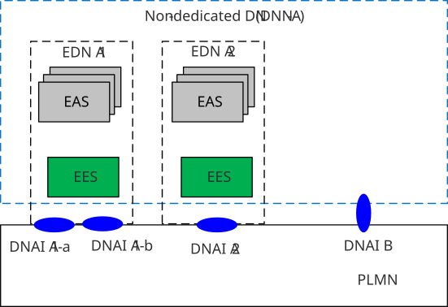
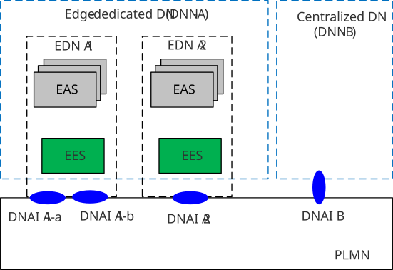
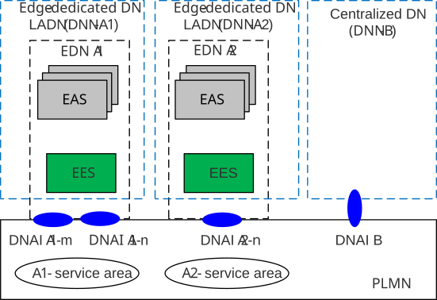
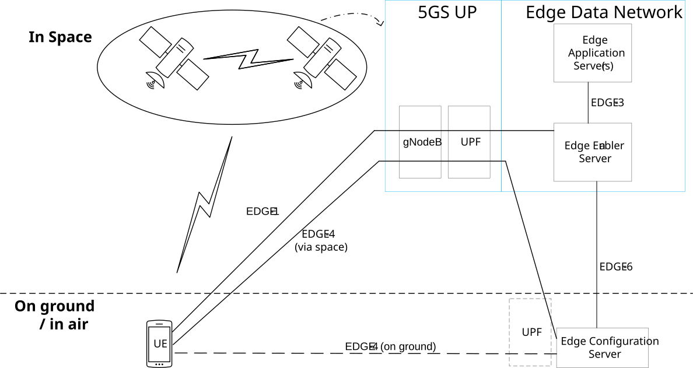
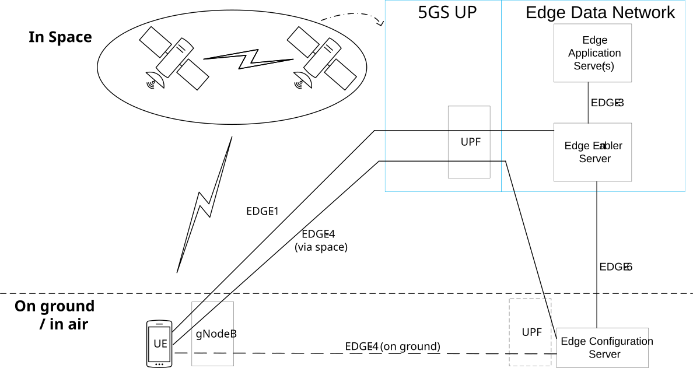
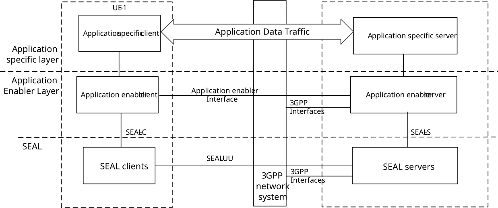
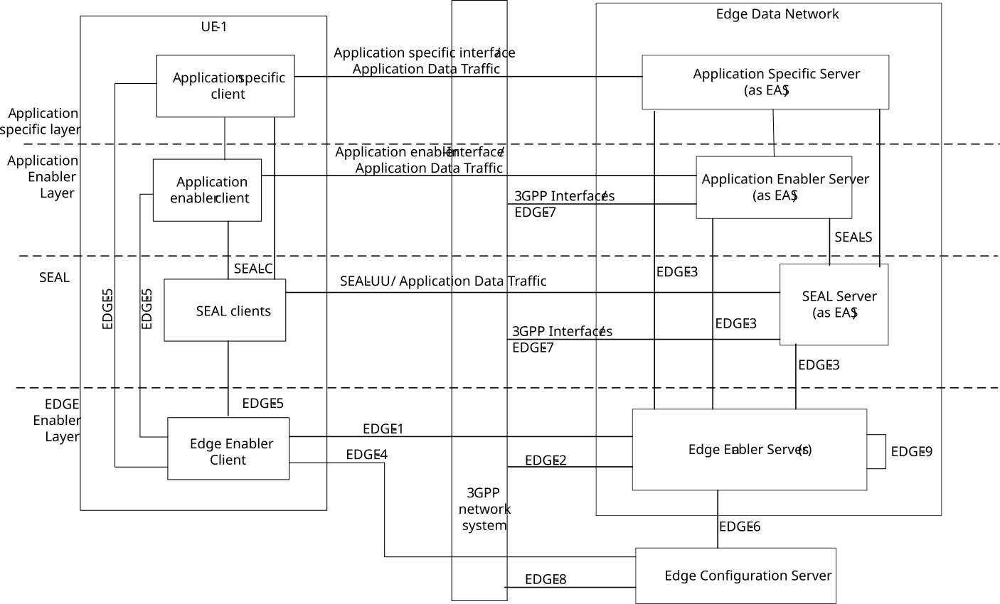
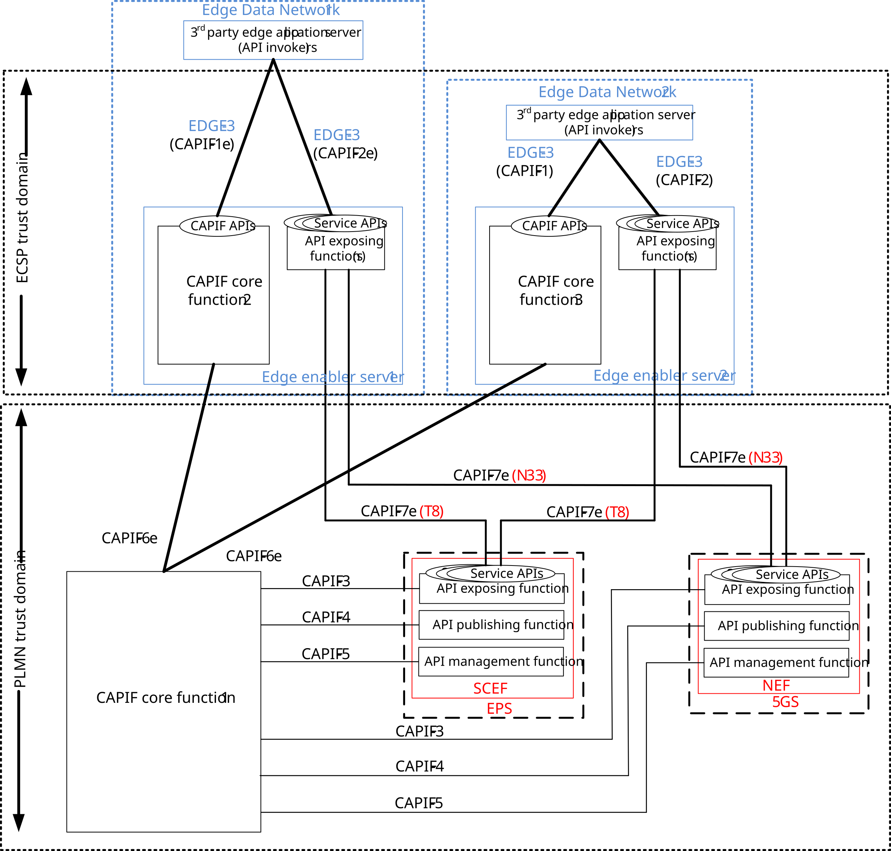
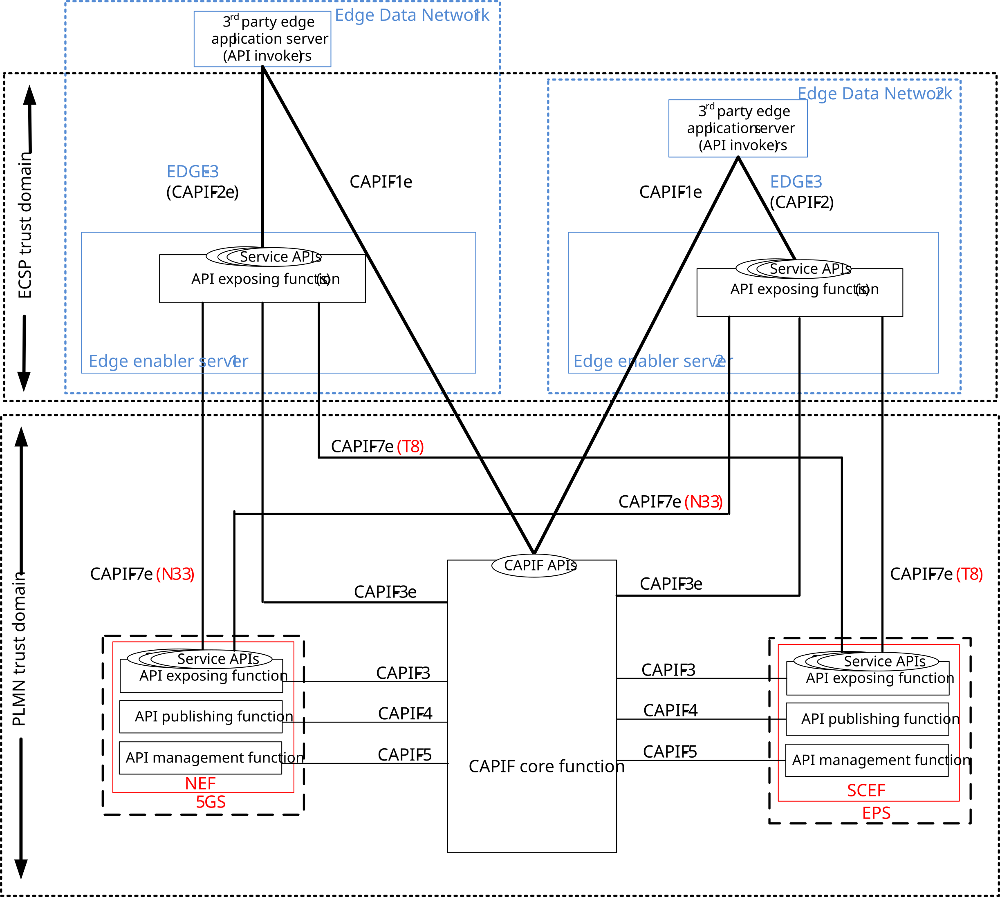
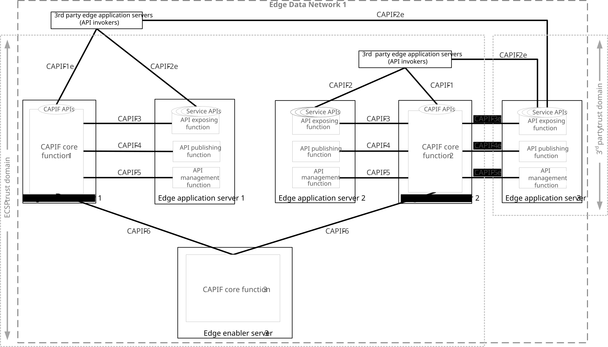

# Annex A (Informative): Deployment models

## A.1 General

The following clauses illustrate different aspects of some possible deployment options

\- Clause A.2 describes some deployment models for different DN implementations;

\- Clause A.3 describes some options for how ECS is deployed in relation to the UE;

\- Clause A.4 describes deployment of EES in relation with SEAL services and Application Enabler Services; and

\- Clause A.5 describes deployments in relation with CAPIF.

## A.2 Deployment models for different DN implementations

### A.2.1 General

This clause describes examples of deployment models with respect to different DN implementations as follows:

\- option 1. use of non-dedicated DN;

\- option 2. use of Edge-dedicated DN; and

\- option 3. use of LADN.

\- option 4. EDN with EAS and EES in GEO/MEO/LEO satellite.

The PLMN supporting edge computing services provides connection to one or multiple DNs.

The following clauses describes the detailed deployment models including relationships between EAS service areas, EES service areas, LADN service areas, and PLMN area.

### A.2.2 Option 1. Use of non-dedicated DN

There is no Edge-dedicated DN for support of edge computing service. A DN common to other services (e.g. internet access) is used to connect to the EASs.

The PLMN supporting edge computing services provides connection to EASs located in EDNs that respectively corresponds to one or more DNAI(s), and each EDN is identified by DNN and one or more DNAI. UEs establishing PDU sessions for the EASs identify the DN using the same DNN and slice information as for PDU sessions for non-Edge services.

Each EAS and EES can have a topological service area or a geographical service area that the EAS and EES serves, respectively. Within this service area, UEs can access an EAS or an EES regardless of their location within the PLMN area via local breakout.

Figure A.2.2-1: Option 1: Use of non-dedicated DN

### A.2.3 Option 2. Use of Edge-dedicated DN

The deployment uses Edge-dedicated DNs for support of edge computing service. Each Edge-dedicated DN is configured with unique DNNs.

The PLMN supporting edge computing services provides connection to several EDNs that correspond to one or more DNAI(s), and each EDN is identified by DNN of the Edge-dedicated DN and one or more DNAI.

Figure A.2.3-1: Option 2: Use of Edge-dedicated DN

### A.2.4 Option 3. Use of LADN

Edge computing services can be provided via Edge-dedicated Data Networks deployed as LADNs. With this option, the PLMN supports edge computing services in the EDN service areas which is equal to the LADN service area. The LADN service area is the service area that the Edge Computing is supported. Each individual EAS in the LADN can support the same or smaller service area than the LADN.

Figure A.2.4-1: Option 3: Use of LADN(s)

### A.2.5 Option 4. EDN in GEO/MEO/LEO satellite

Figure A.2.5-1: EDN deployment with gNB on satellite

Figure A.2.5-2: EDN deployment with gNB on ground

In this deployment option, ECS is deployed on ground. The UE can be on the ground/sea or in the air (e.g. drone). The UPF to access satellite EDN is deployed on satellite, EAS and EES are deployed in one or more satellites. RAN (e.g. gNB) can either be deployed on ground/sea (e.g. in a ship) and connected to satellite UPF or be deployed on regenerative satellite as depicted in Figure A.2.5-1 and Figure A.2.5-2, respectively. The 5GS control plane functions (e.g. AMF, SMF) are deployed on the ground, which is not depicted in the figure for simplicity. EASs and their registered EES are deployed on one or more satellites which constitutes an EDN and these satellites’ coverage areas can correspond to an EDN service area. UPF can be deployed on ground to access the ECS, the EEC (in UE) can reach the ECS by EDGE-4 (on ground or via space). The EES and EAS on board the satellite can be mobile depending on the satellite they are deployed on: GEO, MEO, or LEO. For GEO satellites, since the satellites are stationary relative to the Earth's surface, the EDN is static. However, for MEO and LEO satellites, the EDN is mobile as the satellites are moving relative to the Earth's surface.

NOTE 1: If there are multiple EESs in a satellite EDN, EEC can trigger EAS discovery towards each EES which increases delay due to EDGE-1 interactions. It is recommended to deploy a single EES per EDN to reduce complexity in satellite. The UPF and RAN deployment are described above for the sake of clarity which is related to EDN on-board satellite (e.g. EDGE-4 path), see also 3GPP TS 23.501 \[2\] clause 5.43.2).

During initial service discovery, the EEC (in UE) contacts the ECS via EDGE-4 (on ground or via space) to find an appropriate EES, then an appropriate EAS instance is selected during EAS discovery via EDGE-1 interaction. Finally, AC (in UE) communicates with the selected EAS.

This procedure is applicable for EDN deployment with gNB on satellite.

The service provisioning procedure is same as clause 8.3.3.2.2 and clause 8.3.3.2.3 with the following clarifications:

\- During service provisioning request/subscription, the EEC provides needed satellite capability information (e.g. satellite frequency bands) to the ECS. The ECS monitors UE location and UE moving prediction, and queries external server(s) using the received satellite capability information to get a list of satellite IDs that matches the UEs planned route and its location. Then the ECS uses the received list of the satellite IDs to provision an EES by matching with the satellite IDs in the EES profiles. This enables the ECS to determine a suitable EES with a matching satellite ID to serve the UE for the longest service time, by considering the trajectory of the satellite and selecting an EDN that matches with the movement of the AC hosting UE during the AC’s operation schedule. Once the ECS identifies the suitable EES, it responds/notifies the EEC with the EES information. In addition, the corresponding ECS selected satellite ID is sent to the EEC.

NOTE 2: The external server is responsible for providing satellite availability information for each satellite based on real-time satellite orbit information (e.g. eccentricity, inclination, true anomaly), e.g. see 3GPP TS 23.501 \[2\], Annex Q.

The following description captures the new information flows or differences comparing to existing applicable information flows:

\- service provisioning request (clause 8.3.3.3.2) and service provisioning subscription request (clause 8.3.3.3.4):

\- **\[New IEs\]** PLMN ID, satellite RAT types, frequency bands, Type of Array, Minimum elevation angle and present UE location for a reference grid point are applicable for UE connecting with satellite.

\- EDN configuration information in service provisioning response (clause 8.3.3.3.3) and service provisioning notification (clause 8.3.3.3.6), and EES profile (clause 8.2.6):

\- **\[New IEs\]** Dynamic service area indication: Indicates if the service area is dynamic or not. The service area is dynamic in case of EES and EAS on board a MEO or LEO satellite and not dynamic in case of a GEO satellite.

\- **\[New IEs\]** satellite ID

## A.3 ECS deployments in relation to the UE

### A.3.1 General

This clause shows some examples for how the ECS can be deployed in relation to the UE

### A.3.2 UE (EEC) served by a single ECS

In this scenario the UE can contain a single AC or multiple ACs, however the UE contains a single EEC which is configured with the address of a single ECS. This could for example be an IoT device that only supports a single AC or a smartphone device which contains many ACs which are served by a single ECS.

### A.3.3 UE (EECs) served by multiple ECSs

In this scenario the user is allowed to install multiple ACs in the UE where each AC can be served by an EAS which in turn served by a different ECSP's EES/ECS.

One example is that multiple ACs are installed on a smartphone and the associated EASs are on-boarded onto different ECSP's EESs which are registered with different ECSs.

Another example is a UE that supports Dual SIM. In this scenario the UE can support concurrent connection to two PLMNs.

## A.4 Deployment of EES in relation with SEAL services and Application Enabler Services

### A.4.1 General

The illustration of layered application architecture with the generic SEAL and Application Enabler server functions available in the cloud is shown in Figure A.4.1-1.

Figure A.4.1-1: Illustration of a layered application architecture with generic SEAL and Application Enabler server functions available in the cloud

The examples of application specific client are V2X application specific client, FF application specific client, UAS application specific client or other vertical application specific client residing on the UE. Similarly, the application specific server could be e.g. V2X application specific server, FF application specific server, UAS application specific server or other vertical application specific server.

The UE may consist of an application enabler client. The examples of application enabler client include V2X application enabler client, FF application enabler client, UAS application enabler client or other vertical application enabler client residing on the UE. Similarly, the application enabler server could be V2X application enabler server, FF application enabler Server, UAS application enabler server or other vertical application enabler server.

The illustration of layered application architecture with generic SEAL and Application Enabler server functions available in the edge is shown in Figure A.4.1-2.

Figure A.4.1-2: Illustration of layered application architecture with generic SEAL and Application Enabler server functions available in the edge

While the server functions of an application specific server can be made available only as an EAS, it is also possible that certain application specific server functions are available both at the edge and in the cloud. Similarly, the server functions of an application enabler server can be made available only as an EAS, it is also possible that certain application enabler server functions are available both at the edge and in the cloud. When the server functions of an application are both available at the edge and the cloud, there may be a need for interaction between the two corresponding application servers, which is out of scope of this specification.

NOTE 1: The details of a specific vertical application architecture based on the generic layered application architecture with server functions of an application available in the edge and the cloud is out of scope of this specification.

NOTE 2: When UE is in the coverage of the EDN due to which certain server functions are available both at the edge and in the cloud, then whether UE connects to the server functions available at the edge or directly to the cloud is out of scope of the present document.

### A.4.2 Deployment of SEAL services

There are several options to support SEAL service APIs to be exposed to the EAS.

The EES can act as the CAPIF core function, and the SEAL servers acting the AEF and publish the SEAL service API to the EES. Further, the SEAL service APIs is discovered by the EASs acting as the API invoker during the service API discover procedure as specified in 3GPP TS 23.222 \[6\].

The EES can act as the API topology hiding entry and re-expose SEAL service APIs as specified in 3GPP TS 23.434 \[13\] to EAS via EDGE-3 which utilizes the CAPIF-2/2e reference point as specified in 3GPP TS 23.222 \[6\].

### A.4.3 Deployment of Application Enabler services

There are several options to support vertical application enabler server (e.g., V2X application enabler server) APIs to be exposed to the EAS.

The EES can act as the CAPIF core function, and the vertical application enabler server acting the AEF and publish the vertical application enabler server APIs to the EES. Further, the vertical application enabler server APIs is discovered by the EASs acting as the API invoker during the service API discover procedure as specified in 3GPP TS 23.222 \[6\].

The EES can act as the API topology hiding entry and re-exposes vertical application enabler server APIs, e.g., VAE server APIs as specified in 3GPP TS 23.286 \[14\] to EAS via EDGE-3 which utilizes the CAPIF-2/2e reference point as specified in 3GPP TS 23.222 \[6\].

## A.5 Deployments in relation with CAPIF

### A.5.1 General

### A.5.2 Distributed CAPIF core functions

The EES can support EAS's access to northbound APIs exposed by SCEF/NEF by providing distributed CAPIF core functions as shown in Figure A.5.2-1.

Figure A.5.2-1: EES supporting distributed CAPIF core functions

The EDNs reside outside the PLMN trust domain as shown in Figure A.5.2-1. In EDN 2, the EAS and EES are within the same ECSP trust domain. While in EDN 1, the EES and the EAS are in the different ECSP trust domain.

The EES of an EDN provides the following functions for network capability exposure:

\- the CAPIF core function as specified in 3GPP TS 23.222 \[6\] to support onboarding of EASs (API invokers), publish of service APIs, discovery of service APIs and charging of service APIs invocations; and

\- the API exposing function as specified in 3GPP TS 23.222 \[6\] to expose the service APIs from SCEF/NEF to the EASs via proxy or gateway function.

The following procedures are performed as specified in 3GPP TS 23.222 \[6\]:

\- The SCEF and NEF act as API exposing function and the service APIs from SCEF (T8) and NEF (Nnef) are published to the CAPIF core function 1. The service APIs are published to the EESs (CAPIF core function 2 and CAPIF core function 3) from the CAPIF core function 1.

\- The EAS acts as an API invoker and is onboarded to the EES (CAPIF core function 2 or CAPIF core function 3) within the EDN.

\- The EASs (API invokers) are authenticated with EES (CAPIF core function 2 or CAPIF core function 3).

NOTE: The trusted EASs can utilize the services of a centralized CAPIF core function deployed by the PLMN operator instead of the CAPIF core function of EES deployed within the EDN.

\- The EAS discovers the service APIs published by the SCEF and NEF via the EES (CAPIF core function 2 or CAPIF core function 3) within the EDN including the end point address of the API exposing function where the service API invocation is to be performed.

\- The EAS obtains authorization to invoke the service APIs of the SCEF and NEF from the EES (CAPIF core function 2 or CAPIF core function 3).

\- The EAS invokes the service APIs of the SCEF and NEF after authorization by the EES (API exposing function) and obtaining the UE identifier as specified in clause 8.6.5. The EES (API exposing function) further invokes the service APIs of the SCEF or NEF in the 3GPP core network. EDGE-2 supports CAPIF-7e interactions corresponding to T8 (for SCEF) and N33 (for NEF).

### A.5.3 Centralized CAPIF core function

The EES can support EAS (owned by 3rd party or by PLMN operator) access to northbound APIs exposed by SCEF/NEF by using centralized CAPIF core functions as shown in Figure A.5.3-1.

Figure A.5.3-1: EES supporting centralized CAPIF core functions

The EDNs reside outside the PLMN trust domain as shown in Figure A.5.3-1. In EDN 2, the EAS and EES are within the same ECSP trust domain. While in EDN 1, the EES and the EAS are in the different ECSP trust domain.

The EES of an EDN provides the following functions for network capability exposure:

\- the API exposing function as specified in 3GPP TS 23.222 \[6\] to expose the service APIs from SCEF/NEF to the EASs via proxy or gateway function.

The following procedures are performed as specified in 3GPP TS 23.222 \[6\]:

\- The SCEF and NEF act as API exposing function and the service APIs from SCEF (T8) and NEF (Nnef) are published to the centralized CAPIF core function. The service APIs exposed by the EESs are published to the centralized CAPIF core function.

\- The EAS acts as an API invoker and is onboarded to the centralized CAPIF core function residing outside of the EDN.

\- The EASs (API invokers) are authenticated with the centralized CAPIF core function.

\- The EAS discovers the service APIs published by the SCEF and NEF via the centralized CAPIF core function including the end point address of the API exposing function where the service API invocation is to be performed.

\- The EAS obtains authorization to invoke the service APIs of the SCEF and NEF from the centralized CAPIF core function.

\- The EAS invokes the service APIs of the SCEF and NEF after authorization by the EES (API exposing function) and obtaining the UE identifier as specified in clause 8.6.5. The EES (API exposing function) further invokes the service APIs of the SCEF or NEF in the 3GPP core network. EDGE-2 supports CAPIF-7e interactions corresponding to T8 (for SCEF) and N33 (for NEF).

### A.5.4 Supporting Exposure of EAS Service APIs using CAPIF

The EES provides support for an EAS to expose its Service APIs (i.e., EAS Service APIs) for consumption by the other EASs by providing CAPIF functions as shown in Figure A.5.4-1.

Figure A.5.4-1: EES supporting CAPIF functions for exposure of EAS Service APIs

In EDN 1, all the EESs are within the same ECSP trust domain. The EASs (EAS 1 and EAS 2 as API providers) are within the same ECSP trust domain and EAS 3 (API provider) is within the 3rd-party trust domain. The 3rd party EASs (API invoker) connected to EES 2 (CCF 2) are within the same ECSP trust domain, whereas the 3rd party EASs (API invoker) connected to EES 1 (CCF 1) are outside the ECSP trust domain.

The EES of an EDN provides the following functions for exposure of EAS Service APIs:

\- The CAPIF core function as specified in 3GPP TS 23.222 \[6\] to support onboarding of EASs (API invokers), publish of EAS Service APIs, discovery of EAS Service APIs, and charging of EAS Service APIs invocations.

The following procedures are performed as specified in 3GPP TS 23.222 \[6\]:

\- The EAS (API provider) acts as an API provider by supporting API provider domain functions (i.e., API exposing function, API publishing function, and API management function), and its Service APIs are published to the EES (CAPIF core function 1 or CAPIF core function 2).

\- The EESs (CAPIF core function 1 or CAPIF core function 2) further publishes the EAS Service APIs to CAPIF core function 3 which assumes the role of a centralized repository of EAS service APIs in the EDN 1 to support discovery of the EAS Service APIs across different EESs (EES 1 and EES 2) using CAPIF-6 for interconnection operations as shown in Figure A.5.4-1.

\- The EAS (API invokers) discovers the EAS Service API(s) via CAPIF core function 1 or CAPIF core function 2 (deployed with the EESs) including the end point address of the API exposing function where the service API invocation is to be performed.

NOTE 1: EES supporting CAPIF core function may also provide the support for logging, audit, and access control of EAS Service API(s) as specified in 3GPP TS 23.222 \[6\].

NOTE 2: The other CAPIF operations (e.g., onboarding, authentication, authorization) are the same as specified in the Annex A.5.2.
