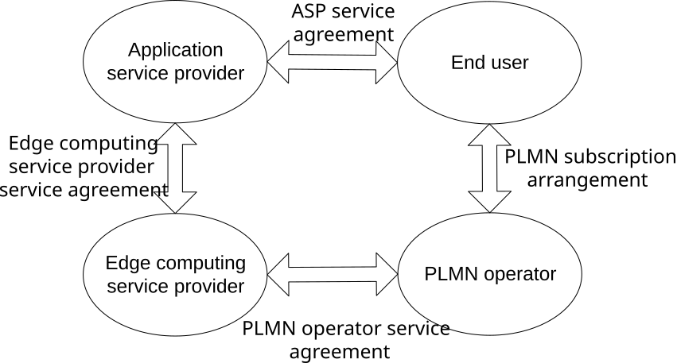
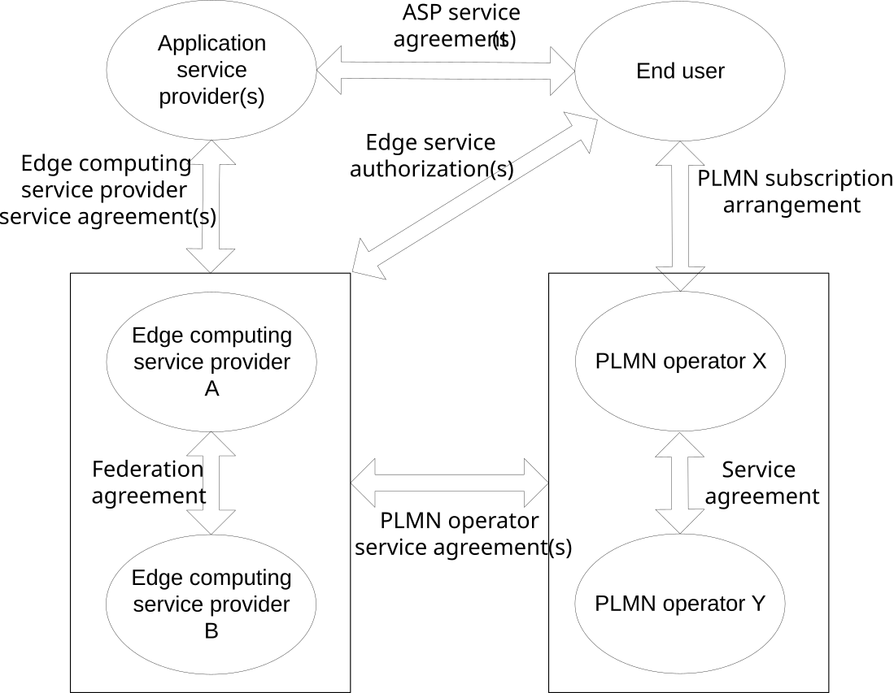
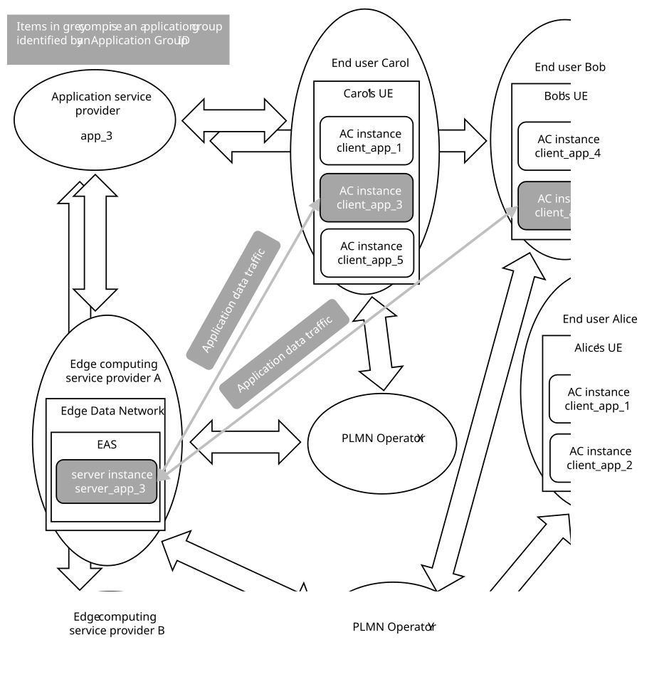
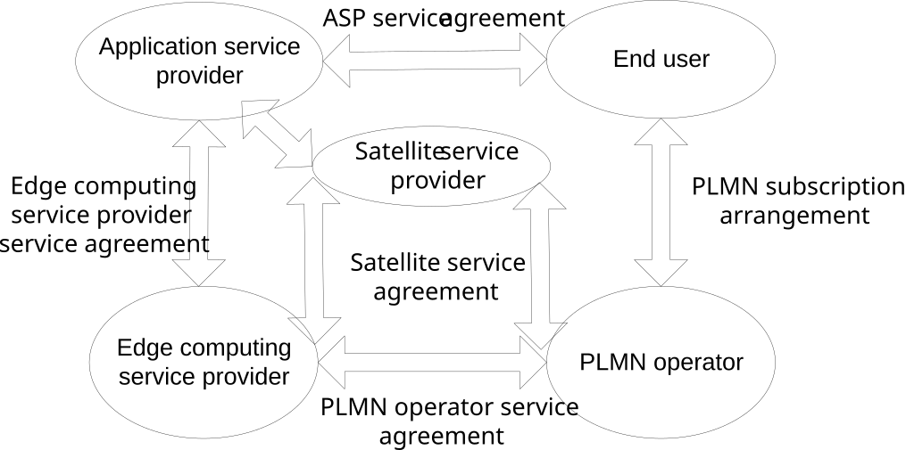

# Annex B (Informative): Involved entities and relationships

## B.1 General

This clause describes the relationship of edge computing service providers, PLMN operators, application service providers and users.

Figure B-1: Relationships involved in edge computing service

The end user is the consumer of the applications provided by the application service provider (ASP) and can have ASP service agreement with a single or multiple application service providers. The end user has a PLMN subscription arrangement with the PLMN operator. The UE used by the end user is allowed to be registered on the PLMN operator network.

The application service provider consumes the edge services (e.g. infrastructure, platform) provided by the edge computing service provider (ECSP) and can have edge computing service provider service agreement with a single or multiple edge computing service providers.

A single PLMN operator can have the PLMN operator service agreement with a single or multiple edge computing service providers.

A single ECSP can have PLMN operator service agreement with a single or multiple PLMN operators which provide edge computing support.

The edge computing service provider and the PLMN operator can be part of the same organization.

## B.2 Federation and Roaming

This clause describes the relationship of edge computing service providers, PLMN operators, application service providers and end users, taking federation and roaming into account.

Figure B.2-1: Relationships involved in edge computing service – federation and roaming

The end user is the consumer of the applications provided by the application service provider (ASP). The End user:

\- can have ASP service agreement with a single or multiple application service providers.

\- has a PLMN subscription arrangement with a PLMN operator (HPLMN), and the UE used by the end user can register on the HPLMN network and network of its roaming partners; or has a SNPN subscription arrangement with a SNPN operator (subscribed SNPN), and the UE used by the end user can register on the subscribed SNPN and a serving SNPN.

\- can have authorization to access edge services of a single or multiple ECSPs.

The ASP consumes the edge services (e.g. infrastructure, platform) provided by the ECSP. The ASP:

\- can have edge computing service provider service agreement with a single or multiple ECSPs.

The PLMN operator provides connectivity between the end user and the edge services provided by the ECSP. The PLMN operator:

\- can have the PLMN operator service agreement with a single or multiple ECSPs.

\- can have service agreement for roaming including agreements for Edge Computing services, and/or federation with a single or multiple PLMN operators.

The ECSP provides the edge services. The ECSP:

\- can have PLMN operator service agreement with a single or multiple PLMN operators which provide edge computing support.

\- can have federation partnership to share edge services with a single or multiple ECSPs.

The ECSP and the PLMN operator can be part of the same organization.

## B.3 Application Groups

This clause describes the relationship of edge computing service providers, PLMN operators, application service providers, application client instances, application server instances, and UEs for a group of application clients being served by a common application server. Figure B.3-1 shows these relationships in terms of roles, entities, and application data traffic.

Figure B.3-1: Relationships involved in application clients served by a common server

The application service provider controls app_3 in all locations, including at different ECSPs, and provides application clients to end users. The Application Group ID links a server and clients that are all part of the application service "app_3".

The Application Group ID is unique within the application service. For a given application, no two groups of application clients share the same Application Group ID. Application Group ID is unique across ECSPs and PLMNs, i.e. the Application Group ID alone is sufficient to identify the group in Figure B-X (without any ECSP, PLMN, or EAS identifiers).

"client_app_3" and "server_app_3" indicate client and server instances running on the UE and the EAS respectively, they are not identities such as ACID, EAS ID that are used in the procedures defined in this specification.

Bob's UE and Carol's UE can be thought of as being in the same group but could also simultaneously be in other groups unrelated to app_3. An app_3 group being simultaneously provided to other app_3 clients will use a different Application Group ID. In all cases, the ASP is the single point of control of Application Group ID.

## B.4 Relationships involved in edge computing service with satellite connectivity

This clause describes the relationship for EDGEAPP deployment with satellite connectivity.

Figure B.4-1: Relationships involved in edge computing service with satellite connectivity

The PLMN operator has satellite service agreement with the satellite service provider to offer his services e.g. to serve the unconnected areas. The end user (a PLMN subscriber) has agreements with the PLMN operator and the ASP provider.

The Edge computing service provider has satellite service agreement with the satellite service provider to deploy EDGEAPP components onboard satellite e.g. to enable Application service provider to provide seamless experience to end users.
