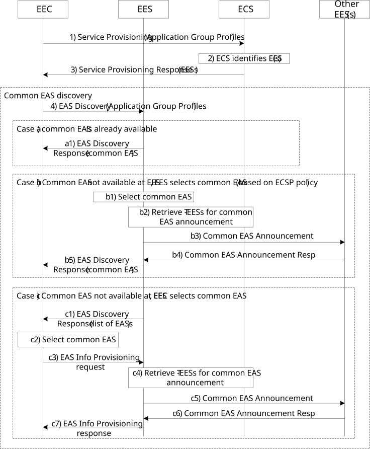
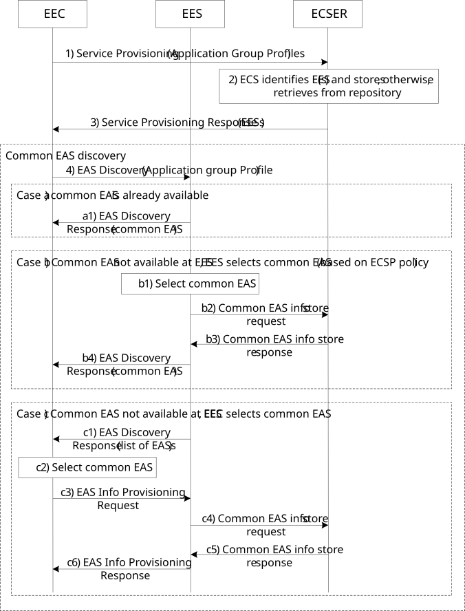

# Annex E (Informative): Support for common EAS

## E.1 General

Specific support for common EAS was introduced in Rel-18. This is an EAS which serves multiple UEs belonging to the same application group. Common EAS is required to ensure that the users belonging to the same application group receives same service. In Rel-18, whether to select common EAS for the group or not is based on ECSP policy.

NOTE 1: The application group may have members which are in different EDNs – in such case, common EAS per EDN can be selected and then, if supported, the selected common EASs can perform synchronization of the content in order to serve the users with the same service across the different EDNs.

NOTE 2: Based on ECSP policy, if a common EAS for the group is not selected for UEs belonging to the same application group that are in same EDN service area, then the UEs may connect to different EASs and those EASs performs synchronization for the content between one another in order to serve the users with the same service.

## E.2 Procedure

### E.2.1 General

Support for common EAS may require (re)use of following procedures (based on the deployment option as to whether ECS-ER is used or not):

\- Service provisioning (in clause 8.3.3.2.2)

\- EAS discovery (in clause 8.5.2.2)

\- EAS information provisioning (in clause 8.15.2.2)

\- Retrieve T-EES (in clause 8.8.3.3)

\- Common EAS announcement (in clause 8.19.2), used when repository function is not available

\- Obtain EAS information (in clause 8.20.2.2), used when repository function is available

\- Common EAS information storage (in clause 8.20.2.3), used when repository function is available

NOTE: It is deployment option whether to support repository function or not.

### E.2.2 Common EAS support without repository function

Figure E.2.2-1 illustrates the common EAS discovery and announcement procedure when repository function is not available.

Figure E.2.2-1: Common EAS discovery and announcement (without repository function)

1\) If the EEC has not already cached the service provisioning information, the EEC sends a service provisioning request to the ECS (as per clause 8.3.3.2.2). The request may include Application group profile as per information flow specified in Table 8.3.3.3.2-1.

2\) Upon receiving the request, the ECS processes the request (as per clause 8.3.3.2.2). When Application group profile is provided in the request, if the ECS-ER is not available, then the ECS identifies EES(s) based on the information contained in the request.

3\) The ECS responds to the EEC's request with a service provisioning response (as per clause 8.3.3.2.2) that includes a list of EDN configuration information, which includes a list of relevant EES(s) information and EDN connection information. The response may contain singe EES (common EES) or multiple EESs.

4\) The EEC sends an EAS discovery request to the EES (as per clause 8.5.2.2). The request includes Application group profile in the discovery filters as per information flow specified in Table 8.5.3.2-2.

Case a) Common EAS information is already available at the EES

a1) If the common EAS information related to the Application Group ID is available at the EES, then the EES provides information of that EAS as result for EAS discovery (as per clause 8.5.2.2). The response message includes information elements as specified in Table 8.5.3.3-1.

> NOTE 1: The EES may have previously determined and stored the common EAS for Application Group ID, or the EES may have received the common EAS selection information for Application Group ID during the common EAS announcement procedure.

Case b) Common EAS information is not available at the EES, EES selects common EAS (based on ECSP policy)

b1) The EES identifies an EAS for the Application Group ID based on the provided EAS discovery filters.

b2) If no ECS-ER is available and the EES initiates Retrieve EES request as specified in clause 8.8.3.3 to retrieve list of EESs for the common EAS announcement.

b3-b4) When the ECS-ER is not available and the EES selects the common EAS, the selected common EAS is announced to other EES(s) as per procedure specified in clause 8.19.

b5) The EES sends an EAS discovery response to the EEC (as per clause 8.5.2.2). The response message includes information elements as specified in Table 8.5.3.3-1.

Case c) Common EAS not available at EES, EEC selects the common EAS

c1) The EES identifies the EAS(s) based on the provided EAS discovery filters and the UE location. The EES sends an EAS discovery response to the EEC (as per clause 8.5.2.2), which includes information about the discovered EASs (as specified in Table 8.5.3.3-1) based on the provided EAS discovery filters.

c2) EEC selects an EAS from the list of EASs received in the EAS discovery response as the common EAS.

c3) The EEC sends the EAS information provisioning request to the EES (as per clause 8.15.2.2). The request includes information elements as specified in Table 8.15.3.2-1.

c4) When Application Group information is included in the request, the EAS provided is considered Common EAS for the Application Group. The EES determines the other EESs to which announce common EAS request needs to be sent as described in clause 8.8.3.3.

c5 – c6) The selected common EAS is announced to other EES(s) as per procedure specified in clause 8.19.

c7) The EES sends an EAS information provisioning response to the EEC indicating a successful status. The response message includes the information elements as specified in Table 8.15.3.2-1.

### E.2.3 Common EAS support with repository function

Figure E.2.3-1 illustrates the common EAS discovery and announcement procedure when repository function is available.

Figure E.2.3-1: Common EAS discovery and announcement (with repository)

1\) Similar to step-1 in clause E.2.2.

2\) Upon receiving the request, the ECS processes the request (as per clause 8.3.3.2.2). When Application group profile is provided in the request, if the ECS-ER is available,

\- EES information is not available corresponding to the Application Group ID, then the ECS identifies EES(s) and stores the identified EES(s)'s information and related Application group ID into the ECS-ER;

else if

\- EES information is available corresponding to the Application Group ID, then the ECS retrieves the EES(s) information corresponding to the Application Group ID from the ECS-ER.

3\) Similar to step-3 in clause E.2.2.

4\) Similar to step-4 in clause E.2.2.

Case a) Common EAS information is already available

a1) Similar to step-a1 in clause E.2.2.

Case b) Common EAS not available at EES, EES selects common EAS (based on ECSP policy)

b1) The EES identifies an EAS for the Application Group ID based on the provided EAS discovery filters.

b2 – b3) If ECS-ER is available, the ECS interacts with the ECS-ER to store the common EAS information as described in clause 8.20.2.3. If common EAS information is already available corresponding to the Application Group ID in the repository, then the ECS-ER returns the common EAS information to the EES as described in clause 8.20.2.3.

b4) Similar to step-b5 in clause E.2.2.

Case c) Common EAS not available at EES, EEC selects common EAS

c1) Similar to step-c1 in clause E.2.2.

c2) Similar to step-c2 in clause E.2.2.

c3) Similar to step-c3 in clause E.2.2.

c4 – c5) If there is ECS-ER, the EEC selected EAS is used in interaction between the EES and ECS-ER as specified in clause 8.20.2.3, and EEC receives common EAS in the EAS information provisioning response. If the common EAS is registered to another EES, then the EES endpoint of the EES where the common EAS is registered is also included in the EAS information provisioning response.

c6) Similar to step-c7 in clause E.2.2.
