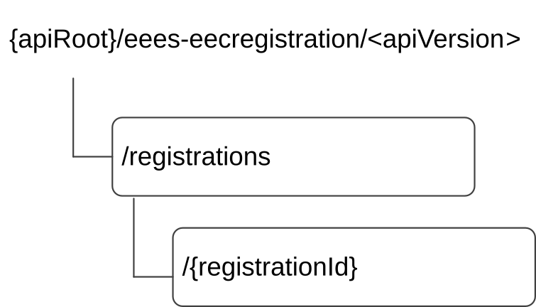

# 6.2.2 Resources

## 6.2.2.1 Overview

Figure 6.2.2.1-1: Resource URI structure of the Eees_EECRegistration API

Table 6.2.2.1-1 provides an overview of the resources and applicable HTTP methods for the Eees_EECRegistration API.

Table 6.2.2.1-1: Resources and methods overview

| Resource name               | Resource URI                    | HTTP method or custom operation | Description                                                           |
|-----------------------------|---------------------------------|---------------------------------|-----------------------------------------------------------------------|
| EEC Registrations           | /registrations                  | POST                            | Create a new "Individual EEC Registration" resource at the EES.       |
| Individual EEC registration | /registrations/{registrationId} | PUT                             | Update an existing "Individual EEC Registration" resource at the EES. |
|                             |                                 | DELETE                          | Remove an existing "Individual ECC Registration" resource at EES      |
|                             |                                 | PATCH                           | Partially update an existing "Individual EEC Registration" at the EES |

## 6.2.2.2 Resource: EEC Registrations

### 6.2.2.2.1 Description

This resource represents a collection of EEC registrations with an EES.

### 6.2.2.2.2 Resource Definition

Resource URI: **{apiRoot}/eees-eecregistration/\<apiVersion\>/registrations**

This resource shall support the resource URI variables defined in table 6.2.2.2.2-1.

Table 6.2.2.2.2-1: Resource URI variables for this resource

| Name    | Data Type | Definition                              |
|---------|-----------|-----------------------------------------|
| apiRoot | string    | See clause 7.5 of 3GPP TS 29.558 \[4\]. |

### 6.2.2.2.3 Resource Standard Methods

#### 6.2.2.2.3.1 POST

This method creates a new registration. This method shall support the URI query parameters specified in table 6.22.2.3.1-

Table 6.2.2.2.3.1-1: URI query parameters supported by the POST method on this resource

| Name | Data type | P   | Cardinality | Description |
|------|-----------|-----|-------------|-------------|
| n/a  |           |     |             |             |

This method shall support the request data structures specified in table 6.2.2.2.3.1-2 and the response data structures and response codes specified in table 6.2.2.2.3.1-3

Table 6.2.2.2.3.1-2: Data structures supported by the POST Request Body on this resource

| Data type       | P   | Cardinality | Description                          |
|-----------------|-----|-------------|--------------------------------------|
| EECRegistration | M   | 1           | EEC registration request information |

Table 6.2.2.2.3.1-3: Data structures supported by the POST Response Body on this resource

<table>
<colgroup>
<col style="width: 17%" />
<col style="width: 4%" />
<col style="width: 11%" />
<col style="width: 18%" />
<col style="width: 47%" />
</colgroup>
<thead>
<tr class="header">
<th>Data type</th>
<th>P</th>
<th>Cardinality</th>
<th>Response codes</th>
<th>Description</th>
</tr>
</thead>
<tbody>
<tr class="odd">
<td>EECRegistration</td>
<td>M</td>
<td>1</td>
<td>201 Created</td>
<td>
EEC information is registered successfully at EES. EEC information registered with EES is provided in the response body.

The URI of the created resource shall be returned in the "Location" HTTP header
</td>
</tr>
<tr class="even">
<td colspan="5">NOTE: The manadatory HTTP error status code for the POST method listed in Table 5.2.6-1 of 3GPP TS 29.122 [3] also apply.</td>
</tr>
</tbody>
</table>

Table 6.2.2.2.3.1-4: Headers supported by the POST method on this resource

|      |           |     |             |             |
|------|-----------|-----|-------------|-------------|
| Name | Data type | P   | Cardinality | Description |
| n/a  |           |     |             |             |

Table 6.2.2.2.3.1-5: Headers supported by the 201 response code on this resource

|          |           |     |             |                                                                                                                                                          |
|----------|-----------|-----|-------------|----------------------------------------------------------------------------------------------------------------------------------------------------------|
| Name     | Data type | P   | Cardinality | Description                                                                                                                                              |
| Location | String    | M   | 1           | Contains the URI of the newly created resource, according to the structure: {apiRoot}/eees-eecregistration/\<apiVersion\>/registrations/{registrationId} |

### 6.2.2.2.4 Resource Custom Operations

None.

## 6.2.2.3 Resource: Individual EEC registration

### 6.2.2.3.1 Description

This resource represents an individual registration of an EEC.

### 6.2.2.3.2 Resource Definition

Resource URI: **{apiRoot}/eees-eecregistration//\<apiVersion\>**/**registrations/{registrationId}**

This resource shall support the resource URI variables defined in table 6.2.2.3.2-1.

Table 6.2.2.3.2-1: Resource URI variables for this resource

| Name           | Data Type | Definition                                     |
|----------------|-----------|------------------------------------------------|
| apiRoot        | string    | See clause 7.5 of 3GPP TS 29.558 \[4\].        |
| registrationId | string    | The Identifier of a specific EEC registration. |

### 6.2.2.3.3 Resource Standard Methods

#### 6.2.2.3.3.1 PUT

This method updates the EEC registration data by completely replacing the existing registration data. This method shall support the URI query parameters specified in table 6.2.2.3.3.1-1.

Table 6.2.2.3.3.1-1: URI query parameters supported by the PUT method on this resource

| Name | Data type | P   | Cardinality | Description |
|------|-----------|-----|-------------|-------------|
| n/a  |           |     |             |             |

This method shall support the request data structures specified in table 6.2.2.3.3.1-2 and the response data structures and response codes specified in table 6.2.2.3.3.1-3.

Table 6.2.2.3.3.1-2: Data structures supported by the PUT Request Body on this resource

| Data type       | P   | Cardinality | Description                                              |
|-----------------|-----|-------------|----------------------------------------------------------|
| EECRegistration | M   | 1           | An "Individual EEC Registration" resource to be updated. |

Table 6.2.2.3.3.1-3: Data structures supported by the PUT Response Body on this resource

<table>
<colgroup>
<col style="width: 16%" />
<col style="width: 5%" />
<col style="width: 13%" />
<col style="width: 25%" />
<col style="width: 39%" />
</colgroup>
<thead>
<tr class="header">
<th>Data type</th>
<th>P</th>
<th>Cardinality</th>
<th>Response codes</th>
<th>Description</th>
</tr>
</thead>
<tbody>
<tr class="odd">
<td>EECRegistration</td>
<td>M</td>
<td>1</td>
<td>200 OK</td>
<td>Successful case. The "Individual EEC Registration" resource updated successfully and the EECRegistration data shall be included in the response.</td>
</tr>
<tr class="even">
<td>n/a</td>
<td></td>
<td></td>
<td>204 No Content</td>
<td>Successful case. The "Individual EEC Registration" resource updated successfully and no content is returned in the response body.</td>
</tr>
<tr class="odd">
<td>n/a</td>
<td></td>
<td></td>
<td>307 Temporary Redirect</td>
<td>
Temporary redirection.

The response shall include a Location header field containing an alternative URI of the resource located in an alternative EES.

Redirection handling is described in clause 5.2.10 of 3GPP TS 29.122 [3] with the difference that the SCEF is replaced by the EES and the SCS/AS is replaced by the EEC.
</td>
</tr>
<tr class="even">
<td>n/a</td>
<td></td>
<td></td>
<td>308 Permanent Redirect</td>
<td>
Permanent redirection.

The response shall include a Location header field containing an alternative URI of the resource located in an alternative EES.

Redirection handling is described in clause 5.2.10 of 3GPP TS 29.122 [3] with the difference that the SCEF is replaced by the EES and the SCS/AS is replaced by the EEC.
</td>
</tr>
<tr class="odd">
<td colspan="5">NOTE: The manadatory HTTP error status code for the HTTP PUT method listed in Table 5.2.6-1 of 3GPP TS 29.122 [3] also apply.</td>
</tr>
</tbody>
</table>

Table 6.2.2.3.3.1-4: Headers supported by the PUT method on this resource

| Name | Data type | P   | Cardinality | Description |
|------|-----------|-----|-------------|-------------|
| n/a  |           |     |             |             |

Table 6.2.2.3.3.1-5: Headers supported by the 200 response code on this resource

| Name | Data type | P   | Cardinality | Description |
|------|-----------|-----|-------------|-------------|
| n/a  |           |     |             |             |

Table 6.2.2.3.3.1-6: Links supported by the 200 Response Code on this endpoint

| Name | Resource name | HTTP method or custom operation | Link parameter(s) | Description |
|------|---------------|---------------------------------|-------------------|-------------|
| n/a  |               |                                 |                   |             |

Table 6.2.2.3.3.1-7: Headers supported by the 307 Response Code on this resource

| Name     | Data type | P   | Cardinality | Description                                                       |
|----------|-----------|-----|-------------|-------------------------------------------------------------------|
| Location | string    | M   | 1           | An alternative URI of the resource located in an alternative EES. |

Table 6.2.2.3.3.1-8: Headers supported by the 308 Response Code on this resource

| Name     | Data type | P   | Cardinality | Description                                                       |
|----------|-----------|-----|-------------|-------------------------------------------------------------------|
| Location | string    | M   | 1           | An alternative URI of the resource located in an alternative EES. |

#### 6.2.2.3.3.2 DELETE

This method deregisters (removes) an existing EEC registration. This method shall support the URI query parameters specified in table 6.2.2.3.3.2-1.

Table 6.2.2.3.3.2-1: URI query parameters supported by the DELETE method on this resource

| Name | Data type | P   | Cardinality | Description |
|------|-----------|-----|-------------|-------------|
| n/a  |           |     |             |             |

This method shall support the request data structures specified in table 6.2.2.3.3.2-2 and the response data structures and response codes specified in table 6.2.2.3.3.2-3.

Table 6.2.2.3.3.1-2: Data structures supported by the DELETE Request Body on this resource

| Data type | P   | Cardinality | Description |
|-----------|-----|-------------|-------------|
| n/a       |     |             |             |

Table 6.2.2.3.3.1-3: Data structures supported by the DELETE Response Body on this resource

<table>
<colgroup>
<col style="width: 15%" />
<col style="width: 4%" />
<col style="width: 13%" />
<col style="width: 23%" />
<col style="width: 42%" />
</colgroup>
<thead>
<tr class="header">
<th>Data type</th>
<th>P</th>
<th>Cardinality</th>
<th>Response codes</th>
<th>Description</th>
</tr>
</thead>
<tbody>
<tr class="odd">
<td>n/a</td>
<td></td>
<td></td>
<td>204 No Content</td>
<td>Successful case. The targeted "Individual EEC Registration" resource deleted successfully.</td>
</tr>
<tr class="even">
<td>n/a</td>
<td></td>
<td></td>
<td>307 Temporary Redirect</td>
<td>
Temporary redirection.

The response shall include a Location header field containing an alternative URI of the resource located in an alternative EES.

Redirection handling is described in clause 5.2.10 of 3GPP TS 29.122 [3] with the difference that the SCEF is replaced by the EES and the SCS/AS is replaced by the EEC.
</td>
</tr>
<tr class="odd">
<td>n/a</td>
<td></td>
<td></td>
<td>308 Permanent Redirect</td>
<td>
Permanent redirection.

The response shall include a Location header field containing an alternative URI of the resource located in an alternative EES.

Redirection handling is described in clause 5.2.10 of 3GPP TS 29.122 [3] with the difference that SCEF is replaced by the EES and the SCS/AS is replaced by the EEC.
</td>
</tr>
<tr class="even">
<td colspan="5">NOTE: The manadatory HTTP error status code for the HTTP DELETE method listed in Table 5.2.6-1 of 3GPP TS 29.122 [3] also apply.</td>
</tr>
</tbody>
</table>

Table 6.2.2.3.3.3-4: Headers supported by the DELETE method on this resource

| Name | Data type | P   | Cardinality | Description |
|------|-----------|-----|-------------|-------------|
| n/a  |           |     |             |             |

Table 6.2.2.3.3.3-5: Headers supported by the 204 response code on this resource

| Name | Data type | P   | Cardinality | Description |
|------|-----------|-----|-------------|-------------|
| n/a  |           |     |             |             |

Table 6.2.2.3.3.3-6: Links supported by the 200 Response Code on this endpoint

| Name | Resource name | HTTP method or custom operation | Link parameter(s) | Description |
|------|---------------|---------------------------------|-------------------|-------------|
| n/a  |               |                                 |                   |             |

Table 6.2.2.3.3.3-7: Headers supported by the 307 Response Code on this resource

| Name     | Data type | P   | Cardinality | Description                                                       |
|----------|-----------|-----|-------------|-------------------------------------------------------------------|
| Location | string    | M   | 1           | An alternative URI of the resource located in an alternative EES. |

Table 6.2.2.3.3.3-8: Headers supported by the 308 Response Code on this resource

| Name     | Data type | P   | Cardinality | Description                                                       |
|----------|-----------|-----|-------------|-------------------------------------------------------------------|
| Location | string    | M   | 1           | An alternative URI of the resource located in an alternative EES. |

#### 6.2.2.3.3.3 PATCH

This method partially updates the EEC registration at EES. This method shall support the URI query parameters specified in table 6.2.2.3.3.3-1.

Table 6.2.2.3.3.3-1: URI query parameters supported by the PATCH method on this resource

| Name | Data type | P   | Cardinality | Description |
|------|-----------|-----|-------------|-------------|
| n/a  |           |     |             |             |

This method shall support the request data structures specified in table 6.2.2.3.3.3-2 and the response data structures and response codes specified in table 6.2.2.3.3.3-3.

Table 6.2.2.3.3.3-2: Data structures supported by the PATCH Request Body on this resource

| Data type            | P   | Cardinality | Description                                                                                          |
|----------------------|-----|-------------|------------------------------------------------------------------------------------------------------|
| EECRegistrationPatch | M   | 1           | Represents the parameters to request the modification of the "Individual EEC Registration" resource. |

Table 6.2.2.3.3.3-3: Data structures supported by the PATCH Response Body on this resource

<table>
<colgroup>
<col style="width: 16%" />
<col style="width: 5%" />
<col style="width: 11%" />
<col style="width: 23%" />
<col style="width: 42%" />
</colgroup>
<thead>
<tr class="header">
<th>Data type</th>
<th>P</th>
<th>Cardinality</th>
<th>Response codes</th>
<th>Description</th>
</tr>
</thead>
<tbody>
<tr class="odd">
<td>EECRegistration</td>
<td>M</td>
<td>1</td>
<td>200 OK</td>
<td>Successful case. The "Individual EEC Registration" resource updated successfully and the EECRegistration data shall be included in the response.</td>
</tr>
<tr class="even">
<td>n/a</td>
<td></td>
<td></td>
<td>204 No Content</td>
<td>Successful case. The "Individual EEC Registration" resource updated successfully and no content is returned in the response body.</td>
</tr>
<tr class="odd">
<td>n/a</td>
<td></td>
<td></td>
<td>307 Temporary Redirect</td>
<td>
Temporary redirection.

The response shall include a Location header field containing an alternative URI of the resource located in an alternative EES.

Redirection handling is described in clause 5.2.10 of 3GPP TS 29.122 [3] with the difference that the SCEF is replaced by the EES and the SCS/AS is replaced by the EEC.
</td>
</tr>
<tr class="even">
<td>n/a</td>
<td></td>
<td></td>
<td>308 Permanent Redirect</td>
<td>
Permanent redirection.

The response shall include a Location header field containing an alternative URI of the resource located in an alternative EES.

Redirection handling is described in clause 5.2.10 of 3GPP TS 29.122 [3] with the difference that the SCEF is replaced by the EES and the SCS/AS is replaced by the EEC.
</td>
</tr>
<tr class="odd">
<td colspan="5">NOTE: The manadatory HTTP error status code for the HTTP PATCH method listed in Table 5.2.6-1 of 3GPP TS 29.122 [3] also apply.</td>
</tr>
</tbody>
</table>

Table 6.2.2.3.3.3-4: Headers supported by the PATCH method on this resource

| Name | Data type | P   | Cardinality | Description |
|------|-----------|-----|-------------|-------------|
| n/a  |           |     |             |             |

Table 6.2.2.3.3.3-5: Headers supported by the 200 response code on this resource

| Name | Data type | P   | Cardinality | Description |
|------|-----------|-----|-------------|-------------|
| n/a  |           |     |             |             |

Table 6.2.2.3.3.3-6: Links supported by the 200 Response Code on this endpoint

| Name | Resource name | HTTP method or custom operation | Link parameter(s) |     | Description |
|------|---------------|---------------------------------|-------------------|-----|-------------|
| n/a  |               |                                 |                   |     |             |

Table 6.2.2.3.3.3-7: Headers supported by the 307 Response Code on this resource

| Name     | Data type | P   | Cardinality | Description                                                       |
|----------|-----------|-----|-------------|-------------------------------------------------------------------|
| Location | string    | M   | 1           | An alternative URI of the resource located in an alternative EES. |

Table 6.2.2.3.3.3-8: Headers supported by the 308 Response Code on this resource

| Name     | Data type | P   | Cardinality | Description                                                       |
|----------|-----------|-----|-------------|-------------------------------------------------------------------|
| Location | string    | M   | 1           | An alternative URI of the resource located in an alternative EES. |

### 6.2.2.3.4 Resource Custom Operations

None.
