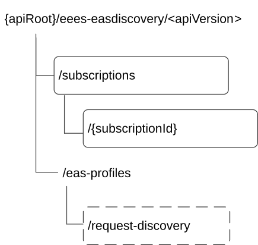

# 6.3.2 Resources

## 6.3.2.1 Overview

Figure 6.3.2.1-1: Resource URI structure of the Eees_EASDiscovery API

Table 6.3.2.1-1 provides an overview of the resources and applicable HTTP methods for the Eees_EASDiscovery API.

Table 6.3.2.1-1: Resources and methods overview

| Resource name                         | Resource URI                    | HTTP method or custom operation | Description                                                                  |
|---------------------------------------|---------------------------------|---------------------------------|------------------------------------------------------------------------------|
| EAS Discovery Subscriptions           | /subscriptions                  | POST                            | Creates a new "Individual EAS Discovery Subscription" resource.              |
| Individual EAS Discovery Subscription | /subscriptions/{subscriptionId} | PUT                             | Updates an existing "Individual EAS Discovery Subscription" resource.        |
|                                       |                                 | DELETE                          | Deletes an existing "Individual EAS Discovery Subscription" resource.        |
|                                       |                                 | PATCH                           | Partial update an existing "Individual EAS Discovery Subscription" resource. |
| EAS Profiles                          | /eas-profiles/request-discovery | request-discovery (POST)        | Request EAS discovery.                                                       |

NOTE 1: Based on SA3 specified security mechanisms for EDGE-1, EDGE-3 and EDGE-9 interfaces, the EES can identify the initiator of the API (i.e. EEC, EAS or EES) and apply the appropriate security procedures as specified in 3GPP TS 33.558 \[20\].

NOTE 2: The same service API can be implemented on different interfaces, i.e. EDGE-1, EDGE-3 and EDGE-9, which are for separate endpoints, i.e. EEC, EAS and EES.

## 6.3.2.2 Resource: EAS Discovery Subscriptions

### 6.3.2.2.1 Description

This resource represents the collection of EAS Discovery Subscriptions managed by the EES.

### 6.3.2.2.2 Resource Definition

Resource URI: **{apiRoot}/eees-easdiscovery/\<apiVersion\>/subscriptions**

This resource shall support the resource URI variables defined in table 6.3.2.2.2-1.

Table 6.3.2.2.2-1: Resource URI variables for this resource

| Name    | Data Type | Definition                              |
|---------|-----------|-----------------------------------------|
| apiRoot | string    | See clause 7.5 of 3GPP TS 29.558 \[4\]. |

### 6.3.2.2.3 Resource Standard Methods

#### 6.3.2.2.3.1 POST

This method shall support the URI query parameters specified in table 6.3.2.2.3.1-1.

Table 6.3.2.2.3.1-1: URI query parameters supported by the POST method on this resource

| Name | Data type | P   | Cardinality | Description |
|------|-----------|-----|-------------|-------------|
| n/a  |           |     |             |             |

This method shall support the request data structures specified in table 6.3.2.2.3.1-2 and the response data structures and response codes specified in table 6.3.2.2.3.1-3.

Table 6.3.2.2.3.1-2: Data structures supported by the POST Request Body on this resource

| Data type                | P   | Cardinality | Description                                               |
|--------------------------|-----|-------------|-----------------------------------------------------------|
| EasDiscoverySubscription | M   | 1           | Create an Individual EAS Discovery Subscription resource. |

Table 6.3.2.2.3.1-3: Data structures supported by the POST Response Body on this resource

<table>
<colgroup>
<col style="width: 17%" />
<col style="width: 4%" />
<col style="width: 11%" />
<col style="width: 17%" />
<col style="width: 48%" />
</colgroup>
<thead>
<tr class="header">
<th>Data type</th>
<th>P</th>
<th>Cardinality</th>
<th>Response codes</th>
<th>Description</th>
</tr>
</thead>
<tbody>
<tr class="odd">
<td>EasDiscoverySubscription</td>
<td>M</td>
<td>1</td>
<td>201 Created</td>
<td>Successful case. An Individual EAS Discovery Subscription resource was successfully created and a representation of the created resource is returned in the response body. 
 
The URI of the created resource shall be returned in an HTTP "Location" header</td>
</tr>
<tr class="even">
<td colspan="5">NOTE: The mandatory HTTP error status code for the POST method listed in Table 5.2.6-1 of 3GPP TS 29.122 [3] also apply.</td>
</tr>
</tbody>
</table>

Table 6.3.2.2.3.1-4: Headers supported by the 201 response code on this resource

|          |           |     |             |                                                                                                                                                       |
|----------|-----------|-----|-------------|-------------------------------------------------------------------------------------------------------------------------------------------------------|
| Name     | Data type | P   | Cardinality | Description                                                                                                                                           |
| Location | String    | M   | 1           | Contains the URI of the newly created resource, according to the structure: {apiRoot}/eees-easdiscovery/\<apiVersion\>/subscriptions/{subscriptionId} |

### 6.3.2.2.4 Resource Custom Operations

None.

## 6.3.2.3 Resource: Individual EAS Discovery Subscription

### 6.3.2.3.1 Description

This resource represents of an Individual EAS Discovery Subscription resource managed by the EES.

### 6.3.2.3.2 Resource Definition

Resource URI: **{apiRoot}/eees-easdiscovery/\<apiVersion\>/subscriptions/{subscriptionId}**

This resource shall support the resource URI variables defined in table 6.3.2.3.2-1.

Table 6.3.2.3.2-1: Resource URI variables for this resource

| Name           | Data Type | Definition                                                   |
|----------------|-----------|--------------------------------------------------------------|
| apiRoot        | string    | See clause 7.5 of 3GPP TS 29.558 \[4\].                      |
| subscriptionId | string    | The identifier of the individual EAS discovery subscription. |

### 6.3.2.3.3 Resource Standard Methods

#### 6.3.2.3.3.1 PUT

This method shall support the URI query parameters specified in table 6.3.2.3.3.1-1.

Table 6.3.2.3.3.1-1: URI query parameters supported by the PUT method on this resource

| Name | Data type | P   | Cardinality | Description |
|------|-----------|-----|-------------|-------------|
| n/a  |           |     |             |             |

This method shall support the request data structures specified in table 6.3.2.3.3.1-2 and the response data structures and response codes specified in table 6.3.2.3.3.1-3.

Table 6.3.2.3.3.1-2: Data structures supported by the PUT Request Body on this resource

| Data type                | P   | Cardinality | Description                                                                                    |
|--------------------------|-----|-------------|------------------------------------------------------------------------------------------------|
| EASDiscoverySubscription | M   | 1           | Represents the updated representation of the "Individual EAS Discovery Subscription" resource. |

Table 6.3.2.3.3.1-3: Data structures supported by the PUT Response Body on this resource

<table>
<colgroup>
<col style="width: 23%" />
<col style="width: 2%" />
<col style="width: 11%" />
<col style="width: 22%" />
<col style="width: 39%" />
</colgroup>
<thead>
<tr class="header">
<th>Data type</th>
<th>P</th>
<th>Cardinality</th>
<th>Response codes</th>
<th>Description</th>
</tr>
</thead>
<tbody>
<tr class="odd">
<td>EasDiscoverySubscription</td>
<td>M</td>
<td>1</td>
<td>200 OK</td>
<td>Successful case. The "Individual EAS Discovery Subscription" resource was successfully updated and a representation of the updated resource is returned in the response body.</td>
</tr>
<tr class="even">
<td>n/a</td>
<td></td>
<td></td>
<td>204 No Content</td>
<td>Successful case. The "Individual EAS Discovery Subscription" resource was successfully updated and no content is returned in the response body.</td>
</tr>
<tr class="odd">
<td>n/a</td>
<td></td>
<td></td>
<td>307 Temporary Redirect</td>
<td>
Temporary redirection.

The response shall include a Location header field containing an alternative URI of the resource located in an alternative EES.

Redirection handling is described in clause 5.2.10 of 3GPP TS 29.122 [3] with the difference that the SCEF is replaced by the EES and the SCS/AS is replaced by the EEC.
</td>
</tr>
<tr class="even">
<td>n/a</td>
<td></td>
<td></td>
<td>308 Permanent Redirect</td>
<td>
Permanent redirection.

The response shall include a Location header field containing an alternative URI of the resource located in an alternative EES.

Redirection handling is described in clause 5.2.10 of 3GPP TS 29.122 [3] with the difference that the SCEF is replaced by the EES and the SCS/AS is replaced by the EEC.
</td>
</tr>
<tr class="odd">
<td colspan="5">NOTE: The mandatory HTTP error status code for the HTTP PUT method listed in Table 5.2.6-1 of 3GPP TS 29.122 [3] also apply.</td>
</tr>
</tbody>
</table>

Table 6.3.2.3.3.1-4: Headers supported by the 307 Response Code on this resource

| Name     | Data type | P   | Cardinality | Description                                                       |
|----------|-----------|-----|-------------|-------------------------------------------------------------------|
| Location | string    | M   | 1           | An alternative URI of the resource located in an alternative EES. |

Table 6.3.2.3.3.1-5: Headers supported by the 308 Response Code on this resource

| Name     | Data type | P   | Cardinality | Description                                                       |
|----------|-----------|-----|-------------|-------------------------------------------------------------------|
| Location | string    | M   | 1           | An alternative URI of the resource located in an alternative EES. |

#### 6.3.2.3.3.2 DELETE

This method shall support the URI query parameters specified in table 6.3.2.3.3.2-1.

Table 6.3.2.3.3.2-1: URI query parameters supported by the DELETE method on this resource

| Name | Data type | P   | Cardinality | Description |
|------|-----------|-----|-------------|-------------|
| n/a  |           |     |             |             |

This method shall support the request data structures specified in table 6.3.2.3.3.2-2 and the response data structures and response codes specified in table 6.3.2.3.3.2-3.

Table 6.3.2.3.3.2-2: Data structures supported by the DELETE Request Body on this resource

| Data type | P   | Cardinality | Description |
|-----------|-----|-------------|-------------|
| n/a       |     |             |             |

Table 6.3.2.3.3.2-3: Data structures supported by the DELETE Response Body on this resource

<table>
<colgroup>
<col style="width: 16%" />
<col style="width: 5%" />
<col style="width: 11%" />
<col style="width: 23%" />
<col style="width: 42%" />
</colgroup>
<thead>
<tr class="header">
<th>Data type</th>
<th>P</th>
<th>Cardinality</th>
<th>Response codes</th>
<th>Description</th>
</tr>
</thead>
<tbody>
<tr class="odd">
<td>n/a</td>
<td></td>
<td></td>
<td>204 No Content</td>
<td>Successful case. The targeted "Individual EAS Discovery Subscription" resource is successfully deleted.</td>
</tr>
<tr class="even">
<td>n/a</td>
<td></td>
<td></td>
<td>307 Temporary Redirect</td>
<td>
Temporary redirection.

The response shall include a Location header field containing an alternative URI of the resource located in an alternative EES.

Redirection handling is described in clause 5.2.10 of 3GPP TS 29.122 [3] with the difference that the SCEF is replaced by the EES and the SCS/AS is replaced by the EEC.
</td>
</tr>
<tr class="odd">
<td>n/a</td>
<td></td>
<td></td>
<td>308 Permanent Redirect</td>
<td>
Permanent redirection.

The response shall include a Location header field containing an alternative URI of the resource located in an alternative EES.

Redirection handling is described in clause 5.2.10 of 3GPP TS 29.122 [3] with the difference that the SCEF is replaced by the EES and the SCS/AS is replaced by the EEC.
</td>
</tr>
<tr class="even">
<td colspan="5">NOTE: The manadatory HTTP error status code for the HTTP DELETE method listed in Table 5.2.6-1 of 3GPP TS 29.122 [3] also apply.</td>
</tr>
</tbody>
</table>

Table 6.3.2.3.3.2-4: Headers supported by the 307 Response Code on this resource

| Name     | Data type | P   | Cardinality | Description                                                       |
|----------|-----------|-----|-------------|-------------------------------------------------------------------|
| Location | string    | M   | 1           | An alternative URI of the resource located in an alternative EES. |

Table 6.3.2.3.3.2-5: Headers supported by the 308 Response Code on this resource

| Name     | Data type | P   | Cardinality | Description                                                       |
|----------|-----------|-----|-------------|-------------------------------------------------------------------|
| Location | string    | M   | 1           | An alternative URI of the resource located in an alternative EES. |

#### 6.3.2.3.3.3 PATCH

This method shall support the URI query parameters specified in the table 6.3.2.3.3.3-1.

Table 6.3.2.3.3.3-1: URI query parameters supported by the PATCH method on this resource

|      |           |     |             |             |
|------|-----------|-----|-------------|-------------|
| Name | Data type | P   | Cardinality | Description |
| n/a  |           |     |             |             |

This method shall support the request data structures specified in table 6.3.2.3.3.3-2 and the response data structures and response codes specified in table 6.3.2.3.3.3-3.

Table 6.3.2.3.3.3-2: Data structures supported by the PATCH Request Body on this resource

|                               |     |             |                                                                                                              |
|-------------------------------|-----|-------------|--------------------------------------------------------------------------------------------------------------|
| Data type                     | P   | Cardinality | Description                                                                                                  |
| EasDiscoverySubscriptionPatch | M   | 1           | Contains the parameters to request the modification of the "Individual EAS Discovery Subscription" resource. |

Table 6.3.2.3.3.3-3: Data structures supported by the PATCH Response Body on this resource

<table>
<colgroup>
<col style="width: 16%" />
<col style="width: 5%" />
<col style="width: 13%" />
<col style="width: 22%" />
<col style="width: 42%" />
</colgroup>
<tbody>
<tr class="odd">
<td>Data type</td>
<td>P</td>
<td>Cardinality</td>
<td>Response codes</td>
<td>Description</td>
</tr>
<tr class="even">
<td>EasDiscoverySubscription</td>
<td>M</td>
<td>1</td>
<td>200 OK</td>
<td>Successful case. The "Individual EAS Discovery Subscription" resource was successfully modified and a representation of the modified resource is returned in the response body.</td>
</tr>
<tr class="odd">
<td>n/a</td>
<td></td>
<td></td>
<td>204 No Content</td>
<td>Successful case. The "Individual EAS Discovery Subscription" resource was successfully modified and no content is returned in the response body.</td>
</tr>
<tr class="even">
<td>n/a</td>
<td></td>
<td></td>
<td>307 Temporary Redirect</td>
<td>
Temporary redirection. The response shall include a Location header field containing an alternative URI of the resource located in an alternative EES.

Redirection handling is described in clause 5.2.10 of 3GPP TS 29.122 [3] with the difference that the SCEF is replaced by the EES and the SCS/AS is replaced by the EEC.
</td>
</tr>
<tr class="odd">
<td>n/a</td>
<td></td>
<td></td>
<td>308 Permanent Redirect</td>
<td>
Permanent redirection. The response shall include a Location header field containing an alternative URI of the resource located in an alternative EES.

Redirection handling is described in clause 5.2.10 of 3GPP TS 29.122 [3] with the difference that the SCEF is replaced by the EES and the SCS/AS is replaced by the EEC.
</td>
</tr>
<tr class="even">
<td colspan="5">NOTE: The mandatory HTTP error status code for the PATCH method listed in table 5.2.6-1 of 3GPP TS 29.122 [3] also apply.</td>
</tr>
</tbody>
</table>

Table 6.3.2.3.3.3-4: Headers supported by the 307 Response Code on this resource

|          |           |     |             |                                                                   |
|----------|-----------|-----|-------------|-------------------------------------------------------------------|
| Name     | Data type | P   | Cardinality | Description                                                       |
| Location | string    | M   | 1           | An alternative URI of the resource located in an alternative EES. |

Table 6.3.2.3.3.3-5: Headers supported by the 308 Response Code on this resource

|          |           |     |             |                                                                   |
|----------|-----------|-----|-------------|-------------------------------------------------------------------|
| Name     | Data type | P   | Cardinality | Description                                                       |
| Location | string    | M   | 1           | An alternative URI of the resource located in an alternative EES. |

### 6.3.2.3.4 Resource Custom Operations

None.

## 6.3.2.4 Resource: EAS Profiles

### 6.3.2.4.1 Description

This resource represents the collection of EAS Profiles managed by the EES.

### 6.3.2.4.2 Resource Definition

Resource URI: **{apiRoot}/eees-easdiscovery/\<apiVersion\>/eas-profiles**

This resource shall support the resource URI variables defined in table 6.3.2.2.2-1.

Table 6.3.2.2.2-1: Resource URI variables for this resource

| Name    | Data Type | Definition                              |
|---------|-----------|-----------------------------------------|
| apiRoot | string    | See clause 7.5 of 3GPP TS 29.558 \[4\]. |

### 6.3.2.4.3 Resource Standard Methods

None.

### 6.3.2.4.4 Resource Custom Operations

#### 6.3.2.4.4.1 Overview

Resource custom operations defined for this resource are summarized in table 6.3.2.4.4.1-1.

Table 6.3.2.4.4.1-1: Custom operations

| Operation name    | Custom operaration URI                                         | Mapped HTTP method | Description                       |
|-------------------|----------------------------------------------------------------|--------------------|-----------------------------------|
| Request-Discovery | eees-easdiscovery/\<apiVersion\>/eas-profile/request-discovery | POST               | Request EAS discovery information |

#### 6.3.2.4.4.2 Operation: RequestDiscovery

##### 6.3.2.4.4.2.1 Description

The custom operation allows a service consumer (e.g. EEC, EAS, EES) to request EAS discovery, as specified in 3GPP TS 23.558 \[2\], from the EES.

##### 6.3.2.4.4.2.2 Operation Definition

This operation shall support the request of data structures specified in table 6.3.2.4.4.2.2-1 and the response data structure and response codes specified in table 6.3.2.4.4.2.2-2.

Table 6.3.2.4.4.2.2-1: Data structures supported by the POST Request Body on this resource

|                 |     |             |                                                              |
|-----------------|-----|-------------|--------------------------------------------------------------|
| Data type       | P   | Cardinality | Description                                                  |
| EASDiscoveryReq | M   | 1           | Contains the necessary information to request EAS discovery. |

Table 6.3.2.4.4.2.2-2: Data structures supported by the POST Response Body on this resource

<table>
<colgroup>
<col style="width: 18%" />
<col style="width: 4%" />
<col style="width: 13%" />
<col style="width: 17%" />
<col style="width: 45%" />
</colgroup>
<thead>
<tr class="header">
<th>Data type</th>
<th>P</th>
<th>Cardinality</th>
<th>Response codes</th>
<th>Description</th>
</tr>
</thead>
<tbody>
<tr class="odd">
<td>EASDiscoveryResp</td>
<td>M</td>
<td>1</td>
<td>200 OK</td>
<td>Successful case. The requested EAS discovery information was successfully returned.</td>
</tr>
<tr class="even">
<td>n/a</td>
<td></td>
<td></td>
<td>204 No Content</td>
<td>Successful case. The processing of the request is successful but no matching EAS was found.</td>
</tr>
<tr class="odd">
<td>n/a</td>
<td></td>
<td></td>
<td>307 Temporary Redirect</td>
<td>
Temporary redirection.

The response shall include a Location header field containing an alternative URI of the resource located in an alternative EES.

Redirection handling is described in clause 5.2.10 of 3GPP TS 29.122 [3] with the difference that the SCEF is replaced by the EES and the SCS/AS is replaced by the EEC.
</td>
</tr>
<tr class="even">
<td>n/a</td>
<td></td>
<td></td>
<td>308 Permanent Redirect</td>
<td>
Permanent redirection.

The response shall include a Location header field containing an alternative URI of the resource located in an alternative EES.

Redirection handling is described in clause 5.2.10 of 3GPP TS 29.122 [3] with the difference that the SCEF is replaced by the EES and the SCS/AS is replaced by the EEC.
</td>
</tr>
<tr class="odd">
<td colspan="5">NOTE: The mandatory HTTP error status code for the HTTP POST method listed in Table 5.2.6-1 of 3GPP TS 29.122 [3] also apply.</td>
</tr>
</tbody>
</table>
