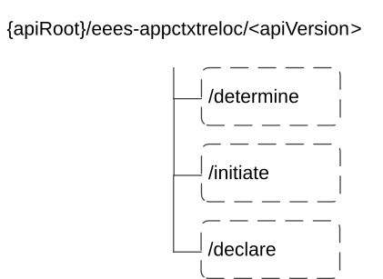

# 6.5.3 Custom Operations without associated resources

## 6.5.3.1 Overview

The structure of the custom operation URIs of the Eees_AppContextRelocation API is shown in Figure 6.5.3.1-1.

Figure 6.5.3.1-1: Resource URI structure of the Eees_AppContextRelocation API

Table 6.5.3.1-1 provides an overview of the custom operations and applicable HTTP methods for the Eees_AppContextRelocation API.

Table 6.5.3.1-1: Custom operations without associated resources

<table>
<colgroup>
<col style="width: 17%" />
<col style="width: 22%" />
<col style="width: 23%" />
<col style="width: 36%" />
</colgroup>
<thead>
<tr class="header">
<th>Operation name</th>
<th>Custom operation URI</th>
<th>Mapped HTTP method</th>
<th>Description</th>
</tr>
</thead>
<tbody>
<tr class="odd">
<td>Determine</td>
<td>/determine</td>
<td>POST</td>
<td>EES or EAS determines if ACR is needed and may initiate the procedure</td>
</tr>
<tr class="even">
<td>Initiate</td>
<td>/initiate</td>
<td>POST</td>
<td>EEC or EES or EAS initiates the requested ACR procedure</td>
</tr>
<tr class="odd">
<td>Declare</td>
<td>/declare</td>
<td>POST</td>
<td>
EAS declares the selected target EAS and the associated information.

(NOTE)
</td>
</tr>
<tr class="even">
<td colspan="4">NOTE: The procedure for Declare custom operation is specified in clause 5.9.2.2 of 3GPP TS 29.558 [4].</td>
</tr>
</tbody>
</table>

The custom operations shall support the URI variables defined in table 6.5.3.1-2.

Table 6.5.3.1-2: URI variables for this custom operation

| Name    | Data type | Definition        |
|---------|-----------|-------------------|
| apiRoot | string    | See clause 6.5.1. |

NOTE 1: Based on SA3 specified security mechanisms for EDGE-1 and EDGE-3 interfaces, the EES can identify the initiator of the API (EEC or EAS) and apply the appropriate security procedures as specified in 3GPP TS 33.558 \[7\].

NOTE 2: The same service API can be implemented on two different interfaces, i.e. EDGE-1 and EDGE-3, which are for separate endpoints, i.e. EEC and EAS.

## 6.5.3.2 Operation: Determine

### 6.5.3.2.1 Description

This custom operation allows the EEC or the EAS to request that the EES evaluates if ACR is needed and subsequently initiate the ACR procedure if required.

### 6.5.3.2.2 Operation Definition

This operation shall support the request data structures, the response data structures and response codes specified in tables 6.5.3.2.2-1 and 6.5.3.2.2-2.

Table 6.5.3.2.2-1: Data structures supported by the POST Request Body on this resource

|              |     |             |                                                             |
|--------------|-----|-------------|-------------------------------------------------------------|
| Data type    | P   | Cardinality | Description                                                 |
| AcrDetermReq | M   | 1           | Information about the requestor and requested ACR operation |

Table 6.5.3.2.2-2: Data structures supported by the POST Response Body on this resource

<table>
<colgroup>
<col style="width: 12%" />
<col style="width: 4%" />
<col style="width: 11%" />
<col style="width: 22%" />
<col style="width: 48%" />
</colgroup>
<tbody>
<tr class="odd">
<td>Data type</td>
<td>P</td>
<td>Cardinality</td>
<td>Response codes</td>
<td>Description</td>
</tr>
<tr class="even">
<td>n/a</td>
<td></td>
<td></td>
<td>204 No Content</td>
<td>Successful case. The ACR request is successfully received and processed.</td>
</tr>
<tr class="odd">
<td>n/a</td>
<td></td>
<td></td>
<td>307 Temporary Redirect</td>
<td>
Temporary redirection. The response shall include a Location header field containing an alternative target URI located in an alternative EES.

Redirection handling is described in clause 5.2.10 of 3GPP TS 29.122 [2].
</td>
</tr>
<tr class="even">
<td>n/a</td>
<td></td>
<td></td>
<td>308 Permanent Redirect</td>
<td>
Permanent redirection. The response shall include a Location header field containing an alternative target URI located in an alternative EES.

Redirection handling is described in clause 5.2.10 of 3GPP TS 29.122 [2]
</td>
</tr>
<tr class="odd">
<td colspan="5">NOTE: The manadatory HTTP error status code for the POST method listed in Table 5.2.6-1 of 3GPP TS 29.122 [3] also apply.</td>
</tr>
</tbody>
</table>

Table 6.5.3.2.2-3: Headers supported by the 307 Response Code on this resource

|          |           |     |             |                                                          |
|----------|-----------|-----|-------------|----------------------------------------------------------|
| Name     | Data type | P   | Cardinality | Description                                              |
| Location | string    | M   | 1           | An alternative target URI located in an alternative EES. |

Table 6.5.3.2.2-4: Headers supported by the 308 Response Code on this resource

|          |           |     |             |                                                          |
|----------|-----------|-----|-------------|----------------------------------------------------------|
| Name     | Data type | P   | Cardinality | Description                                              |
| Location | string    | M   | 1           | An alternative target URI located in an alternative EES. |

## 6.5.3.3 Operation: Initiate

### 6.5.3.3.1 Description

This custom operation allows the EEC to request initiation of an ACR procedure and the EES to request initiation of an ACR procedure for EAS bundle.

### 6.5.3.3.2 Operation Definition

This operation shall support the request data structures and the response data structures and response codes specified in tables 6.5.3.3.2-1 and 6.5.3.3.2-2.

Table 6.5.3.3.2-1: Data structures supported by the POST Request Body on this resource

|            |     |             |                                                             |
|------------|-----|-------------|-------------------------------------------------------------|
| Data type  | P   | Cardinality | Description                                                 |
| AcrInitReq | M   | 1           | Information about the requestor and requested ACR operation |

Table 6.5.3.3.2-2: Data structures supported by the POST Response Body on this resource

<table>
<colgroup>
<col style="width: 14%" />
<col style="width: 4%" />
<col style="width: 11%" />
<col style="width: 22%" />
<col style="width: 47%" />
</colgroup>
<tbody>
<tr class="odd">
<td>Data type</td>
<td>P</td>
<td>Cardinality</td>
<td>Response codes</td>
<td>Description</td>
</tr>
<tr class="even">
<td>n/a</td>
<td></td>
<td></td>
<td>204 No Content</td>
<td>Successful case. The ACR request is successfully received and processed.</td>
</tr>
<tr class="odd">
<td>n/a</td>
<td></td>
<td></td>
<td>307 Temporary Redirect</td>
<td>
Temporary redirection. The response shall include a Location header field containing an alternative target URI located in an alternative EES.

Redirection handling is described in clause 5.2.10 of 3GPP TS 29.122 [2].
</td>
</tr>
<tr class="even">
<td>n/a</td>
<td></td>
<td></td>
<td>308 Permanent Redirect</td>
<td>
Permanent redirection. The response shall include a Location header field containing an alternative target URI located in an alternative EES.

Redirection handling is described in clause 5.2.10 of 3GPP TS 29.122 [2]
</td>
</tr>
<tr class="odd">
<td colspan="5">NOTE: The manadatory HTTP error status code for the POST method listed in Table 5.2.6-1 of 3GPP TS 29.122 [3] also apply.</td>
</tr>
</tbody>
</table>

Table 6.5.3.3.2-3: Headers supported by the 307 Response Code on this resource

|          |           |     |             |                                                          |
|----------|-----------|-----|-------------|----------------------------------------------------------|
| Name     | Data type | P   | Cardinality | Description                                              |
| Location | string    | M   | 1           | An alternative target URI located in an alternative EES. |

Table 6.5.3.3.2-4: Headers supported by the 308 Response Code on this resource

|          |           |     |             |                                                          |
|----------|-----------|-----|-------------|----------------------------------------------------------|
| Name     | Data type | P   | Cardinality | Description                                              |
| Location | string    | M   | 1           | An alternative target URI located in an alternative EES. |

## 6.5.3.4 Operation: Declare

### 6.5.3.4.1 Description

This custom operation allows an S-EAS to declare the selected target EAS and the associated information.

### 6.5.3.4.2 Operation Definition

This operation shall support the request data structures and the response data structures and response codes specified in tables 6.5.3.4.2-1 and 6.5.3.4.2-2.

Table 6.5.3.4.2-1: Data structures supported by the POST Request Body on this resource

|           |     |             |                                               |
|-----------|-----|-------------|-----------------------------------------------|
| Data type | P   | Cardinality | Description                                   |
| AcrDecReq | M   | 1           | Contains the selected target EAS information. |

Table 6.5.3.4.2-2: Data structures supported by the POST Response Body on this resource

<table>
<colgroup>
<col style="width: 12%" />
<col style="width: 4%" />
<col style="width: 11%" />
<col style="width: 22%" />
<col style="width: 48%" />
</colgroup>
<tbody>
<tr class="odd">
<td>Data type</td>
<td>P</td>
<td>Cardinality</td>
<td>Response codes</td>
<td>Description</td>
</tr>
<tr class="even">
<td>n/a</td>
<td></td>
<td></td>
<td>204 No Content</td>
<td>Successful case. The selected target EAS information is successfully received.</td>
</tr>
<tr class="odd">
<td>n/a</td>
<td></td>
<td></td>
<td>307 Temporary Redirect</td>
<td>
Temporary redirection. The response shall include a Location header field containing an alternative target URI located in an alternative EES.

Redirection handling is described in clause 5.2.10 of 3GPP TS 29.122 [2].
</td>
</tr>
<tr class="even">
<td>n/a</td>
<td></td>
<td></td>
<td>308 Permanent Redirect</td>
<td>
Permanent redirection. The response shall include a Location header field containing an alternative target URI located in an alternative EES.

Redirection handling is described in clause 5.2.10 of 3GPP TS 29.122 [2]
</td>
</tr>
<tr class="odd">
<td colspan="5">NOTE: The mandatory HTTP error status code for the POST method listed in Table 5.2.6-1 of 3GPP TS 29.122 [3] also apply.</td>
</tr>
</tbody>
</table>

Table 6.5.3.4.2-3: Headers supported by the 307 Response Code on this resource

|          |           |     |             |                                                          |
|----------|-----------|-----|-------------|----------------------------------------------------------|
| Name     | Data type | P   | Cardinality | Description                                              |
| Location | string    | M   | 1           | An alternative target URI located in an alternative EES. |

Table 6.5.3.4.2-4: Headers supported by the 308 Response Code on this resource

|          |           |     |             |                                                          |
|----------|-----------|-----|-------------|----------------------------------------------------------|
| Name     | Data type | P   | Cardinality | Description                                              |
| Location | string    | M   | 1           | An alternative target URI located in an alternative EES. |
