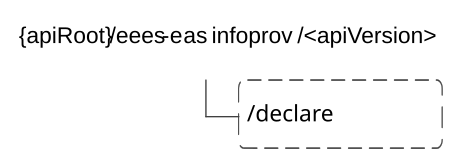

# 6.6 Eees_EASInformationProvisioning API

## 6.6.1 Introduction

The Eees_EASInformationProvisioning service shall use the Eees_EASInformationProvisioning API.

The API URI of Eees_EASInformationProvisioning API shall be:

**{apiRoot}/\<apiName\>/\<apiVersion\>**

The request URI used in HTTP requests shall have the Resource URI structure defined in clause 7.5 of 3GPP TS 29.558 \[4\], i.e:

**{apiRoot}/\<apiName\>/\<apiVersion\>/\<apiSpecificResourceUriPart\>**

with the following components:

\- The {apiRoot} shall be set as described in clause 7.5 of 3GPP TS 29.558 \[4\].

\- The \<apiName\> shall be "eees-easinfoprov".

\- The \<apiVersion\> shall be "v1".

\- The \<apiSpecificResourceUriPart\> shall be set as described in clause 6.6.3.

## 6.6.2 Resources

There are no resources defined for this API in this release of the specification.

## 6.6.3 Custom operations without associated resources

### 6.6.3.1 Overview

The structure of the custom operation URIs of the Eees_EASInformationProvisioning API is shown in Figure 6.6.3.1‑1.

Figure 6.6.3.1-1: Custom operation URI structure of the Eees_EASInformationProvisioning API

Table 6.6.3.1-1 provides an overview of the custom operations and applicable HTTP methods for the Eees_EASInformationProvisioning API.

Table 6.6.3.1-1: Custom operations without associated resources

| Operation name | Custom operation URI | Mapped HTTP method | Description                                                                                                                                        |
|----------------|----------------------|--------------------|----------------------------------------------------------------------------------------------------------------------------------------------------|
| Declare        | /declare             | POST               | EEC exchanging information about selected EAS or ACR scenario selection or both or the EES provides information about selected EAS to another EES. |

The custom operations shall support the URI variables defined in table 6.6.3.1-2.

Table 6.6.3.1-2: URI variables for this custom operation

| Name    | Data type | Definition        |
|---------|-----------|-------------------|
| apiRoot | string    | See clause 6.6.1. |

### 6.6.3.2 Operation: Declare

#### 6.6.3.2.1 Description

This custom operation allows the EEC to send the EAS information provisioning request to the EES to declare EAS information or for the EES to provide information about selected EAS to another EES.

#### 6.6.3.2.2 Operation Definition

This operation shall support the request data structures, the response data structures and response codes specified in tables 6.6.3.2.2-1 and 6.6.3.2.2-2.

Table 6.6.3.2.2-1: Data structures supported by the POST Request Body on this resource

|                |     |             |                                                             |
|----------------|-----|-------------|-------------------------------------------------------------|
| Data type      | P   | Cardinality | Description                                                 |
| EASInfoProvReq | M   | 1           | Information about the EAS information provisioning request. |

Table 6.6.3.2.2-2: Data structures supported by the POST Response Body on this resource

<table>
<colgroup>
<col style="width: 15%" />
<col style="width: 4%" />
<col style="width: 13%" />
<col style="width: 17%" />
<col style="width: 48%" />
</colgroup>
<tbody>
<tr class="odd">
<td>Data type</td>
<td>P</td>
<td>Cardinality</td>
<td>Response codes</td>
<td>Description</td>
</tr>
<tr class="even">
<td>EASInfoProvResp</td>
<td>M</td>
<td>1</td>
<td>200 OK</td>
<td>Information about the EAS information provisioning response.</td>
</tr>
<tr class="odd">
<td>n/a</td>
<td></td>
<td></td>
<td>204 No Content</td>
<td>The EAS information request is successfully received and processed.</td>
</tr>
<tr class="even">
<td>n/a</td>
<td></td>
<td></td>
<td>307 Temporary Redirect</td>
<td>
Temporary redirection. The response shall include a Location header field containing an alternative target URI located in an alternative EES.

Redirection handling is described in clause 5.2.10 of 3GPP TS 29.122 [2].
</td>
</tr>
<tr class="odd">
<td>n/a</td>
<td></td>
<td></td>
<td>308 Permanent Redirect</td>
<td>
Permanent redirection. The response shall include a Location header field containing an alternative target URI located in an alternative EES.

Redirection handling is described in clause 5.2.10 of 3GPP TS 29.122 [2].
</td>
</tr>
<tr class="even">
<td colspan="5">NOTE: The manadatory HTTP error status codes for the POST method listed in table 5.2.6-1 of 3GPP TS 29.122 [3] also apply.</td>
</tr>
</tbody>
</table>

Table 6.6.3.2.2-3: Headers supported by the 307 Response Code on this resource

|          |           |     |             |                                                          |
|----------|-----------|-----|-------------|----------------------------------------------------------|
| Name     | Data type | P   | Cardinality | Description                                              |
| Location | string    | M   | 1           | An alternative target URI located in an alternative EES. |

Table 6.6.3.2.2-4: Headers supported by the 308 Response Code on this resource

|          |           |     |             |                                                          |
|----------|-----------|-----|-------------|----------------------------------------------------------|
| Name     | Data type | P   | Cardinality | Description                                              |
| Location | string    | M   | 1           | An alternative target URI located in an alternative EES. |

### 6.6.3.3 Void

### 6.6.3.4 Void

## 6.6.4 Notifications

None.

## 6.6.5 Data Model

### 6.6.5.1 General

This clause specifies the application data model supported by the Eees_EASInformationProvisioning API.

Table 6.6.5.1-1 specifies the data types defined specifically for the Eees_EASInformationProvisioning API service.

Table 6.6.5.1-1: Eees_EASInformationProvisioning API specific Data Types

| Data type           | Section defined | Description                                                                              | Applicability |
|---------------------|-----------------|------------------------------------------------------------------------------------------|---------------|
| EASasInfoProvReq    | 6.6.5.2.2       | Describes the parameters shared to perform EAS Information Provision related operations. |               |
| EasInfoProvReqType  | 6.6.5.3.3       | Represents the type of EAS Information Provisioning Request.                             |               |
| EASInfoProvResp     | 6.6.5.2.3       | Information about the EAS information provisioning response.                             |               |
| InstantiatedEASInfo | 6.6.5.2.4       | Contains the instantiated EAS information.                                               |               |

Table 6.6.5.1-2 specifies data types re-used by the Eees_EASInformationProvisioning API service from other specifications, including a reference to their respective specifications and when needed, a short description of their use within the Eees_EASInformationProvisioning.

Table 6.6.5.1-2: Re-used Data Types

| Data type      | Reference            | Comments                                                          | Applicability |
|----------------|----------------------|-------------------------------------------------------------------|---------------|
| ACRScenario    | 3GPP TS 29.558 \[4\] | To represent the selected ACR scenarios in ACR_SELECTION event.   |               |
| Dnai           | 3GPP TS 29.571 \[5\] | Identifies a DNAI.                                                |               |
| EndPoint       | 3GPP TS 29.558 \[4\] | Represents the endpoint information of an EAS.                    |               |
| LocationArea5G | 3GPP TS 29.122 \[3\] | Used to define the geographic and topological area served by EAS. |               |

### 6.6.5.2 Structured data types

#### 6.6.5.2.1 Introduction

This clause defines the data structures to be used in resource representations.

#### 6.6.5.2.2 Type: EASInfoProvReq

Table 6.6.5.2.2-1: Definition of type EASInfoProvReq

<table>
<colgroup>
<col style="width: 12%" />
<col style="width: 16%" />
<col style="width: 4%" />
<col style="width: 11%" />
<col style="width: 40%" />
<col style="width: 14%" />
</colgroup>
<tbody>
<tr class="odd">
<td>Name</td>
<td>Data type</td>
<td>P</td>
<td>Cardinality</td>
<td>Description</td>
<td>Applicability</td>
</tr>
<tr class="even">
<td>eecId</td>
<td>string</td>
<td>M</td>
<td>1</td>
<td>Represents a unique identifier of the EEC.</td>
<td></td>
</tr>
<tr class="odd">
<td>acId</td>
<td>string</td>
<td>M</td>
<td>1</td>
<td>Identity of the AC.</td>
<td></td>
</tr>
<tr class="even">
<td>selEasIds</td>
<td>array(string)</td>
<td>O</td>
<td>1..N</td>
<td>The identifier(s) (e.g. FQDN, URI) of the selected EAS (or the selected EAS(s) for EAS bundles) which is either instantiated or instantiable.</td>
<td></td>
</tr>
<tr class="odd">
<td>appGrpId</td>
<td>string</td>
<td>O</td>
<td>0..1</td>
<td>The application group identifier, identifying a group of UEs using the same EAS. (NOTE 4)</td>
<td></td>
</tr>
<tr class="even">
<td>eesList</td>
<td>array(EESInfo)</td>
<td>O</td>
<td>1..N</td>
<td>Contains the list of EESs which support the application group identifier used for common EAS announcement. (NOTE 4)</td>
<td></td>
</tr>
<tr class="odd">
<td>eesId</td>
<td>string</td>
<td>O</td>
<td>0..1</td>
<td>Represents the identifier of the EES.</td>
<td>EdgeApp_3</td>
</tr>
<tr class="even">
<td>eesEndPnts</td>
<td>array(EndPoint)</td>
<td>O</td>
<td>1..N</td>
<td>Represents the endpoint(s) of the EES.</td>
<td>EdgeApp_3</td>
</tr>
<tr class="odd">
<td>reqType</td>
<td>EasInfoProvReqType</td>
<td>O</td>
<td>0..1</td>
<td>Indicates the type of the EAS Information Provisioning Request.</td>
<td></td>
</tr>
<tr class="even">
<td>selAcrScenarios</td>
<td>array(ACRScenario)</td>
<td>O</td>
<td>1..N</td>
<td>The list of ACR scenarios (or the list of ACR scenarios for EAS bundles) selected by the EEC. (NOTE 1)</td>
<td></td>
</tr>
<tr class="odd">
<td>selEasEndPoints</td>
<td>array(EndPoint)</td>
<td>O</td>
<td>1..N</td>
<td>The endpoint(s) of the selected EAS (or the selected EAS(s) for EAS bundles).</td>
<td></td>
</tr>
<tr class="even">
<td>dnais</td>
<td>array(Dnai)</td>
<td>O</td>
<td>1..N</td>
<td>Represents list of Data network access identifier for each selected EAS identifier.</td>
<td></td>
</tr>
<tr class="odd">
<td>svcArea</td>
<td>array(LocationArea5G)</td>
<td>O</td>
<td>1..N</td>
<td>Service availability area (geographical and topological) for each selected EAS identifier</td>
<td></td>
</tr>
<tr class="even">
<td>assEesEndPoints</td>
<td>array(EndPoint)</td>
<td>O</td>
<td>1..N</td>
<td>EES information of the other EES(s) which support the direct bundled EAS, within the same EDN, and associated with the EASID list.</td>
<td></td>
</tr>
<tr class="odd">
<td>casInfo</td>
<td>EndPoint</td>
<td>O</td>
<td>0..1</td>
<td>Target cloud application server information provided by the AC.</td>
<td></td>
</tr>
<tr class="even">
<td>acProf</td>
<td>ACProfile</td>
<td>O</td>
<td>0..1</td>
<td>Profile of AC for which the EEC provides edge enabling services. (NOTE 2, NOTE 3)</td>
<td></td>
</tr>
<tr class="odd">
<td>eecSvcContSupp</td>
<td>array(ACRScenario)</td>
<td>O</td>
<td>1..N</td>
<td>The ACR scenarios supported by the EEC for service continuity. If this attribute is not present, then the EEC does not support service continuity. (NOTE 2, NOTE 5)</td>
<td></td>
</tr>
<tr class="even">
<td colspan="6">
NOTE 1: The attribute may be present only if Selected EASID(s) and Selected EAS Endpoint(s) are present and "reqType" attribute is set to "ACR_SCENARIO_SELECTION_ANNOUNCEMENT".

NOTE 2: The attributes are present only if the "reqType" attribute is set to "ACR_SCENARIO_SELECTION_REQUEST"

NOTE 3: The attribute is present if AC Profile is not shared to EES previously

NOTE 4: This attribute may be present only if the "reqType" attribute is set to "EAS_SELECTION".

NOTE 5: The EAS bundle information is not applicable for proxy type of EAS bundle.
</td>
</tr>
</tbody>
</table>

#### 6.6.5.2.3 Type: EASInfoProvResp

Table 6.6.5.2.3-1: Definition of type EASInfoProvResp

<table>
<colgroup>
<col style="width: 14%" />
<col style="width: 14%" />
<col style="width: 4%" />
<col style="width: 11%" />
<col style="width: 40%" />
<col style="width: 14%" />
</colgroup>
<tbody>
<tr class="odd">
<td>Name</td>
<td>Data type</td>
<td>P</td>
<td>Cardinality</td>
<td>Description</td>
<td>Applicability</td>
</tr>
<tr class="even">
<td>selAcrScenarioList</td>
<td>array(ACRScenario)</td>
<td>O</td>
<td>1..N</td>
<td>The list of ACR scenarios (or the list of ACR scenarios for EAS bundles) selected by the EES. (NOTE 1)</td>
<td></td>
</tr>
<tr class="odd">
<td>instEasInfo</td>
<td>InstantiatedEASInfo</td>
<td>O</td>
<td>0..1</td>
<td>The instantiated EAS information. (NOTE 2)</td>
<td></td>
</tr>
<tr class="even">
<td>comEasEndpoint</td>
<td>EndPoint</td>
<td>O</td>
<td>0..1</td>
<td>The common EAS endpoint provided if the EES has determined a different common EAS. (NOTE 3)</td>
<td></td>
</tr>
<tr class="odd">
<td>comEesEndpoint</td>
<td>EndPoint</td>
<td>O</td>
<td>0..1</td>
<td>The common EES endpoint of the common EAS provided if the common EAS is registered to a different EES. (NOTE 3)</td>
<td></td>
</tr>
<tr class="even">
<td colspan="6">
NOTE 1: Only present if the "reqType" attribute is set to "ACR_SCENARIO_SELECTION_REQUEST".

NOTE 2: Only present if request does not include the selected EAS endpoint.

NOTE 3: Only present if the "reqType" attribute set tois set to "EAS_SELECTION".
</td>
</tr>
</tbody>
</table>

#### 6.6.5.2.4 Type: InstantiatedEASInfo

Table 6.6.5.2.4-1: Definition of type InstantiatedEASInfo

|             |            |     |             |                                                                                                          |               |
|-------------|------------|-----|-------------|----------------------------------------------------------------------------------------------------------|---------------|
| Name        | Data type  | P   | Cardinality | Description                                                                                              | Applicability |
| eas         | EASProfile | M   | 1           | The profile of the instantiated EAS.                                                                     |               |
| lifeTime    | DateTime   | O   | 0..1        | Indicates the time duration for which the EAS information is valid and supposed to be cached in the EEC. |               |
| eesEndpoint | EndPoint   | O   | 0..1        | The endpoint address (e.g. URI, IP address) of the EES where the instantiated EAS is registered.         |               |

#### 6.6.5.2.5 Void

#### 6.6.5.2.6 Void

#### 6.6.5.2.7 Void

### 6.6.5.3 Simple data types and enumerations

#### 6.6.5.3.1 Introduction

This clause defines simple data types and enumerations that can be referenced from data structures defined in the previous clauses.

#### 6.6.5.3.2 Simple data types

The simple data types defined in table 6.6.5.3.2-1 shall be supported.

Table 6.6.5.3.2-1: Simple data types

|           |                 |             |               |
|-----------|-----------------|-------------|---------------|
| Type Name | Type Definition | Description | Applicability |
|           |                 |             |               |

#### 6.6.5.3.3 Enumeration: EasInfoProvReqType

Table 6.6.5.3.3-1: Enumeration EasInfoProvReqType

| Enumeration value                   | Description                                                                            | Applicability |
|-------------------------------------|----------------------------------------------------------------------------------------|---------------|
| ACR_SCENARIO_SELECTION_ANNOUNCEMENT | The EAS information provisioning request types is ACR scenario selection announcement. |               |
| ACR_SCENARIO_SELECTION_REQUEST      | The EAS information provisioning request types is ACR scenario selection request.      |               |
| EAS_SELECTION                       | The EAS information provisioning request types is EAS selection.                       |               |

## 6.6.6 Error Handling

General error handling is described in clause 7.7 of 3GPP TS 29.558 \[4\].

## 6.6.7 Feature negotiation

General feature negotiation procedures are defined in clause 7.8 of 3GPP TS 29.558 \[4\]. Table 6.6.7-1 lists the supported features for the Eees_EASInformationProvisioning API.

Table 6.6.7-1: Supported Features

<table>
<colgroup>
<col style="width: 16%" />
<col style="width: 22%" />
<col style="width: 61%" />
</colgroup>
<thead>
<tr class="header">
<th>Feature number</th>
<th>Feature Name</th>
<th>Description</th>
</tr>
</thead>
<tbody>
<tr class="odd">
<td>1</td>
<td>EdgeApp_3</td>
<td>
This feature indicates support of enhancements for the Enabling Edge Applications. Within this feature the following enhancements are covered:

- declaring the EAS Information provisioning data to the EES.
</td>
</tr>
</tbody>
</table>
