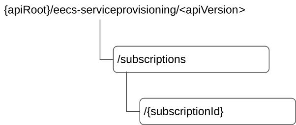

# 8.1.2 Resources

## 8.1.2.1 Overview

Figure 8.1.2.1-1: Resource URI structure of the Eecs_ServiceProvisioning API

Table 8.1.2.1-1 provides an overview of the resources and applicable HTTP methods for the Eecs_ServiceProvisioning API.

Table 8.1.2.1-1: Resources and methods overview

| Resource name                                | Resource URI                    | HTTP method or custom operation | Description                                                                         |
|----------------------------------------------|---------------------------------|---------------------------------|-------------------------------------------------------------------------------------|
| Service Provisioning Subscriptions           | /subscriptions                  | POST                            | Creates a new "Individual Service Provisioning Subscription" resource.              |
| Individual Service Provisioning Subscription | /subscriptions/{subscriptionId} | PUT                             | Updates an existing "Individual Service Provisioning Subscription" resource.        |
|                                              |                                 | DELETE                          | Deletes an existing "Individual Service Provisioning Subscription" resource.        |
|                                              |                                 | PATCH                           | Partial update an existing "Individual Service Provisioning subscription" resource. |

## 8.1.2.3 Resource: Service Provisioning Subscriptions

### 8.1.2.3.1 Description

This resource represents a collection of service provisioning subscriptions of EECs interested in receiving provisioning data related notifications from ECS.

### 8.1.2.3.2 Resource Definition

Resource URI: **{apiRoot}/eecs-serviceprovisioning/\<apiVersion\>/subscriptions**

This resource shall support the resource URI variables defined in table 8.1.2.3.2-1.

Table 8.1.2.3.2-1: Resource URI variables for this resource

| Name    | Data Type | Definition                             |
|---------|-----------|----------------------------------------|
| apiRoot | String    | See clause 7.5 of 3GPP TS 29.558 \[4\] |

### 8.1.2.3.3 Resource Standard Methods

#### 8.1.2.3.3.1 POST

This method creates a new subscription. This method shall support the URI query parameters specified in table 8.1.2.3.3.1-1.

Table 8.1.2.3.3.1-1: URI query parameters supported by the POST method on this resource

| Name | Data type | P   | Cardinality | Description |
|------|-----------|-----|-------------|-------------|
| n/a  |           |     |             |             |

This method shall support the request data structures specified in table 8.1.2.3.3.1-2 and the response data structures and response codes specified in table 8.1.2.3.3.1-3.

Table 8.1.2.3.3.1-2: Data structures supported by the POST Request Body on this resource

| Data type               | P   | Cardinality | Description                                     |
|-------------------------|-----|-------------|-------------------------------------------------|
| ECSServProvSubscription | M   | 1           | Create a new service provisioning subscription. |

Table 8.1.2.3.3.1-3: Data structures supported by the POST Response Body on this resource

<table>
<colgroup>
<col style="width: 23%" />
<col style="width: 4%" />
<col style="width: 11%" />
<col style="width: 17%" />
<col style="width: 42%" />
</colgroup>
<thead>
<tr class="header">
<th>Data type</th>
<th>P</th>
<th>Cardinality</th>
<th>Response codes</th>
<th>Description</th>
</tr>
</thead>
<tbody>
<tr class="odd">
<td>ECSServProvSubscription</td>
<td>M</td>
<td>1</td>
<td>201 Created</td>
<td>Successful case. The ECS service provisioning subscription is successfully created and a representation of the created "Individual ECS Service Provisioning Subscription" resource shall be returned. 
 
The URI of the created resource shall be returned in the "Location" HTTP header</td>
</tr>
<tr class="even">
<td colspan="5">NOTE: The mandatory HTTP error status code for the POST method listed in Table 5.2.6-1 of 3GPP TS 29.122 [3] also apply.</td>
</tr>
</tbody>
</table>

Table 8.1.2.3.3.1-4: Headers supported by the 201 response code on this resource

|          |           |     |             |                                                                                                                                                              |
|----------|-----------|-----|-------------|--------------------------------------------------------------------------------------------------------------------------------------------------------------|
| Name     | Data type | P   | Cardinality | Description                                                                                                                                                  |
| Location | String    | M   | 1           | Contains the URI of the newly created resource, according to the structure: {apiRoot}/eecs-serviceprovisioning/\<apiVersion\>/subscriptions/{subscriptionId} |

### 8.1.2.3.4 Resource Custom Operations

None.

## 8.1.2.4 Resource: Individual Service Provisioning Subscription

### 8.1.2.4.1 Description

This resource represents the individual service provisioning subscription of an EEC at a given ECS.

### 8.1.2.4.2 Resource Definition

Resource URI: **{apiRoot}/eecs-serviceprovisioning/\<apiVersion\>/subscriptions/{subscriptionId}**

This resource shall support the resource URI variables defined in the table 8.1.2.4.2-1.

Table 8.1.2.4.2-1: Resource URI variables for this resource

| Name           | Data Type | Definition                                                  |
|----------------|-----------|-------------------------------------------------------------|
| apiRoot        | string    | See clause 7.5 of 3GPP TS 29.558 \[4\]                      |
| subscriptionId | string    | Identifies an individual service provisioning subscription. |

### 8.1.2.4.3 Resource Standard Methods

#### 8.1.2.4.3.1 PUT

This method updates the individual service provisioning subscription information at the ECS by completely replacing the existing subscription data (except eecId, suppFeat, requestTestNotification and websockNotifConfig). This method shall support the URI query parameters specified in the table 8.1.2.4.3.1-1.

Table 8.1.2.4.3.1-1: URI query parameters supported by the PUT method on this resource

|      |           |     |             |             |
|------|-----------|-----|-------------|-------------|
| Name | Data type | P   | Cardinality | Description |
| n/a  |           |     |             |             |

This method shall support the request data structures specified in table 8.1.2.4.3.1-2 and the response data structures and response codes specified in table 8.1.2.4.3.1-3.

Table 8.1.2.4.3.1-2: Data structures supported by the PUT Request Body on this resource

|                         |     |             |                                                                                                       |
|-------------------------|-----|-------------|-------------------------------------------------------------------------------------------------------|
| Data type               | P   | Cardinality | Description                                                                                           |
| ECSServProvSubscription | M   | 1           | Represents the updated representation of the "individual Service Provisioning Subscription" resource. |

Table 8.1.2.4.3.1-3: Data structures supported by the PUT Response Body on this resource

<table>
<colgroup>
<col style="width: 23%" />
<col style="width: 2%" />
<col style="width: 11%" />
<col style="width: 20%" />
<col style="width: 41%" />
</colgroup>
<thead>
<tr class="header">
<th>Data type</th>
<th>P</th>
<th>Cardinality</th>
<th>Response codes</th>
<th>Description</th>
</tr>
</thead>
<tbody>
<tr class="odd">
<td>ECSServProvSubscription</td>
<td>M</td>
<td>1</td>
<td>200 OK</td>
<td>Successful case. The "Individual Service Provisioning Subscription" resource is successfully updated and a representation of the updated resource shall be returned in the response body modified successfully and the updated information is returned in the response.</td>
</tr>
<tr class="even">
<td>n/a</td>
<td></td>
<td></td>
<td>204 No Content</td>
<td>Successful case. The "Individual Service Provisioning Subscription" resource is successfully updated and no content is returned in the response body.</td>
</tr>
<tr class="odd">
<td>n/a</td>
<td></td>
<td></td>
<td>307 Temporary Redirect</td>
<td>
Temporary redirection.

The response shall include a Location header field containing an alternative URI of the resource located in an alternative ECS.

Redirection handling is described in clause 5.2.10 of 3GPP TS 29.122 [3].
</td>
</tr>
<tr class="even">
<td>n/a</td>
<td></td>
<td></td>
<td>308 Permanent Redirect</td>
<td>
Permanent redirection.

The response shall include a Location header field containing an alternative URI of the resource located in an alternative ECS.

Redirection handling is described in clause 5.2.10 of 3GPP TS 29.122 [3].
</td>
</tr>
<tr class="odd">
<td colspan="5">NOTE: The mandatory HTTP error status code for the HTTP PUT method listed in Table 5.2.6-1 of 3GPP TS 29.122 [3] also apply.</td>
</tr>
</tbody>
</table>

Table 8.1.2.4.3.1-4: Headers supported by the 307 Response Code on this resource

|          |           |     |             |                                                                   |
|----------|-----------|-----|-------------|-------------------------------------------------------------------|
| Name     | Data type | P   | Cardinality | Description                                                       |
| Location | string    | M   | 1           | An alternative URI of the resource located in an alternative ECS. |

Table 8.1.2.4.3.1-5: Headers supported by the 308 Response Code on this resource

|          |           |     |             |                                                                   |
|----------|-----------|-----|-------------|-------------------------------------------------------------------|
| Name     | Data type | P   | Cardinality | Description                                                       |
| Location | string    | M   | 1           | An alternative URI of the resource located in an alternative ECS. |

#### 8.1.2.4.3.2 DELETE

This method removes the subscription information from the ECS. This method shall support the URI query parameters specified in the table 8.1.2.4.3.2-1.

Table 8.1.2.4.3.2-1: URI query parameters supported by the DELETE method on this resource

|      |           |     |             |             |
|------|-----------|-----|-------------|-------------|
| Name | Data type | P   | Cardinality | Description |
| n/a  |           |     |             |             |

This method shall support the request data structures specified in table 8.1.2.4.3.2-2 and the response data structures and response codes specified in table 8.1.2.4.3.2-3.

Table 8.1.2.4.3.2-2: Data structures supported by the DELETE Request Body on this resource

|           |     |             |             |
|-----------|-----|-------------|-------------|
| Data type | P   | Cardinality | Description |
| n/a       |     |             |             |

Table 8.1.2.4.3.2-3: Data structures supported by the DELETE Response Body on this resource

|                                                                                                                              |     |             |                        |                                                                                                                                                                                                                                    |
|------------------------------------------------------------------------------------------------------------------------------|-----|-------------|------------------------|------------------------------------------------------------------------------------------------------------------------------------------------------------------------------------------------------------------------------------|
| Data type                                                                                                                    | P   | Cardinality | Response codes         | Description                                                                                                                                                                                                                        |
| n/a                                                                                                                          | M   | 1           | 204 No Content         | Successful case. The targeted "Individual Service Provisioning Subscription” resource is successfully deleted.                                                                                                                     |
| n/a                                                                                                                          |     |             | 307 Temporary Redirect | Temporary redirection. The response shall include a Location header field containing an alternative URI of the resource located in an alternative ECS. Redirection handling is described in clause 5.2.10 of 3GPP TS 29.122 \[3\]. |
| n/a                                                                                                                          |     |             | 308 Permanent Redirect | Permanent redirection. The response shall include a Location header field containing an alternative URI of the resource located in an alternative ECS. Redirection handling is described in clause 5.2.10 of 3GPP TS 29.122 \[3\]. |
| NOTE: The mandatory HTTP error status code for the DELETE method listed in Table 5.2.6-1 of 3GPP TS 29.122 \[3\] also apply. |     |             |                        |                                                                                                                                                                                                                                    |

Table 8.1.2.4.3.2-4: Headers supported by the 307 Response Code on this resource

|          |           |     |             |                                                                   |
|----------|-----------|-----|-------------|-------------------------------------------------------------------|
| Name     | Data type | P   | Cardinality | Description                                                       |
| Location | string    | M   | 1           | An alternative URI of the resource located in an alternative ECS. |

Table 8.1.2.4.3.2-5: Headers supported by the 308 Response Code on this resource

|          |           |     |             |                                                                   |
|----------|-----------|-----|-------------|-------------------------------------------------------------------|
| Name     | Data type | P   | Cardinality | Description                                                       |
| Location | string    | M   | 1           | An alternative URI of the resource located in an alternative ECS. |

#### 8.1.2.4.3.3 PATCH

This method partially updates the individual service provisioning subscription. This method shall support the URI query parameters specified in the table 8.1.2.4.3.3-1.

Table 8.1.2.4.3.3-1: URI query parameters supported by the PATCH method on this resource

|      |           |     |             |             |
|------|-----------|-----|-------------|-------------|
| Name | Data type | P   | Cardinality | Description |
| n/a  |           |     |             |             |

This method shall support the request data structures specified in table 8.1.2.4.3.3-2 and the response data structures and response codes specified in table 8.1.2.4.3.3-3.

Table 8.1.2.4.3.3-2: Data structures supported by the PATCH Request Body on this resource

|                              |     |             |                                                                                                                       |
|------------------------------|-----|-------------|-----------------------------------------------------------------------------------------------------------------------|
| Data type                    | P   | Cardinality | Description                                                                                                           |
| ECSServProvSubscriptionPatch | M   | 1           | Represents the parameters to request the modification of the "Individual Service Provisioning Subscription" resource. |

Table 8.1.2.4.3.3-3: Data structures supported by the PATCH Response Body on this resource

<table>
<colgroup>
<col style="width: 23%" />
<col style="width: 3%" />
<col style="width: 11%" />
<col style="width: 21%" />
<col style="width: 40%" />
</colgroup>
<thead>
<tr class="header">
<th>Data type</th>
<th>P</th>
<th>Cardinality</th>
<th>Response codes</th>
<th>Description</th>
</tr>
</thead>
<tbody>
<tr class="odd">
<td>ECSServProvSubscription</td>
<td>M</td>
<td>1</td>
<td>200 OK</td>
<td>Successful case. The "Individual Service Provisioning Subscription" resource is successfully modified and a representation of the updated resource shall be returned in the response.</td>
</tr>
<tr class="even">
<td>n/a</td>
<td></td>
<td></td>
<td>204 No Content</td>
<td>Successful case. The "Individual Service Provisioning Subscription" resource is successfully updated and no content is returned in the response body.</td>
</tr>
<tr class="odd">
<td>n/a</td>
<td></td>
<td></td>
<td>307 Temporary Redirect</td>
<td>
Temporary redirection.

The response shall include a Location header field containing an alternative URI of the resource located in an alternative ECS.

Redirection handling is described in clause 5.2.10 of 3GPP TS 29.122 [3].
</td>
</tr>
<tr class="even">
<td>n/a</td>
<td></td>
<td></td>
<td>308 Permanent Redirect</td>
<td>
Permanent redirection.

The response shall include a Location header field containing an alternative URI of the resource located in an alternative ECS.

Redirection handling is described in clause 5.2.10 of 3GPP TS 29.122 [3].
</td>
</tr>
<tr class="odd">
<td colspan="5">NOTE: The mandatory HTTP error status code for the HTTP PATCH method listed in Table 5.2.6-1 of 3GPP TS 29.122 [3] also apply.</td>
</tr>
</tbody>
</table>

Table 8.1.2.4.3.3-7: Headers supported by the 307 Response Code on this resource

|          |           |     |             |                                                                   |
|----------|-----------|-----|-------------|-------------------------------------------------------------------|
| Name     | Data type | P   | Cardinality | Description                                                       |
| Location | string    | M   | 1           | An alternative URI of the resource located in an alternative ECS. |

Table 8.1.2.4.3.3-8: Headers supported by the 308 Response Code on this resource

|          |           |     |             |                                                                   |
|----------|-----------|-----|-------------|-------------------------------------------------------------------|
| Name     | Data type | P   | Cardinality | Description                                                       |
| Location | string    | M   | 1           | An alternative URI of the resource located in an alternative ECS. |
