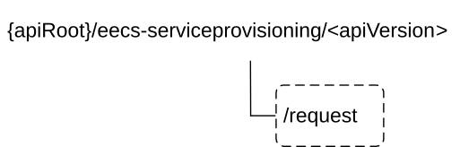

# 8.1.3 Custom Operations without associated resources

## 8.1.3.1 Overview

The structure of the custom operation URIs of the Eecs_ServiceProvisioning API is shown in Figure 8.1.3.1-1.

Figure 8.1.3.1-1: Custom operation URI structure of the Eecs_ServiceProvisioning API

Table 8.1.3.1-1 provides an overview of the custom operations and applicable HTTP methods defined for the Eecs_ServiceProvisioning API.

Table 8.1.3.1-1: Custom operations without associated resources

| Operation name | Custom operation URI | Mapped HTTP method | Description                                                            |
|----------------|----------------------|--------------------|------------------------------------------------------------------------|
| Request        | /request             | POST               | Enables an EEC to request service provisioning information to the ECS. |

The custom operations shall support the URI variables defined in table 8.1.3.1-2.

Table 8.1.3.1-2: URI variables for this custom operation

| Name    | Data type | Definition        |
|---------|-----------|-------------------|
| apiRoot | string    | See clause 8.1.2. |

## 8.1.3.2 Operation: Request

### 8.1.3.2.1 Description

The custom operation enables an EEC to request service provisioning information to the ECS.

### 8.1.3.2.2 Operation Definition

This operation shall support the request data structures and the response data structures and response codes specified in tables 8.1.3.2.2-1 and 8.1.3.2.2-2.

Table 8.1.3.2.2-1: Data structures supported by the POST Request Body on this resource

|                |     |             |                                                                      |
|----------------|-----|-------------|----------------------------------------------------------------------|
| Data type      | P   | Cardinality | Description                                                          |
| ECSServProvReq | M   | 1           | Contains the parameters to request service provisioning information. |

Table 8.1.3.2.2-2: Data structures supported by the POST Response Body on this resource

<table>
<colgroup>
<col style="width: 18%" />
<col style="width: 4%" />
<col style="width: 11%" />
<col style="width: 23%" />
<col style="width: 42%" />
</colgroup>
<tbody>
<tr class="odd">
<td>Data type</td>
<td>P</td>
<td>Cardinality</td>
<td>Response codes</td>
<td>Description</td>
</tr>
<tr class="even">
<td>ECSServProvResp</td>
<td>M</td>
<td>1</td>
<td>200 OK</td>
<td>Successful case. The requested service provisioning information is returned successfully.</td>
</tr>
<tr class="odd">
<td>n/a</td>
<td></td>
<td></td>
<td>204 No Content</td>
<td>Successful case. The requested service provisioning information does not exist.</td>
</tr>
<tr class="even">
<td>n/a</td>
<td></td>
<td></td>
<td>307 Temporary Redirect</td>
<td>
Temporary redirection. The response shall include a Location header field containing an alternative target URI located in an alternative ECS.

Redirection handling is described in clause 5.2.10 of 3GPP TS 29.122 [3].
</td>
</tr>
<tr class="odd">
<td>n/a</td>
<td></td>
<td></td>
<td>308 Permanent Redirect</td>
<td>
Permanent redirection. The response shall include a Location header field containing an alternative target URI located in an alternative ECS.

Redirection handling is described in clause 5.2.10 of 3GPP TS 29.122 [3]
</td>
</tr>
<tr class="even">
<td colspan="5">NOTE: The manadatory HTTP error status code for the HTTP POST method listed in Table 5.2.6-1 of 3GPP TS 29.122 [3] also apply.</td>
</tr>
</tbody>
</table>

Table 8.1.3.2.2-3: Headers supported by the 307 Response Code on this resource

|          |           |     |             |                                                          |
|----------|-----------|-----|-------------|----------------------------------------------------------|
| Name     | Data type | P   | Cardinality | Description                                              |
| Location | string    | M   | 1           | An alternative target URI located in an alternative ECS. |

Table 8.1.3.2.2-4: Headers supported by the 308 Response Code on this resource

|          |           |     |             |                                                          |
|----------|-----------|-----|-------------|----------------------------------------------------------|
| Name     | Data type | P   | Cardinality | Description                                              |
| Location | string    | M   | 1           | An alternative target URI located in an alternative ECS. |
