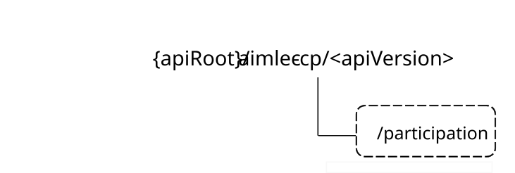

# 6.1 Aimlec_AIMLEClientParticipation API

## 6.1.1 Introduction

The AIMLE client participation service shall use the Aimlec_AIMLEClientParticipation API.

The API URI of the Aimlec_AIMLEClientParticipation API shall be:

**{apiRoot}/\<apiName\>/\<apiVersion\>**

The request URIs used in HTTP requests shall have the Resource URI structure defined in clause 5.2.4 of 3GPP TS 29.122 \[5\], i.e.:

**{apiRoot}/\<apiName\>/\<apiVersion\>/\<apiSpecificSuffixes\>**

with the following components:

\- The {apiRoot} shall be set as described in clause 5.2.4 of 3GPP TS 29.122 \[5\].

\- The \<apiName\> shall be "aimlec-cp".

\- The \<apiVersion\> shall be "v1".

\- The \<apiSpecificSuffixes\> shall be set as described in clause 6.1.3.

## 6.1.2 Usage of HTTP and common API related aspects

The provisions of clause 5.2 of 3GPP TS 29.122 \[5\] shall apply for the Aimlec_AIMLEClientParticipation API.

## 6.1.3 Resources

There are neither resources nor methods used for the service.

## 6.1.4 Custom operations without associated resources

### 6.1.4.1 Overview

The structure of the custom operation URIs of the Aimlec_AIMLEClientParticipation API is shown in Figure 6.1.4.1-1.

Figure 6.1.4.1-1: Custom operation URI structure of the Aimlec_AIMLEClientParticipation API

Table 6.1.4.1-1 provides an overview of the custom operations and applicable HTTP methods defined for the Aimlec_AIMLEClientParticipation API.

Table 6.1.4.1-1: Custom operations without associated resources

| Operation name                     | Custom operation URI | Mapped HTTP method | Description                                                                                     |
|------------------------------------|----------------------|--------------------|-------------------------------------------------------------------------------------------------|
| Participation for AI/ML operations | /participation       | POST               | Used by the AIMLE server to request the AIMLE client for participation of the AI/ML operations. |

The custom operations shall support the URI variables defined in table 6.1.4.1-2.

Table 6.1.4.1-2: URI variables for this custom operation

| Name    | Data type | Definition        |
|---------|-----------|-------------------|
| apiRoot | string    | See clause 6.1.1. |

### 6.1.4.2 Operation: Participation for AI/ML operations

#### 6.1.4.2.1 Description

The custom operation enables the AIMLE server to request the AIMLE client to join or depart one or more AI/ML operations.

#### 6.1.4.2.2 Operation definition

This operation shall support the response data structures and response codes specified in tables 6.1.4.2.2-1, 6.1.4.2.2-2, 6.1.4.2.2-3 and 6.1.4.2.2-4.

Table 6.1.4.2.2-1: Data structures supported by the POST Request Body on this resource

| Data type              | P   | Cardinality | Description                                     |
|------------------------|-----|-------------|-------------------------------------------------|
| AimlecParticipationReq | M   | 1           | Request for participation the AI/ML operations. |

Table 6.1.4.2.2-2: Data structures supported by the POST Response Body on this resource

<table>
<colgroup>
<col style="width: 18%" />
<col style="width: 4%" />
<col style="width: 13%" />
<col style="width: 13%" />
<col style="width: 50%" />
</colgroup>
<thead>
<tr class="header">
<th>Data type</th>
<th>P</th>
<th>Cardinality</th>
<th>
Response

codes
</th>
<th>Description</th>
</tr>
</thead>
<tbody>
<tr class="odd">
<td>AimlecParticipationResp</td>
<td>M</td>
<td>1</td>
<td>200 OK</td>
<td>Successful case. The requested "participation the AI/ML operation" shall be responded.</td>
</tr>
<tr class="even">
<td>n/a</td>
<td></td>
<td></td>
<td>307 Temporary Redirect</td>
<td>
Temporary redirection. The response shall include a Location header field containing an alternative URI of the resource located in an alternative AIMLE client.

Redirection handling is described in clause 5.2.10 of 3GPP TS 29.122 [5].
</td>
</tr>
<tr class="odd">
<td>n/a</td>
<td></td>
<td></td>
<td>308 Permanent Redirect</td>
<td>
Permanent redirection. The response shall include a Location header field containing an alternative URI of the resource located in an alternative AIMLE client.

Redirection handling is described in clause 5.2.10 of 3GPP TS 29.122 [5].
</td>
</tr>
<tr class="even">
<td colspan="5">NOTE: The mandatory HTTP error status code for the HTTP POST method listed in table 5.2.6-1 of 3GPP TS 29.122 [5] also apply.</td>
</tr>
</tbody>
</table>

Table 6.1.4.2.2-3: Headers supported by the 307 Response Code on this resource

| Name     | Data type | P   | Cardinality | Description                                                                |
|----------|-----------|-----|-------------|----------------------------------------------------------------------------|
| Location | string    | M   | 1           | Contains an alternative target URI located in an alternative AIMLE client. |

Table 6.1.4.2.2-4: Headers supported by the 308 Response Code on this resource

| Name     | Data type | P   | Cardinality | Description                                                                |
|----------|-----------|-----|-------------|----------------------------------------------------------------------------|
| Location | string    | M   | 1           | Contains an alternative target URI located in an alternative AIMLE client. |

## 6.1.5 Notifications

### 6.1.5.1 General

There are no notifications defined for the Aimlec_AIMLEClientParticipation API in this release of the specification.

## 6.1.6 Data model

### 6.1.6.1 General

This clause specifies the application data model supported by the API.

Table 6.1.6.1-1 specifies the data types defined for the Aimlec_AIMLEClientParticipation API.

Table 6.1.6.1-1: Aimlec_AIMLEClientParticipation API specific data types

| Data type               | Clause defined | Description                                                     | Applicability |
|-------------------------|----------------|-----------------------------------------------------------------|---------------|
| AimlecParticipationReq  | 6.1.6.2.2      | Represents the participation request for the AI/ML operations.  |               |
| AimlecParticipationResp | 6.1.6.2.3      | Represents the participation response for the AI/ML operations. |               |
| ClienSetPart            | 6.1.6.3.3      | Represents the participation request for the AIMLE client set.  |               |
| SchedAimlOperation      | 6.1.6.2.4      | Represents the scheduled AI/ML participation type.              |               |

Table 6.1.6.1-2 specifies data types re-used by the Aimlec_AIMLEClientParticipation API from other specifications, including a reference to their respective specifications, and when needed, a short description of their use within the Aimlec_AIMLEClientParticipation API.

Table 6.1.6.1-2: Aimlec_AIMLEClientParticipation API re-used data types

| Data type                  | Reference            | Comments                                            | Applicability |
|----------------------------|----------------------|-----------------------------------------------------|---------------|
| AimlOperation              | 6.3.6.3.5            | Represents the type of the AI/ML operation.         |               |
| DatasetRequirement         | 3GPP TS 29.482 \[7\] | Represents the dataset requirements.                |               |
| ScheduledCommunicationTime | 3GPP TS 29.122 \[5\] | Represents an offered scheduled communication time. |               |
| ServiceRequirement         | 3GPP TS 29.482 \[7\] | Represents the service requirements.                |               |

### 6.1.6.2 Structured data types

#### 6.1.6.2.1 Introduction

This clause defines the structures to be used in resource representations.

#### 6.1.6.2.2 Type: AimlecParticipationReq

Table 6.1.6.2.2-1: Definition of type AimlecParticipationReq

| Attribute name      | Data type                 | P   | Cardinality | Description                                                                                                                                 | Applicability |
|---------------------|---------------------------|-----|-------------|---------------------------------------------------------------------------------------------------------------------------------------------|---------------|
| requesterId         | string                    | M   | 1           | Contains the identifier of the service consumer. For the AIMLE client, e.g. unique client identifier. For the AIMLE server, e.g. FQDN, URI. |               |
| clientSetId         | string                    | M   | 1           | Identifies the identity of the AIMLE client set.                                                                                            |               |
| clientSetPart       | ClientSetPart             | M   | 1           | Identifies the participation request for the AIMLE client set.                                                                              |               |
| mlModelId           | string                    | M   | 1           | Identifies the identity of the ML model for AI/ML operation.                                                                                |               |
| schedAimlOperations | array(SchedAimlOperation) | M   | 1..N        | Identifies the list of AI/ML operations which are required to be performed.                                                                 |               |
| dataSetReq          | DatasetRequirement        | M   | 1           | Identifies the dataset requirements.                                                                                                        |               |
| serviceReq          | ServiceRequirement        | M   | 1           | Identifies the service requirements.                                                                                                        |               |

#### 6.1.6.2.3 Type: AimlecParticipationResp

Table 6.1.6.2.3-1: Definition of type AimlecParticipationResp

<table>
<colgroup>
<col style="width: 16%" />
<col style="width: 12%" />
<col style="width: 4%" />
<col style="width: 11%" />
<col style="width: 40%" />
<col style="width: 13%" />
</colgroup>
<thead>
<tr class="header">
<th>Attribute name</th>
<th>Data type</th>
<th>P</th>
<th>Cardinality</th>
<th>Description</th>
<th>Applicability</th>
</tr>
</thead>
<tbody>
<tr class="odd">
<td>clientStatus</td>
<td>boolean</td>
<td>M</td>
<td>1</td>
<td>
It indicates whether the willingness of the AIMLE client to be added to or to be removed.

- When set to "true" indicates the willingness of the AIMLE client to be added to or to be removed from the AIMLE client list to perform AI/ML operations.

- When set to "false" indicates the denial of the AIMLE client to be added to or to be removed from the AIMLE client list to perform AI/ML operations.
</td>
<td></td>
</tr>
</tbody>
</table>

#### 6.1.6.2.4 Type: SchedAimlOperation

Table 6.1.6.2.4-1: Definition of type SchedAimlOperation

| Attribute name | Data type                  | P   | Cardinality | Description                                      | Applicability |
|----------------|----------------------------|-----|-------------|--------------------------------------------------|---------------|
| aimlOperation  | AimlOperation              | M   | 1           | Identifies the type of the AI/ML operation.      |               |
| aimlOperSched  | ScheduledCommunicationTime | O   | 0..1        | Identifies the schedule for the AI/ML operation. |               |

### 6.1.6.3 Simple data types and enumerations

#### 6.1.6.3.1 Introduction

This clause defines simple data types and enumerations that can be referenced from data structures defined in the previous clauses.

#### 6.1.6.3.2 Simple data types

The simple data types defined in table 6.1.6.3.2-1 shall be supported.

Table 6.1.6.3.2-1: Simple data types

| Type Name | Type Definition | Description | Applicability |
|-----------|-----------------|-------------|---------------|
|           |                 |             |               |

#### 6.1.6.3.3 Enumeration: ClientSetPart

The enumeration ClientSetPart represents the participation request for the AIMLE client set. It shall comply with the provisions defined in table 6.1.6.3.3-1.

Table 6.1.6.3.3-1: Enumeration ClienSetPart

| Enumeration value | Description                                | Applicability |
|-------------------|--------------------------------------------|---------------|
| JOIN              | Identifies to join the AIMLE client set.   |               |
| DEPART            | Identifies to depart the AIMLE client set. |               |

### 6.1.6.4 Data types describing alternative data types or combinations of data types

There are no data types describing alternative data types or combinations of data types defined for this API in this release of the specification.

### 6.1.6.5 Binary data

#### 6.1.6.5.1 Binary data types

Table 6.1.6.5.1-1: Binary data types

| Name | Clause defined | Content type |
|------|----------------|--------------|
|      |                |              |

## 6.1.7 Error handling

### 6.1.7.1 General

For the Aimlec_AIMLEClientParticipation API, HTTP error responses shall be supported as specified in clause 5.2.6 of 3GPP TS 29.122 \[5\]. Protocol errors and application errors specified in clause 5.2.6 of 3GPP TS 29.122 \[5\] shall be supported for the HTTP status codes specified in table 5.2.6-1 of 3GPP TS 29.122 \[5\].

In addition, the requirements in the following clauses are applicable for the Aimlec_AIMLEClientParticipation API.

### 6.1.7.2 Protocol errors

No specific procedures for the Aimlec_AIMLEClientParticipation API are specified.

### 6.1.7.3 Application errors

The application errors defined for the Aimlec_AIMLEClientParticipation API are listed in table 6.1.7.3-1.

Table 6.1.7.3-1: Application errors

| Application Error | HTTP status code | Description |
|-------------------|------------------|-------------|
|                   |                  |             |

## 6.1.8 Feature negotiation

The optional features in table 6.1.8-1 are defined for the Aimlec_AIMLEClientParticipation API. They shall be negotiated using the extensibility mechanism defined in clause 5.2.7 of 3GPP TS 29.122 \[5\].

Table 6.1.8-1: Supported features

| Feature number | Feature Name | Description |
|----------------|--------------|-------------|
|                |              |             |

## 6.1.9 Security

The provisions of clause 6 of 3GPP TS 29.122 \[5\] shall apply for the Aimlec_AIMLEClientParticipation API.
