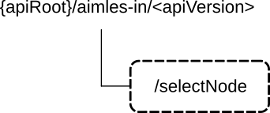

# 6.17 Aimles_IntermediateNode API

## 6.17.1 Introduction

The intermediate node service shall use the Aimles_IntermediateNode API.

The API URI of the Aimles_IntermediateNode API shall be:

**{apiRoot}/\<apiName\>/\<apiVersion\>**

The request URIs used in HTTP requests shall have the Resource URI structure defined in clause 5.2.4 of 3GPP TS 29.122 \[5\], i.e.:

**{apiRoot}/\<apiName\>/\<apiVersion\>/\<apiSpecificSuffixes\>**

with the following components:

\- The {apiRoot} shall be set as described in clause 5.2.4 of 3GPP TS 29.122 \[5\].

\- The \<apiName\> shall be "aimles-in".

\- The \<apiVersion\> shall be "v1".

\- The \<apiSpecificSuffixes\> shall be set as described in clause 6.17.3.

## 6.17.2 Usage of HTTP and common API related aspects

The provisions of clause 5.2 of 3GPP TS 29.122 \[5\] shall apply for the Aimles_IntermediateNode API.

## 6.17.3 Resources

### 6.17.3.1 Overview

This clause describes the structure for the Resource URIs and the resources and methods used for the service.

Figure 6.17.3.1-1 depicts the resource URIs structure for the Aimles_IntermediateNode API.

Figure 6.17.3.1-1: Resource URI structure of the Aimles_IntermediateNode API

Table 6.17.3.1-1 provides an overview of the resources and applicable HTTP methods.

Table 6.17.3.1-1: Resources and methods overview

| Resource name                          | Resource URI  | HTTP method | Description                                         |
|----------------------------------------|---------------|-------------|-----------------------------------------------------|
| Discover one or more intermediate node | /discoverNode | GET         | Request discovering one or more intermediate nodes. |

### 6.17.3.2 Resource: Discover one or more intermediate nodes

#### 6.17.3.2.1 Description

This resource represents discovering one or more intermediate nodes.

#### 6.17.3.2.2 Resource definition

Resource URI: **{apiRoot}/aimles-in/\<apiVersion\>/discoverNode**

This resource shall support the resource URI variables defined in table 6.17.3.2.2-1.

Table 6.17.3.2.2-1: Resource URI variables for this resource

| Name    | Data type | Definition        |
|---------|-----------|-------------------|
| apiRoot | string    | See clause 6.17.1 |

#### 6.17.3.2.3 Resource standard methods

##### 6.17.3.2.3.1 GET

This method shall support the URI query parameters specified in table 6.17.3.2.3.1-1.

Table 6.17.3.2.3.1-1: URI query parameters supported by the GET method on this resource

<table>
<colgroup>
<col style="width: 16%" />
<col style="width: 15%" />
<col style="width: 4%" />
<col style="width: 11%" />
<col style="width: 37%" />
<col style="width: 14%" />
</colgroup>
<tbody>
<tr class="odd">
<td>Name</td>
<td>Data type</td>
<td>P</td>
<td>Cardinality</td>
<td>Description</td>
<td>Applicability</td>
</tr>
<tr class="even">
<td>filt-criteria</td>
<td>IntermediateNodeDiscoveryReq</td>
<td>M</td>
<td>1</td>
<td>Represents the intermedia node discovery filtering criteria.</td>
<td></td>
</tr>
<tr class="odd">
<td>supported-features</td>
<td>SupportedFeatures</td>
<td>C</td>
<td>0..1</td>
<td>
Contains supported features information, used to negotiate the applicability of optional features.

This query parameter shall be present only if feature negotiation needs to take place.
</td>
<td></td>
</tr>
</tbody>
</table>

This method shall support the request data structures specified in table 6.17.3.2.3.1-2 and the response data structures and response codes specified in table 6.17.3.2.3.1-3.

Table 6.17.3.2.3.1-2: Data structures supported by the GET Request Body on this resource

|           |     |             |             |
|-----------|-----|-------------|-------------|
| Data type | P   | Cardinality | Description |
| n/a       |     |             |             |

Table 6.17.3.2.3.1-3: Data structures supported by the GET Response Body on this resource

<table>
<colgroup>
<col style="width: 22%" />
<col style="width: 4%" />
<col style="width: 13%" />
<col style="width: 22%" />
<col style="width: 38%" />
</colgroup>
<tbody>
<tr class="odd">
<td>Data type</td>
<td>P</td>
<td>Cardinality</td>
<td>Response codes</td>
<td>Description</td>
</tr>
<tr class="even">
<td>IntermediateNodeDiscoveryResp</td>
<td>M</td>
<td>1</td>
<td>200 OK</td>
<td>
Successful case.

The response body contains list of AIMLE servers and split operation profile.
</td>
</tr>
<tr class="odd">
<td>n/a</td>
<td></td>
<td></td>
<td>307 Temporary Redirect</td>
<td>
Temporary redirection.

The response shall include a Location header field containing an alternative URI of the resource located in an alternative AIMLE server.

Redirection handling is described in clause 5.2.10 of 3GPP TS 29.122 [5].
</td>
</tr>
<tr class="even">
<td>n/a</td>
<td></td>
<td></td>
<td>308 Permanent Redirect</td>
<td>
Permanent redirection.

The response shall include a Location header field containing an alternative URI of the resource located in an alternative AIMLE server.

Redirection handling is described in clause 5.2.10 of 3GPP TS 29.122 [5].
</td>
</tr>
<tr class="odd">
<td colspan="5">NOTE: The mandatory HTTP error status codes for the HTTP GET method listed in table 5.2.6-1 of 3GPP TS 29.122 [5] also apply.</td>
</tr>
</tbody>
</table>

Table 6.17.3.2.3.1-4: Headers supported by the 307 Response Code on this resource

|          |           |     |             |                                                                                     |
|----------|-----------|-----|-------------|-------------------------------------------------------------------------------------|
| Name     | Data type | P   | Cardinality | Description                                                                         |
| Location | string    | M   | 1           | Contains an alternative URI of the resource located in an alternative AIMLE Server. |

Table 6.17.3.2.3.1-5: Headers supported by the 308 Response Code on this resource

|          |           |     |             |                                                                                     |
|----------|-----------|-----|-------------|-------------------------------------------------------------------------------------|
| Name     | Data type | P   | Cardinality | Description                                                                         |
| Location | string    | M   | 1           | Contains an alternative URI of the resource located in an alternative AIMLE Server. |

#### 6.17.3.2.4 Resource custom operations

There are no resource custom operations defined for this resource in this release of the specification.

## 6.17.4 Custom operations without associated resources

### 6.17.4.1 Overview

The structure of the custom operation URIs of the Aimles_IntermediateNode API is shown in Figure 6.17.4.1-1.

Figure 6.17.4.1-1: Custom operation URI structure of the Aimles_IntermediateNode API

Table 6.17.4.1-1 provides an overview of the custom operations and applicable HTTP methods defined for the Aimles_IntermediateNode API.

Table 6.17.4.1-1: Custom operations without associated resources

| Operation name                       | Custom operation URI | Mapped HTTP method | Description                                                                                                   |
|--------------------------------------|----------------------|--------------------|---------------------------------------------------------------------------------------------------------------|
| Select one or more intermediate node | /selectNode          | POST               | Used by the AIMLE client to request the AIMLE server for selecting one or more discovered intermediate nodes. |

The custom operations shall support the URI variables defined in table 6.17.4.1-2.

Table 6.17.4.1-2: URI variables for this custom operation

| Name    | Data type | Definition         |
|---------|-----------|--------------------|
| apiRoot | string    | See clause 6.17.1. |

### 6.17.4.2 Operation: Select one or more intermediate node

#### 6.17.4.2.1 Description

The custom operation enables selecting one or more discovered intermediate nodes.

#### 6.17.4.2.2 Operation Definition

This operation shall support the request data structures and the response data structures, and response codes specified in tables 6.17.4.2.2-1 and 6.17.4.2.2-2.

Table 6.17.4.2.2-1: Data structures supported by the POST Request Body on this custom operation

| Data type                 | P   | Cardinality | Description                                                                                                                                                                 |
|---------------------------|-----|-------------|-----------------------------------------------------------------------------------------------------------------------------------------------------------------------------|
| IntermediateNodeSelectReq | M   | 1           | Represents the discovered intermediate nodes which are selected by the AIMLE client and are to be used to update the AIMLE pipeline operation for AIMLE service continuity. |

Table 6.17.4.2.2-2: Data structures supported by the POST Response Body on this custom operation

<table>
<colgroup>
<col style="width: 22%" />
<col style="width: 4%" />
<col style="width: 13%" />
<col style="width: 22%" />
<col style="width: 38%" />
</colgroup>
<tbody>
<tr class="odd">
<td>Data type</td>
<td>P</td>
<td>Cardinality</td>
<td>Response codes</td>
<td>Description</td>
</tr>
<tr class="even">
<td>n/a</td>
<td>M</td>
<td>1</td>
<td>204 No Content</td>
<td>
Successful case.

The discovered one or more intermediate nodes are successfully selected.
</td>
</tr>
<tr class="odd">
<td>n/a</td>
<td></td>
<td></td>
<td>307 Temporary Redirect</td>
<td>
Temporary redirection.

The response shall include a Location header field containing an alternative URI of the resource located in an alternative AIMLE server.

Redirection handling is described in clause 5.2.10 of 3GPP TS 29.122 [5].
</td>
</tr>
<tr class="even">
<td>n/a</td>
<td></td>
<td></td>
<td>308 Permanent Redirect</td>
<td>
Permanent redirection.

The response shall include a Location header field containing an alternative URI of the resource located in an alternative AIMLE server.

Redirection handling is described in clause 5.2.10 of 3GPP TS 29.122 [5].
</td>
</tr>
<tr class="odd">
<td colspan="5">NOTE: The mandatory HTTP error status codes for the HTTP POST method listed in table 5.2.6-1 of 3GPP TS 29.122 [5] also apply.</td>
</tr>
</tbody>
</table>

Table 6.17.4.2.2-3: Headers supported by the 307 Response Code on this custom operation

|          |           |     |             |                                                                                     |
|----------|-----------|-----|-------------|-------------------------------------------------------------------------------------|
| Name     | Data type | P   | Cardinality | Description                                                                         |
| Location | string    | M   | 1           | Contains an alternative URI of the resource located in an alternative AIMLE Server. |

Table 6.17.4.2.2-4: Headers supported by the 308 Response Code on this custom operation

|          |           |     |             |                                                                                     |
|----------|-----------|-----|-------------|-------------------------------------------------------------------------------------|
| Name     | Data type | P   | Cardinality | Description                                                                         |
| Location | string    | M   | 1           | Contains an alternative URI of the resource located in an alternative AIMLE Server. |

## 6.17.5 Notifications

There are no notifications defined for this API in this release of the specification.

## 6.17.6 Data model

### 6.17.6.1 General

This clause specifies the application data model supported by the Aimles_IntermediateNode API.

Table 6.17.6.1-1 specifies the data types defined for the Aimles_IntermediateNode API.

Table 6.17.6.1-1: Aimles_IntermediateNode API specific Data Types

| Data type                     | Clause defined | Description                                                                                                                            | Applicability |
|-------------------------------|----------------|----------------------------------------------------------------------------------------------------------------------------------------|---------------|
| DiscoveredNode                | 6.17.6.2.5     | Represents the discovered intermediate node.                                                                                           |               |
| IntermediateNodeDiscoveryReq  | 6.17.6.2.2     | Represents the request for discovering the one or more intermediate nodes.                                                             |               |
| IntermediateNodeDiscoveryResp | 6.17.6.2.3     | Represents the candidate intermediate nodes that can be used to update the AIMLE pipeline operation for AIMLE service continuity.      |               |
| IntermediateNodeSelectReq     | 6.17.6.2.4     | Represents the selected intermediate nodes that are to be used to update the AIMLE pipeline operation for AIMLE service continuity.    |               |
| MobilityInformation           | 6.17.6.3.4     | Represents mobility information by the discovered VAL client.                                                                          |               |
| NodeRoleType                  | 6.17.6.3.3     | Represents the supported types by the discovered intermediate node (e.g. AIMLE server or AIMLE client) as the relay/intermediate node. |               |
| SplitMlModelTopologies        | 6.17.6.3.5     | Represents the supported split ML model topologies.                                                                                    |               |
| SplitOpsInfo                  | 6.17.6.2.6     | Represents the split operation information, supported by the discovered VAL client.                                                    |               |

Table 6.17.6.1-2 specifies data types re-used by the Aimles_IntermediateNode API from other specifications, including a reference to their respective specifications, and when needed, a short description of their use within the Aimles_IntermediateNode API.

Table 6.17.6.1-2: Aimles_IntermediateNode API re-used Data Types

| Data type          | Reference             | Comments                                                                                         | Applicability |
|--------------------|-----------------------|--------------------------------------------------------------------------------------------------|---------------|
| ClientDiscCriteria | 3GPP TS 29.549 \[9\]  | Represents the AIMLE Client discovery criteria.                                                  |               |
| LocationArea5G     | 3GPP TS 29.122 \[5\]  | Represent the location information.                                                              |               |
| SupportedFeatures  | 3GPP TS 29.571 \[11\] | Represents the supported features, used to negotiate the supported optional features of the API. |               |
| TimeWindow         | 3GPP TS 29.122 \[5\]  | Identifies the start time and the end time for the validity time.                                |               |
| ValTargetUe        | 3GPP TS 29.549 \[9\]  | Unique identifier of a VAL user or a VAL UE.                                                     |               |

### 6.17.6.2 Structured data types

#### 6.17.6.2.1 Introduction

This clause defines the structures to be used in resource representations.

#### 6.17.6.2.2 Type: IntermediateNodeDiscoveryReq

Table 6.17.6.2.2-1: Definition of type IntermediateNodeDiscoveryReq

| Attribute name    | Data type          | P   | Cardinality | Description                                                                       | Applicability |
|-------------------|--------------------|-----|-------------|-----------------------------------------------------------------------------------|---------------|
| requestorId       | ValTargetUe        | M   | 1           | The identifier of the AIMLE client that requests.                                 |               |
| serviceId         | string             | M   | 1           | The identifier of the AIMLE service.                                              |               |
| discoveryCriteria | ClientDiscCriteria | M   | 1           | Represents the criteria for discovery.                                            |               |
| areaValidity      | LocationArea5G     | O   | 0..1        | Identifies the coordinate of the area of interest, for which the request applies. |               |
| timeValidity      | TimeWindow         | O   | 0..1        | Identifies the time of interest, for which the request applies.                   |               |

#### 6.17.6.2.3 Type: IntermediateNodeDiscoveryResp

Table 6.17.6.2.3-1: Definition of type IntermediateNodeDiscoveryResp

<table>
<colgroup>
<col style="width: 16%" />
<col style="width: 16%" />
<col style="width: 3%" />
<col style="width: 11%" />
<col style="width: 38%" />
<col style="width: 13%" />
</colgroup>
<thead>
<tr class="header">
<th>Attribute name</th>
<th>Data type</th>
<th>P</th>
<th>Cardinality</th>
<th>Description</th>
<th>Applicability</th>
</tr>
</thead>
<tbody>
<tr class="odd">
<td>discNodes</td>
<td>array(DiscoveredNode)</td>
<td>M</td>
<td>1..N</td>
<td>
Identifies one or more intermediate nodes that fulfil the criteria for the discovery.

The discovered nodes may be combination of servers and clients, such as EAS, VAL server, AIMLE server, and V2X server and the AIMLE client and VAL client.
</td>
<td></td>
</tr>
</tbody>
</table>

#### 6.17.6.2.4 Type: IntermediateNodeSelectReq

Table 6.17.6.2.4-1: Definition of type IntermediateNodeSelectReq

| Attribute name | Data type      | P   | Cardinality | Description                                                                                    | Applicability |
|----------------|----------------|-----|-------------|------------------------------------------------------------------------------------------------|---------------|
| requestorId    | ValTargetUe    | M   | 1           | The identifier of the AIMLE client that requests.                                              |               |
| serviceId      | string         | M   | 1           | The identifier of the AIMLE service.                                                           |               |
| selectNodeIds  | array(string)  | M   | 1..N        | Identifies selected one or more intermediate nodes that fulfil the criteria for the discovery. |               |
| areaValidity   | LocationArea5G | O   | 0..1        | Identifies the coordinate of the area of interest, for which the request applies.              |               |
| timeValidity   | TimeWindow     | O   | 0..1        | Identifies the time of interest, for which the request applies.                                |               |

#### 6.17.6.2.5 Type: DiscoveredNode

Table 6.17.6.2.5-1: Definition of type DiscoveredNode

| Attribute name | Data type    | P   | Cardinality | Description                                                                                     | Applicability |
|----------------|--------------|-----|-------------|-------------------------------------------------------------------------------------------------|---------------|
| nodeId         | string       | M   | 1           | Identifies the intermediate node (server or client) that fulfil the criteria for the discovery. |               |
| splitOpsInfo   | SplitOpsInfo | O   | 0..1        | Identifies the split operation information, supported by the discovered intermediate node.      |               |

#### 6.17.6.2.6 Type: SplitOpsInfo

Table 6.17.6.2.6-1: Definition of type SplitOpsInfo

| Attribute name         | Data type              | P   | Cardinality | Description                                                                                | Applicability |
|------------------------|------------------------|-----|-------------|--------------------------------------------------------------------------------------------|---------------|
| suppRoles              | array(NodeRoleType)    | M   | 1..N        | Identifies type of the roles of the discovered AIMLE client as relay/intermediate node.    |               |
| areaValidity           | LocationArea5G         | M   | 1           | Identifies the coordinate of the area of interest, for which the request applies.          |               |
| timeValidity           | TimeWindow             | M   | 1           | Identifies the time of interest, for which the request applies.                            |               |
| serverList             | array(string)          | O   | 0..N        | Identifies the list of servers, for which the VAL client can be used as intermediate node. |               |
| mobilityInformation    | MobilityInformation    | O   | 0..1        | Identifies mobility information by the discovered VAL client                               |               |
| splitMlModelTopologies | SplitMlModelTopologies | O   | 0..1        | Identifies the supported split ML model topologies.                                        |               |

### 6.17.6.3 Simple data types and enumerations

#### 6.17.6.3.1 Introduction

This clause defines simple data types and enumerations that can be referenced from data structures defined in the previous clauses.

#### 6.17.6.3.2 Simple data types

The simple data types defined in table 6.17.6.3.2-1 shall be supported.

Table 6.17.6.3.2-1: Simple data types

|           |                 |             |               |
|-----------|-----------------|-------------|---------------|
| Type Name | Type Definition | Description | Applicability |
|           |                 |             |               |

#### 6.17.6.3.3 Enumeration: NodeRoleType

The enumeration NodeRoleType represents the supported types by the AIMLE server or the AIMLE client as the relay/intermediate node. It shall comply with the provisions defined in table 6.17.6.3.3-1.

Table 6.17.6.3.3-1: Enumeration NodeRoleType

| Enumeration value | Description                                                                                                                          | Applicability |
|-------------------|--------------------------------------------------------------------------------------------------------------------------------------|---------------|
| AMPLIFY_N_FORWARD | Represents supported role as amplify and forward type by the discovered intermediate node.                                           |               |
| STORE_N_FORWARD   | Represents supported role as store and forward type by the discovered intermediate node.                                             |               |
| LAYERES_CUTS      | Represents supported role as process specific subsets of hierarchically structured data streams by the discovered intermediate node. |               |

#### 6.17.6.3.4 Enumeration: MobilityInformation

The enumeration MobilityInformation represents mobility information by the discovered VAL client. It shall comply with the provisions defined in table 6.17.6.3.4-1.

Table 6.17.6.3.4-1: Enumeration MobilityInformation

| Enumeration value | Description                                                             | Applicability |
|-------------------|-------------------------------------------------------------------------|---------------|
| STATIC            | Represents static mobility information by the discovered VAL UE.        |               |
| LOW_VELOCITY      | Represents low velocity mobility information by the discovered VAL UE.  |               |
| HIGH_VELOCITY     | Represents high velocity mobility information by the discovered VAL UE. |               |

#### 6.17.6.3.5 Enumeration: SplitMlModelTopologies

The enumeration SplitMlModelTopologies represents the supported split ML model topologies. It shall comply with the provisions defined in table 6.17.6.3.5-1.

Table 6.17.6.3.5-1: Enumeration SplitMlModelTopologies

| Enumeration value | Description                                                                      | Applicability |
|-------------------|----------------------------------------------------------------------------------|---------------|
| DATA_PARALLELISM  | Represents data parallelism as the supported split ML model operation topology.  |               |
| MODEL_PARALLELISM | Represents model parallelism as the supported split ML model operation topology. |               |
| HYBRID            | Represents hybrid as the supported split ML model operation topology.            |               |

### 6.17.6.4 Data types describing alternative data types or combinations of data types

There are no data types describing alternative data types or combinations of data types defined for this API in this release of the specification.

### 6.17.6.5 Binary data

#### 6.17.6.5.1 Binary data types

The binary data types defined in table 6.17.6.5.1-1 shall be supported.

Table 6.17.6.5.1-1: Binary data types

| Name | Clause defined | Content type |
|------|----------------|--------------|
|      |                |              |

## 6.17.7 Error handling

### 6.17.7.1 General

For the Aimles_IntermediateNode API, HTTP error responses shall be supported as specified in clause 5.2.6 of 3GPP TS 29.122 \[5\]. Protocol errors and application errors specified in clause 5.2.6 of 3GPP TS 29.122 \[5\] shall be supported for the HTTP status codes specified in table 5.2.6-1 of 3GPP TS 29.122 \[5\].

In addition, the requirements in the following clauses are applicable for the Aimles_IntermediateNode API.

### 6.17.7.2 Protocol Errors

No specific procedures for the Aimles_IntermediateNode API are specified.

### 6.17.7.3 Application errors

The application errors defined for the Aimles_IntermediateNode API are listed in table 6.17.7.3-1.

Table 6.17.7.3-1: Application errors

| Application Error | HTTP status code | Description |
|-------------------|------------------|-------------|
|                   |                  |             |
|                   |                  |             |

## 6.17.8 Feature negotiation

The optional features in table 6.17.8-1 are defined for the Aimles_IntermediateNode API. They shall be negotiated using the extensibility mechanism defined in clause 5.2.7 of 3GPP TS 29.122 \[5\].

Table 6.17.8-1: Supported Features

| Feature number | Feature Name | Description |
|----------------|--------------|-------------|
|                |              |             |

## 6.17.9 Security

The provisions of clause 6 of 3GPP TS 29.122 \[5\] shall apply for the Aimles_IntermediateNode API.
