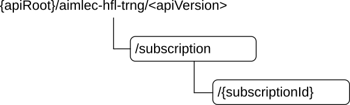

# 6.2.3 Resources

## 6.2.3.1 Overview

This clause describes the structure for the Resource URIs and the resources and methods used for the service.

Figure 6.2.3.1-1 depicts the resource URIs structure for the Aimlec_HFLTraining API.

Figure 6.2.3.1-1: Resource URI structure of the Aimlec_HFLTraining API

Table 6.2.3.1-1 provides an overview of the resources and applicable HTTP methods.

Table 6.2.3.1-1: Resources and methods overview

| Resource name                        | Resource URI                    | HTTP method or custom operation | Description                                                                                     |
|--------------------------------------|---------------------------------|---------------------------------|-------------------------------------------------------------------------------------------------|
| HFL training subscription            | /subscriptions                  | POST                            | Request the creation of the HFL training subscription resources.                                |
| Individual HFL training subscription | /subscriptions/{subscriptionId} | GET                             | Retrieve an existing "Individual HFL training subscription" resource.                           |
|                                      |                                 | PUT                             | Request the full replacement of an existing "Individual HFL training subscription" resource.    |
|                                      |                                 | PATCH                           | Request the partial replacement of an existing "Individual HFL training subscription" resource. |
|                                      |                                 | DELETE                          | Request the deletion of an existing "Individual HFL training subscription" resource.            |

## 6.2.3.2 Resource: HFL training subscription

### 6.2.3.2.1 Description

This resource represents the AIMLE server subscription request to the HFL training event with the AIMLE client.

### 6.2.3.2.2 Resource definition

Resource URI: **{apiRoot}/aimlec-hfl-trng/\<apiVersion\>/subscriptions**

This resource shall support the resource URI variables defined in table 6.2.3.2.2-1.

Table 6.2.3.2.2-1: Resource URI variables for this resource

| Name    | Data type | Definition       |
|---------|-----------|------------------|
| apiRoot | string    | See clause 6.2.1 |

### 6.2.3.2.3 Resource standard methods

#### 6.2.3.2.3.1 POST

This method shall support the URI query parameters specified in table 6.2.3.2.3.1-1.

Table 6.2.3.2.3.1-1: URI query parameters supported by the POST method on this resource

|      |           |     |             |             |               |
|------|-----------|-----|-------------|-------------|---------------|
| Name | Data type | P   | Cardinality | Description | Applicability |
| n/a  |           |     |             |             |               |

This method shall support the request data structures specified in table 6.2.3.2.3.1-2 and the response data structures and response codes specified in table 6.2.3.2.3.1-3.

Table 6.2.3.2.3.1-2: Data structures supported by the POST Request Body on this resource

|            |     |             |                                                      |
|------------|-----|-------------|------------------------------------------------------|
| Data type  | P   | Cardinality | Description                                          |
| HflTrngSub | M   | 1           | Represents the "HFL training subscription" resource. |

Table 6.2.3.2.3.1-3: Data structures supported by the POST Response Body on this resource

<table>
<colgroup>
<col style="width: 20%" />
<col style="width: 4%" />
<col style="width: 11%" />
<col style="width: 19%" />
<col style="width: 44%" />
</colgroup>
<tbody>
<tr class="odd">
<td>Data type</td>
<td>P</td>
<td>Cardinality</td>
<td>Response codes</td>
<td>Description</td>
</tr>
<tr class="even">
<td>HflTrngSub</td>
<td>M</td>
<td>1</td>
<td>201 Created</td>
<td>
Successful case. The creation of an Individual HFL training subscription resource is confirmed, and a representation of that resource is returned.

An HTTP "Location" header that contains the URI of the created resource shall also be included.
</td>
</tr>
<tr class="odd">
<td colspan="5">NOTE: The mandatory HTTP error status codes for the HTTP POST method listed in table 5.2.6-1 of 3GPP TS 29.122 [5] also apply.</td>
</tr>
</tbody>
</table>

Table 6.2.3.2.3.1-4: Headers supported by the 201 Response Code on this resource

<table>
<colgroup>
<col style="width: 17%" />
<col style="width: 14%" />
<col style="width: 5%" />
<col style="width: 13%" />
<col style="width: 48%" />
</colgroup>
<tbody>
<tr class="odd">
<td>Name</td>
<td>Data type</td>
<td>P</td>
<td>Cardinality</td>
<td>Description</td>
</tr>
<tr class="even">
<td>Location</td>
<td>string</td>
<td>M</td>
<td>1</td>
<td>
Contains the URI of the newly created resource, according to the structure:

{apiRoot}/aimlec-hfl-trng/&lt;apiVersion&gt;/subscriptions/{subscriptionId}
</td>
</tr>
</tbody>
</table>

### 6.2.3.2.4 Resource custom operations

There are no resource custom operations defined for this resource in this release of the specification.

## 6.2.3.3 Resource: Individual HFL training subscription

### 6.2.3.3.1 Description

This resource represents an individual HFL training subscription resource at a given AIMLE client.

### 6.2.3.3.2 Resource definition

Resource URI: **{apiRoot}/aimles-hfl-trng/\<apiVersion\>/subscriptions/{subscriptionId}**

This resource shall support the resource URI variables defined in table 6.2.3.3.2-1.

Table 6.2.3.3.2-1: Resource URI variables for this resource

| Name            | Data type | Definition                                                                       |
|-----------------|-----------|----------------------------------------------------------------------------------|
| apiRoot         | string    | See clause 6.2.1                                                                 |
| subscriptioinId | string    | Represents the identifier of an "Individual HFL training subscription" resource. |

### 6.2.3.3.3 Resource standard methods

#### 6.2.3.3.3.1 GET

This method shall support the URI query parameters specified in table 6.2.3.3.3.1-1.

Table 6.2.3.3.3.1-1: URI query parameters supported by the GET method on this resource

|      |           |     |             |             |               |
|------|-----------|-----|-------------|-------------|---------------|
| Name | Data type | P   | Cardinality | Description | Applicability |
| n/a  |           |     |             |             |               |

This method shall support the request data structures specified in table 6.2.3.3.3.1-2 and the response data structures and response codes specified in table 6.2.3.3.3.1-3.

Table 6.2.3.3.3.1-2: Data structures supported by the GET Request Body on this resource

|           |     |             |             |
|-----------|-----|-------------|-------------|
| Data type | P   | Cardinality | Description |
| n/a       |     |             |             |

Table 6.2.3.3.3.1-3: Data structures supported by the GET Response Body on this resource

<table>
<colgroup>
<col style="width: 17%" />
<col style="width: 4%" />
<col style="width: 11%" />
<col style="width: 22%" />
<col style="width: 44%" />
</colgroup>
<tbody>
<tr class="odd">
<td>Data type</td>
<td>P</td>
<td>Cardinality</td>
<td>Response codes</td>
<td>Description</td>
</tr>
<tr class="even">
<td>HflTrngSub</td>
<td>M</td>
<td>1</td>
<td>200 OK</td>
<td>Successful case. The requested "Individual HFL training subscription" resource shall be returned in the response body.</td>
</tr>
<tr class="odd">
<td>n/a</td>
<td></td>
<td></td>
<td>307 Temporary Redirect</td>
<td>
Temporary redirection.

The response shall include a Location header field containing an alternative URI of the resource located in an alternative AIMLE client.

Redirection handling is described in clause 5.2.10 of 3GPP TS 29.122 [5].
</td>
</tr>
<tr class="even">
<td>n/a</td>
<td></td>
<td></td>
<td>308 Permanent Redirect</td>
<td>
Permanent redirection.

The response shall include a Location header field containing an alternative URI of the resource located in an alternative AIMLE client.

Redirection handling is described in clause 5.2.10 of 3GPP TS 29.122 [5].
</td>
</tr>
<tr class="odd">
<td colspan="5">NOTE: The mandatory HTTP error status codes for the HTTP GET method listed in table 5.2.6-1 of 3GPP TS 29.122 [5] also apply.</td>
</tr>
</tbody>
</table>

Table 6.2.3.3.3.1-4: Headers supported by the 307 Response Code on this resource

|          |           |     |             |                                                                            |
|----------|-----------|-----|-------------|----------------------------------------------------------------------------|
| Name     | Data type | P   | Cardinality | Description                                                                |
| Location | string    | M   | 1           | Contains an alternative target URI located in an alternative AIMLE client. |

Table 6.2.3.3.3.1-5: Headers supported by the 308 Response Code on this resource

|          |           |     |             |                                                                            |
|----------|-----------|-----|-------------|----------------------------------------------------------------------------|
| Name     | Data type | P   | Cardinality | Description                                                                |
| Location | string    | M   | 1           | Contains an alternative target URI located in an alternative AIMLE client. |

#### 6.2.3.3.3.2 PUT

This method shall support the URI query parameters specified in table 6.2.3.3.3.2-1.

Table 6.2.3.3.3.2-1: URI query parameters supported by the PUT method on this resource

|      |           |     |             |             |               |
|------|-----------|-----|-------------|-------------|---------------|
| Name | Data type | P   | Cardinality | Description | Applicability |
| n/a  |           |     |             |             |               |

This method shall support the request data structures specified in table 6.2.3.3.3.2-2 and the response data structures and response codes specified in table 6.2.3.3.3.2-3.

Table 6.2.3.3.3.2-2: Data structures supported by the PUT Request Body on this resource

|            |     |             |                                                                                                                       |
|------------|-----|-------------|-----------------------------------------------------------------------------------------------------------------------|
| Data type  | P   | Cardinality | Description                                                                                                           |
| HflTrngSub | M   | 1           | Represents the complete update of the representation of the existing "Individual HFL training subscription" resource. |

Table 6.2.3.3.3.2-3: Data structures supported by the PUT Response Body on this resource

<table>
<colgroup>
<col style="width: 18%" />
<col style="width: 4%" />
<col style="width: 11%" />
<col style="width: 22%" />
<col style="width: 42%" />
</colgroup>
<tbody>
<tr class="odd">
<td>Data type</td>
<td>P</td>
<td>Cardinality</td>
<td>Response codes</td>
<td>Description</td>
</tr>
<tr class="even">
<td>HflTrngSub</td>
<td>M</td>
<td>1</td>
<td>200 OK</td>
<td>Successful case. The requested "Individual HFL training subscription" resource is successfully updated and a representation of the updated resource shall be returned in the response body.</td>
</tr>
<tr class="odd">
<td>n/a</td>
<td></td>
<td></td>
<td>204 No Content</td>
<td>Successful case. The "Individual HFL training subscription" resource is successfully updated and no content is returned in the response body.</td>
</tr>
<tr class="even">
<td>n/a</td>
<td></td>
<td></td>
<td>307 Temporary Redirect</td>
<td>
Temporary redirection.

The response shall include a Location header field containing an alternative URI of the resource located in an alternative AIMLE client.

Redirection handling is described in clause 5.2.10 of 3GPP TS 29.122 [5].
</td>
</tr>
<tr class="odd">
<td>n/a</td>
<td></td>
<td></td>
<td>308 Permanent Redirect</td>
<td>
Permanent redirection.

The response shall include a Location header field containing an alternative URI of the resource located in an alternative AIMLE client.

Redirection handling is described in clause 5.2.10 of 3GPP TS 29.122 [5].
</td>
</tr>
<tr class="even">
<td colspan="5">NOTE: The mandatory HTTP error status codes for the HTTP PUT method listed in table 5.2.6-1 of 3GPP TS 29.122 [5] also apply.</td>
</tr>
</tbody>
</table>

Table 6.2.3.3.3.2-4: Headers supported by the 307 Response Code on this resource

|          |           |     |             |                                                                            |
|----------|-----------|-----|-------------|----------------------------------------------------------------------------|
| Name     | Data type | P   | Cardinality | Description                                                                |
| Location | string    | M   | 1           | Contains an alternative target URI located in an alternative AIMLE client. |

Table 6.2.3.3.3.2-5: Headers supported by the 308 Response Code on this resource

|          |           |     |             |                                                                            |
|----------|-----------|-----|-------------|----------------------------------------------------------------------------|
| Name     | Data type | P   | Cardinality | Description                                                                |
| Location | string    | M   | 1           | Contains an alternative target URI located in an alternative AIMLE client. |

#### 6.2.3.3.3.3 PATCH

This method shall support the URI query parameters specified in table 6.2.3.3.3.3-1.

Table 6.2.3.3.3.3-1: URI query parameters supported by the PATCH method on this resource

|      |           |     |             |             |               |
|------|-----------|-----|-------------|-------------|---------------|
| Name | Data type | P   | Cardinality | Description | Applicability |
| n/a  |           |     |             |             |               |

This method shall support the request data structures specified in table 6.2.3.3.3.3-2 and the response data structures and response codes specified in table 6.2.3.3.3.3-3.

Table 6.2.3.3.3.3-2: Data structures supported by the PATCH Request Body on this resource

|                 |     |             |                                                                                                               |
|-----------------|-----|-------------|---------------------------------------------------------------------------------------------------------------|
| Data type       | P   | Cardinality | Description                                                                                                   |
| HflTrngSubPatch | M   | 1           | Represents the parameters to request the modification of the "Individual HFL training subscription" resource. |

Table 6.2.3.3.3.3-3: Data structures supported by the PATCH Response Body on this resource

<table>
<colgroup>
<col style="width: 17%" />
<col style="width: 4%" />
<col style="width: 13%" />
<col style="width: 22%" />
<col style="width: 42%" />
</colgroup>
<tbody>
<tr class="odd">
<td>Data type</td>
<td>P</td>
<td>Cardinality</td>
<td>Response codes</td>
<td>Description</td>
</tr>
<tr class="even">
<td>HflTrngSub</td>
<td>M</td>
<td>1</td>
<td>200 OK</td>
<td>Successful case. The "Individual HFL training subscription" resource is successfully modified and a representation of the updated resource shall be returned in the response body.</td>
</tr>
<tr class="odd">
<td>n/a</td>
<td></td>
<td></td>
<td>204 No Content</td>
<td>Successful case. The "Individual HFL training subscription" resource is successfully modified and no content is returned in the response body.</td>
</tr>
<tr class="even">
<td>n/a</td>
<td></td>
<td></td>
<td>307 Temporary Redirect</td>
<td>
Temporary redirection.

The response shall include a Location header field containing an alternative URI of the resource located in an alternative AIMLE client.

Redirection handling is described in clause 5.2.10 of 3GPP TS 29.122 [5].
</td>
</tr>
<tr class="odd">
<td>n/a</td>
<td></td>
<td></td>
<td>308 Permanent Redirect</td>
<td>
Permanent redirection.

The response shall include a Location header field containing an alternative URI of the resource located in an alternative AIMLE client.

Redirection handling is described in clause 5.2.10 of 3GPP TS 29.122 [5].
</td>
</tr>
<tr class="even">
<td colspan="5">NOTE: The mandatory HTTP error status codes for the HTTP PATCH method listed in table 5.2.6-1 of 3GPP TS 29.122 [5] also apply.</td>
</tr>
</tbody>
</table>

Table 6.2.3.3.3.3-4: Headers supported by the 307 Response Code on this resource

|          |           |     |             |                                                                            |
|----------|-----------|-----|-------------|----------------------------------------------------------------------------|
| Name     | Data type | P   | Cardinality | Description                                                                |
| Location | string    | M   | 1           | Contains an alternative target URI located in an alternative AIMLE client. |

Table 6.2.3.3.3.3-5: Headers supported by the 308 Response Code on this resource

|          |           |     |             |                                                                            |
|----------|-----------|-----|-------------|----------------------------------------------------------------------------|
| Name     | Data type | P   | Cardinality | Description                                                                |
| Location | string    | M   | 1           | Contains an alternative target URI located in an alternative AIMLE client. |

#### 6.2.3.3.3.4 DELETE

This method shall support the URI query parameters specified in table 6.2.3.3.3.4-1.

Table 6.2.3.3.3.4-1: URI query parameters supported by the DELETE method on this resource

|      |           |     |             |             |               |
|------|-----------|-----|-------------|-------------|---------------|
| Name | Data type | P   | Cardinality | Description | Applicability |
| n/a  |           |     |             |             |               |

This method shall support the request data structures specified in table 6.2.3.3.3.4-2 and the response data structures and response codes specified in table 6.2.3.3.3.4-3.

Table 6.2.3.3.3.4-2: Data structures supported by the DELETE Request Body on this resource

|           |     |             |             |
|-----------|-----|-------------|-------------|
| Data type | P   | Cardinality | Description |
| n/a       |     |             |             |

Table 6.2.3.3.3.4-3: Data structures supported by the DELETE Response Body on this resource

<table>
<colgroup>
<col style="width: 18%" />
<col style="width: 4%" />
<col style="width: 13%" />
<col style="width: 22%" />
<col style="width: 41%" />
</colgroup>
<tbody>
<tr class="odd">
<td>Data type</td>
<td>P</td>
<td>Cardinality</td>
<td>Response codes</td>
<td>Description</td>
</tr>
<tr class="even">
<td>n/a</td>
<td></td>
<td></td>
<td>204 No Content</td>
<td>Successful case. The "Individual HFL training subscription" resource is successfully deleted.</td>
</tr>
<tr class="odd">
<td>n/a</td>
<td></td>
<td></td>
<td>307 Temporary Redirect</td>
<td>
Temporary redirection.

The response shall include a Location header field containing an alternative URI of the resource located in an alternative AIMLE client.

Redirection handling is described in clause 5.2.10 of 3GPP TS 29.122 [5].
</td>
</tr>
<tr class="even">
<td>n/a</td>
<td></td>
<td></td>
<td>308 Permanent Redirect</td>
<td>
Permanent redirection.

The response shall include a Location header field containing an alternative URI of the resource located in an alternative AIMLE client.

Redirection handling is described in clause 5.2.10 of 3GPP TS 29.122 [5].
</td>
</tr>
<tr class="odd">
<td colspan="5">NOTE: The mandatory HTTP error status codes for the HTTP DELETE method listed in table 5.2.6-1 of 3GPP TS 29.122 [5] also apply.</td>
</tr>
</tbody>
</table>

Table 6.2.3.3.3.4-4: Headers supported by the 307 Response Code on this resource

|          |           |     |             |                                                                            |
|----------|-----------|-----|-------------|----------------------------------------------------------------------------|
| Name     | Data type | P   | Cardinality | Description                                                                |
| Location | string    | M   | 1           | Contains an alternative target URI located in an alternative AIMLE client. |

Table 6.2.3.3.3.4-5: Headers supported by the 308 Response Code on this resource

|          |           |     |             |                                                                            |
|----------|-----------|-----|-------------|----------------------------------------------------------------------------|
| Name     | Data type | P   | Cardinality | Description                                                                |
| Location | string    | M   | 1           | Contains an alternative target URI located in an alternative AIMLE client. |

### 6.3.3.3.4 Resource custom operations

There are no resource custom operations defined for this resource in this release of the specification.
