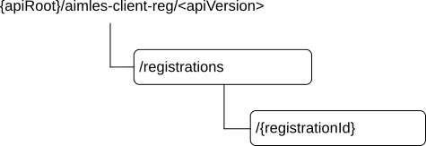

# 6.3.3 Resources

## 6.3.3.1 Overview

This clause describes the structure for the Resource URIs and the resources and methods used for the service.

Figure 6.3.3.1-1 depicts the resource URIs structure for the Aimles_AIMLEClientRegistration API.

Figure 6.3.3.1-1: Resource URI structure of the Aimles_AIMLEClientRegistration API

Table 6.3.3.1-1 provides an overview of the resources and applicable HTTP methods.

Table 6.3.3.1-1: Resources and methods overview

| Resource name                        | Resource URI                    | HTTP method or custom operation | Description                                                                                                        |
|--------------------------------------|---------------------------------|---------------------------------|--------------------------------------------------------------------------------------------------------------------|
| AIMLE client registrations           | /registrations                  | POST                            | Registers the AIMLE client at the AIMLE server i.e. creates a new "Individual AIMLE client registration" resource. |
| Individual AIMLE client registration | /registrations/{registrationId} | PUT                             | Fully replace an "Individual AIMLE client registration" resource.                                                  |
|                                      |                                 | DELETE                          | Deregisters the AIMLE client i.e. removes an "Individual AIMLE client registration" resource.                      |

## 6.3.3.2 Resource: AIMLE client registrations (Collection)

### 6.3.3.2.1 Description

This resource represents all AIMLE clients that are registered at a given AIMLE server.

### 6.3.3.2.2 Resource definition

Resource URI: **{apiRoot}/aimles-client-reg/\<apiVersion\>/registrations**

This resource shall support the resource URI variables defined in table 6.3.3.2.2-1.

Table 6.3.3.2.2-1: Resource URI variables for this resource

| Name    | Data type | Definition       |
|---------|-----------|------------------|
| apiRoot | string    | See clause 6.3.1 |

### 6.3.3.2.3 Resource standard methods

#### 6.3.3.2.3.1 POST

This method shall support the URI query parameters specified in table 6.3.3.2.3.1-1.

Table 6.3.3.2.3.1-1: URI query parameters supported by the POST method on this resource

|      |           |     |             |             |               |
|------|-----------|-----|-------------|-------------|---------------|
| Name | Data type | P   | Cardinality | Description | Applicability |
| n/a  |           |     |             |             |               |

This method shall support the request data structures specified in table 6.3.3.2.3.1-2 and the response data structures and response codes specified in table 6.3.3.2.3.1-3.

Table 6.3.3.2.3.1-2: Data structures supported by the POST Request Body on this resource

|                    |     |             |                                                                                               |
|--------------------|-----|-------------|-----------------------------------------------------------------------------------------------|
| Data type          | P   | Cardinality | Description                                                                                   |
| AimleClientRegInfo | M   | 1           | Contains information for the creation of a new individual AIMLE client registration resource. |

Table 6.3.3.2.3.1-3: Data structures supported by the POST Response Body on this resource

<table>
<colgroup>
<col style="width: 22%" />
<col style="width: 4%" />
<col style="width: 13%" />
<col style="width: 22%" />
<col style="width: 38%" />
</colgroup>
<tbody>
<tr class="odd">
<td>Data type</td>
<td>P</td>
<td>Cardinality</td>
<td>Response codes</td>
<td>Description</td>
</tr>
<tr class="even">
<td>AimleRegistration</td>
<td>M</td>
<td>1</td>
<td>201 Created</td>
<td>
Successful case.

An "Individual AIMLE client registration" resource is created, and a representation of that resource is returned.
</td>
</tr>
<tr class="odd">
<td colspan="5">NOTE: The mandatory HTTP error status codes for the HTTP POST method listed in table 5.2.6-1 of 3GPP TS 29.122 [5] also apply.</td>
</tr>
</tbody>
</table>

Table 6.3.3.2.3.1-4: Headers supported by the 201 Response Code on this resource

<table>
<colgroup>
<col style="width: 19%" />
<col style="width: 15%" />
<col style="width: 6%" />
<col style="width: 13%" />
<col style="width: 44%" />
</colgroup>
<tbody>
<tr class="odd">
<td>Name</td>
<td>Data type</td>
<td>P</td>
<td>Cardinality</td>
<td>Description</td>
</tr>
<tr class="even">
<td>Location</td>
<td>string</td>
<td>M</td>
<td>1</td>
<td>
Contains the URI of the newly created resource, according to the structure:

{apiRoot}/aimles-client-reg/&lt;apiVersion&gt;/registrations/{registrationId}
</td>
</tr>
</tbody>
</table>

### 6.3.3.2.4 Resource custom operations

None.

## 6.3.3.3 Resource: Individual AIMLE client registration (Document)

### 6.3.3.3.1 Description

This resource represents an individual AIMLE client registered at a given AIMLE server.

### 6.3.3.3.2 Resource definition

Resource URI: **{apiRoot}/aimles-client-reg/\<apiVersion\>/registrations/{registrationId}**

This resource shall support the resource URI variables defined in table 6.3.3.3.2-1.

Table 6.3.3.3.2-1: Resource URI variables for this resource

| Name           | Data type | Definition                                |
|----------------|-----------|-------------------------------------------|
| apiRoot        | string    | See clause 6.3.1                          |
| registrationId | string    | The AIMLE client registration identifier. |

### 6.3.3.3.3 Resource standard methods

#### 6.3.3.3.3.1 PUT

This method shall support the URI query parameters specified in table 6.3.3.3.3.1-1.

Table 6.3.3.3.3.1-1: URI query parameters supported by the PUT method on this resource

|      |           |     |             |             |               |
|------|-----------|-----|-------------|-------------|---------------|
| Name | Data type | P   | Cardinality | Description | Applicability |
| n/a  |           |     |             |             |               |

This method shall support the request data structures specified in table 6.3.3.3.3.1-2 and the response data structures and response codes specified in table 6.3.3.3.3.1-3.

Table 6.3.3.3.3.1-2: Data structures supported by the PUT Request Body on this resource

|                   |     |             |                                                                                         |
|-------------------|-----|-------------|-----------------------------------------------------------------------------------------|
| Data type         | P   | Cardinality | Description                                                                             |
| AimleRegistration | M   | 1           | Contains information for the update of "Individual AIMLE client registration" resource. |

Table 6.3.3.3.3.1-3: Data structures supported by the PUT Response Body on this resource

<table>
<colgroup>
<col style="width: 22%" />
<col style="width: 4%" />
<col style="width: 13%" />
<col style="width: 22%" />
<col style="width: 38%" />
</colgroup>
<tbody>
<tr class="odd">
<td>Data type</td>
<td>P</td>
<td>Cardinality</td>
<td>Response codes</td>
<td>Description</td>
</tr>
<tr class="even">
<td>AimleRegistration</td>
<td>M</td>
<td>1</td>
<td>200 OK</td>
<td>
Successful case.

An "Individual AIMLE client registration" resource is updated, and a representation of that resource is returned.
</td>
</tr>
<tr class="odd">
<td>n/a</td>
<td></td>
<td></td>
<td>204 No Content</td>
<td>
Successful case.

An "Individual AIMLE client registration" resource is updated.
</td>
</tr>
<tr class="even">
<td>n/a</td>
<td></td>
<td></td>
<td>307 Temporary Redirect</td>
<td>
Temporary redirection. The response shall include a Location header field containing an alternative URI of the resource located in an alternative AIMLE server.

Redirection handling is described in clause 5.2.10 of 3GPP TS 29.122 [5].
</td>
</tr>
<tr class="odd">
<td>n/a</td>
<td></td>
<td></td>
<td>308 Permanent Redirect</td>
<td>
Permanent redirection. The response shall include a Location header field containing an alternative URI of the resource located in an alternative AIMLE server.

Redirection handling is described in clause 5.2.10 of 3GPP TS 29.122 [5].
</td>
</tr>
<tr class="even">
<td colspan="5">NOTE: The mandatory HTTP error status codes for the HTTP PUT method listed in table 5.2.6-1 of 3GPP TS 29.122 [5] also apply.</td>
</tr>
</tbody>
</table>

Table 6.3.3.3.3.1-4: Headers supported by the 307 Response Code on this resource

|          |           |     |             |                                                                            |
|----------|-----------|-----|-------------|----------------------------------------------------------------------------|
| Name     | Data type | P   | Cardinality | Description                                                                |
| Location | string    | M   | 1           | Contains an alternative target URI located in an alternative AIMLE server. |

Table 6.3.3.3.3.1-5: Headers supported by the 308 Response Code on this resource

|          |           |     |             |                                                                            |
|----------|-----------|-----|-------------|----------------------------------------------------------------------------|
| Name     | Data type | P   | Cardinality | Description                                                                |
| Location | string    | M   | 1           | Contains an alternative target URI located in an alternative AIMLE server. |

#### 6.3.3.3.3.2 DELETE

This method shall support the URI query parameters specified in table 6.3.3.3.3.2-1.

Table 6.3.3.3.3.2-1: URI query parameters supported by the DELETE method on this resource

|      |           |     |             |             |               |
|------|-----------|-----|-------------|-------------|---------------|
| Name | Data type | P   | Cardinality | Description | Applicability |
| n/a  |           |     |             |             |               |

This method shall support the request data structures specified in table 6.3.3.3.3.2-2 and the response data structures and response codes specified in table 6.3.3.3.3.2-3.

Table 6.3.3.3.3.2-2: Data structures supported by the DELETE Request Body on this resource

|           |     |             |             |
|-----------|-----|-------------|-------------|
| Data type | P   | Cardinality | Description |
| n/a       |     |             |             |

Table 6.3.3.3.3.2-3: Data structures supported by the DELETE Response Body on this resource

<table>
<colgroup>
<col style="width: 22%" />
<col style="width: 4%" />
<col style="width: 13%" />
<col style="width: 22%" />
<col style="width: 38%" />
</colgroup>
<tbody>
<tr class="odd">
<td>Data type</td>
<td>P</td>
<td>Cardinality</td>
<td>Response codes</td>
<td>Description</td>
</tr>
<tr class="even">
<td>n/a</td>
<td></td>
<td></td>
<td>204 No Content</td>
<td>
Successful case.

An "Individual AIMLE client registration" resource is removed.
</td>
</tr>
<tr class="odd">
<td>n/a</td>
<td></td>
<td></td>
<td>307 Temporary Redirect</td>
<td>
Temporary redirection. The response shall include a Location header field containing an alternative URI of the resource located in an alternative AIMLE server.

Redirection handling is described in clause 5.2.10 of 3GPP TS 29.122 [5].
</td>
</tr>
<tr class="even">
<td>n/a</td>
<td></td>
<td></td>
<td>308 Permanent Redirect</td>
<td>
Permanent redirection. The response shall include a Location header field containing an alternative URI of the resource located in an alternative AIMLE server.

Redirection handling is described in clause 5.2.10 of 3GPP TS 29.122 [5].
</td>
</tr>
<tr class="odd">
<td colspan="5">NOTE: The mandatory HTTP error status codes for the HTTP DELETE method listed in table 5.2.6-1 of 3GPP TS 29.122 [5] also apply.</td>
</tr>
</tbody>
</table>

Table 6.3.3.3.3.2-4: Headers supported by the 307 Response Code on this resource

|          |           |     |             |                                                                            |
|----------|-----------|-----|-------------|----------------------------------------------------------------------------|
| Name     | Data type | P   | Cardinality | Description                                                                |
| Location | string    | M   | 1           | Contains an alternative target URI located in an alternative AIMLE server. |

Table 6.3.3.3.3.2-5: Headers supported by the 308 Response Code on this resource

|          |           |     |             |                                                                            |
|----------|-----------|-----|-------------|----------------------------------------------------------------------------|
| Name     | Data type | P   | Cardinality | Description                                                                |
| Location | string    | M   | 1           | Contains an alternative target URI located in an alternative AIMLE server. |

### 6.3.3.3.4 Resource custom operations

None.
