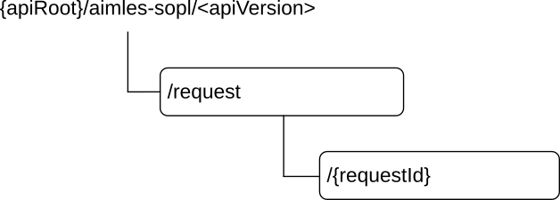
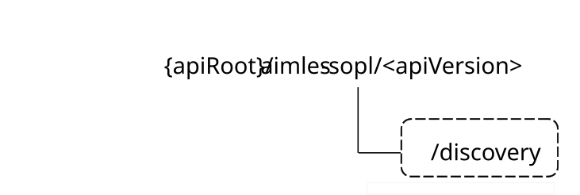

# 6.5 Aimles_SplitOpPipeline API

## 6.5.1 Introduction

The AI/ML split operation pipeline shall use the Aimles_SplitOpPipeline API.

The API URI of the Aimles_SplitOpPipeline API shall be:

**{apiRoot}/\<apiName\>/\<apiVersion\>**

The request URIs used in HTTP requests shall have the Resource URI structure defined in clause 5.2.4 of 3GPP TS 29.122 \[5\], i.e.:

**{apiRoot}/\<apiName\>/\<apiVersion\>/\<apiSpecificSuffixes\>**

with the following components:

\- The {apiRoot} shall be set as described in clause 5.2.4 of 3GPP TS 29.122 \[5\].

\- The \<apiName\> shall be "aimles-sopl".

\- The \<apiVersion\> shall be "v1".

\- The \<apiSpecificSuffixes\> shall be set as described in clause 6.5.3.

## 6.5.2 Usage of HTTP and common API related aspects

The provisions of clause 5.2 of 3GPP TS 29.122 \[5\] shall apply for the Aimles_SplitOpPipeline API.

## 6.5.3 Resources

### 6.5.3.1 Overview

This clause describes the structure for the Resource URIs and the resources and methods used for the service.

Figure 6.5.3.1-1 depicts the resource URIs structure for the Aimles_SplitOpPipeline API.

Figure 6.5.3.1-1: Resource URI structure of the Aimles_SplitOpPipeline API

Table 6.5.3.1-1 provides an overview of the resources and applicable HTTP methods.

Table 6.5.3.1-1: Resources and methods overview

| Operation name                                     | Custom operation URI | Mapped HTTP method | Description                                                                                                |
|----------------------------------------------------|----------------------|--------------------|------------------------------------------------------------------------------------------------------------|
| AI/ML split operation pipeline creation            | /request             | POST               | Request the creation of an "AI/ML split operation pipeline creation" resource.                             |
| Individual AI/ML split operation pipeline creation | /request/{requestId} | PUT                | Request the fully update of an existing "Individual AI/ML split operation pipeline creation" resource.     |
|                                                    |                      | DELETE             | Request the deletion of an existing "Individual AI/ML split operation pipeline creation" resource.         |
|                                                    |                      | PATCH              | Request the partially update of an existing "Individual AI/ML split operation pipeline creation" resource. |

### 6.5.3.2 Resource: AIMLE split operation pipeline creation

#### 6.5.3.2.1 Description

This resource represents the AIMLE client split operation pipeline creation request resource at a given AIMLE server.

#### 6.5.3.2.2 Resource definition

Resource URI: **{apiRoot}/aimles-sopl/\<apiVersion\>/request**

This resource shall support the resource URI variables defined in table 6.5.3.2.2-1.

Table 6.5.3.2.2-1: Resource URI variables for this resource

| Name    | Data type | Definition       |
|---------|-----------|------------------|
| apiRoot | string    | See clause 6.5.1 |

#### 6.5.3.2.3 Resource standard methods

##### 6.5.3.2.3.1 POST

This method shall support the URI query parameters specified in table 6.5.3.2.3.1-1.

Table 6.5.3.2.3.1-1: URI query parameters supported by the POST method on this resource

|      |           |     |             |             |               |
|------|-----------|-----|-------------|-------------|---------------|
| Name | Data type | P   | Cardinality | Description | Applicability |
| n/a  |           |     |             |             |               |

This method shall support the request data structures specified in table 6.5.3.2.3.1-2 and the response data structure and response codes specified in table 6.5.3.2.3.1-3.

Table 6.5.3.2.3.1-2: Data structures supported by the POST Request Body on this resource

|                          |     |             |                                                                                                             |
|--------------------------|-----|-------------|-------------------------------------------------------------------------------------------------------------|
| Data type                | P   | Cardinality | Description                                                                                                 |
| SplitOpPipelineCreateReq | M   | 1           | Represents the parameters to request the creation of an "AI/ML split operation pipeline creation" resource. |

Table 6.5.3.2.3.1-3: Data structures supported by the POST Response Body on this resource

<table>
<colgroup>
<col style="width: 22%" />
<col style="width: 4%" />
<col style="width: 13%" />
<col style="width: 22%" />
<col style="width: 38%" />
</colgroup>
<tbody>
<tr class="odd">
<td>Data type</td>
<td>P</td>
<td>Cardinality</td>
<td>Response codes</td>
<td>Description</td>
</tr>
<tr class="even">
<td>SplitOpPipelineCreateResp</td>
<td>M</td>
<td>1</td>
<td>201 Created</td>
<td>
Successful case.

The AI/ML split operation pipeline creation is successfully created and a representation of the created "Individual split operation pipeline creation" resource shall be returned.

An HTTP "Location" header that contains the resource URI of the created resource shall also be included.
</td>
</tr>
<tr class="odd">
<td colspan="5">NOTE: The mandatory HTTP error status codes for the HTTP POST method listed in table 5.2.6-1 of 3GPP TS 29.122 [5] also apply.</td>
</tr>
</tbody>
</table>

Table 6.5.3.2.3.1-4: Headers supported by the 201 Response Code on this resource

|          |           |     |             |                                                                                                                          |
|----------|-----------|-----|-------------|--------------------------------------------------------------------------------------------------------------------------|
| Name     | Data type | P   | Cardinality | Description                                                                                                              |
| Location | string    | M   | 1           | Contains the URI of the newly created resource, according to the structure: {apiRoot}/aimles-sopl/\<apiVersion\>/request |

#### 6.5.3.2.4 Resource custom operations

None.

### 6.5.3.3 Resource: Individual AIMLE split operation pipeline creation

#### 6.5.3.3.1 Description

This resource represents an individual AIMLE client split operation pipeline creation request resource at a given AIMLE server.

#### 6.5.3.3.2 Resource definition

Resource URI: **{apiRoot}/aimles-sopl/\<apiVersion\>/request/{requestId}**

This resource shall support the resource URI variables defined in table 6.5.3.3.2-1.

Table 6.5.3.3.2-1: Resource URI variables for this resource

| Name      | Data type | Definition                                                                |
|-----------|-----------|---------------------------------------------------------------------------|
| apiRoot   | string    | See clause 6.5.1                                                          |
| requestId | string    | An individual AIMLE split operation pipeline creation request identifier. |

#### 6.5.3.3.3 Resource standard methods

##### 6.5.3.3.3.1 PUT

This method shall support the URI query parameters specified in table 6.5.3.3.3.1-1.

Table 6.5.3.3.3.1-1: URI query parameters supported by the PUT method on this resource

|      |           |     |             |             |               |
|------|-----------|-----|-------------|-------------|---------------|
| Name | Data type | P   | Cardinality | Description | Applicability |
| n/a  |           |     |             |             |               |

This method shall support the request data structures specified in table 6.5.3.3.3.1-2 and the response data structures and response codes specified in table 6.5.3.3.3.1-3.

Table 6.5.3.3.3.1-2: Data structures supported by the PUT Request Body on this resource

|                          |     |             |                                                                                  |
|--------------------------|-----|-------------|----------------------------------------------------------------------------------|
| Data type                | P   | Cardinality | Description                                                                      |
| SplitOpPipelineCreateReq | M   | 1           | An individual instance of AIMLE split operation pipeline resource to be updated. |

Table 6.5.3.3.3.1-3: Data structures supported by the PUT Response Body on this resource

<table>
<colgroup>
<col style="width: 22%" />
<col style="width: 4%" />
<col style="width: 13%" />
<col style="width: 22%" />
<col style="width: 38%" />
</colgroup>
<tbody>
<tr class="odd">
<td>Data type</td>
<td>P</td>
<td>Cardinality</td>
<td>Response codes</td>
<td>Description</td>
</tr>
<tr class="even">
<td>SplitOpPipelineCreateResp</td>
<td>M</td>
<td>1</td>
<td>200 OK</td>
<td>
Successful case.

An individual AIMLE split operation pipeline resource is updated, and a representation of that resource is returned.
</td>
</tr>
<tr class="odd">
<td>n/a</td>
<td></td>
<td></td>
<td>204 No Content</td>
<td>
Successful case.

An individual AIMLE split operation pipeline resource is updated.
</td>
</tr>
<tr class="even">
<td>n/a</td>
<td></td>
<td></td>
<td>307 Temporary Redirect</td>
<td>
Temporary redirection. The response shall include a Location header field containing an alternative URI of the resource located in an alternative AIMLE server.

Redirection handling is described in clause 5.2.10 of 3GPP TS 29.122 [5].
</td>
</tr>
<tr class="odd">
<td>n/a</td>
<td></td>
<td></td>
<td>308 Permanent Redirect</td>
<td>
Permanent redirection. The response shall include a Location header field containing an alternative URI of the resource located in an alternative AIMLE server.

Redirection handling is described in clause 5.2.10 of 3GPP TS 29.122 [5].
</td>
</tr>
<tr class="even">
<td colspan="5">NOTE: The mandatory HTTP error status codes for the HTTP PUT method listed in table 5.2.6-1 of 3GPP TS 29.122 [5] also apply.</td>
</tr>
</tbody>
</table>

Table 6.5.3.3.3.1-4: Headers supported by the 307 Response Code on this resource

|          |           |     |             |                                                                            |
|----------|-----------|-----|-------------|----------------------------------------------------------------------------|
| Name     | Data type | P   | Cardinality | Description                                                                |
| Location | string    | M   | 1           | Contains an alternative target URI located in an alternative AIMLE server. |

Table 6.5.3.3.3.1-5: Headers supported by the 308 Response Code on this resource

|          |           |     |             |                                                                            |
|----------|-----------|-----|-------------|----------------------------------------------------------------------------|
| Name     | Data type | P   | Cardinality | Description                                                                |
| Location | string    | M   | 1           | Contains an alternative target URI located in an alternative AIMLE server. |

##### 6.5.3.3.3.2 DELETE

This method shall support the URI query parameters specified in table 6.5.3.3.3.2-1.

Table 6.5.3.3.3.2-1: URI query parameters supported by the DELETE method on this resource

|      |           |     |             |             |               |
|------|-----------|-----|-------------|-------------|---------------|
| Name | Data type | P   | Cardinality | Description | Applicability |
| n/a  |           |     |             |             |               |

This method shall support the request data structures specified in table 6.5.3.3.3.2-2 and the response data structures and response codes specified in table 6.5.3.3.3.2-3.

Table 6.5.3.3.3.2-2: Data structures supported by the DELETE Request Body on this resource

|           |     |             |             |
|-----------|-----|-------------|-------------|
| Data type | P   | Cardinality | Description |
| n/a       |     |             |             |

Table 6.5.3.3.3.2-3: Data structures supported by the DELETE Response Body on this resource

<table>
<colgroup>
<col style="width: 20%" />
<col style="width: 4%" />
<col style="width: 13%" />
<col style="width: 23%" />
<col style="width: 38%" />
</colgroup>
<tbody>
<tr class="odd">
<td>Data type</td>
<td>P</td>
<td>Cardinality</td>
<td>Response codes</td>
<td>Description</td>
</tr>
<tr class="even">
<td>n/a</td>
<td></td>
<td></td>
<td>204 No Content</td>
<td>
Successful case.

An individual AIMLE split operation pipeline resource is removed.
</td>
</tr>
<tr class="odd">
<td>n/a</td>
<td></td>
<td></td>
<td>307 Temporary Redirect</td>
<td>
Temporary redirection. The response shall include a Location header field containing an alternative URI of the resource located in an alternative AIMLE server.

Redirection handling is described in clause 5.2.10 of 3GPP TS 29.122 [5].
</td>
</tr>
<tr class="even">
<td>n/a</td>
<td></td>
<td></td>
<td>308 Permanent Redirect</td>
<td>
Permanent redirection. The response shall include a Location header field containing an alternative URI of the resource located in an alternative AIMLE server.

Redirection handling is described in clause 5.2.10 of 3GPP TS 29.122 [5].
</td>
</tr>
<tr class="odd">
<td colspan="5">NOTE: The mandatory HTTP error status codes for the HTTP DELETE method listed in table 5.2.6-1 of 3GPP TS 29.122 [5] also apply.</td>
</tr>
</tbody>
</table>

Table 6.5.3.3.3.2-4: Headers supported by the 307 Response Code on this resource

|          |           |     |             |                                                                            |
|----------|-----------|-----|-------------|----------------------------------------------------------------------------|
| Name     | Data type | P   | Cardinality | Description                                                                |
| Location | string    | M   | 1           | Contains an alternative target URI located in an alternative AIMLE server. |

Table 6.5.3.3.3.2-5: Headers supported by the 308 Response Code on this resource

|          |           |     |             |                                                                            |
|----------|-----------|-----|-------------|----------------------------------------------------------------------------|
| Name     | Data type | P   | Cardinality | Description                                                                |
| Location | string    | M   | 1           | Contains an alternative target URI located in an alternative AIMLE server. |

##### 6.5.3.3.3.3 PATCH

This method shall support the URI query parameters specified in table 6.5.3.3.3.3-1.

Table 6.5.3.3.3.3-1: URI query parameters supported by the PATCH method on this resource

|      |           |     |             |             |               |
|------|-----------|-----|-------------|-------------|---------------|
| Name | Data type | P   | Cardinality | Description | Applicability |
| n/a  |           |     |             |             |               |

This method shall support the request data structures specified in table 6.5.3.3.3.3-2 and the response data structures and response codes specified in table 6.5.3.3.3.3-3.

Table 6.5.3.3.3.3-2: Data structures supported by the PATCH Request Body on this resource

|                      |     |             |                                                                                  |
|----------------------|-----|-------------|----------------------------------------------------------------------------------|
| Data type            | P   | Cardinality | Description                                                                      |
| SplitOpPipelinePatch | M   | 1           | An individual instance of AIMLE split operation pipeline resource to be updated. |

Table 6.5.3.3.3.3-3: Data structures supported by the PATCH Response Body on this resource

<table>
<colgroup>
<col style="width: 20%" />
<col style="width: 5%" />
<col style="width: 12%" />
<col style="width: 23%" />
<col style="width: 38%" />
</colgroup>
<tbody>
<tr class="odd">
<td>Data type</td>
<td>P</td>
<td>Cardinality</td>
<td>Response codes</td>
<td>Description</td>
</tr>
<tr class="even">
<td>SplitOpPipelineCreateResp</td>
<td>M</td>
<td>1</td>
<td>200 OK</td>
<td>
Successful case.

An individual AIMLE split operation pipeline resource is updated, and a representation of that resource is returned.
</td>
</tr>
<tr class="odd">
<td>n/a</td>
<td></td>
<td></td>
<td>204 No Content</td>
<td>
Successful case.

An individual AIMLE split operation pipeline resource is updated.
</td>
</tr>
<tr class="even">
<td>n/a</td>
<td></td>
<td></td>
<td>307 Temporary Redirect</td>
<td>
Temporary redirection. The response shall include a Location header field containing an alternative URI of the resource located in an alternative AIMLE server.

Redirection handling is described in clause 5.2.10 of 3GPP TS 29.122 [5].
</td>
</tr>
<tr class="odd">
<td>n/a</td>
<td></td>
<td></td>
<td>308 Permanent Redirect</td>
<td>
Permanent redirection. The response shall include a Location header field containing an alternative URI of the resource located in an alternative AIMLE server.

Redirection handling is described in clause 5.2.10 of 3GPP TS 29.122 [5].
</td>
</tr>
<tr class="even">
<td colspan="5">NOTE: The mandatory HTTP error status codes for the HTTP PUT method listed in table 5.2.6-1 of 3GPP TS 29.122 [5] also apply.</td>
</tr>
</tbody>
</table>

Table 6.5.3.3.3.3-4: Headers supported by the 307 Response Code on this resource

|          |           |     |             |                                                                            |
|----------|-----------|-----|-------------|----------------------------------------------------------------------------|
| Name     | Data type | P   | Cardinality | Description                                                                |
| Location | string    | M   | 1           | Contains an alternative target URI located in an alternative AIMLE server. |

Table 6.5.3.3.3.3-5: Headers supported by the 308 Response Code on this resource

|          |           |     |             |                                                                            |
|----------|-----------|-----|-------------|----------------------------------------------------------------------------|
| Name     | Data type | P   | Cardinality | Description                                                                |
| Location | string    | M   | 1           | Contains an alternative target URI located in an alternative AIMLE server. |

#### 6.5.3.3.4 Resource custom operations

None.

## 6.5.4 Custom operations without associated resources

### 6.5.4.1 Overview

The structure of the custom operation URIs of the Aimles_SplitOpEvent API is shown in Figure 6.5.4.1-1.

Figure 6.5.4.1-1: Custom operation URI structure of the Aimles_SplitOpEvent API

Table 6.5.4.1-1: Custom operations without associated resources

| Operation name                  | Custom operation URI | Mapped HTTP method | Description                                                                                                               |
|---------------------------------|----------------------|--------------------|---------------------------------------------------------------------------------------------------------------------------|
| AI/ML split operation discovery | /discovery           | POST               | Used by the AIMLE client or VAL server to communicate with the AIMLE server for split AI/ML operation pipeline discovery. |

The custom operations shall support the URI variables defined in table 6.5.4.1-2.

Table 6.5.4.1-2: URI variables for this custom operation

| Name    | Data type | Definition        |
|---------|-----------|-------------------|
| apiRoot | string    | See clause 6.5.1. |

### 6.5.4.2 Operation: AI/ML split operation discovery

#### 6.5.4.2.1 Description

The custom operation enables the AIMLE client to request the AIMLE server to perform the AI/ML split operation discovery.

#### 6.5.4.2.2 Operation definition

This operation shall support the response data structures and response codes specified in tables 6.5.4.2.2-1 and 6.5.4.2.2-2.

Table 6.5.4.2.2-1: Data structures supported by the POST Request Body on this resource

|                        |     |             |                                                                            |
|------------------------|-----|-------------|----------------------------------------------------------------------------|
| Data type              | P   | Cardinality | Description                                                                |
| SplitOpPipelineDiscReq | M   | 1           | Contains the AIMLE split operation pipeline discovery request information. |

Table 6.5.4.2.2-2: Data structures supported by the POST Response Body on this resource

<table>
<colgroup>
<col style="width: 18%" />
<col style="width: 5%" />
<col style="width: 11%" />
<col style="width: 22%" />
<col style="width: 41%" />
</colgroup>
<tbody>
<tr class="odd">
<td>Data type</td>
<td>P</td>
<td>Cardinality</td>
<td>Response codes</td>
<td>Description</td>
</tr>
<tr class="even">
<td>SplitOpPipelineDiscResp</td>
<td>M</td>
<td>1</td>
<td>200 OK</td>
<td>
Successful case.

The AIMLE split operation pipeline discovery is performed.
</td>
</tr>
<tr class="odd">
<td>n/a</td>
<td></td>
<td></td>
<td>307 Temporary Redirect</td>
<td>
Temporary redirection. The response shall include a Location header field containing an alternative URI of the resource located in an alternative AIMLE server.

Redirection handling is described in clause 5.2.10 of 3GPP TS 29.122 [5].
</td>
</tr>
<tr class="even">
<td>n/a</td>
<td></td>
<td></td>
<td>308 Permanent Redirect</td>
<td>
Permanent redirection. The response shall include a Location header field containing an alternative URI of the resource located in an alternative AIMLE server.

Redirection handling is described in clause 5.2.10 of 3GPP TS 29.122 [5].
</td>
</tr>
<tr class="odd">
<td colspan="5">NOTE: The mandatory HTTP error status codes for the HTTP POST method listed in table 5.2.6-1 of 3GPP TS 29.122 [5] also apply.</td>
</tr>
</tbody>
</table>

Table 6.5.4.2.2-3: Headers supported by the 307 Response Code on this resource

|          |           |     |             |                                                                            |
|----------|-----------|-----|-------------|----------------------------------------------------------------------------|
| Name     | Data type | P   | Cardinality | Description                                                                |
| Location | string    | M   | 1           | Contains an alternative target URI located in an alternative AIMLE server. |

Table 6.5.4.2.2-4: Headers supported by the 308 Response Code on this resource

|          |           |     |             |                                                                            |
|----------|-----------|-----|-------------|----------------------------------------------------------------------------|
| Name     | Data type | P   | Cardinality | Description                                                                |
| Location | string    | M   | 1           | Contains an alternative target URI located in an alternative AIMLE server. |

## 6.5.5 Notifications

There are no notifications defined for this API in this release of the specification.

## 6.5.6 Data Model

### 6.5.6.1 General

This clause specifies the application data model supported by the API.

Table 6.5.6.1-1 specifies the data types defined for the Aimles_SplitOpPipeline API.

Table 6.5.6.1-1: Aimles_SplitOpPipeline API specific Data Types

| Data type                 | Section defined | Description                                                       | Applicability |
|---------------------------|-----------------|-------------------------------------------------------------------|---------------|
| SplitOpPipelineCreateReq  | 6.5.6.2.2       | Represents the AIMLE Split Operation Pipeline Create request.     |               |
| SplitOpPipelineCreateResp | 6.5.6.2.3       | Represents the AIMLE Split Operation Pipeline Create response     |               |
| SplitOpPipelineDiscReq    | 6.5.6.2.5       | Represents the AIMLE Split Operation Pipeline Discovery request.  |               |
| SplitOpPipelineDiscResp   | 6.5.6.2.6       | Represents the AIMLE Split Operation Pipeline Discovery response. |               |
| SplitOpPipelinePatch      | 6.5.6.2.4       | Represents the AIMLE Split Operation Pipeline Patch request.      |               |
| SplitOpRequirements       | 6.5.6.2.7       | Represents the AIMLE Split Operation Pipeline requirements        |               |

Table 6.5.6.1-2 specifies data types re-used by the Aimles_SplitOpPipeline API service.

Table 6.5.6.1-2: Aimles_SplitOpPipeline API re-used Data Types

| Data type           | Reference             | Comments                                                                                 | Applicability |
|---------------------|-----------------------|------------------------------------------------------------------------------------------|---------------|
| EndPoint            | 3GPP TS 29.558 \[10\] | Represents the endpoint information of a node.                                           |               |
| DiscFilters         | 3GPP TS 29.482 \[7\]  | Represents the discovery filters to determine matching split operation profile or nodes. |               |
| SplitOpPipelineInfo | 3GPP TS 29.482 \[7\]  | Represents split operation pipeline information.                                         |               |
| SplitOpProfile      | 3GPP TS 29.482 \[7\]  | Represents the split operation profile that VAL server participates to.                  |               |
| StageInfo           | 3GPP TS 29.482 \[7\]  | Represents the information related to each stage in split operation pipeline.            |               |
| Uri                 | 3GPP TS 29.122 \[5\]  | Used to indicate the notification URI.                                                   |               |
| UsageInformation    | 3GPP TS 29.482 \[7\]  | Represents the usage information for the split AI/ML model.                              |               |

### 6.5.6.2 Structured data types

#### 6.5.6.2.1 Introduction

This clause defines the data structures to be used in resource representations.

#### 6.5.6.2.2 Type: SplitOpPipelineCreateReq

Table 6.5.6.2.2-1: Definition of type SplitOpPipelineCreateReq

| Attribute name      | Data type           | P   | Cardinality | Description                                                                                                                                 | Applicability |
|---------------------|---------------------|-----|-------------|---------------------------------------------------------------------------------------------------------------------------------------------|---------------|
| requestorId         | string              | M   | 1           | Contains the identifier of the service consumer. For the AIMLE client, e.g. unique client identifier. For the AIMLE server, e.g. FQDN, URI. |               |
| notifUri            | Uri                 | M   | 1           | Identifies the URI, towards which the notification should be delivered.                                                                     |               |
| splitOpRequirements | SplitOpRequirements | M   | 1           | Contains the set of characteristics to determine matching split operation profiles or nodes.                                                |               |

#### 6.5.6.2.3 Type: SplitOpPipelineCreateResp

Table 6.5.6.2.3-1: Definition of type SplitOpPipelineCreateResp

| Attribute name | Data type      | P   | Cardinality | Description                            | Applicability |
|----------------|----------------|-----|-------------|----------------------------------------|---------------|
| splitOpProfile | SplitOpProfile | O   | 0..1        | Contains the split operation profiles. |               |

#### 6.5.6.2.4 Type: SplitOpPipelinePatch

Table 6.5.6.2.4-1: Definition of type SplitOpPipelinePatch

| Attribute name      | Data type           | P   | Cardinality | Description                                                             | Applicability |
|---------------------|---------------------|-----|-------------|-------------------------------------------------------------------------|---------------|
| notifUri            | Uri                 | M   | 1           | Identifies the URI, towards which the notification should be delivered. |               |
| splitOpPipelineId   | string              | M   | 1           | Contains the identifier for split operation pipeline.                   |               |
| splitOpPipelineInfo | SplitOpPipelineInfo | M   | 1           | Contains split operation pipeline information.                          |               |

#### 6.5.6.2.5 Type: SplitOpPipelineDiscReq

Table 6.5.6.2.5-1: Definition of type SplitOpPipelineDiscReq

| Attribute name | Data type   | P   | Cardinality | Description                                                                                  | Applicability |
|----------------|-------------|-----|-------------|----------------------------------------------------------------------------------------------|---------------|
| notifUri       | Uri         | M   | 1           | Identifies the URI, towards which the notification should be delivered.                      |               |
| discFilters    | DiscFilters | M   | 1           | Contains the set of characteristics to determine matching split operation profiles or nodes. |               |

#### 6.5.6.2.6 Type: SplitOpPipelineDiscResp

Table 6.5.6.2.6-1: Definition of type SplitOpPipelineDiscResp

<table>
<colgroup>
<col style="width: 16%" />
<col style="width: 14%" />
<col style="width: 4%" />
<col style="width: 12%" />
<col style="width: 37%" />
<col style="width: 13%" />
</colgroup>
<thead>
<tr class="header">
<th>Attribute name</th>
<th>Data type</th>
<th>P</th>
<th>Cardinality</th>
<th>Description</th>
<th>Applicability</th>
</tr>
</thead>
<tbody>
<tr class="odd">
<td>discoveredNodes</td>
<td>array(string)</td>
<td>C</td>
<td>1..N</td>
<td>
Contains the list of discovered nodes.

(NOTE)
</td>
<td></td>
</tr>
<tr class="even">
<td>splitOpProfiles</td>
<td>array(SplitOpProfile)</td>
<td>C</td>
<td>1..N</td>
<td>
Contains the list of split operation profiles.

(NOTE)
</td>
<td></td>
</tr>
<tr class="odd">
<td colspan="6">NOTE: At least one of these attributes shall be present.</td>
</tr>
</tbody>
</table>

#### 6.5.6.2.7 Type: SplitOpRequirements

Table 6.5.6.2.7-1: Definition of type SplitOpRequirements

| Attribute name     | Data type        | P   | Cardinality | Description                                                                                               | Applicability |
|--------------------|------------------|-----|-------------|-----------------------------------------------------------------------------------------------------------|---------------|
| stageInfo          | array(StageInfo) | M   | 1..N        | Contains information about split operation stages.                                                        |               |
| usageInfo          | UsageInformation | O   | 0..1        | Contains information about planned usage of the split operation.                                          |               |
| notificationTarget | EndPoint         | O   | 0..1        | Contains information about the Endpoint where the result of the split operation is sent by the tail node. |               |

### 6.5.6.3 Simple data types and enumerations

#### 6.5.6.3.1 Introduction

This clause defines simple data types and enumerations that can be referenced from data structures defined in the previous clauses.

#### 6.5.6.3.2 Simple data types

The simple data types defined in table 6.5.6.3.2-1 shall be supported.

Table 6.5.6.3.2-1: Simple data types

| Type Name | Type Definition | Description | Applicability |
|-----------|-----------------|-------------|---------------|
|           |                 |             |               |

### 6.5.6.4 Data types describing alternative data types or combinations of data types

There are no data types describing alternative data types or combinations of data types defined for this API in this release of the specification.

### 6.5.6.5 Binary data

#### 6.5.6.5.1 Binary Data Types

Table 6.5.6.5.1-1: Binary Data Types

| Name | Clause defined | Content type |
|------|----------------|--------------|
|      |                |              |

## 6.5.7 Error Handling

### 6.5.7.1 General

For the Aimles_SplitOpPipeline API, HTTP error responses shall be supported as specified in clause 5.2.1.6 of 3GPP TS 29.122 \[5\]. Protocol errors and application errors specified in clause 5.2.1.6 of 3GPP TS 29.122 \[5\] shall be supported for the HTTP status codes specified in table 5.2.1.6-1 of 3GPP TS 29.122 \[5\].

In addition, the requirements in the following clauses are applicable for the Aimles_SplitOpPipeline API.

### 6.5.7.2 Protocol Errors

No specific protocol errors for the Aimles_SplitOpPipeline API are specified.

### 6.5.7.3 Application Errors

The application errors defined for Aimles_SplitOpPipeline API are listed in table 6.5.7.3-1.

Table 6.5.7.3-1: Application errors

| Application Error | HTTP status code | Description | Applicability |
|-------------------|------------------|-------------|---------------|
|                   |                  |             |               |

## 6.5.8 Feature negotiation

The optional features in table 6.5.8-1 are defined for the Aimles_SplitOpPipeline API. They shall be negotiated using the extensibility mechanism defined clause 5.2.1.7 of 3GPP TS 29.122 \[5\].

Table 6.5.8-1: Supported Features

| Feature number | Feature Name | Description |
|----------------|--------------|-------------|
|                |              |             |

## 6.5.9 Security

The provisions of clause 6 of 3GPP TS 29.122 \[5\] shall apply for the Aimles_SplitOpPipeline API.
