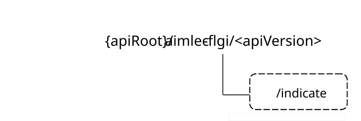

# 6.6 Aimlec_FLGroupIndication API

## 6.6.1 Introduction

The FL group indication service shall use the Aimlec_FLGroupIndication API.

The API URI of the AIML_FederatedLearning API shall be:

**{apiRoot}/\<apiName\>/\<apiVersion\>**

The request URIs used in HTTP requests shall have the Resource URI structure defined in clause 5.2.4 of 3GPP TS 29.122 \[5\], i.e.:

**{apiRoot}/\<apiName\>/\<apiVersion\>/\<apiSpecificSuffixes\>**

with the following components:

\- The {apiRoot} shall be set as described in clause 5.2.4 of 3GPP TS 29.122 \[5\].

\- The \<apiName\> shall be "aimlec-flgi".

\- The \<apiVersion\> shall be "v1".

\- The \<apiSpecificSuffixes\> shall be set as described in clause 6.6.4.

## 6.6.2 Usage of HTTP and common API related aspects

The provisions of clause 5.2 of 3GPP TS 29.122 \[5\] shall apply for the Aimlec_FLGroupIndication API.

## 6.6.3 Resources

### 6.6.3.1 Overview

There are neither resources nor methods used for the service.

## 6.6.4 Custom operations without associated resources

### 6.6.4.1 Overview

The structure of the custom operation URIs of the Aimlec_FLGroupIndication API is shown in Figure 6.6.4.1-1.

Figure 6.6.4.1-1: Custom operation URI structure of the Aimlec_FLGroupIndication API

Table 6.6.4.1-1 provides an overview of the custom operations and applicable HTTP methods defined for the Aimlec_FLGroupIndication API.

Table 6.6.4.1-1: Custom operations without associated resources

| Operation name    | Custom operation URI | Mapped HTTP method | Description                                                                    |
|-------------------|----------------------|--------------------|--------------------------------------------------------------------------------|
| Indicate FL group | /indicate            | POST               | Used by the AIMLE server to indicate FL group information to the AIMLE client. |

The custom operations shall support the URI variables defined in table 6.6.4.1-2.

Table 6.6.4.1-2: URI variables for this custom operation

| Name    | Data type | Definition        |
|---------|-----------|-------------------|
| apiRoot | string    | See clause 6.6.1. |

### 6.6.4.2 Operation: Indicate FL group

#### 6.6.4.2.1 Description

The custom operation enables the AIMLE server to indicate the AIMLE client as the candidate FL member the information on the FL group.

#### 6.6.4.2.2 Operation definition

This operation shall support the response data structures and response codes specified in tables 6.6.4.2.2-1, 6.6.4.2.2-2, 6.6.4.2.2-3, and 6.6.4.2.2-4.

Table 6.6.4.2.2-1: Data structures supported by the POST Request Body on this resource

|             |     |             |                                                         |
|-------------|-----|-------------|---------------------------------------------------------|
| Data type   | P   | Cardinality | Description                                             |
| IndFlMember | M   | 1           | Information which shall be indicated to the FL members. |

Table 6.6.4.2.2-2: Data structures supported by the POST Response Body on this resource

<table>
<colgroup>
<col style="width: 14%" />
<col style="width: 4%" />
<col style="width: 13%" />
<col style="width: 16%" />
<col style="width: 51%" />
</colgroup>
<tbody>
<tr class="odd">
<td>Data type</td>
<td>P</td>
<td>Cardinality</td>
<td>Response codes</td>
<td>Description</td>
</tr>
<tr class="even">
<td>n/a</td>
<td></td>
<td></td>
<td>204 No Content</td>
<td>Success. The indicated information on FL member group is successfully received, processed, and provisioned.</td>
</tr>
<tr class="odd">
<td>n/a</td>
<td></td>
<td></td>
<td>307 Temporary Redirect</td>
<td>
Temporary redirection. The response shall include a Location header field containing an alternative URI of the resource located in an alternative AIMLE client.

Redirection handling is described in clause 5.2.10 of 3GPP TS 29.122 [5].
</td>
</tr>
<tr class="even">
<td>n/a</td>
<td></td>
<td></td>
<td>308 Permanent Redirect</td>
<td>
Permanent redirection. The response shall include a Location header field containing an alternative URI of the resource located in an alternative AIMLE client.

Redirection handling is described in clause 5.2.10 of 3GPP TS 29.122 [5].
</td>
</tr>
<tr class="odd">
<td colspan="5">NOTE: The mandatory HTTP error status code for the HTTP POST method listed in table 5.2.6-1 of 3GPP TS 29.122 [5] also apply.</td>
</tr>
</tbody>
</table>

Table 6.6.4.2.2-3: Headers supported by the 307 Response Code on this resource

| Name     | Data type | P   | Cardinality | Description                                                                |
|----------|-----------|-----|-------------|----------------------------------------------------------------------------|
| Location | string    | M   | 1           | Contains an alternative target URI located in an alternative AIMLE client. |

Table 6.6.4.2.2-4: Headers supported by the 308 Response Code on this resource

| Name     | Data type | P   | Cardinality | Description                                                                |
|----------|-----------|-----|-------------|----------------------------------------------------------------------------|
| Location | string    | M   | 1           | Contains an alternative target URI located in an alternative AIMLE client. |

## 6.6.5 Notifications

### 6.6.5.1 General

There are no notifications defined for the Aimlec_FLGroupIndication API in this release of the specification.

## 6.6.6 Data model

### 6.6.6.1 General

This clause specifies the application data model supported by the Aimlec_FLGroupIndication API.

Table 6.6.6.1-1 specifies the data types defined for the Aimlec_FLGroupIndication API.

Table 6.6.6.1-1: Aimlec_FLGroupIndication API specific Data Types

| Data type            | Clause defined | Description                                                                  | Applicability |
|----------------------|----------------|------------------------------------------------------------------------------|---------------|
| FlGroupDelCause      | 6.6.6.3.6      | Represents the deletion cause for the FL group.                              |               |
| FlGroupDeletionInfo  | 6.6.6.2.6      | Represents the FL group deletion information.                                |               |
| FlGroupInfo          | 6.6.6.2.3      | Represents the FL group information.                                         |               |
| FlMemberAvailability | 6.6.6.3.3      | Indicates the FL member availability.                                        |               |
| FlMemberConstraint   | 6.6.6.3.4      | Indicates the FL member constraint.                                          |               |
| FlMemberData         | 6.6.6.2.4      | Represents the FL group member data e.g. FL member identifier, address.      |               |
| FlMemberInfo         | 6.6.6.2.5      | Represents the FL member information e.g. availability, constraint, FL role. |               |
| FlMemberRole         | 6.6.6.3.5      | Indicates the FL member role.                                                |               |
| IndFlMember          | 6.6.6.2.2      | Indicates the FL member the information on FL member group                   |               |

Table 6.6.6.1-2 specifies data types re-used by the Aimlec_FLGroupIndication API from other specifications, including a reference to their respective specifications, and when needed, a short description of their use within the Aimlec_FLGroupIndication API.

Table 6.6.6.1-2: Aimlec_FLGroupIndication API re-used Data Types

| Data type     | Reference            | Comments                               | Applicability |
|---------------|----------------------|----------------------------------------|---------------|
| TimeWindow    | 3GPP TS 29.122 \[5\] | Represents a time window.              |               |
| ValUeAddrInfo | 3GPP TS 29.549 \[9\] | Represents VAL UE address information. |               |

### 6.6.6.2 Structured data types

#### 6.6.6.2.1 Introduction

This clause defines the structures to be used in resource representations.

#### 6.6.6.2.2 Type: IndFlMember

Table 6.6.6.2.2-1: Definition of type IndFlMember

<table>
<colgroup>
<col style="width: 16%" />
<col style="width: 14%" />
<col style="width: 4%" />
<col style="width: 11%" />
<col style="width: 38%" />
<col style="width: 13%" />
</colgroup>
<thead>
<tr class="header">
<th>Attribute name</th>
<th>Data type</th>
<th>P</th>
<th>Cardinality</th>
<th>Description</th>
<th>Applicability</th>
</tr>
</thead>
<tbody>
<tr class="odd">
<td>serverId</td>
<td>string</td>
<td>M</td>
<td>1</td>
<td>Identifier of the indicating AIMLE server</td>
<td></td>
</tr>
<tr class="even">
<td>valServiceId</td>
<td>string</td>
<td>C</td>
<td>0..1</td>
<td>
Identifier of the VAL service for which the grouping indication is applied.

(NOTE 1)
</td>
<td></td>
</tr>
<tr class="odd">
<td>mlModelId</td>
<td>string</td>
<td>C</td>
<td>0..1</td>
<td>
Identifier of the ML model for which the indication is applied.

(NOTE 1)
</td>
<td></td>
</tr>
<tr class="even">
<td>analyticsId</td>
<td>string</td>
<td>C</td>
<td>0..1</td>
<td>
Identifier of the UE-to-UE session analytics, the FL grouping is based on, if the FL process is used for that of the UE-to-UE session analytics.

(NOTE 1)
</td>
<td></td>
</tr>
<tr class="odd">
<td>flGroupIds</td>
<td>array(FlGroupInfo)</td>
<td>M</td>
<td>1..N</td>
<td>Identifiers of one or more AIMLE created or modified FL group for the FL process</td>
<td></td>
</tr>
<tr class="even">
<td>flGroupDelInfo</td>
<td>FlGroupDeletionInfo</td>
<td>C</td>
<td>0..1</td>
<td>
Indicates the FL group is going to be deleted.

(NOTE 2)
</td>
<td></td>
</tr>
<tr class="odd">
<td colspan="6">
NOTE 1: One of the attributes "valServiceId", "mlModelId", or "analyticsId" shall be present if the FL group indication is related to FL group creation or change.

NOTE 2: The "flGroupDelInfo attribute shall be present if the indication is related to an FL group deletion.
</td>
</tr>
</tbody>
</table>

#### 6.6.6.2.3 Type: FlGroupInfo

Table 6.6.6.2.3-1: Definition of type FlGroupInfo

| Attribute name | Data type           | P   | Cardinality | Description                                                 | Applicability |
|----------------|---------------------|-----|-------------|-------------------------------------------------------------|---------------|
| flGroupId      | string              | M   | 1           | Contains the FL group identifier.                           |               |
| flMembers      | array(FlMemberData) | O   | 1..N        | Contains FL member data e.g. FL member identifier, address. |               |

#### 6.6.6.2.4 Type: FlMemberData

Table 6.6.6.2.4-1: Definition of type FlMemberData

<table>
<colgroup>
<col style="width: 16%" />
<col style="width: 14%" />
<col style="width: 4%" />
<col style="width: 11%" />
<col style="width: 38%" />
<col style="width: 13%" />
</colgroup>
<thead>
<tr class="header">
<th>Attribute name</th>
<th>Data type</th>
<th>P</th>
<th>Cardinality</th>
<th>Description</th>
<th>Applicability</th>
</tr>
</thead>
<tbody>
<tr class="odd">
<td>flMemberId</td>
<td>string</td>
<td>C</td>
<td>0..1</td>
<td>
Identifier of FL member

(NOTE)
</td>
<td></td>
</tr>
<tr class="even">
<td>flMemberAddr</td>
<td>ValUeAddrInfo</td>
<td>C</td>
<td>0..1</td>
<td>
Address information of FL member

(NOTE)
</td>
<td></td>
</tr>
<tr class="odd">
<td>flMemberInfo</td>
<td>FlMemberInfo</td>
<td>O</td>
<td>0..1</td>
<td>Information on FL members</td>
<td></td>
</tr>
<tr class="even">
<td colspan="6">NOTE: At least one of the "flMemberId" and "flMemberAddr" attributes shall be present.</td>
</tr>
</tbody>
</table>

#### 6.6.6.2.5 Type: FlMemberInfo

Table 6.6.6.2.5-1: Definition of type FlMemberInfo

| Attribute name | Data type                 | P   | Cardinality | Description                                  | Applicability |
|----------------|---------------------------|-----|-------------|----------------------------------------------|---------------|
| availability   | FlMemberAvailability      | O   | 0..1        | Represents the FL group member availability. |               |
| constraints    | array(FlMemberConstraint) | O   | 1..N        | Represents the FL group member constraints.  |               |
| role           | FlMemberRole              | O   | 0..1        | Represents the FL group member role/type.    |               |

#### 6.6.6.2.6 Type: FlGroupDeletionInfo

Table 6.6.6.2.6-1: Definition of type FlGroupDeletionInfo

<table>
<colgroup>
<col style="width: 16%" />
<col style="width: 14%" />
<col style="width: 4%" />
<col style="width: 11%" />
<col style="width: 38%" />
<col style="width: 13%" />
</colgroup>
<thead>
<tr class="header">
<th>Attribute name</th>
<th>Data type</th>
<th>P</th>
<th>Cardinality</th>
<th>Description</th>
<th>Applicability</th>
</tr>
</thead>
<tbody>
<tr class="odd">
<td>cause</td>
<td>FlGroupDelCause</td>
<td>O</td>
<td>0..1</td>
<td>Represents the cause for the FL group deletion.</td>
<td></td>
</tr>
<tr class="even">
<td>expTime</td>
<td>TimeWindow</td>
<td>O</td>
<td>0..1</td>
<td>
Represents the expiration time of the FL members group deletion (e.g. due to AI/ML service termination or group UE mobility to different service area).

If the expTime attribute is not included, the deletion of the group is instant.
</td>
<td></td>
</tr>
</tbody>
</table>

### 6.6.6.3 Simple data types and enumerations

#### 6.6.6.3.1 Introduction

This clause defines simple data types and enumerations that can be referenced from data structures defined in the previous clauses.

#### 6.6.6.3.2 Simple data types

The simple data types defined in table 6.6.6.3.2-1 shall be supported.

Table 6.6.6.3.2-1: Simple data types

|           |                 |             |               |
|-----------|-----------------|-------------|---------------|
| Type Name | Type Definition | Description | Applicability |
|           |                 |             |               |

#### 6.6.6.3.3 Enumeration: FlMemberAvailability

The enumeration FlMemberAvailability represents information regarding FL member availability of the VAL UE. It shall comply with the provisions defined in table 6.6.6.3.3-1.

Table 6.6.6.3.3-1: Enumeration FlMemberAvailability

| Enumeration value | Description                     | Applicability |
|-------------------|---------------------------------|---------------|
| AVAILABLE         | The FL member is available.     |               |
| NOT_AVAILABLE     | The FL member is not available. |               |

#### 6.6.6.3.4 Enumeration: FlMemberConstraint

The enumeration FlMemberConstraint represents an FL member constraint information of the VAL UE. It shall comply with the provisions defined in table 6.6.6.3.4-1.

Table 6.6.6.3.4-1: Enumeration FlMemberConstraint

| Enumeration value   | Description                                        | Applicability |
|---------------------|----------------------------------------------------|---------------|
| LIMITED_MEMORY      | Indicates a limited memory load.                   |               |
| LIMITED_PROCCESSING | Indicates a limited processing power.              |               |
| LIMITED_ACCESS      | Indicates a limited access to only the local data. |               |

#### 6.6.6.3.5 Enumeration: FlMemberRole

The enumeration FlMemberRole represents an FL member role of the VAL UE. It shall comply with the provisions defined in table 6.6.6.3.5-1.

Table 6.6.6.3.5-1: Enumeration FlMemberRole

| Enumeration value | Description                      | Applicability |
|-------------------|----------------------------------|---------------|
| FL_CLIENT         | Indicates an FL client role.     |               |
| FL_SERVER         | Indicates an FL server role.     |               |
| FL_AGGREGATOR     | Indicates an FL aggregator role. |               |

#### 6.6.6.3.6 Enumeration: FlGroupDelCause

The enumeration FlGroupDelCause represents the deletion cause for the FL group. It shall comply with the provisions defined in table 6.6.6.3.6-1.

Table 6.6.6.3.6-1: Enumeration FlGroupDelCause

| Enumeration value | Description                                         | Applicability |
|-------------------|-----------------------------------------------------|---------------|
| SRV_TERMINATION   | Indicates the AI/ML service termination.            |               |
| OUT_OF_SRV_AREA   | Indicates the UE has moved out of the service area. |               |

### 6.6.6.4 Data types describing alternative data types or combinations of data types

There are no data types describing alternative data types or combination of data types for Aimlec_FLGroupIndication API in this release of the specification.

### 6.6.6.5 Binary data

#### 6.6.6.5.1 Binary data types

The binary data types defined in table 6.6.6.5.1-1 shall be supported.

Table 6.6.6.5.1-1: Binary data types

| Name | Clause defined | Content type |
|------|----------------|--------------|
|      |                |              |

## 6.6.7 Error handling

### 6.6.7.1 General

For the Aimlec_FLGroupIndication API, HTTP error responses shall be supported as specified in clause 5.2.6 of 3GPP TS 29.122 \[5\]. Protocol errors and application errors specified in clause 5.2.6 of 3GPP TS 29.122 \[5\] shall be supported for the HTTP status codes specified in table 5.2.6-1 of 3GPP TS 29.122 \[5\].

In addition, the requirements in the following clauses are applicable for the Aimlec_FLGroupIndication API.

### 6.6.7.2 Protocol errors

No specific procedures for the Aimlec_FLGroupIndication API are specified in this release of the specification.

### 6.6.7.3 Application errors

The application errors defined for the Aimlec_FLGroupIndication API are listed in Table 6.6.7.3-1.

Table 6.6.7.3-1: Application errors

| Application Error | HTTP status code | Description |
|-------------------|------------------|-------------|
|                   |                  |             |

## 6.6.8 Feature negotiation

The optional features in table 6.6.8-1 are defined for the Aimlec_FLGroupIndication API. They shall be negotiated using the extensibility mechanism defined in clause 5.2.7 of 3GPP TS 29.122 \[5\].

Table 6.6.8-1: Supported Features

| Feature number | Feature Name | Description |
|----------------|--------------|-------------|
|                |              |             |

## 6.6.9 Security

The provisions of clause 6 of 3GPP TS 29.122 \[5\] shall apply for the Aimlec_FLGroupIndication API.
