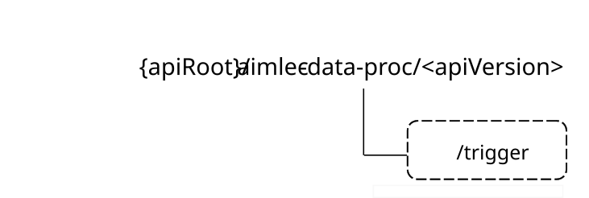

# 6.7 Aimlec_ClientDataProcessing API

## 6.7.1 Introduction

The client data processing service shall use the Aimlec_ClientDataProcessing API.

The API URI of the Aimlec_ClientDataProcessing API shall be:

**{apiRoot}/\<apiName\>/\<apiVersion\>**

The request URIs used in HTTP requests shall have the Resource URI structure defined in clause 5.2.4 of 3GPP TS 29.122 \[5\], i.e.:

**{apiRoot}/\<apiName\>/\<apiVersion\>/\<apiSpecificSuffixes\>**

with the following components:

\- The {apiRoot} shall be set as described in clause 5.2.4 of 3GPP TS 29.122 \[5\].

\- The \<apiName\> shall be "aimlec-data-proc".

\- The \<apiVersion\> shall be "v1".

\- The \<apiSpecificSuffixes\> shall be set as described in clause 6.7.4.

## 6.7.2 Usage of HTTP and common API related aspects

The provisions of clause 5.2 of 3GPP TS 29.122 \[5\] shall apply for the Aimlec_ClientDataProcessing API.

## 6.7.3 Resources

### 6.7.3.1 Overview

There are neither resources nor methods used for the service.

## 6.7.4 Custom operations without associated resources

### 6.7.4.1 Overview

The structure of the custom operation URIs of the Aimlec_ClientDataProcessing API is shown in Figure 6.7.4.1-1.

Figure 6.7.4.1-1: Custom operation URI structure of the Aimlec_ClientDataProcessing API

Table 6.7.4.1-1 provides an overview of the custom operations and applicable HTTP methods defined for the Aimlec_ClientDataProcessing API.

Table 6.7.4.1-1: Custom operations without associated resources

| Operation name                 | Custom operation URI | Mapped HTTP method | Description                                                                          |
|--------------------------------|----------------------|--------------------|--------------------------------------------------------------------------------------|
| Trigger client data processing | /trigger             | POST               | Used by the AIMLE server to trigger the AIMLE client for the client data processing. |

The custom operations shall support the URI variables defined in table 6.7.4.1-2.

Table 6.7.4.1-2: URI variables for this custom operation

| Name    | Data type | Definition        |
|---------|-----------|-------------------|
| apiRoot | string    | See clause 6.7.1. |

### 6.7.4.2 Operation: Trigger client data processing

#### 6.7.4.2.1 Description

The custom operation enables the AIMLE server to trigger the AIMLE client for the client data processing which includes the data preparation or the data analysis.

#### 6.7.4.2.2 Operation definition

This operation shall support the response data structures and response codes specified in tables 6.7.4.2.2-1 and 6.7.4.2.2-2, 6.7.4.2.2-3, and 6.7.4.2.2-4.

Table 6.7.4.2.2-1: Data structures supported by the POST Request Body on this resource

| Data type      | P   | Cardinality | Description                                                            |
|----------------|-----|-------------|------------------------------------------------------------------------|
| CltDataProcReq | M   | 1           | Information which shall be used to trigger the client data processing. |

Table 6.7.4.2.2-2: Data structures supported by the POST Response Body on this resource

<table>
<colgroup>
<col style="width: 18%" />
<col style="width: 4%" />
<col style="width: 11%" />
<col style="width: 14%" />
<col style="width: 50%" />
</colgroup>
<thead>
<tr class="header">
<th>Data type</th>
<th>P</th>
<th>Cardinality</th>
<th>Response codes</th>
<th>Description</th>
</tr>
</thead>
<tbody>
<tr class="odd">
<td>CltDataProcResp</td>
<td></td>
<td></td>
<td>200 OK</td>
<td>Successful case. The requested client data processing is successfully received and processed, and the processed data and optionally a timestamp shall be returned in the response body.</td>
</tr>
<tr class="even">
<td>n/a</td>
<td></td>
<td></td>
<td>307 Temporary Redirect</td>
<td>
Temporary redirection. The response shall include a Location header field containing an alternative URI of the resource located in an alternative AIMLE client.

Redirection handling is described in clause 5.2.10 of 3GPP TS 29.122 [5].
</td>
</tr>
<tr class="odd">
<td>n/a</td>
<td></td>
<td></td>
<td>308 Permanent Redirect</td>
<td>
Permanent redirection. The response shall include a Location header field containing an alternative URI of the resource located in an alternative AIMLE client.

Redirection handling is described in clause 5.2.10 of 3GPP TS 29.122 [5].
</td>
</tr>
<tr class="even">
<td colspan="5">NOTE: The mandatory HTTP error status code for the HTTP POST method listed in table 5.2.6-1 of 3GPP TS 29.122 [5] also apply.</td>
</tr>
</tbody>
</table>

Table 6.7.4.2.2-3: Headers supported by the 307 Response Code on this resource

| Name     | Data type | P   | Cardinality | Description                                                                |
|----------|-----------|-----|-------------|----------------------------------------------------------------------------|
| Location | string    | M   | 1           | Contains an alternative target URI located in an alternative AIMLE client. |

Table 6.7.4.2.2-4: Headers supported by the 308 Response Code on this resource

| Name     | Data type | P   | Cardinality | Description                                                                |
|----------|-----------|-----|-------------|----------------------------------------------------------------------------|
| Location | string    | M   | 1           | Contains an alternative target URI located in an alternative AIMLE client. |

## 6.7.5 Notifications

### 6.7.5.1 General

There are no notifications defined for the Aimlec_ClientDataProcessing API in this release of the specification.

## 6.7.6 Data model

### 6.7.6.1 General

This clause specifies the application data model supported by the Aimlec_ClientDataProcessing API.

Table 6.7.6.1-1 specifies the data types defined for the Aimlec_ClientDataProcessing API.

Table 6.7.6.1-1: Aimlec_ClientDataProcessing API specific Data Types

| Data type       | Clause defined | Description                                                      | Applicability |
|-----------------|----------------|------------------------------------------------------------------|---------------|
| CltDataProcReq  | 6.7.6.2.2      | Represents triggering information for client data processing.    |               |
| CltDataProcResp | 6.7.6.2.3      | Represents the outcome of the successful client data processing. |               |

Table 6.7.6.1-2 specifies data types re-used by the Aimlec_ClientDataProcessing API from other specifications, including a reference to their respective specifications, and when needed, a short description of their use within the Aimlec_ClientDataProcessing API.

Table 6.7.6.1-2: Aimlec_ClientDataProcessing API re-used Data Types

| Data type                  | Reference             | Comments                                                         | Applicability |
|----------------------------|-----------------------|------------------------------------------------------------------|---------------|
| AggregatedDataAnaOutputs   | 3GPP TS 29.482 \[7\]  | Represents the AIMLE Aggregated Data Analysis Output.            |               |
| AggregatedDataPrepOutputs  | 3GPP TS 29.482 \[7\]  | Represents the AIMLE Aggregated Data Preparation Output.         |               |
| DataMgmtOp                 | 3GPP TS 29.482 \[7\]  | Represents the type of the client data processing.               |               |
| DataProcessReqs            | 3GPP TS 29.482 \[7\]  | Represents the data preparation requirement.                     |               |
| DateTime                   | 3GPP TS 29.122 \[5\]  | Used to represent the date and time.                             |               |
| ScheduledCommunicationTime | 3GPP TS 29.571 \[11\] | Used to define the schedules for traffic pattern configurations. |               |

### 6.7.6.2 Structured data types

#### 6.7.6.2.1 Introduction

This clause defines the structures to be used in resource representations.

#### 6.7.6.2.2 Type: CltDataProcReq

Table 6.7.6.2.2-1: Definition of type CltDataProcReq

<table>
<colgroup>
<col style="width: 16%" />
<col style="width: 14%" />
<col style="width: 4%" />
<col style="width: 11%" />
<col style="width: 38%" />
<col style="width: 13%" />
</colgroup>
<thead>
<tr class="header">
<th>Attribute name</th>
<th>Data type</th>
<th>P</th>
<th>Cardinality</th>
<th>Description</th>
<th>Applicability</th>
</tr>
</thead>
<tbody>
<tr class="odd">
<td>requesterId</td>
<td>string</td>
<td>M</td>
<td>1</td>
<td>Contains the identifier of the service consumer. For the AIMLE client, e.g. unique client identifier. For the AIMLE server, e.g. FQDN, URI.</td>
<td></td>
</tr>
<tr class="even">
<td>dataProc</td>
<td>DataMgmtOp</td>
<td>M</td>
<td>1</td>
<td>Identifies the type of the client data processing i.e. the data preparation or the data analysis.</td>
<td></td>
</tr>
<tr class="odd">
<td>dataPrepReqs</td>
<td>DataProcessReqs</td>
<td>C</td>
<td>0..1</td>
<td>
Identifies the data preparation requirements for the client data processing.

If Aiml_Ph2 feature is supported, this attribute shall be present if the requested data management type is "DATA_PREPARATION".

(NOTE)
</td>
<td></td>
</tr>
<tr class="even">
<td>dataAnalysisReqs</td>
<td>DataProcessReqs</td>
<td>C</td>
<td>0..1</td>
<td>
Identifies the data analysis requirements for the client data processing.

If Aiml_Ph2 feature is supported, this attribute shall be present if the requested data management is "DATA_ANALYSIS".

(NOTE)
</td>
<td></td>
</tr>
<tr class="odd">
<td>dataProcSched</td>
<td>ScheduledCommunicationTime</td>
<td>O</td>
<td>0..1</td>
<td>Identifies the schedule for the client data processing.</td>
<td></td>
</tr>
<tr class="even">
<td>dataDriftDetReqs</td>
<td>DataProcessReqs</td>
<td>C</td>
<td>0..1</td>
<td>
Represents the requirement for the data drift detection operation type.

This attribute shall be present if the requested data management is "DATA_DRIFT_DETECTION".

(NOTE)
</td>
<td>Aiml_Ph2</td>
</tr>
<tr class="odd">
<td colspan="6">NOTE: At least one of the "dataPrepReqs", "dataAnalysisReqs", or "dataDriftDetReqs" attributes shall be present.</td>
</tr>
</tbody>
</table>

#### 6.7.6.2.3 Type: CltDataProcResp

Table 6.7.6.2.3-1: Definition of type CltDataProcResp

<table>
<colgroup>
<col style="width: 16%" />
<col style="width: 14%" />
<col style="width: 4%" />
<col style="width: 11%" />
<col style="width: 38%" />
<col style="width: 13%" />
</colgroup>
<thead>
<tr class="header">
<th>Attribute name</th>
<th>Data type</th>
<th>P</th>
<th>Cardinality</th>
<th>Description</th>
<th>Applicability</th>
</tr>
</thead>
<tbody>
<tr class="odd">
<td>dataPrepOutputs</td>
<td>AggregatedDataPrepOutputs</td>
<td>C</td>
<td>0..1</td>
<td>Identifies one or more outputs for the client data processing, where each output is w.r.t. a data preparation requirement. (NOTE 1)</td>
<td></td>
</tr>
<tr class="even">
<td>dataAnalysisOutputs</td>
<td>AggregatedDataAnaOutputs</td>
<td>C</td>
<td>0..1</td>
<td>Identifies one or more outputs for the client data processing, where each output is w.r.t. a data analysis requirement. (NOTE )</td>
<td></td>
</tr>
<tr class="odd">
<td>timestamp</td>
<td>DateTime</td>
<td>O</td>
<td>0..1</td>
<td>Identifies the timestamp for the client data processing.</td>
<td></td>
</tr>
<tr class="even">
<td>dataDriftDetOutputs</td>
<td>AggregatedDataPrepOutputs</td>
<td>C</td>
<td>0..1</td>
<td>
Identifies one or more outputs for the client data processing, where each output is w.r.t. a data drift detection requirement.

(NOTE 1) (NOTE 2)
</td>
<td>Aiml_Ph2</td>
</tr>
<tr class="odd">
<td colspan="6">
NOTE 1: At least one of the "dataPrepOutputs", "dataAnalysisOutputs", or "dataDriftDetOutputs" attributes shall be present.

NOTE 2: The output format of "dataDriftDetOutputs" may be numerical or categorical. If categorical, the format shall be nominal or ordinal.
</td>
</tr>
</tbody>
</table>

### 6.7.6.3 Simple data types and enumerations

#### 6.7.6.3.1 Introduction

This clause defines simple data types and enumerations that can be referenced from data structures defined in the previous clauses.

#### 6.7.6.3.2 Simple data types

The simple data types defined in table 6.7.6.3.2-1 shall be supported.

Table 6.7.6.3.2-1: Simple data types

| Type Name | Type Definition | Description | Applicability |
|-----------|-----------------|-------------|---------------|
|           |                 |             |               |

### 6.7.6.4 Data types describing alternative data types or combinations of data types

There are no data types describing alternative data types or combination of data types for Aimlec_ClientDataProcessing API in this release of the specification.

### 6.7.6.5 Binary data

#### 6.7.6.5.1 Binary data types

The binary data types defined in table 6.7.6.5.1-1 shall be supported.

Table 6.7.6.5.1-1: Binary data types

| Name | Clause defined | Content type |
|------|----------------|--------------|
|      |                |              |

## 6.7.7 Error handling

### 6.7.7.1 General

For the Aimlec_ClientDataProcessing API, HTTP error responses shall be supported as specified in clause 5.2.6 of 3GPP TS 29.122 \[5\]. Protocol errors and application errors specified in clause 5.2.6 of 3GPP TS 29.122 \[5\] shall be supported for the HTTP status codes specified in table 5.2.6-1 of 3GPP TS 29.122 \[5\].

In addition, the requirements in the following clauses are applicable for the Aimlec_ClientDataProcessing API.

### 6.7.7.2 Protocol errors

No specific procedures for the Aimlec_ClientDataProcessing API are specified in this release of the specification.

### 6.7.7.3 Application errors

The application errors defined for the Aimlec_ClientDataProcessing API are listed in Table 6.7.7.3-1.

Table 6.7.7.3-1: Application errors

| Application Error | HTTP status code | Description |
|-------------------|------------------|-------------|
|                   |                  |             |

## 6.7.8 Feature negotiation

The optional features in table 6.7.8-1 are defined for the Aimlec_ClientDataProcessing API. They shall be negotiated using the extensibility mechanism defined in clause 5.2.7 of 3GPP TS 29.122 \[5\].

Table 6.7.8-1: Supported Features

| Feature number | Feature Name | Description                                                  |
|----------------|--------------|--------------------------------------------------------------|
| 1              | Aiml_Ph2     | Indicates the support of data drift detection functionality. |

## 6.7.9 Security

The provisions of clause 6 of 3GPP TS 29.122 \[5\] shall apply for the Aimlec_ClientDataProcessing API.
