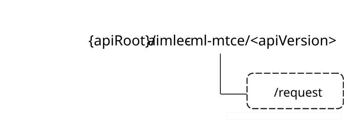

# 6.8 Aimlec_MLModTngCapEva API

## 6.8.1 Introduction

The ML model training capability evaluation service shall use the Aimlec_MLModTngCapEva API.

The API URI of the Aimlec_MLModTngCapEva API shall be:

**{apiRoot}/\<apiName\>/\<apiVersion\>**

The request URIs used in HTTP requests shall have the Resource URI structure defined in clause 5.2.4 of 3GPP TS 29.122 \[5\], i.e.:

**{apiRoot}/\<apiName\>/\<apiVersion\>/\<apiSpecificSuffixes\>**

with the following components:

\- The {apiRoot} shall be set as described in clause 5.2.4 of 3GPP TS 29.122 \[5\].

\- The \<apiName\> shall be "aimlec-ml-mtce".

\- The \<apiVersion\> shall be "v1".

\- The \<apiSpecificSuffixes\> shall be set as described in clause 6.8.4.

## 6.8.2 Usage of HTTP and common API related aspects

The provisions of clause 5.2 of 3GPP TS 29.122 \[5\] shall apply for the Aimlec_MLModTngCapEva API.

## 6.8.3 Resources

There are no resources defined for this API in this release of the specification.

## 6.8.4 Custom operations without associated resources

### 6.8.4.1 Overview

The structure of the custom operation URIs of the Aimlec_MLModTngCapEva API is shown in Figure 6.8.4.1-1.

Figure 6.8.4.1-1: Custom operation URI structure of the Aimlec_MLModTngCapEva API

Table 6.8.4.1-1 provides an overview of the custom operations and applicable HTTP methods defined for the Aimlec_MLModTngCapEva API.

Table 6.8.4.1-1: Custom operations without associated resources

| Operation name                                  | Custom operation URI | Mapped HTTP method | Description                                                                                                                |
|-------------------------------------------------|----------------------|--------------------|----------------------------------------------------------------------------------------------------------------------------|
| ML model training capability evaluation request | /request             | POST               | Enables the AIMLE server to request the AIMLE client to perform ML model training capability evaluation service operation. |

The custom operations shall support the URI variables defined in table 6.8.4.1-2.

Table 6.8.4.1-2: URI variables for this custom operation

| Name    | Data type | Definition        |
|---------|-----------|-------------------|
| apiRoot | string    | See clause 6.8.1. |

### 6.8.4.2 Operation: ML model training capability evaluation request

#### 6.8.4.2.1 Description

The custom operation enables the AIMLE server to request the AIMLE client to perform the ML model training capability evaluation service operation.

#### 6.8.4.2.2 Operation definition

This operation shall support the response data structures and response codes specified in tables 6.8.4.2.2-1 and 6.8.4.2.2-2.

Table 6.8.4.2.2-1: Data structures supported by the POST Request Body on this resource

|                    |     |             |                                                                           |
|--------------------|-----|-------------|---------------------------------------------------------------------------|
| Data type          | P   | Cardinality | Description                                                               |
| MlModTngCapEvalReq | M   | 1           | Contains the ML model training capability evaluation request information. |

Table 6.8.4.2.2-2: Data structures supported by the POST Response Body on this resource

<table>
<colgroup>
<col style="width: 22%" />
<col style="width: 4%" />
<col style="width: 13%" />
<col style="width: 22%" />
<col style="width: 38%" />
</colgroup>
<tbody>
<tr class="odd">
<td>Data type</td>
<td>P</td>
<td>Cardinality</td>
<td>Response codes</td>
<td>Description</td>
</tr>
<tr class="even">
<td>MlModTngCapEvalResp</td>
<td>M</td>
<td>0..1</td>
<td>200 OK</td>
<td>Contains the ML model training capability evaluation response information.</td>
</tr>
<tr class="odd">
<td>n/a</td>
<td></td>
<td></td>
<td>307 Temporary Redirect</td>
<td>
Temporary redirection. The response shall include a Location header field containing an alternative URI of the resource located in an alternative AIMLE client.

Redirection handling is described in clause 5.2.10 of 3GPP TS 29.122 [5].
</td>
</tr>
<tr class="even">
<td>n/a</td>
<td></td>
<td></td>
<td>308 Permanent Redirect</td>
<td>
Permanent redirection. The response shall include a Location header field containing an alternative URI of the resource located in an alternative AIMLE client.

Redirection handling is described in clause 5.2.10 of 3GPP TS 29.122 [5].
</td>
</tr>
<tr class="odd">
<td colspan="5">NOTE: The mandatory HTTP error status codes for the HTTP POST method listed in table 5.2.6-1 of 3GPP TS 29.122 [5] also apply.</td>
</tr>
</tbody>
</table>

Table 6.8.4.2.2-3: Headers supported by the 307 Response Code on this resource

|          |           |     |             |                                                                            |
|----------|-----------|-----|-------------|----------------------------------------------------------------------------|
| Name     | Data type | P   | Cardinality | Description                                                                |
| Location | string    | M   | 1           | Contains an alternative target URI located in an alternative AIMLE client. |

Table 6.8.4.2.2-4: Headers supported by the 308 Response Code on this resource

|          |           |     |             |                                                                            |
|----------|-----------|-----|-------------|----------------------------------------------------------------------------|
| Name     | Data type | P   | Cardinality | Description                                                                |
| Location | string    | M   | 1           | Contains an alternative target URI located in an alternative AIMLE client. |

## 6.8.5 Notifications

There are no notifications defined for this API in this release of the specification.

## 6.8.6 Data model

### 6.8.6.1 General

This clause specifies the application data model supported by the Aimlec_MLModTngCapEva API.

Table 6.8.6.1-1 specifies the data types defined for the Aimlec_MLModTngCapEva API.

Table 6.8.6.1-1: Aimlec_MLModTngCapEva API specific Data Types

| Data type           | Clause defined | Description                                                                       | Applicability |
|---------------------|----------------|-----------------------------------------------------------------------------------|---------------|
| AimlModelData       | 6.8.6.2.4      | Contains the AI/ML model information and model parameters for use in FL training. |               |
| CapEvalOutcome      | 6.8.6.3.3      | Indicates the outcome of the ML model training capability evaluation.             |               |
| DataSetRequirements | 6.8.6.2.5      | Contains requirements on data set for FL training.                                |               |
| DomainFeatures      | 6.8.6.2.6      | Contains a list of features for each data domain(s) of the datasets at the UE.    |               |
| MlModTngCapEvalReq  | 6.8.6.2.2      | Contains the ML model training capability evaluation request information.         |               |
| MlModTngCapEvalResp | 6.8.6.2.3      | Contains the ML model training capability evaluation response information.        |               |

Table 6.8.6.1-2 specifies data types re-used by the Aimlec_MLModTngCapEva API from other specifications, including a reference to their respective specifications, and when needed, a short description of their use within the Aimlec_MLModTngCapEva API.

Table 6.8.6.1-2: Aimlec_MLModTngCapEva API re-used Data Types

| Data type      | Reference            | Comments                                    | Applicability |
|----------------|----------------------|---------------------------------------------|---------------|
| AimlModelType  | 6.3.6.3.4            | Used to indicate a type of the AI/ML model. |               |
| MLModelProfile | 3GPP TS 29.482 \[7\] | Used to indicate an ML model profile.       |               |
| TimeWindow     | 3GPP TS 29.122 \[5\] | Used to indicate a time window.             |               |

### 6.8.6.2 Structured data types

#### 6.8.6.2.1 Introduction

This clause defines the structures to be used in resource representations.

#### 6.8.6.2.2 Type: MlModTngCapEvalReq

Table 6.8.6.2.2-1: Definition of type MlModTngCapEvalReq

<table>
<colgroup>
<col style="width: 16%" />
<col style="width: 14%" />
<col style="width: 4%" />
<col style="width: 11%" />
<col style="width: 38%" />
<col style="width: 13%" />
</colgroup>
<thead>
<tr class="header">
<th>Attribute name</th>
<th>Data type</th>
<th>P</th>
<th>Cardinality</th>
<th>Description</th>
<th>Applicability</th>
</tr>
</thead>
<tbody>
<tr class="odd">
<td>aimleServerId</td>
<td>string</td>
<td>M</td>
<td>1</td>
<td>The AIMLE server identifier.</td>
<td></td>
</tr>
<tr class="even">
<td>availTime</td>
<td>TimeWindow</td>
<td>O</td>
<td>0..1</td>
<td>Indicates the requested available time to support FL operation.</td>
<td></td>
</tr>
<tr class="odd">
<td>testTask</td>
<td>string</td>
<td>O</td>
<td>0..1</td>
<td>
Represents the task for test ML model training capability.

(NOTE)
</td>
<td></td>
</tr>
<tr class="even">
<td>modelInfo</td>
<td>AimlModelData</td>
<td>O</td>
<td>0..1</td>
<td>Contains the AI/ML model information and model parameters for use in the FL training process.</td>
<td></td>
</tr>
<tr class="odd">
<td>dataSetReq</td>
<td>DataSetRequirements</td>
<td>O</td>
<td>0..1</td>
<td>Contains requirements on data set for FL training.</td>
<td></td>
</tr>
<tr class="even">
<td colspan="6">NOTE: The detail content of the "testTask" attribute is implementation dependent.</td>
</tr>
</tbody>
</table>

#### 6.8.6.2.3 Type: MlModTngCapEvalResp

Table 6.8.6.2.3-1: Definition of type MlModTngCapEvalResp

<table>
<colgroup>
<col style="width: 16%" />
<col style="width: 17%" />
<col style="width: 4%" />
<col style="width: 11%" />
<col style="width: 36%" />
<col style="width: 13%" />
</colgroup>
<thead>
<tr class="header">
<th>Attribute name</th>
<th>Data type</th>
<th>P</th>
<th>Cardinality</th>
<th>Description</th>
<th>Applicability</th>
</tr>
</thead>
<tbody>
<tr class="odd">
<td>capEvalOut</td>
<td>CapEvalOutcome</td>
<td>M</td>
<td>1</td>
<td>Indicates the outcome of the ML model training capability evaluation.</td>
<td></td>
</tr>
<tr class="even">
<td>testResult</td>
<td>string</td>
<td>C</td>
<td>0..1</td>
<td>
Contains the test result of the ML model training capability evaluation.

If the "capEvalOut" indicates the ability to join the FL training process the "testResult" attribute shall be included.

(NOTE)
</td>
<td></td>
</tr>
<tr class="odd">
<td>evalFailInd</td>
<td>string</td>
<td>C</td>
<td>0..1</td>
<td>
Contains the reason for inability to join the FL training process.

If the "capEvalOut" indicates the inability to join the FL training process the "evalFailInd" attribute shall be included.

(NOTE)
</td>
<td></td>
</tr>
<tr class="even">
<td colspan="6">NOTE: The detail content of this attribute is implementation dependent and depends on the information provided in the MlModTngCapEvalReq data type.</td>
</tr>
</tbody>
</table>

#### 6.8.6.2.4 Type: AimlModelData

Table 6.8.6.2.4-1: Definition of type AimlModelData

<table>
<colgroup>
<col style="width: 16%" />
<col style="width: 14%" />
<col style="width: 4%" />
<col style="width: 11%" />
<col style="width: 38%" />
<col style="width: 13%" />
</colgroup>
<thead>
<tr class="header">
<th>Attribute name</th>
<th>Data type</th>
<th>P</th>
<th>Cardinality</th>
<th>Description</th>
<th>Applicability</th>
</tr>
</thead>
<tbody>
<tr class="odd">
<td>aimlModels</td>
<td>array(AimlModelInfo)</td>
<td>O</td>
<td>1..N</td>
<td>
Contains information about the AI/ML model.

(NOTE 1)
</td>
<td></td>
</tr>
<tr class="even">
<td>mlModelParams</td>
<td>array(string)</td>
<td>O</td>
<td>1..N</td>
<td>
Contains model parameters for use in FL training.

(NOTE 2)
</td>
<td></td>
</tr>
<tr class="odd">
<td colspan="6">
NOTE 1: For the HFL only one AI/ML model shall be present. For the VFL more than one AI/ML model may be present.

NOTE 2: The detail content of the "mlModelParams" attribute is implementation dependent.
</td>
</tr>
</tbody>
</table>

#### 6.8.6.2.5 Type: DataSetRequirements

Table 6.8.6.2.5-1: Definition of type DataSetRequirements

<table>
<colgroup>
<col style="width: 16%" />
<col style="width: 14%" />
<col style="width: 4%" />
<col style="width: 11%" />
<col style="width: 38%" />
<col style="width: 13%" />
</colgroup>
<thead>
<tr class="header">
<th>Attribute name</th>
<th>Data type</th>
<th>P</th>
<th>Cardinality</th>
<th>Description</th>
<th>Applicability</th>
</tr>
</thead>
<tbody>
<tr class="odd">
<td>commonFtIds</td>
<td>array(string)</td>
<td>C</td>
<td>1..N</td>
<td>
Contains a list of the features identifiers of the required features common to the dataset of the different data domains.

(NOTE 1)
</td>
<td></td>
</tr>
<tr class="even">
<td>domainFts</td>
<td>array(DomainFeatures)</td>
<td>C</td>
<td>1..N</td>
<td>
Contains a list of features for each data domain(s) of the datasets at the UE.

(NOTE 1)
</td>
<td></td>
</tr>
<tr class="odd">
<td>dataSource</td>
<td>string</td>
<td>O</td>
<td>0..1</td>
<td>
Contains the identifier of a data source for the FL training (e.g. SEAL server, SEAL client, other NF entity, etc.).

(NOTE 2)
</td>
<td></td>
</tr>
<tr class="even">
<td colspan="6">
NOTE 1: For the VFL at least one of the "commonFtIds" and "domainFts" attributes shall be present.

NOTE 2: The "dataSource" attribute shall be present for the HFL and may be present for the VFL.
</td>
</tr>
</tbody>
</table>

#### 6.8.6.2.6 Type: DomainFeatures

Table 6.8.6.2.6-1: Definition of type DomainFeatures

| Attribute name | Data type     | P   | Cardinality | Description                                                                                                                                               | Applicability |
|----------------|---------------|-----|-------------|-----------------------------------------------------------------------------------------------------------------------------------------------------------|---------------|
| domain         | string        | M   | 1           | Represents a data domain i.e. a specific category of data or logical groupings of data that all relate together (e.g. customer data, product data, etc.). |               |
| featureIds     | array(string) | M   | 1..N        | Represents a list of the features identifiers for the data domain of the datasets at the UE.                                                              |               |

#### 6.8.6.2.7 Type: AimlModelInfo

Table 6.8.6.2.7-1: Definition of type AimlModelInfo

| Attribute name | Data type      | P   | Cardinality | Description                                                                                                                                                 | Applicability |
|----------------|----------------|-----|-------------|-------------------------------------------------------------------------------------------------------------------------------------------------------------|---------------|
| aimlModelType  | AimlModelType  | O   | 0..1        | Contains AI/ML model type (e.g. decision tree, linear regression, neural network).                                                                          |               |
| mlModelProf    | MLModelProfile | O   | 0..1        | Contains ML model profile data e.g. ML model profile identifier, ML model address, ML model information, AIMLE server identifier, ML repository identifier. |               |

### 6.8.6.3 Simple data types and enumerations

#### 6.8.6.3.1 Introduction

This clause defines simple data types and enumerations that can be referenced from data structures defined in the previous clauses.

#### 6.8.6.3.2 Simple data types

The simple data types defined in table 6.8.6.3.2-1 shall be supported.

Table 6.8.6.3.2-1: Simple data types

|           |                 |             |               |
|-----------|-----------------|-------------|---------------|
| Type Name | Type Definition | Description | Applicability |
|           |                 |             |               |

#### 6.8.6.3.3 Enumeration: CapEvalOutcome

The enumeration CapEvalOutcome represents the outcome of the ML model training capability evaluation. It shall comply with the provisions defined in table 6.8.6.3.3-1.

Table 6.8.6.3.3-1: Enumeration CapEvalOutcome

| Enumeration value | Description                                       | Applicability |
|-------------------|---------------------------------------------------|---------------|
| ABILITY_TO_JOIN   | Indicates ability to join the training process.   |               |
| FIRST_MATCH       | Indicates inability to join the training process. |               |

### 6.8.6.4 Data types describing alternative data types or combinations of data types

There are no data types describing alternative data types or combinations of data types defined for this API in this release of the specification.

### 6.8.6.5 Binary data

#### 6.8.6.5.1 Binary data types

The binary data types defined in table 6.8.6.5.1-1 shall be supported.

Table 6.8.6.5.1-1: Binary data types

| Name | Clause defined | Content type |
|------|----------------|--------------|
|      |                |              |

## 6.8.7 Error handling

### 6.8.7.1 General

For the Aimlec_MLModTngCapEva API, HTTP error responses shall be supported as specified in clause 5.2.6 of 3GPP TS 29.122 \[5\]. Protocol errors and application errors specified in clause 5.2.6 of 3GPP TS 29.122 \[5\] shall be supported for the HTTP status codes specified in table 5.2.6-1 of 3GPP TS 29.122 \[5\].

In addition, the requirements in the following clauses are applicable for the Aimlec_MLModTngCapEva API.

### 6.8.7.2 Protocol errors

No specific procedures for the Aimlec_MLModTngCapEva API are specified.

### 6.8.7.3 Application errors

The application errors defined for the Aimlec_MLModTngCapEva API are listed in table 6.8.7.3-1.

Table 6.8.7.3-1: Application errors

| Application Error | HTTP status code | Description |
|-------------------|------------------|-------------|
|                   |                  |             |

## 6.8.8 Feature negotiation

The optional features in table 6.8.8-1 are defined for the Aimlec_MLModTngCapEva API. They shall be negotiated using the extensibility mechanism defined in clause 5.2.7 of 3GPP TS 29.122 \[5\].

Table 6.8.8-1: Supported Features

| Feature number | Feature Name | Description |
|----------------|--------------|-------------|
|                |              |             |

## 6.8.9 Security

The provisions of clause 6 of 3GPP TS 29.122 \[5\] shall apply for the Aimlec_MLModTngCapEva API.
