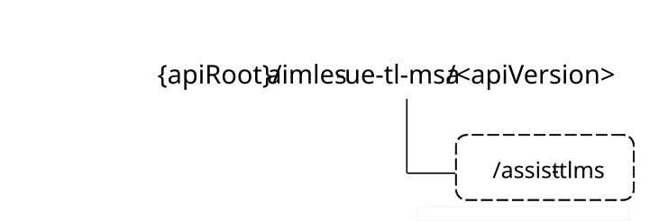

# 6.9 Aimles_UeTLModelSelectionAssistance API

## 6.9.1 Introduction

The TL enablement service shall use the Aimles_UeTLModelSelectionAssistance API.

The API URI of the Aimles_UeTLModelSelectionAssistance API shall be:

**{apiRoot}/\<apiName\>/\<apiVersion\>**

The request URIs used in HTTP requests shall have the Resource URI structure defined in clause 5.2.4 of 3GPP TS 29.122 \[5\], i.e.:

**{apiRoot}/\<apiName\>/\<apiVersion\>/\<apiSpecificSuffixes\>**

with the following components:

\- The {apiRoot} shall be set as described in clause 5.2.4 of 3GPP TS 29.122 \[5\].

\- The \<apiName\> shall be "aimles-ue-tl-msa".

\- The \<apiVersion\> shall be "v1".

\- The \<apiSpecificSuffixes\> shall be set as described in clause 6.9.4.

## 6.9.2 Usage of HTTP and common API related aspects

The provisions of clause 5.2 of 3GPP TS 29.122 \[5\] shall apply for the Aimles_UeTLModelSelectionAssistance API.

## 6.9.3 Resources

### 6.9.3.1 Overview

There are neither resources nor methods used for the service.

## 6.9.4 Custom operations without associated resources

### 6.9.4.1 Overview

The structure of the custom operation URIs of the Aimles_UeTLModelSelectionAssistance API is shown in Figure 6.9.4.1-1.

Figure 6.9.4.1-1: Custom operation URI structure of the Aimles_UeTLModelSelectionAssistance API

Table 6.9.4.1-1 provides an overview of the custom operations and applicable HTTP methods defined for the Aimles_UeTLModelSelectionAssistance API.

Table 6.9.4.1-1: Custom operations without associated resources

| Operation name                | Custom operation URI | Mapped HTTP method | Description                                                                            |
|-------------------------------|----------------------|--------------------|----------------------------------------------------------------------------------------|
| TL model selection assistance | /assist-tlms         | POST               | Used by the AIMLE client to request the AIMLE server to perform TL enablement service. |

The custom operations shall support the URI variables defined in table 6.9.4.1-2.

Table 6.9.4.1-2: URI variables for this custom operation

| Name    | Data type | Definition        |
|---------|-----------|-------------------|
| apiRoot | string    | See clause 6.9.1. |

### 6.9.4.2 Operation: TL model selection assistance

#### 6.9.4.2.1 Description

The custom operation enables the AIMLE client to request the AIMLE server to provide one or more pre-trained ML models for the TL enablement service.

#### 6.9.4.2.2 Operation definition

This operation shall support the response data structures and response codes specified in tables 6.9.4.2.2-1, 6.9.4.2.2-2, 6.9.4.2.2-3, and 6.9.4.2.2-4.

Table 6.9.4.2.2-1: Data structures supported by the POST Request Body on this resource

| Data type              | P   | Cardinality | Description                                            |
|------------------------|-----|-------------|--------------------------------------------------------|
| TlModelSelectAssistReq | M   | 1           | Contains information to trigger TL enablement service. |

Table 6.9.4.2.2-2: Data structures supported by the POST Response Body on this resource

<table>
<colgroup>
<col style="width: 23%" />
<col style="width: 3%" />
<col style="width: 13%" />
<col style="width: 22%" />
<col style="width: 38%" />
</colgroup>
<thead>
<tr class="header">
<th>Data type</th>
<th>P</th>
<th>Cardinality</th>
<th>Response codes</th>
<th>Description</th>
</tr>
</thead>
<tbody>
<tr class="odd">
<td>TlModelSelectAssistResp</td>
<td></td>
<td></td>
<td>200 OK</td>
<td>
Successful case.

The TL enablement service is performed.
</td>
</tr>
<tr class="even">
<td>n/a</td>
<td></td>
<td></td>
<td>307 Temporary Redirect</td>
<td>
Temporary redirection. The response shall include a Location header field containing an alternative URI of the resource located in an alternative AIMLE server.

Redirection handling is described in clause 5.2.10 of 3GPP TS 29.122 [5].
</td>
</tr>
<tr class="odd">
<td>n/a</td>
<td></td>
<td></td>
<td>308 Permanent Redirect</td>
<td>
Permanent redirection. The response shall include a Location header field containing an alternative URI of the resource located in an alternative AIMLE server.

Redirection handling is described in clause 5.2.10 of 3GPP TS 29.122 [5].
</td>
</tr>
<tr class="even">
<td colspan="5">NOTE: The mandatory HTTP error status code for the HTTP POST method listed in table 5.2.6-1 of 3GPP TS 29.122 [5] also apply.</td>
</tr>
</tbody>
</table>

Table 6.9.4.2.2-3: Headers supported by the 307 Response Code on this resource

| Name     | Data type | P   | Cardinality | Description                                                                |
|----------|-----------|-----|-------------|----------------------------------------------------------------------------|
| Location | string    | M   | 1           | Contains an alternative target URI located in an alternative AIMLE server. |

Table 6.9.4.2.2-4: Headers supported by the 308 Response Code on this resource

| Name     | Data type | P   | Cardinality | Description                                                                |
|----------|-----------|-----|-------------|----------------------------------------------------------------------------|
| Location | string    | M   | 1           | Contains an alternative target URI located in an alternative AIMLE server. |

## 6.9.5 Notifications

There are no notifications defined for this API in this release of the specification.

## 6.9.6 Data model

### 6.9.6.1 General

This clause specifies the application data model supported by the Aimles_UeTLModelSelectionAssistance API.

Table 6.9.6.1-1 specifies the data types defined for the Aimles_UeTLModelSelectionAssistance API.

Table 6.9.6.1-1: Aimles_UeTLModelSelectionAssistance API specific Data Types

| Data type               | Clause defined | Description                                                              | Applicability |
|-------------------------|----------------|--------------------------------------------------------------------------|---------------|
| AccessType              | 6.9.6.2.6      | Contains permission and restriction to access the pre-trained model.     |               |
| EnvironmentType         | 6.9.6.3.4      | Contains the environment for the target ML task.                         |               |
| MlModel                 | 6.9.6.2.5      | Contains the pre-trained ML models for the TL enablement service.        |               |
| TlCriteria              | 6.9.6.2.4      | Contains the criteria for transfer learning.                             |               |
| TlModelSelectAssistReq  | 6.9.6.2.2      | Contains information to trigger TL enablement service.                   |               |
| TlModelSelectAssistResp | 6.9.6.2.3      | Contains one or more pre-trained ML model for the TL enablement service. |               |
| TlType                  | 6.9.6.3.3      | Contains the type of the transfer learning.                              |               |

Table 6.9.6.1-2 specifies data types re-used by the Aimles_UeTLModelSelectionAssistance API from other specifications, including a reference to their respective specifications, and when needed, a short description of their use within the Aimles_UeTLModelSelectionAssistance API.

Table 6.9.6.1-2: Aimles_UeTLModelSelectionAssistance API re-used Data Types

| Data type      | Reference             | Comments                                                                                      | Applicability |
|----------------|-----------------------|-----------------------------------------------------------------------------------------------|---------------|
| AimlModelInfo  | 6.8.6.2.7             | Contains information about the AI/ML model.                                                   |               |
| MLModelProfile | 3GPP TS 29.482 \[7\]  | Used to indicate an ML model profile.                                                         |               |
| Uint32         | 3GPP TS 29.571 \[11\] | Integer where the allowed values correspond to the value range of an unsigned 32-bit integer. |               |
| ValTargetUe    | 3GPP TS 29.549 \[9\]  | Unique identifier of a VAL user or a VAL UE.                                                  |               |

### 6.9.6.2 Structured data types

#### 6.9.6.2.1 Introduction

This clause defines the structures to be used in resource representations.

#### 6.9.6.2.2 Type: TlModelSelectAssistReq

Table 6.9.6.2.2-1: Definition of type TlModelSelectAssistReq

<table>
<colgroup>
<col style="width: 16%" />
<col style="width: 14%" />
<col style="width: 4%" />
<col style="width: 11%" />
<col style="width: 38%" />
<col style="width: 13%" />
</colgroup>
<thead>
<tr class="header">
<th>Attribute name</th>
<th>Data type</th>
<th>P</th>
<th>Cardinality</th>
<th>Description</th>
<th>Applicability</th>
</tr>
</thead>
<tbody>
<tr class="odd">
<td>serverId</td>
<td>string</td>
<td>M</td>
<td>1</td>
<td>Identifies the AIMLE server</td>
<td></td>
</tr>
<tr class="even">
<td>valSrvId</td>
<td>string</td>
<td>M</td>
<td>1</td>
<td>Identifying the VAL service, for which the TL enablement service is requested.</td>
<td></td>
</tr>
<tr class="odd">
<td>tlCriteria</td>
<td>TlCriteria</td>
<td>M</td>
<td>1</td>
<td>Identifying the criteria for transfer learning, for which the TL enablement service is requested.</td>
<td></td>
</tr>
<tr class="even">
<td>mlTaskId</td>
<td>string</td>
<td>C</td>
<td>0..1</td>
<td>
Identifying the ML task, for which the TL enablement service is requested.

(NOTE)
</td>
<td></td>
</tr>
<tr class="odd">
<td>adaeAnalyticsId</td>
<td>string</td>
<td>C</td>
<td>0..1</td>
<td>
Identifying the ADAE analytics, for which the TL enablement service is requested.

(NOTE)
</td>
<td></td>
</tr>
<tr class="even">
<td>mlModelProfile</td>
<td>MlModelProfile</td>
<td>C</td>
<td>0..1</td>
<td>
Identifying the ML model profile, for which the TL enablement service is requested.

(NOTE)
</td>
<td></td>
</tr>
<tr class="odd">
<td>mlModelReq</td>
<td>array(string)</td>
<td>O</td>
<td>0..N</td>
<td>Identifying the requirements for the ML model, for which the TL enablement service is requested.</td>
<td></td>
</tr>
<tr class="even">
<td>valUeIds</td>
<td>array(ValTargetUe)</td>
<td>O</td>
<td>0..N</td>
<td>Identifying a list of one or more VAL UEs associated with the target ML task, for which one or more pre-trained models are requested.</td>
<td></td>
</tr>
<tr class="odd">
<td>mlModelRateReq</td>
<td>array(string)</td>
<td>O</td>
<td>0..N</td>
<td>Identifying the requirements for the rating of the ML model, for which the TL enablement service is requested.</td>
<td></td>
</tr>
<tr class="even">
<td colspan="6">NOTE: At least one of these attributes shall be included.</td>
</tr>
</tbody>
</table>

#### 6.9.6.2.3 Type: TlModelSelectAssistResp

Table 6.9.6.2.3-1: Definition of type TlModelSelectAssistResp

| Attribute name | Data type      | P   | Cardinality | Description                                                                                                   | Applicability |
|----------------|----------------|-----|-------------|---------------------------------------------------------------------------------------------------------------|---------------|
| mlModelList    | array(MlModel) | M   | 1..N        | Identifying the selected one or more pre-trained ML models, for which the TL enablement service is requested. |               |

#### 6.9.6.2.4 Type: TlCriteria

Table 6.9.6.2.4-1: Definition of type TlCriteria

| Attribute name | Data type         | P   | Cardinality | Description                                                             | Applicability |
|----------------|-------------------|-----|-------------|-------------------------------------------------------------------------|---------------|
| reqFeatures    | array(string)     | O   | 0..N        | Identifies the required features for a pre-trained model.               |               |
| dataReq        | array(string)     | O   | 0..N        | Identifies the training data requirements.                              |               |
| tlType         | TlType            | O   | 0..1        | Identifies the type of transfer learning.                               |               |
| environment    | EnvironmentType   | O   | 0..1        | Identifies the environment which is associated with the target ML task. |               |
| access         | array(AccessType) | O   | 0..N        | Permissions and restrictions to access the pre-trained model.           |               |

#### 6.9.6.2.5 Type: MlModel

Table 6.9.6.2.5-1: Definition of type MlModel

| Attribute name | Data type     | P   | Cardinality | Description                                                | Applicability |
|----------------|---------------|-----|-------------|------------------------------------------------------------|---------------|
| mlRepositoryId | string        | M   | 1           | Identifies the unique repository identity of the ML model. |               |
| mlModelInfo    | AimlModelInfo | M   | 1           | Identifies the information on the ML model.                |               |
| mlModelRating  | Uint32        | O   | 0..1        | Identifies the rating of the ML model.                     |               |

#### 6.9.6.2.6 Type: AccessType

Table 6.9.6.2.6-1: Definition of type AccessType

| Attribute name   | Data type | P   | Cardinality | Description                                                                    | Applicability |
|------------------|-----------|-----|-------------|--------------------------------------------------------------------------------|---------------|
| modelLicense     | string    | O   | 0..1        | Identifies the license of the pre-trained ML model.                            |               |
| dataTrainLicense | string    | O   | 0..1        | Identifies the license of the dataset, used to train the pre-trained ML model. |               |
| codeTrainLicense | string    | O   | 0..1        | Identifies the license of the code, used to train the pre-trained ML model.    |               |

### 6.9.6.3 Simple data types and enumerations

#### 6.9.6.3.1 Introduction

This clause defines simple data types and enumerations that can be referenced from data structures defined in the previous clauses.

#### 6.9.6.3.2 Simple data types

The simple data types defined in table 6.9.6.3.2-1 shall be supported.

Table 6.9.6.3.2-1: Simple data types

| Type Name | Type Definition | Description | Applicability |
|-----------|-----------------|-------------|---------------|
|           |                 |             |               |

#### 6.9.6.3.3 Enumeration: TlType

The enumeration TlType represents the AIMLE service operation modes. It shall comply with the provisions defined in table 6.9.6.3.3-1.

Table 6.9.6.3.3-1: Enumeration TlType

| Enumeration value | Description                                                                                                                                                                                     | Applicability |
|-------------------|-------------------------------------------------------------------------------------------------------------------------------------------------------------------------------------------------|---------------|
| INDUCTIVE         | Identifies that the pre-trained ML models are for different task than the target ML task, but the target ML task has labelled data.                                                             |               |
| TRANSDUCTIVE      | Identifies that the pre-trained ML models and the trained ML model for the target ML task have different data distributions (labelled and unlabelled), however share similarities for the task. |               |
| UNSUPERVISED      | Identifies that the pre-trained ML models and the trained ML model for the target ML task have both unlabelled data, however share similarities for the task.                                   |               |

#### 6.9.6.3.4 Enumeration: EnvironmentType

The enumeration EnvironmentType represents the AIMLE service operation modes. It shall comply with the provisions defined in table 6.9.6.3.4-1.

Table 6.9.6.3.4-1: Enumeration EnvironmentType

| Enumeration value | Description                                                                                                                                                                         | Applicability |
|-------------------|-------------------------------------------------------------------------------------------------------------------------------------------------------------------------------------|---------------|
| DOMAIN_SHIFT      | Identifies that the data distribution suited for the pre-trained ML models differs from the data distribution suited for the trained ML model for the target ML task.               |               |
| SIMULATED_REAL    | Identifies that the pre-trained ML models are suited for the simulated data while the target ML task has the real-world data.                                                       |               |
| DYNAMIC           | Identifies that the suited data distribution for the pre-trained ML models changes over time.                                                                                       |               |
| HETEROGENEOUS     | Identifies that the data distribution suited for the pre-trained ML models differs significantly from the data distribution suited for the trained ML model for the target ML task. |               |
| ROBOTICS          | Identifies that the pre-trained ML models are suited for the target ML task for robotic platforms.                                                                                  |               |
| SMART             | Identifies that the pre-trained ML models are suited for the target ML task for smart platforms.                                                                                    |               |

### 6.9.6.4 Data types describing alternative data types or combinations of data types

There are no data types describing alternative data types or combinations of data types defined for this API in this release of the specification.

### 6.9.6.5 Binary data

#### 6.9.6.5.1 Binary data types

The binary data types defined in table 6.9.6.5.1-1 shall be supported.

Table 6.9.6.5.1-1: Binary data types

| Name | Clause defined | Content type |
|------|----------------|--------------|
|      |                |              |

## 6.9.7 Error handling

### 6.9.7.1 General

For the Aimles_UeTLModelSelectionAssistance API, HTTP error responses shall be supported as specified in clause 5.2.6 of 3GPP TS 29.122 \[5\]. Protocol errors and application errors specified in clause 5.2.6 of 3GPP TS 29.122 \[5\] shall be supported for the HTTP status codes specified in table 5.2.6-1 of 3GPP TS 29.122 \[5\].

In addition, the requirements in the following clauses are applicable for the Aimles_UeTLModelSelectionAssistance API.

### 6.9.7.2 Protocol errors

No specific procedures for the Aimles_UeTLModelSelectionAssistance API are specified.

### 6.9.7.3 Application errors

The application errors defined for the Aimles_UeTLModelSelectionAssistance API are listed in table 6.9.7.3-1.

Table 6.9.7.3-1: Application errors

| Application Error | HTTP status code | Description |
|-------------------|------------------|-------------|
|                   |                  |             |

## 6.9.8 Feature negotiation

The optional features in table 6.9.8-1 are defined for the Aimles_UeTLModelSelectionAssistance API. They shall be negotiated using the extensibility mechanism defined in clause 5.2.7 of 3GPP TS 29.122 \[5\].

Table 6.9.8-1: Supported Features

| Feature number | Feature Name | Description |
|----------------|--------------|-------------|
|                |              |             |

## 6.9.9 Security

The provisions of clause 6 of 3GPP TS 29.122 \[5\] shall apply for the Aimles_UeTLModelSelectionAssistance API.
