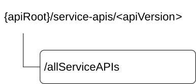

# 8.1 CAPIF_Discover_Service_API

## 8.1.1 API URI

The CAPIF_Discover_Service_API service shall use the CAPIF_Discover_Service_API.

The request URIs used in HTTP requests from the API invoker towards the CCF shall have the Resource URI structure defined in clause 7.5 with the following clarifications:

\- The \<apiName\> shall be "service-apis".

\- The \<apiVersion\> shall be "v1".

\- The \<apiSpecificSuffixes\> shall be set as described in clause 8.1.2.

All the resource URIs and the custom operation URIs specified in the clauses below are defined relative to the above API URI.

## 8.1.2 Resources

### 8.1.2.1 Overview

This clause describes the structure for the Resource URIs and the resources and methods used for the service.

Figure 8.1.2.1-1 depicts the resource URIs structure for the CAPIF_Discover_Service_API.

Figure 8.1.2.1-1: Resource URI structure of the CAPIF_Discover_Service_API

Table 8.1.2.1-1 provides an overview of the resources and applicable HTTP methods.

Table 8.1.2.1-1: Resources and methods overview

<table>
<colgroup>
<col style="width: 25%" />
<col style="width: 31%" />
<col style="width: 12%" />
<col style="width: 30%" />
</colgroup>
<thead>
<tr class="header">
<th>Resource name</th>
<th>Resource URI</th>
<th>HTTP method or custom operation</th>
<th>Description</th>
</tr>
</thead>
<tbody>
<tr class="odd">
<td>All published service APIs</td>
<td>
/allServiceAPIs

(NOTE)
</td>
<td>GET</td>
<td>Discover service APIs according to certain filter criteria.</td>
</tr>
<tr class="even">
<td colspan="4">NOTE: The path segment "allServiceAPIs" does not follow the related naming convention defined in clause 7.5.1. The path segment is however kept as currently defined in this specification for backward compatibility considerations.</td>
</tr>
</tbody>
</table>

### 8.1.2.2 Resource: All published service APIs

#### 8.1.2.2.1 Description

This resource represents the collection of published service APIs at the CCF.

This resource is modelled using the Store resource archetype (see Annex C.3 of 3GPP TS 29.501 \[18\]).

#### 8.1.2.2.2 Resource Definition

Resource URI: **{apiRoot}/service-apis/\<apiVersion\>/allServiceAPIs**

This resource shall support the resource URI variables defined in table 8.1.2.2.2-1.

Table 8.1.2.2.2-1: Resource URI variables for this resource

| Name    | Data Type | Definition      |
|---------|-----------|-----------------|
| apiRoot | string    | See clause 7.5. |

#### 8.1.2.2.3 Resource Standard Methods

##### 8.1.2.2.3.1 GET

The HTTP GET method enables to retrieve a list of APIs currently registered at the CCF and satisfying a number of filter criteria.

Table 8.1.2.2.3.1-1: URI query parameters supported by the GET method on this resource

<table>
<colgroup>
<col style="width: 15%" />
<col style="width: 19%" />
<col style="width: 5%" />
<col style="width: 11%" />
<col style="width: 36%" />
<col style="width: 11%" />
</colgroup>
<tbody>
<tr class="odd">
<td>Name</td>
<td>Data type</td>
<td>P</td>
<td>Cardinality</td>
<td>Description</td>
<td>Applicability</td>
</tr>
<tr class="even">
<td>api-invoker-id</td>
<td>string</td>
<td>M</td>
<td>1</td>
<td>It represents the identifier (assigned by the CCF) ofthe API invoker that is sending the request. It may also represent the identifier of the CCF that is sending the request if the request is sent over the CAPIF-6/6e reference point. (NOTE 1)</td>
<td></td>
</tr>
<tr class="odd">
<td>api-name</td>
<td>string</td>
<td>O</td>
<td>0..1</td>
<td>Contains the API name as {apiName} part of the URI structure as defined in clause 5.2.4 of 3GPP TS 29.122 [14].</td>
<td></td>
</tr>
<tr class="even">
<td>api-version</td>
<td>string</td>
<td>O</td>
<td>0..1</td>
<td>Contains the API major version conveyed in the URI (e.g. v1).</td>
<td></td>
</tr>
<tr class="odd">
<td>comm-type</td>
<td>CommunicationType</td>
<td>O</td>
<td>0..1</td>
<td>Communication type used by the API (e.g. REQUEST_RESPONSE).</td>
<td></td>
</tr>
<tr class="even">
<td>protocol</td>
<td>Protocol</td>
<td>O</td>
<td>0..1</td>
<td>Protocol used by the API.</td>
<td></td>
</tr>
<tr class="odd">
<td>aef-id</td>
<td>string</td>
<td>O</td>
<td>0..1</td>
<td>AEF identifier.</td>
<td></td>
</tr>
<tr class="even">
<td>data-format</td>
<td>DataFormat</td>
<td>O</td>
<td>0..1</td>
<td>Data format used by the API (e.g. serialization protocol JSON).</td>
<td></td>
</tr>
<tr class="odd">
<td>api-cat</td>
<td>string</td>
<td>O</td>
<td>0..1</td>
<td>The service API category to which the service API belongs.</td>
<td></td>
</tr>
<tr class="even">
<td>preferred-aef-loc</td>
<td>AefLocation</td>
<td>O</td>
<td>0..1</td>
<td>The preferred AEF location. If this parameter is present, the CCF shall try to discover a matched AEF location the service API supports. This parameter is ignored by the CCF if there is no matching record found.</td>
<td></td>
</tr>
<tr class="odd">
<td>req-api-prov-name</td>
<td>string</td>
<td>O</td>
<td>0..1</td>
<td>Represents the required API provider name.</td>
<td>RNAA</td>
</tr>
<tr class="even">
<td>api-supported-features</td>
<td>SupportedFeatures</td>
<td>C</td>
<td>0..1</td>
<td>Features supported by the discovered service API indicated by api-name parameter. This may only be present if the api-name query parameter is present.</td>
<td>ApiSupportedFeatureQuery</td>
</tr>
<tr class="odd">
<td>ue-ip-addr</td>
<td>IpAddrInfo</td>
<td>O</td>
<td>0..1</td>
<td>Represents the UE IP address information.</td>
<td>RNAA</td>
</tr>
<tr class="even">
<td>service-kpis</td>
<td>ServiceKpis</td>
<td>O</td>
<td>0..1</td>
<td>Contains information about service characteristics provided by the targeted service API(s).</td>
<td>EdgeApp_2</td>
</tr>
<tr class="odd">
<td>net-slice-info</td>
<td>array(NetSliceId)</td>
<td>O</td>
<td>1..N</td>
<td>Contains the identifier(s) of the network slice(s) within which the API shall be available.</td>
<td>SliceBasedAPIExposure</td>
</tr>
<tr class="even">
<td>grant-types</td>
<td>array(OAuthGrantType)</td>
<td>O</td>
<td>1..N</td>
<td>
Contains the OAuth grant types that need to be supported.

This query parameter may be present only in case of RNAA, as defined in clause 6.5.3 of TS 33.122 [16]. Otherwise, it is not applicable and shall not be present.
</td>
<td>RNAA</td>
</tr>
<tr class="odd">
<td>api-ids</td>
<td>array(string)</td>
<td>C</td>
<td>1..N</td>
<td>
Contains the identifier(s) of the targeted service APIs.

(NOTE 3)
</td>
<td>MultiStepDiscovery</td>
</tr>
<tr class="even">
<td>supported-features</td>
<td>SupportedFeatures</td>
<td>O</td>
<td>0..1</td>
<td>
Contains the list of supported features among the ones defined in clause 8.1.6.

This query parameter shall be present only when feature negotiation needs to take place.
</td>
<td></td>
</tr>
<tr class="odd">
<td>res-ops</td>
<td>array(ResOperInfo)</td>
<td>O</td>
<td>1..N</td>
<td>
Contains the list of supported API resource(s) and service operation(s).

This query parameter may only be present if the "api-name" query parameter is present.
</td>
<td>CAPIF_Ext1</td>
</tr>
<tr class="even">
<td colspan="6">
NOTE 1: This parameter is not part of the API filter criteria so that it is not used in matching APIs published in the CCF.

NOTE 2: In addition to the above standardized query parameters, the service consumer may also provide vendor-specific query parameter(s) as specified in clause 5.2.13.3 of 3GPP TS 29.122 [14]. The CCF shall use any received vendor-specific query parameters in the filtering process of the results to be returned in the response in a similar way and in addition to the standardized query parameters defined in this table. This capability may be signalled using the "VendSpecQueryParams" feature.

NOTE 3: When the "MultiStepDiscovery" feature is supported and this query parameter is present, then all the other query parameters in this table shall be absent except the "supported-features" and "api-invoker-id" query parameters.
</td>
</tr>
</tbody>
</table>

This method shall support the request data structures specified in table 8.1.2.2.3.1-2 and the response data structures and response codes specified in table 8.1.2.2.3.1-3.

Table 8.1.2.2.3.1-2: Data structures supported by the GET Request Body on this resource

|           |     |             |             |
|-----------|-----|-------------|-------------|
| Data type | P   | Cardinality | Description |
| n/a       |     |             |             |

Table 8.1.2.2.3.1-3: Data structures supported by the GET Response Body on this resource

<table>
<colgroup>
<col style="width: 16%" />
<col style="width: 9%" />
<col style="width: 14%" />
<col style="width: 19%" />
<col style="width: 39%" />
</colgroup>
<tbody>
<tr class="odd">
<td>Data type</td>
<td>P</td>
<td>Cardinality</td>
<td>
Response

codes
</td>
<td>Description</td>
</tr>
<tr class="even">
<td>DiscoveredAPIs</td>
<td>M</td>
<td>1</td>
<td>200 OK</td>
<td>The response body contains the result of the search over the list of registered APIs.</td>
</tr>
<tr class="odd">
<td>n/a</td>
<td></td>
<td></td>
<td>307 Temporary Redirect</td>
<td>
Temporary redirection.

The response shall include a Location header field containing an alternative target URI of the resource located in an alternative CCF.

Redirection handling is described in clause 5.2.10 of 3GPP TS 29.122 [14].
</td>
</tr>
<tr class="even">
<td>n/a</td>
<td></td>
<td></td>
<td>308 Permanent Redirect</td>
<td>
Permanent redirection.

The response shall include a Location header field containing an alternative target URI of the resource located in an alternative CCF.

Redirection handling is described in clause 5.2.10 of 3GPP TS 29.122 [14].
</td>
</tr>
<tr class="odd">
<td>ProblemDetails</td>
<td>O</td>
<td>0..1</td>
<td>414 URI Too Long</td>
<td>Indicates that the server refuses to process the request because the request-target is too long.</td>
</tr>
<tr class="even">
<td colspan="5">NOTE: The mandatory HTTP error status codes for the HTTP GET method listed in table 5.2.6-1 of 3GPP TS 29.122 [14] shall also apply.</td>
</tr>
</tbody>
</table>

Table 8.1.2.2.3.1-4: Headers supported by the 307 Response Code on this resource

|          |           |     |             |                                                                                   |
|----------|-----------|-----|-------------|-----------------------------------------------------------------------------------|
| Name     | Data type | P   | Cardinality | Description                                                                       |
| Location | string    | M   | 1           | Contains an alternative target URI of the resource located in an alternative CCF. |

Table 8.1.2.2.3.1-5: Headers supported by the 308 Response Code on this resource

|          |           |     |             |                                                                                   |
|----------|-----------|-----|-------------|-----------------------------------------------------------------------------------|
| Name     | Data type | P   | Cardinality | Description                                                                       |
| Location | string    | M   | 1           | Contains an alternative target URI of the resource located in an alternative CCF. |

#### 8.1.2.2.4 Resource Custom Operations

There are no resource custom operations defined for this resource in this release of the specification.

## 8.1.2A Custom Operations without associated resources

There are no custom operations without associated resources defined for this API in this release of the specification.

## 8.1.3 Notifications

There are no notifications defined for this API in this release of the specification.

## 8.1.4 Data Model

### 8.1.4.1 General

This clause specifies the application data model supported by the API. Data types listed in clause 7.2 also apply to this API.

Table 8.1.4.1-1 specifies the data types defined specifically for the CAPIF_Discover_Service_API.

Table 8.1.4.1-1: CAPIF_Discover_Service_API specific Data Types

<table>
<colgroup>
<col style="width: 14%" />
<col style="width: 17%" />
<col style="width: 54%" />
<col style="width: 13%" />
</colgroup>
<thead>
<tr class="header">
<th>Data type</th>
<th>Section defined</th>
<th>Description</th>
<th>Applicability</th>
</tr>
</thead>
<tbody>
<tr class="odd">
<td>DiscoveredAPIs</td>
<td>Clause 8.1.4.2.2</td>
<td>
Represents a list of APIs currently registered at the CCF

and satisfying a number of filter criteria provided by the service consumer.
</td>
<td></td>
</tr>
<tr class="even">
<td>IpAddrInfo</td>
<td>Clause 8.1.4.2.4</td>
<td>Represents the UE IP address information.</td>
<td>RNAA</td>
</tr>
<tr class="odd">
<td>ResOperInfo</td>
<td>Clause 8.1.4.2.5</td>
<td>Represents the resourse(s) and/or service operation(s).</td>
<td>CAPIF_Ext1</td>
</tr>
</tbody>
</table>

Table 8.1.4.1-2 specifies data types re-used by the CAPIF_Discover_Service_API from other specifications, including a reference to their respective specifications, and when needed, a short description of their use within the CAPIF_Discover_Service_API.

Table 8.1.4.1-2: Re-used Data Types

| Data type             | Reference             | Comments                                                                                                      | Applicability         |
|-----------------------|-----------------------|---------------------------------------------------------------------------------------------------------------|-----------------------|
| AefLocation           | Clause 8.2.4.2.10     | Used to indicate the AEF location.                                                                            |                       |
| CommunicationType     | Clause 8.2.4.3.5      | Used to indicate the communication type used by the API.                                                      |                       |
| DataFormat            | Clause 8.2.4.3.4      | Represents a data format, e.g., JSON.                                                                         |                       |
| Ipv4Addr              | 3GPP TS 29.122 \[14\] | Used to indicate an IPv4 address.                                                                             | RNAA                  |
| Ipv6Addr              | 3GPP TS 29.122 \[14\] | Used to indicate an IPv6 address.                                                                             | RNAA                  |
| NetSliceId            | 3GPP TS 29.435 \[31\] | Represents the identification information of a network slice.                                                 | SliceBasedAPIExposure |
| OAuthGrantType        | Clause 8.5.4.3.4      | Represents the OAuth grant type.                                                                              | RNAA                  |
| Operation             | Clause 8.2.4.3.7      | Indicates an HTTP method.                                                                                     | CAPIF_Ext1            |
| ProblemDetails        | 3GPP TS 29.122 \[14\] | Used to represent additional information and details on an error response.                                    |                       |
| Protocol              | Clause 8.2.4.3.3      | Represents a protocol and protocol version used by an API.                                                    |                       |
| ServiceAPIDescription | Clause 8.2.4.2.2      | Represents the description of the service API.                                                                |                       |
| ServiceKpis           | Clause 8.2.4.2.13     | Represents information about the service characteristics provided by a service API.                           | EdgeApp_2             |
| SupportedFeatures     | 3GPP TS 29.571 \[19\] | Represents the list of supported feature(s) and used to negotiate the applicability of the optional features. |                       |
| Uri                   | 3GPP TS 29.122 \[14\] | Represents a URI.                                                                                             |                       |

### 8.1.4.2 Structured data types

#### 8.1.4.2.1 Introduction

This clause defines the structured data types to be used in resource representations of the CAPIF_Discover_Service_API.

#### 8.1.4.2.2 Type: DiscoveredAPIs

Table 8.1.4.2.2-1: Definition of type DiscoveredAPIs

<table>
<colgroup>
<col style="width: 0%" />
<col style="width: 17%" />
<col style="width: 0%" />
<col style="width: 16%" />
<col style="width: 4%" />
<col style="width: 11%" />
<col style="width: 36%" />
<col style="width: 13%" />
</colgroup>
<thead>
<tr class="header">
<th colspan="3">Attribute name</th>
<th>Data type</th>
<th>P</th>
<th>Cardinality</th>
<th>Description</th>
<th>Applicability</th>
</tr>
</thead>
<tbody>
<tr class="odd">
<td colspan="3">serviceAPIDescriptions</td>
<td>array(ServiceAPIDescription)</td>
<td>O</td>
<td>1..N</td>
<td>
Description of the service API as published by the service.

(NOTE 1, NOTE 2)
</td>
<td></td>
</tr>
<tr class="even">
<td colspan="2">suppFeat</td>
<td colspan="2">SupportedFeatures</td>
<td>C</td>
<td>0..1</td>
<td>
Contains the list of supported features among the ones defined in clause 8.1.6.

This attribute shall be present only when feature negotiation needs to take place.

(NOTE 1)
</td>
<td></td>
</tr>
<tr class="odd">
<td colspan="7">
NOTE 1: When used in this data type and within the CAPIF_Discover_Service_API, the "suppFeat" attribute is not present and feature negotiation needs to take place, the "supportedFeatures" attribute within each array element of the "serviceAPIDescriptions" attribute shall be set to the same value and include the supported feature(s) (among the ones defined in clause 8.1.6) applicable for the operation defined in clause 8.1.2.2.3.1.

NOTE 2: When the "MultiStepDiscovery" feature is supported and the "api-ids" query parameter is present in the corresponding API discovery request, then each array element of this attribute shall contain the "aefProfiles" attribute, and the "aefProfiles" attribute shall in turn contain the "interfaceDescriptions" attribute, in order to return the full interface description information of the targeted APIs.
</td>
<td></td>
</tr>
</tbody>
</table>

#### 8.1.4.2.3 Void

#### 8.1.4.2.4 Type: IpAddrInfo

Table 8.1.4.2.4-1: Definition of type IpAddrInfo

<table>
<colgroup>
<col style="width: 14%" />
<col style="width: 10%" />
<col style="width: 4%" />
<col style="width: 11%" />
<col style="width: 42%" />
<col style="width: 16%" />
</colgroup>
<thead>
<tr class="header">
<th>Attribute name</th>
<th>Data type</th>
<th>P</th>
<th>Cardinality</th>
<th>Description</th>
<th>Applicability</th>
</tr>
</thead>
<tbody>
<tr class="odd">
<td>ipv4Addr</td>
<td>Ipv4Addr</td>
<td>C</td>
<td>0..1</td>
<td>
Contains the IPv4 address of the UE.

(NOTE)
</td>
<td></td>
</tr>
<tr class="even">
<td>ipv6Addr</td>
<td>Ipv6Addr</td>
<td>C</td>
<td>0..1</td>
<td>
Contains the IPv6 address of the UE.

(NOTE)
</td>
<td></td>
</tr>
<tr class="odd">
<td colspan="6">NOTE: These attributes are mutually exclusive. Either one of them shall be present.</td>
</tr>
</tbody>
</table>

#### 8.1.4.2.5 Type: ResOperInfo

Table 8.1.4.2.5-1: Definition of type ResOperInfo

<table>
<colgroup>
<col style="width: 14%" />
<col style="width: 10%" />
<col style="width: 4%" />
<col style="width: 11%" />
<col style="width: 42%" />
<col style="width: 16%" />
</colgroup>
<thead>
<tr class="header">
<th>Attribute name</th>
<th>Data type</th>
<th>P</th>
<th>Cardinality</th>
<th>Description</th>
<th>Applicability</th>
</tr>
</thead>
<tbody>
<tr class="odd">
<td>resource</td>
<td>Uri</td>
<td>C</td>
<td>0..1</td>
<td>
Represents the resource in the form of the resource relative URI path after the API URI as defined in clause 5.2.4 of 3GPP TS 29.122 [14].

This attribute shall not be present for custom operations without associated resource, i.e., custom operations defined directly on the API URI.
</td>
<td></td>
</tr>
<tr class="even">
<td>operations</td>
<td>array(Operation)</td>
<td>O</td>
<td>1..N</td>
<td>
Represents the API service operation (i.e., HTTP method) supported on the resource provided within the "path" attribute.

This attribute may be present only if the "resource" attribute is also present.
</td>
<td></td>
</tr>
<tr class="odd">
<td>customServOpers</td>
<td>array(string)</td>
<td>C</td>
<td>1..N</td>
<td>
Represents the name(s) of the custom service operation(s) supported either on the resource provided within the "path" attribute or on the API URI.

This attribute shall be present for custom operations without associated resources.
</td>
<td></td>
</tr>
</tbody>
</table>

### 8.1.4.3 Simple data types and enumerations

#### 8.1.4.3.1 Introduction

This clause defines simple data types and enumerations that can be referenced from data structures defined in the previous clauses.

#### 8.1.4.3.2 Simple data types

The simple data types defined in table 8.1.4.3.2-1 shall be supported.

Table 8.1.4.3.2-1: Simple data types

|           |                 |             |               |
|-----------|-----------------|-------------|---------------|
| Type Name | Type Definition | Description | Applicability |
|           |                 |             |               |

### 8.1.4.4 Data types describing alternative data types or combinations of data types

There are no data types describing alternative data types or combinations of data types defined for this API in this release of the specification.

## 8.1.5 Error Handling

### 8.1.5.1 General

HTTP error handling shall be supported as specified in clause 7.7.

In addition, the requirements in the following clauses shall apply.

### 8.1.5.2 Protocol Errors

In this Release of the specification, there are no additional protocol errors applicable for the CAPIF_Discover_Service_API.

### 8.1.5.3 Application Errors

The application errors defined for the CAPIF_Discover_Service_API are listed in table 8.1.5.3-1.

Table 8.1.5.3-1: Application errors

| Application Error | HTTP status code | Description | Applicability |
|-------------------|------------------|-------------|---------------|
|                   |                  |             |               |

## 8.1.6 Feature negotiation

The optional features in table 8.1.6-1 are defined for the the CAPIF_Discover_Service_API. General feature negotiation procedures are defined in clause 7.8.

Table 8.1.6-1: Supported Features

<table>
<colgroup>
<col style="width: 15%" />
<col style="width: 24%" />
<col style="width: 59%" />
</colgroup>
<thead>
<tr class="header">
<th>Feature number</th>
<th>Feature Name</th>
<th>Description</th>
</tr>
</thead>
<tbody>
<tr class="odd">
<td>1</td>
<td>ApiSupportedFeatureQuery</td>
<td>Indicates the support of the query filter indicating the supported feature(s) of a service API.</td>
</tr>
<tr class="even">
<td>2</td>
<td>VendSpecQueryParams</td>
<td>Indicates the support of vendor specific API discovery query filter parameters.</td>
</tr>
<tr class="odd">
<td>3</td>
<td>RNAA</td>
<td>
Indicates the support of the RNAA functionality.

This feature enables the following functionalities:

- Provisioning the API provider name and the related filtering criteria enhancement.

- Provisioning the UE IP address information and the related filtering criteria enhancement.

- Support service API discovery based on the supported OAuth grant types for RNAA.
</td>
</tr>
<tr class="even">
<td>4</td>
<td>SliceBasedAPIExposure</td>
<td>
Indicates the support of the network slice-based API exposure functionality.

Within this feature, the following enhancements are covered:

- Support service API discovery based on the supported network slice.
</td>
</tr>
<tr class="odd">
<td>5</td>
<td>CAPIF_Ext1</td>
<td>
Indicates the support of the enhancements for CAPIF functionality.

Within this feature, the following enhancements are covered:

- Support of the service API discovery based on the supported service operations and resources.
</td>
</tr>
<tr class="even">
<td>6</td>
<td>MultiStepDiscovery</td>
<td>
Indicates the support of the enhancements to this API in Rel-19.

This feature enables the following functionalities:

- Support API discovery based on the identifier(s) of the targeted service API(s).
</td>
</tr>
</tbody>
</table>
