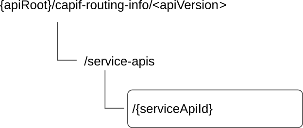

# 8.10 CAPIF_Routing_Info_API

## 8.10.1 API URI

The CAPIF_Routing_Info_API service shall use the CAPIF_Routing_Info_API.

The request URIs used in HTTP requests from the API exposing function towards the CAPIF core function shall have the Resource URI structure as defined in clause 7.5 with the following clarifications:

\- The \<apiName\> shall be "capif-routing-info".

\- The \<apiVersion\> shall be "v1".

\- The \<apiSpecificSuffixes\> shall be set as described in clause 8.10.2.

All the resource URIs and the custom operation URIs specified in the clauses below are defined relative to the above API URI.

## 8.10.2 Resources

### 8.10.2.1 Overview

This clause describes the structure for the Resource URIs and the resources and methods used for the service.

Figure 8.10.2.1-1 depicts the resource URIs structure for the CAPIF_Routing_Info_API.

Figure 8.10.2.1-1: Resource URI structure of the CAPIF_Routing_Info_API

Table 8.10.2.1-1 provides an overview of the resources and applicable HTTP methods.

Table 8.10.2.1-1: Resources and methods overview

| Resource name                       | Resource URI                 | HTTP method or custom operation | Description                                                                                                                    |
|-------------------------------------|------------------------------|---------------------------------|--------------------------------------------------------------------------------------------------------------------------------|
| Individual Service API routing info | /service-apis/{serviceApiId} | GET                             | Retrieves the API routing information for a published service API and API exposing function which applies the topology hiding. |

### 8.10.2.2 Resource: Individual Service API routing info

#### 8.10.2.2.1 Description

The API Routing Information resource represents the API routing information for the service API per API Exposing Function.

#### 8.10.2.2.2 Resource Definition

Resource URI: **{apiRoot}/capif-routing-info/\<apiVersion\>/service-apis/{serviceApiId}**

This resource shall support the resource URI variables defined in table 8.10.2.2.2-1.

Table 8.10.2.2.2-1: Resource URI variables for this resource

| Name         | Data type | Definition                                     |
|--------------|-----------|------------------------------------------------|
| apiRoot      | string    | See clause 7.5                                 |
| serviceApiId | string    | Identifies an individual published service API |

#### 8.10.2.2.3 Resource Standard Methods

##### 8.10.2.2.3.1 GET

This method shall support the URI query parameters specified in table 8.10.2.2.3.1-1.

Table 8.10.2.2.3.1-1: URI query parameters supported by the GET method on this resource

<table>
<colgroup>
<col style="width: 9%" />
<col style="width: 17%" />
<col style="width: 2%" />
<col style="width: 11%" />
<col style="width: 43%" />
<col style="width: 15%" />
</colgroup>
<thead>
<tr class="header">
<th>Name</th>
<th>Data type</th>
<th>P</th>
<th>Cardinality</th>
<th>Description</th>
<th>Applicability</th>
</tr>
</thead>
<tbody>
<tr class="odd">
<td>aef-id</td>
<td>string</td>
<td>M</td>
<td>1</td>
<td>AEF identifier</td>
<td></td>
</tr>
<tr class="even">
<td>supp-feat</td>
<td>SupportedFeatures</td>
<td>C</td>
<td>0..1</td>
<td>
Contains the list of supported feature(s) among the ones defined in in clause 8.10.6.

This query parameter shall be present only when feature negotiation needs to take place.
</td>
<td></td>
</tr>
</tbody>
</table>

This method shall support the request data structures specified in table 8.10.2.2.3.1-2 and the response data structures and response codes specified in table 8.10.2.2.3.1-3.

Table 8.10.2.2.3.1-2: Data structures supported by the GET Request Body on this resource

| Data type | P   | Cardinality | Description |
|-----------|-----|-------------|-------------|
| n/a       |     |             |             |

Table 8.10.2.2.3.1-3: Data structures supported by the GET Response Body on this resource

<table>
<colgroup>
<col style="width: 28%" />
<col style="width: 3%" />
<col style="width: 11%" />
<col style="width: 10%" />
<col style="width: 46%" />
</colgroup>
<thead>
<tr class="header">
<th>Data type</th>
<th>P</th>
<th>Cardinality</th>
<th>
Response

Codes
</th>
<th>Description</th>
</tr>
</thead>
<tbody>
<tr class="odd">
<td>RoutingInfo</td>
<td>M</td>
<td>1</td>
<td>200 OK</td>
<td>The Routing information applicable for the service API requested.</td>
</tr>
<tr class="even">
<td>n/a</td>
<td></td>
<td></td>
<td>307 Temporary Redirect</td>
<td>
Temporary redirection, during resource retrieval. The response shall include a Location header field containing an alternative URI of the resource located in an alternative CAPIF core function.

Redirection handling is described in clause 5.2.10 of 3GPP TS 29.122 [14].
</td>
</tr>
<tr class="odd">
<td>n/a</td>
<td></td>
<td></td>
<td>308 Permanent Redirect</td>
<td>
Permanent redirection, during resource retrieval. The response shall include a Location header field containing an alternative URI of the resource located in an alternative CAPIF core function.

Redirection handling is described in clause 5.2.10 of 3GPP TS 29.122 [14].
</td>
</tr>
<tr class="even">
<td>ProblemDetails</td>
<td>O</td>
<td>0..1</td>
<td>414 URI Too Long</td>
<td>Indicates that the server refuses to process the request because the request-target is too long.</td>
</tr>
<tr class="odd">
<td colspan="5">NOTE: The mandatory HTTP error status codes for the GET method listed in table 5.2.6-1 of 3GPP TS 29.122 [14] also apply.</td>
</tr>
</tbody>
</table>

Table 8.10.2.2.3.1-4: Headers supported by the 307 Response Code on this resource

|          |           |     |             |                                                                                   |
|----------|-----------|-----|-------------|-----------------------------------------------------------------------------------|
| Name     | Data type | P   | Cardinality | Description                                                                       |
| Location | string    | M   | 1           | An alternative URI of the resource located in an alternative CAPIF core function. |

Table 8.10.2.2.3.1-5: Headers supported by the 308 Response Code on this resource

|          |           |     |             |                                                                                   |
|----------|-----------|-----|-------------|-----------------------------------------------------------------------------------|
| Name     | Data type | P   | Cardinality | Description                                                                       |
| Location | string    | M   | 1           | An alternative URI of the resource located in an alternative CAPIF core function. |

#### 8.10.2.2.4 Resource Custom Operations

None.

## 8.10.2A Custom Operations without associated resources

There are no custom operations without associated resources defined for this API in this release of the specification.

## 8.10.3 Notifications

There are no notifications defined for this API in this release of the specification.

## 8.10.4 Data Model

### 8.10.4.1 General

This clause specifies the application data model supported by the API. Data types listed in clause 7.2 also apply to this API.

Table 8.10.4.1-1 specifies the data types defined specifically for the CAPIF_Routing_Info_API service.

Table 8.10.4.1-1: CAPIF_Routing_Info_API specific Data Types

| Data type        | Section defined   | Description                         | Applicability |
|------------------|-------------------|-------------------------------------|---------------|
| Ipv6AddressRange | Clause 8.10.4.2.4 | Represents IPv6 address range.      |               |
| RoutingInfo      | Clause 8.10.4.2.2 | Represents API routing information. |               |
| RoutingRule      | Clause 8.10.4.2.3 | Represents API routing rule.        |               |

Table 8.10.4.1-2 specifies data types re-used by the CAPIF_Routing_Info_API service.

Table 8.10.4.1-2: Re-used Data Types

| Data type         | Reference             | Comments                                                                            | Applicability |
|-------------------|-----------------------|-------------------------------------------------------------------------------------|---------------|
| AefProfile        | Clause 8.2.4.2.4      | Used to indicate the AEF profile.                                                   |               |
| Ipv4AddressRange  | 3GPP TS 29.510 \[28\] | Used to indicate the IPv4 address range.                                            |               |
| Ipv6Addr          | 3GPP TS 29.122 \[14\] | Used to indicate the IPv6 address.                                                  |               |
| ProblemDetails    | 3GPP TS 29.122 \[14\] | Used to represent error related information.                                        |               |
| SupportedFeatures | 3GPP TS 29.571 \[19\] | Used to negotiate the applicability of optional features defined in table 8.10.6-1. |               |

### 8.10.4.2 Structured data types

#### 8.10.4.2.1 Introduction

This clause defines data structures to be used in resource representations.

#### 8.10.4.2.2 Type: RoutingInfo

Table 8.10.4.2.2-1: Definition of type RoutingInfo

| Attribute name | Data type          | P   | Cardinality | Description   | Applicability |
|----------------|--------------------|-----|-------------|---------------|---------------|
| routingRules   | array(RoutingRule) | M   | 1..N        | Routing rules |               |

#### 8.10.4.2.3 Type: RoutingRule

Table 8.10.4.2.3-1: Definition of type RoutingRule

| Attribute name                                                                                                                            | Data type               | P   | Cardinality | Description                                                             | Applicability |
|-------------------------------------------------------------------------------------------------------------------------------------------|-------------------------|-----|-------------|-------------------------------------------------------------------------|---------------|
| ipv4AddrRanges                                                                                                                            | array(Ipv4AddressRange) | O   | 1..N        | The IPv4 address range for the API invocation source IP address. (NOTE) |               |
| ipv6AddrRanges                                                                                                                            | array(Ipv6AddressRange) | O   | 1..N        | The IPv6 address range for the API invocation source IP address. (NOTE) |               |
| aefProfile                                                                                                                                | AefProfile              | M   | 1           | The target AEF profile                                                  |               |
| NOTE: If no IP address range is provided, it means the service API invocation from any source IP address can be routed to the target AEF. |                         |     |             |                                                                         |               |

#### 8.10.4.2.4 Type: Ipv6AddressRange

Table 8.10.4.2.4-1: Definition of type Ipv6AddressRange

| Attribute name | Data type | P   | Cardinality | Description                                                | Applicability |
|----------------|-----------|-----|-------------|------------------------------------------------------------|---------------|
| start          | Ipv6Addr  | M   | 1           | First value identifying the start of an IPv6 address range |               |
| end            | Ipv6Addr  | M   | 1           | Last value identifying the end of an IPv6 address range    |               |

### 8.10.4.3 Simple data types and enumerations

None.

## 8.10.5 Error Handling

### 8.10.5.1 General

HTTP error handling shall be supported as specified in clause 7.7.

In addition, the requirements in the following clauses shall apply.

### 8.10.5.2 Protocol Errors

In this Release of the specification, there are no additional protocol errors applicable for the CAPIF_Routing_Info_API.

### 8.10.5.3 Application Errors

The application errors defined for the CAPIF_Routing_Info_API are listed in table 8.10.5.3-1.

Table 8.10.5.3-1: Application errors

| Application Error | HTTP status code | Description | Applicability |
|-------------------|------------------|-------------|---------------|
|                   |                  |             |               |

## 8.10.6 Feature negotiation

General feature negotiation procedures are defined in clause 7.8.

Table 8.10.6-1: Supported Features

| Feature number | Feature Name | Description |
|----------------|--------------|-------------|
| n/a            |              |             |
|                |              |             |
