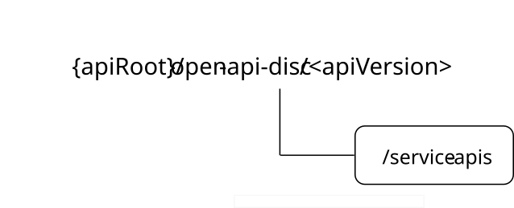

# 8.11 CAPIF_Open_Discover_Service_API

## 8.11.1 Introduction

The CAPIF_Open_Discover_Service_API service shall use the CAPIF_Open_Discover_Service_API.

**{apiRoot}/\<apiName\>/\<apiVersion\>**

The request URIs used in HTTP requests shall have the Resource URI structure defined in clause 7.5, i.e.:

**{apiRoot}/\<apiName\>/\<apiVersion\>/\<apiSpecificSuffixes\>**

with the following components:

\- The {apiRoot} shall be set as described in clause 7.5.

\- The \<apiName\> shall be "open-api-disc".

\- The \<apiVersion\> shall be "v1".

\- The \<apiSpecificSuffixes\> shall be set as described in clause 8.11.2 and 8.11.3.

All the resource URIs and the custom operation URIs specified in the clauses below are defined relative to the above API URI.

## 8.11.1A Usage of HTTP

The provisions of clause 7.3 of 3GPP TS 29.549 \[15\] shall apply for the CAPIF_Open_Discover_Service_API.

## 8.11.2 Resources

### 8.11.2.1 Overview

This clause describes the structure for the Resource URIs and the resources and methods used for the service.

Figure 8.11.2.1-1 depicts the resource URIs structure for the CAPIF_Open_Discover_Service_API.

Figure 8.11.2.1-1: Resource URI structure of the CAPIF_Open_Discover_Service_API

Table 8.11.2.1-1 provides an overview of the resources and applicable HTTP methods for the CAPIF_Open_Discover_Service_API.

Table 8.11.2.1-1: Resources and methods overview

| Resource name | Resource URI  | HTTP method or custom operation | Description                                                                            |
|---------------|---------------|---------------------------------|----------------------------------------------------------------------------------------|
| Service APIs  | /service-apis | GET                             | Request open discovery of the Service API(s) according to a set of filtering criteria. |

### 8.11.2.2 Resource: Service APIs

#### 8.11.2.2.1 Description

This resource represents the collection of Service API(s) managed by the CCF.

This resource is modelled using the Store resource archetype (see Annex C.3 of 3GPP TS 29.501 \[18\]).

#### 8.11.2.2.2 Resource Definition

Resource URI: **{apiRoot}/open-api-disc/\<apiVersion\>/service-apis**

This resource shall support the resource URI variables defined in table 8.11.2.2.2-1.

Table 8.11.2.2.2-1: Resource URI variables for this resource

| Name    | Data Type | Definition         |
|---------|-----------|--------------------|
| apiRoot | string    | See clause 8.11.1. |

#### 8.11.2.2.3 Resource Standard Methods

##### 8.11.2.2.3.1 GET

The HTTP GET method enables to request open discovery of the Service API(s) currently registered at the CCF.

Table 8.11.2.2.3.1-1: URI query parameters supported by the GET method on this resource

<table>
<colgroup>
<col style="width: 15%" />
<col style="width: 15%" />
<col style="width: 4%" />
<col style="width: 12%" />
<col style="width: 37%" />
<col style="width: 14%" />
</colgroup>
<tbody>
<tr class="odd">
<td>Name</td>
<td>Data type</td>
<td>P</td>
<td>Cardinality</td>
<td>Description</td>
<td>Applicability</td>
</tr>
<tr class="even">
<td>api-names</td>
<td>array(string)</td>
<td>O</td>
<td>1..N</td>
<td>
Contains the name(s) of the target Service API(s).

Each Service API name shall be set to the value of the "&lt;apiName&gt;" placeholder of the target Service API URI structure as defined in clause 5.2.4 of 3GPP TS 29.122 [14].
</td>
<td></td>
</tr>
<tr class="odd">
<td>api-versions</td>
<td>map(array(string))</td>
<td>O</td>
<td>1..N(1..M)</td>
<td>
Contains the major version(s) (e.g., v1) of the target Service API(s).

Each Service API version shall be set to the value of the "&lt;apiVersion&gt;" placeholder of the target Service API URI structure as defined in clause 5.2.4 of 3GPP TS 29.122 [14].

The key of the map shall be set to the value of the Service API name (i.e., the value of the "&lt;apiName&gt;" placeholder of the Service API URI structure as defined in clause 5.2.4 of 3GPP TS 29.122 [14]) of the Service API to which the provided list of Service API version(s) provided within the map value applies.
</td>
<td></td>
</tr>
<tr class="even">
<td>comm-type</td>
<td>CommunicationType</td>
<td>O</td>
<td>0..1</td>
<td>Contains the communication type supported by the target Service API(s).</td>
<td></td>
</tr>
<tr class="odd">
<td>protocols</td>
<td>array(Protocol)</td>
<td>O</td>
<td>1..N</td>
<td>Contains the protocol(s) supported by the target Service API(s).</td>
<td></td>
</tr>
<tr class="even">
<td>data-format</td>
<td>DataFormat</td>
<td>O</td>
<td>0..1</td>
<td>Contains data format supported by the target Service API(s).</td>
<td></td>
</tr>
<tr class="odd">
<td>api-cats</td>
<td>array(string)</td>
<td>O</td>
<td>1..N</td>
<td>Contains the category(ies) of the target Service API(s).</td>
<td></td>
</tr>
<tr class="even">
<td>preferred-aef-loc</td>
<td>AefLocation</td>
<td>O</td>
<td>0..1</td>
<td>
Contains the preferred location information for AEF(s) exposing the target Service API(s).

This query parameter is ignored by the CCF if there are no matching records at the CCF.
</td>
<td></td>
</tr>
<tr class="odd">
<td>api-prov-names</td>
<td>array(string)</td>
<td>O</td>
<td>1..N</td>
<td>Contains the name(s) of the provider(s) of the target Service API(s).</td>
<td></td>
</tr>
<tr class="even">
<td>api-supported-features</td>
<td>map(SupportedFeatures)</td>
<td>O</td>
<td>1..N</td>
<td>
Contains the list of the feature(s) supported by the target Service API(s) identified by the "api-names" query parameter.

This query parameter may be present only if the "api-name" query parameter is also present.

The key of the map shall be set to the value of the Service API name (among the ones provided within the "api-names" query parameter) of the Service API to which the provided list of supported feature(s) provided within the map value applies.
</td>
<td></td>
</tr>
<tr class="odd">
<td>service-kpis</td>
<td>ServiceKpis</td>
<td>O</td>
<td>0..1</td>
<td>Contains information about the service characteristics provided by the target Service API(s).</td>
<td></td>
</tr>
<tr class="even">
<td>api-ids</td>
<td>array(string)</td>
<td>O</td>
<td>1..N</td>
<td>Contains the identifier(s) of the target Service APIs.</td>
<td></td>
</tr>
<tr class="odd">
<td>res-ops</td>
<td>array(ResOperInfo)</td>
<td>O</td>
<td>1..N</td>
<td>
Contains the list of supported Service API resource(s) and service operation(s).

This query parameter may be present only if the "api-names" query parameter is present.
</td>
<td></td>
</tr>
<tr class="even">
<td>supported-features</td>
<td>SupportedFeatures</td>
<td>O</td>
<td>0..1</td>
<td>
Contains the list of supported features among the ones defined in clause 8.11.6.

This query parameter shall be present only when feature negotiation is required.
</td>
<td></td>
</tr>
<tr class="odd">
<td colspan="6">NOTE: In addition to the above standardized query parameters, the service consumer may also provide vendor-specific query parameter(s) as specified in clause 5.2.13.3 of 3GPP TS 29.122 [14]. The CCF shall use any received vendor-specific query parameters in the filtering process of the results to be returned in the response in a similar way and in addition to the standardized query parameters defined in this table.</td>
</tr>
</tbody>
</table>

This method shall support the request data structures specified in table 8.11.2.2.3.1-2 and the response data structures and response codes specified in table 8.11.2.2.3.1-3.

Table 8.11.2.2.3.1-2: Data structures supported by the GET Request Body on this resource

|           |     |             |             |
|-----------|-----|-------------|-------------|
| Data type | P   | Cardinality | Description |
| n/a       |     |             |             |

Table 8.11.2.2.3.1-3: Data structures supported by the GET Response Body on this resource

<table>
<colgroup>
<col style="width: 16%" />
<col style="width: 9%" />
<col style="width: 14%" />
<col style="width: 19%" />
<col style="width: 39%" />
</colgroup>
<tbody>
<tr class="odd">
<td>Data type</td>
<td>P</td>
<td>Cardinality</td>
<td>
Response

codes
</td>
<td>Description</td>
</tr>
<tr class="even">
<td>OpenDiscoveryResp</td>
<td>M</td>
<td>1</td>
<td>200 OK</td>
<td>Successful case. The result of the requested Open Service APIs discovery is returned.</td>
</tr>
<tr class="odd">
<td>n/a</td>
<td></td>
<td></td>
<td>307 Temporary Redirect</td>
<td>
Temporary redirection.

The response shall include a Location header field containing an alternative target URI of the resource located in an alternative CCF.

Redirection handling is described in clause 5.2.10 of 3GPP TS 29.122 [14].
</td>
</tr>
<tr class="even">
<td>n/a</td>
<td></td>
<td></td>
<td>308 Permanent Redirect</td>
<td>
Permanent redirection.

The response shall include a Location header field containing an alternative target URI of the resource located in an alternative CCF.

Redirection handling is described in clause 5.2.10 of 3GPP TS 29.122 [14].
</td>
</tr>
<tr class="odd">
<td>ProblemDetails</td>
<td>O</td>
<td>0..1</td>
<td>414 URI Too Long</td>
<td>Indicates that the server refuses to process the request because the request target is too long.</td>
</tr>
<tr class="even">
<td colspan="5">NOTE: The mandatory HTTP error status codes for the HTTP GET method listed in table 5.2.6-1 of 3GPP TS 29.122 [14] shall also apply.</td>
</tr>
</tbody>
</table>

Table 8.11.2.2.3.1-4: Headers supported by the 307 Response Code on this resource

|          |           |     |             |                                                                                   |
|----------|-----------|-----|-------------|-----------------------------------------------------------------------------------|
| Name     | Data type | P   | Cardinality | Description                                                                       |
| Location | string    | M   | 1           | Contains an alternative target URI of the resource located in an alternative CCF. |

Table 8.11.2.2.3.1-5: Headers supported by the 308 Response Code on this resource

|          |           |     |             |                                                                                   |
|----------|-----------|-----|-------------|-----------------------------------------------------------------------------------|
| Name     | Data type | P   | Cardinality | Description                                                                       |
| Location | string    | M   | 1           | Contains an alternative target URI of the resource located in an alternative CCF. |

#### 8.11.2.2.4 Resource Custom Operations

There are no resource custom operations defined for this resource in this release of the specification.

## 8.11.3 Custom Operations without associated resources

There are no custom operations without associated resources defined for this API in this release of the specification.

## 8.11.4 Notifications

There are no notifications defined for this API in this release of the specification.

## 8.11.5 Data Model

### 8.11.5.1 General

This clause specifies the application data model supported by the API.

Table 8.11.5.1-1 specifies the data types defined specifically for the CAPIF_Open_Discover_Service_API.

Table 8.11.5.1-1: CAPIF_Open_Discover_Service_API specific Data Types

| Data type         | Section defined | Description                                                                                | Applicability |
|-------------------|-----------------|--------------------------------------------------------------------------------------------|---------------|
| OpenAefProfile    | 8.11.5.2.4      | Represents the AEF Profile details provided within an Open Service API Discovery response. |               |
| OpenAPIDetails    | 8.11.5.2.3      | Represents the Service API details provided within an Open Service API Discovery response. |               |
| OpenDiscoveryResp | 8.11.5.2.2      | Represents the Open Service API Discovery response.                                        |               |

Table 8.11.5.1-2 specifies data types re-used by the CAPIF_Open_Discover_Service_API from other specifications, including a reference to their respective specifications, and when needed, a short description of their use within the CAPIF_Open_Discover_Service_API.

Table 8.11.5.1-2: Re-used Data Types

| Data type         | Reference             | Comments                                                                                                      | Applicability |
|-------------------|-----------------------|---------------------------------------------------------------------------------------------------------------|---------------|
| AefLocation       | Clause 8.2.4.2.10     | Represents the AEF location.                                                                                  |               |
| ApiStatus         | Clause 8.2.4.2.12     | Represents the Service API status.                                                                            |               |
| CommunicationType | Clause 8.2.4.3.5      | Represents the communication type used by the Service API.                                                    |               |
| DataFormat        | Clause 8.2.4.3.4      | Represents a data format or data serialization protocol.                                                      |               |
| ProblemDetails    | 3GPP TS 29.122 \[14\] | Used to represent additional information and details on an error response.                                    |               |
| Protocol          | Clause 8.2.4.3.3      | Represents a protocol.                                                                                        |               |
| ResOperInfo       | Clause 8.1.4.2.5      | Represents the resourse(s) and/or service operation(s).                                                       |               |
| ServiceKpis       | Clause 8.2.4.2.13     | Represents information about the service characteristics provided by a service API.                           |               |
| SupportedFeatures | 3GPP TS 29.571 \[19\] | Represents the list of supported feature(s) and used to negotiate the applicability of the optional features. |               |
| Version           | Clause 8.2.4.2.5      | Represents an API version.                                                                                    |               |

### 8.11.5.2 Structured data types

#### 8.11.5.2.1 Introduction

This clause defines the structured data types to be used in resource representations.

#### 8.11.5.2.2 Type: OpenDiscoveryResp

Table 8.11.5.2.2-1: Definition of type OpenDiscoveryResp

<table>
<colgroup>
<col style="width: 17%" />
<col style="width: 0%" />
<col style="width: 16%" />
<col style="width: 4%" />
<col style="width: 11%" />
<col style="width: 36%" />
<col style="width: 13%" />
</colgroup>
<thead>
<tr class="header">
<th colspan="2">Attribute name</th>
<th>Data type</th>
<th>P</th>
<th>Cardinality</th>
<th>Description</th>
<th>Applicability</th>
</tr>
</thead>
<tbody>
<tr class="odd">
<td colspan="2">discApis</td>
<td>array(OpenAPIDetails)</td>
<td>M</td>
<td>0..N</td>
<td>
Contains the details of the discovered Service API(s).

If there are no Service API matching the provided query parameters, an empty array shall be provided within this attribute.
</td>
<td></td>
</tr>
<tr class="even">
<td>suppFeat</td>
<td colspan="2">SupportedFeatures</td>
<td>C</td>
<td>0..1</td>
<td>
Contains the list of supported features among the ones defined in clause 8.11.6.

This attribute shall be present only when feature negotiation is required.
</td>
<td></td>
</tr>
</tbody>
</table>

#### 8.11.5.2.3 Type: OpenAPIDetails

Table 8.11.5.2.3-1: Definition of type OpenAPIDetails

| Attribute name     | Data type             | P   | Cardinality | Description                                                                                                                                                           | Applicability |
|--------------------|-----------------------|-----|-------------|-----------------------------------------------------------------------------------------------------------------------------------------------------------------------|---------------|
| apiName            | string                | M   | 1           | Contains the Service API name set to the value of the "\<apiName\>" placeholder of the Service API URI structure as defined in clause 5.2.4 of 3GPP TS 29.122 \[14\]. |               |
| apiId              | string                | O   | 0..1        | Contains the Service API identifier.                                                                                                                                  |               |
| apiStatus          | ApiStatus             | O   | 0..1        | Indicates the Service API status.                                                                                                                                     |               |
| description        | string                | O   | 0..1        | Contains a textual description of the Service API.                                                                                                                    |               |
| serviceAPICategory | string                | O   | 0..1        | Contains the Service API category.                                                                                                                                    |               |
| apiSuppFeats       | SupportedFeatures     | O   | 0..1        | Contains the list of the features supported by the Service API.                                                                                                       |               |
| apiProvName        | string                | O   | 0..1        | Contains the Service API provider name.                                                                                                                               |               |
| aefProfiles        | array(OpenAefProfile) | O   | 1..N        | Contains the AEF profile related information.                                                                                                                         |               |

#### 8.11.5.2.4 Type: OpenAefProfile

Table 8.11.5.2.4-1: Definition of type OpenAefProfile

| Attribute name                                                                                                                                                        | Data type      | P   | Cardinality | Description                                                                         | Applicability |
|-----------------------------------------------------------------------------------------------------------------------------------------------------------------------|----------------|-----|-------------|-------------------------------------------------------------------------------------|---------------|
| aefId                                                                                                                                                                 | string         | O   | 1           | Contains the AEF identifier.                                                        |               |
| versions                                                                                                                                                              | array(Version) | O   | 1..N        | Contains the supported Service API version(s).                                      |               |
| protocol                                                                                                                                                              | Protocol       | O   | 0..1        | Contains the protocol used by the Service API.                                      |               |
| dataFormat                                                                                                                                                            | DataFormat     | O   | 0..1        | Contains the data format used by the API.                                           |               |
| aefLocation                                                                                                                                                           | AefLocation    | O   | 0..1        | Contains the location information of the AEF exposing the Service API.              |               |
| serviceKpis                                                                                                                                                           | ServiceKpis    | O   | 0..1        | Contains information about the service characteristics provided by the Service API. |               |
| NOTE: Vendor-specific extensions to the OpenAefProfile data structure, using the mechanism defined in clause 7.11, may be used to convey vendor-specific information. |                |     |             |                                                                                     |               |

### 8.11.5.3 Simple data types and enumerations

#### 8.11.5.3.1 Introduction

This clause defines simple data types and enumerations that can be referenced from data structures defined in the previous clauses.

#### 8.11.5.3.2 Simple data types

The simple data types defined in table 8.11.5.3.2-1 shall be supported.

Table 8.11.5.3.2-1: Simple data types

|           |                 |             |               |
|-----------|-----------------|-------------|---------------|
| Type Name | Type Definition | Description | Applicability |
|           |                 |             |               |

### 8.11.5.4 Data types describing alternative data types or combinations of data types

There are no data types describing alternative data types or combinations of data types defined for this API in this release of the specification.

### 8.11.5.5 Binary data

#### 8.11.5.5.1 Binary Data Types

Table 8.11.5.5.1-1: Binary Data Types

| Name | Clause defined | Content type |
|------|----------------|--------------|
|      |                |              |

## 8.11.6 Error Handling

### 8.11.6.1 General

For the CAPIF_Open_Discover_Service_API, error handling shall be supported as specified in clause 7.7.

In addition, the requirements in the following clauses are applicable for the CAPIF_Open_Discover_Service_API.

### 8.11.6.2 Protocol Errors

No specific protocol errors for the CAPIF_Open_Discover_Service_API are specified.

### 8.11.6.3 Application Errors

The application errors defined for the CAPIF_Open_Discover_Service_API are listed in table 8.11.6.3-1.

Table 8.11.6.3-1: Application errors

| Application Error | HTTP status code | Description | Applicability |
|-------------------|------------------|-------------|---------------|
|                   |                  |             |               |

## 8.11.7 Feature negotiation

The optional features in table 8.11.7-1 are defined for the the CAPIF_Open_Discover_Service_API. They shall be negotiated using the extensibility mechanism defined in clause 7.8.

Table 8.11.7-1: Supported Features

| Feature number | Feature Name | Description |
|----------------|--------------|-------------|
|                |              |             |

## 8.11.8 Security

In this release of the specification, the security requirements for this API are not specified and out of scope of 3GPP, including authorization (e.g., API access control and the related access credentials) and authentication related requirements.
