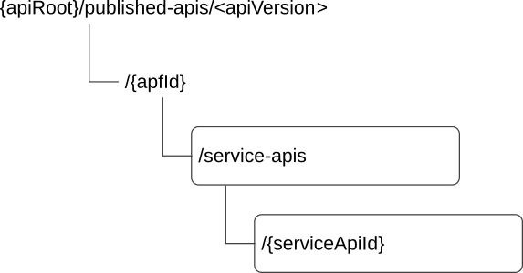

# 8.2.2 Resources

## 8.2.2.1 Overview

This clause describes the structure for the Resource URIs and the resources and methods used for the service.

Figure 8.2.2.1-1 depicts the resource URIs structure for the CAPIF_Publish_Service_API.

Figure 8.2.2.1-1: Resource URI structure of the CAPIF_Publish_Service_API

Table 8.2.2.1-1 provides an overview of the resources and applicable HTTP methods.

Table 8.2.2.1-1: Resources and methods overview

| Resource name                | Resource URI                         | HTTP method or custom operation | Description                                 |
|------------------------------|--------------------------------------|---------------------------------|---------------------------------------------|
| APF published APIs           | /{apfId}/service-apis                | POST                            | Publish a new API                           |
|                              |                                      | GET                             | Retrieve all the published service APIs.    |
| Individual APF published API | /{apfId}/service-apis/{serviceApiId} | GET                             | Retrieve an existing published service API. |
|                              |                                      | PUT                             | Update an existing published service API.   |
|                              |                                      | PATCH                           | Modify an existing published service API.   |
|                              |                                      | DELETE                          | Delete an existing published service API.   |

## 8.2.2.2 Resource: APF published APIs

### 8.2.2.2.1 Description

This resource represents all the published service APIs at the CCF for a given APF.

The resource is modelled using the Collection resource archetype (see Annex C.2 of 3GPP TS 29.501 \[18\]).

### 8.2.2.2.2 Resource Definition

Resource URI: **{apiRoot}/published-apis/\<apiVersion\>/{apfId}/service-apis**

This resource shall support the resource URI variables defined in table 8.2.2.2.2-1.

Table 8.2.2.2.2-1: Resource URI variables for this resource

<table>
<colgroup>
<col style="width: 11%" />
<col style="width: 14%" />
<col style="width: 74%" />
</colgroup>
<thead>
<tr class="header">
<th>Name</th>
<th>Data Type</th>
<th>Definition</th>
</tr>
</thead>
<tbody>
<tr class="odd">
<td>apiRoot</td>
<td>string</td>
<td>See clause 7.5.</td>
</tr>
<tr class="even">
<td>apfId</td>
<td>string</td>
<td>
Identifies the API publishing function that is publishing the service API.

For the CAPIF interconnection case, this string identifies the CCF that is publishing the service API.
</td>
</tr>
</tbody>
</table>

### 8.2.2.2.3 Resource Standard Methods

#### 8.2.2.2.3.1 POST

The HTTP POST method enables a service consumer to request to publish a new API at the CCF.

This method shall support the URI query parameters specified in table 8.2.2.2.3.1-1.

Table 8.2.2.2.3.1-1: URI query parameters supported by the POST method on this resource

| Name | Data type | P   | Cardinality | Description |
|------|-----------|-----|-------------|-------------|
| n/a  |           |     |             |             |

This method shall support the request data structures specified in table 8.2.2.2.3.1-2 and the response data structures and response codes specified in table 8.2.2.2.3.1-3.

Table 8.2.2.2.3.1-2: Data structures supported by the POST Request Body on this resource

| Data type             | P   | Cardinality | Description                                                       |
|-----------------------|-----|-------------|-------------------------------------------------------------------|
| ServiceAPIDescription | M   | 1           | Contains the parameters defining the service API to be published. |

Table 8.2.2.2.3.1-3: Data structures supported by the POST Response Body on this resource

<table>
<colgroup>
<col style="width: 20%" />
<col style="width: 3%" />
<col style="width: 12%" />
<col style="width: 14%" />
<col style="width: 49%" />
</colgroup>
<thead>
<tr class="header">
<th>Data type</th>
<th>P</th>
<th>Cardinality</th>
<th>
Response

codes
</th>
<th>Description</th>
</tr>
</thead>
<tbody>
<tr class="odd">
<td>ServiceAPIDescription</td>
<td>M</td>
<td>1</td>
<td>201 Created</td>
<td>
Successful case. The service API is successfully published.

The URI of the created "Individual APF published API" resource shall be returned in an HTTP "Location" header.
</td>
</tr>
<tr class="even">
<td colspan="5">NOTE: The mandatory HTTP error status codes for the HTTP POST method listed in table 5.2.6-1 of 3GPP TS 29.122 [14] shall also apply.</td>
</tr>
</tbody>
</table>

Table 8.2.2.2.3.1-4: Headers supported by the 201 Response Code on this resource

<table>
<colgroup>
<col style="width: 16%" />
<col style="width: 14%" />
<col style="width: 4%" />
<col style="width: 11%" />
<col style="width: 52%" />
</colgroup>
<tbody>
<tr class="odd">
<td>Name</td>
<td>Data type</td>
<td>P</td>
<td>Cardinality</td>
<td>Description</td>
</tr>
<tr class="even">
<td>Location</td>
<td>string</td>
<td>M</td>
<td>1</td>
<td>
Contains the URI of the newly created resource, according to the structure:

{apiRoot}/published-apis/&lt;apiVersion&gt;/{apfId}/service-apis/{serviceApiId}
</td>
</tr>
</tbody>
</table>

#### 8.2.2.2.3.2 GET

The HTTP GET method enables a service consumer to retrieve all the published service APIs at the CCF.

This method shall support the URI query parameters specified in table 8.2.2.2.3.2-1.

Table 8.2.2.2.3.2-1: URI query parameters supported by the GET method on this resource

| Name | Data type | P   | Cardinality | Description |
|------|-----------|-----|-------------|-------------|
| n/a  |           |     |             |             |

This method shall support the request data structures specified in table 8.2.2.2.3.2-2 and the response data structures and response codes specified in table 8.2.2.2.3.2-3.

Table 8.2.2.2.3.2-2: Data structures supported by the GET Request Body on this resource

| Data type | P   | Cardinality | Description |
|-----------|-----|-------------|-------------|
| n/a       |     |             |             |

Table 8.2.2.2.3.2-3: Data structures supported by the GET Response Body on this resource

<table>
<colgroup>
<col style="width: 25%" />
<col style="width: 3%" />
<col style="width: 12%" />
<col style="width: 14%" />
<col style="width: 43%" />
</colgroup>
<thead>
<tr class="header">
<th>Data type</th>
<th>P</th>
<th>Cardinality</th>
<th>
Response

codes
</th>
<th>Description</th>
</tr>
</thead>
<tbody>
<tr class="odd">
<td>array(ServiceAPIDescription)</td>
<td>M</td>
<td>0..N</td>
<td>200 OK</td>
<td>
Successful case. The representation(s) of the "Individual APF published API" resource(s) of the requested service API(s) shall be returned in the response body.

If there are no active "Individual APF published API" resources at the CCF, an empty array is returned.
</td>
</tr>
<tr class="even">
<td>n/a</td>
<td></td>
<td></td>
<td>307 Temporary Redirect</td>
<td>
Temporary redirection.

The response shall include a Location header field containing an alternative target URI of the resource located in an alternative CCF.

Redirection handling is described in clause 5.2.10 of 3GPP TS 29.122 [14].
</td>
</tr>
<tr class="odd">
<td>n/a</td>
<td></td>
<td></td>
<td>308 Permanent Redirect</td>
<td>
Permanent redirection.

The response shall include a Location header field containing an alternative target URI of the resource located in an alternative CCF.

Redirection handling is described in clause 5.2.10 of 3GPP TS 29.122 [14].
</td>
</tr>
<tr class="even">
<td colspan="5">NOTE: The mandatory HTTP error status codes for the HTTP GET method listed in table 5.2.6-1 of 3GPP TS 29.122 [14] shall also apply.</td>
</tr>
</tbody>
</table>

Table 8.2.2.2.3.2-4: Headers supported by the 307 Response Code on this resource

|          |           |     |             |                                                                                   |
|----------|-----------|-----|-------------|-----------------------------------------------------------------------------------|
| Name     | Data type | P   | Cardinality | Description                                                                       |
| Location | string    | M   | 1           | Contains an alternative target URI of the resource located in an alternative CCF. |

Table 8.2.2.2.3.2-5: Headers supported by the 308 Response Code on this resource

|          |           |     |             |                                                                                   |
|----------|-----------|-----|-------------|-----------------------------------------------------------------------------------|
| Name     | Data type | P   | Cardinality | Description                                                                       |
| Location | string    | M   | 1           | Contains an alternative target URI of the resource located in an alternative CCF. |

### 8.2.2.2.4 Resource Custom Operations

There are no resource custom operations defined for this resource in this release of the specification.

## 8.2.2.3 Resource: Individual APF published API

### 8.2.2.3.1 Description

The Individual APF published API resource represents an individual published service API.

The resource is modelled using the Document resource archetype (see Annex C.1 of 3GPP TS 29.501 \[18\]).

### 8.2.2.3.2 Resource Definition

Resource URI: **{apiRoot}/published-apis/\<apiVersion\>/{apfId}/service-apis/{serviceApiId}**

This resource shall support the resource URI variables defined in table 8.2.2.3.2-1.

Table 8.2.2.3.2-1: Resource URI variables for this resource

<table>
<colgroup>
<col style="width: 11%" />
<col style="width: 18%" />
<col style="width: 70%" />
</colgroup>
<thead>
<tr class="header">
<th>Name</th>
<th>Data Type</th>
<th>Definition</th>
</tr>
</thead>
<tbody>
<tr class="odd">
<td>apiRoot</td>
<td>string</td>
<td>See clause 7.5</td>
</tr>
<tr class="even">
<td>apfId</td>
<td>string</td>
<td>
Identifies the API publishing function that is publishing the service API.

For the CAPIF interconnection case, this string identifies the CCF that is publishing the service API.
</td>
</tr>
<tr class="odd">
<td>serviceApiId</td>
<td>string</td>
<td>Identifies an "Individual APF published API" resource.</td>
</tr>
</tbody>
</table>

### 8.2.2.3.3 Resource Standard Methods

#### 8.2.2.3.3.1 GET

The HTTP GET method allows a service consumer to retrieve an existing "Individual APF published API" resource at the CCF.

This method shall support the URI query parameters specified in table 8.2.2.3.3.1-1.

Table 8.2.2.3.3.1-1: URI query parameters supported by the GET method on this resource

| Name | Data type | P   | Cardinality | Description |
|------|-----------|-----|-------------|-------------|
| n/a  |           |     |             |             |

This method shall support the request data structures specified in table 8.2.2.3.3.1-2 and the response data structures and response codes specified in table 8.2.2.3.3.1-3.

Table 8.2.2.3.3.1-2: Data structures supported by the GET Request Body on this resource

| Data type | P   | Cardinality | Description |
|-----------|-----|-------------|-------------|
| n/a       |     |             |             |

Table 8.2.2.3.3.1-3: Data structures supported by the GET Response Body on this resource

<table>
<colgroup>
<col style="width: 25%" />
<col style="width: 3%" />
<col style="width: 11%" />
<col style="width: 15%" />
<col style="width: 45%" />
</colgroup>
<thead>
<tr class="header">
<th>Data type</th>
<th>P</th>
<th>Cardinality</th>
<th>
Response

codes
</th>
<th>Description</th>
</tr>
</thead>
<tbody>
<tr class="odd">
<td>ServiceAPIDescription</td>
<td>M</td>
<td>1</td>
<td>200 OK</td>
<td>Successful case. The service API is successfully published and a representation of the created "Individual APF published API" resource shall be returned.</td>
</tr>
<tr class="even">
<td>n/a</td>
<td></td>
<td></td>
<td>307 Temporary Redirect</td>
<td>
Temporary redirection.

The response shall include a Location header field containing an alternative target URI of the resource located in an alternative CCF.

Redirection handling is described in clause 5.2.10 of 3GPP TS 29.122 [14].
</td>
</tr>
<tr class="odd">
<td>n/a</td>
<td></td>
<td></td>
<td>308 Permanent Redirect</td>
<td>
Permanent redirection.

The response shall include a Location header field containing an alternative target URI of the resource located in an alternative CCF.

Redirection handling is described in clause 5.2.10 of 3GPP TS 29.122 [14].
</td>
</tr>
<tr class="even">
<td colspan="5">NOTE: The mandatory HTTP error status codes for the HTTP GET method listed in table 5.2.6-1 of 3GPP TS 29.122 [14] shall also apply.</td>
</tr>
</tbody>
</table>

Table 8.2.2.3.3.1-4: Headers supported by the 307 Response Code on this resource

|          |           |     |             |                                                                                   |
|----------|-----------|-----|-------------|-----------------------------------------------------------------------------------|
| Name     | Data type | P   | Cardinality | Description                                                                       |
| Location | string    | M   | 1           | Contains an alternative target URI of the resource located in an alternative CCF. |

Table 8.2.2.3.3.1-5: Headers supported by the 308 Response Code on this resource

|          |           |     |             |                                                                                   |
|----------|-----------|-----|-------------|-----------------------------------------------------------------------------------|
| Name     | Data type | P   | Cardinality | Description                                                                       |
| Location | string    | M   | 1           | Contains an alternative target URI of the resource located in an alternative CCF. |

#### 8.2.2.3.3.2 PUT

The HTTP PUT method allows a service consumer to update an existing "Individual APF published API" resource at the CCF.

This method shall support the URI query parameters specified in table 8.2.2.3.3.2-1.

Table 8.2.2.3.3.2-1: URI query parameters supported by the PUT method on this resource

| Name | Data type | P   | Cardinality | Description |
|------|-----------|-----|-------------|-------------|
| n/a  |           |     |             |             |

This method shall support the request data structures specified in table 8.2.2.3.3.2-2 and the response data structures and response codes specified in table 8.2.2.3.3.2-3.

Table 8.2.2.3.3.2-2: Data structures supported by the PUT Request Body on this resource

| Data type             | P   | Cardinality | Description                                                                         |
|-----------------------|-----|-------------|-------------------------------------------------------------------------------------|
| ServiceAPIDescription | M   | 1           | Contains the updated representation of the "Individual APF published API" resource. |

Table 8.2.2.3.3.2-3: Data structures supported by the PUT Response Body on this resource

<table>
<colgroup>
<col style="width: 20%" />
<col style="width: 4%" />
<col style="width: 11%" />
<col style="width: 15%" />
<col style="width: 48%" />
</colgroup>
<thead>
<tr class="header">
<th>Data type</th>
<th>P</th>
<th>Cardinality</th>
<th>
Response

codes
</th>
<th>Description</th>
</tr>
</thead>
<tbody>
<tr class="odd">
<td>ServiceAPIDescription</td>
<td>M</td>
<td>1</td>
<td>200 OK</td>
<td>Successful case. The "Individual APF published API" resource is successfully updated and a representation of the updated resource shall be returned in the response body.</td>
</tr>
<tr class="even">
<td>n/a</td>
<td></td>
<td></td>
<td>204 No Content</td>
<td>Successful case. The "Individual APF published API" resource is successfully updated and no content is returned in the response body.</td>
</tr>
<tr class="odd">
<td>n/a</td>
<td></td>
<td></td>
<td>307 Temporary Redirect</td>
<td>
Temporary redirection.

The response shall include a Location header field containing an alternative target URI of the resource located in an alternative CCF.

Redirection handling is described in clause 5.2.10 of 3GPP TS 29.122 [14].
</td>
</tr>
<tr class="even">
<td>n/a</td>
<td></td>
<td></td>
<td>308 Permanent Redirect</td>
<td>
Permanent redirection.

The response shall include a Location header field containing an alternative target URI of the resource located in an alternative CCF.

Redirection handling is described in clause 5.2.10 of 3GPP TS 29.122 [14].
</td>
</tr>
<tr class="odd">
<td colspan="5">NOTE: The mandatory HTTP error status codes for the HTTP PUT method listed in table 5.2.6-1 of 3GPP TS 29.122 [14] shall also apply.</td>
</tr>
</tbody>
</table>

Table 8.2.2.3.3.2-4: Headers supported by the 307 Response Code on this resource

|          |           |     |             |                                                                                   |
|----------|-----------|-----|-------------|-----------------------------------------------------------------------------------|
| Name     | Data type | P   | Cardinality | Description                                                                       |
| Location | string    | M   | 1           | Contains an alternative target URI of the resource located in an alternative CCF. |

Table 8.2.2.3.3.2-5: Headers supported by the 308 Response Code on this resource

|          |           |     |             |                                                                                   |
|----------|-----------|-----|-------------|-----------------------------------------------------------------------------------|
| Name     | Data type | P   | Cardinality | Description                                                                       |
| Location | string    | M   | 1           | Contains an alternative target URI of the resource located in an alternative CCF. |

#### 8.2.2.3.3.3 DELETE

The HTTP DELETE method allows a service consumer to delete an existing "Individual APF published API" resource at the CCF.

This method shall support the URI query parameters specified in table 8.2.2.3.3.3-1.

Table 8.2.2.3.3.3-1: URI query parameters supported by the GET method on this resource

| Name | Data type | P   | Cardinality | Description |
|------|-----------|-----|-------------|-------------|
| n/a  |           |     |             |             |

This method shall support the request data structures specified in table 8.2.2.3.3.3-2 and the response data structures and response codes specified in table 8.2.2.3.3.3-3.

Table 8.2.2.3.3.3-2: Data structures supported by the DELETE Request Body on this resource

| Data type | P   | Cardinality | Description |
|-----------|-----|-------------|-------------|
| n/a       |     |             |             |

Table 8.2.2.3.3.3-3: Data structures supported by the DELETE Response Body on this resource

<table>
<colgroup>
<col style="width: 16%" />
<col style="width: 4%" />
<col style="width: 12%" />
<col style="width: 15%" />
<col style="width: 51%" />
</colgroup>
<thead>
<tr class="header">
<th>Data type</th>
<th>P</th>
<th>Cardinality</th>
<th>
Response

codes
</th>
<th>Description</th>
</tr>
</thead>
<tbody>
<tr class="odd">
<td>n/a</td>
<td></td>
<td></td>
<td>204 No Content</td>
<td>Successful case. The "Individual APF published API" resource is successfully deleted.</td>
</tr>
<tr class="even">
<td>n/a</td>
<td></td>
<td></td>
<td>307 Temporary Redirect</td>
<td>
Temporary redirection.

The response shall include a Location header field containing an alternative target URI of the resource located in an alternative CCF.

Redirection handling is described in clause 5.2.10 of 3GPP TS 29.122 [14].
</td>
</tr>
<tr class="odd">
<td>n/a</td>
<td></td>
<td></td>
<td>308 Permanent Redirect</td>
<td>
Permanent redirection.

The response shall include a Location header field containing an alternative target URI of the resource located in an alternative CCF.

Redirection handling is described in clause 5.2.10 of 3GPP TS 29.122 [14].
</td>
</tr>
<tr class="even">
<td colspan="5">NOTE: The mandatory HTTP error status codes for the HTTP DELETE method listed in table 5.2.6-1 of 3GPP TS 29.122 [14] shall also apply.</td>
</tr>
</tbody>
</table>

Table 8.2.2.3.3.3-4: Headers supported by the 307 Response Code on this resource

|          |           |     |             |                                                                                   |
|----------|-----------|-----|-------------|-----------------------------------------------------------------------------------|
| Name     | Data type | P   | Cardinality | Description                                                                       |
| Location | string    | M   | 1           | Contains an alternative target URI of the resource located in an alternative CCF. |

Table 8.2.2.3.3.3-5: Headers supported by the 308 Response Code on this resource

|          |           |     |             |                                                                                   |
|----------|-----------|-----|-------------|-----------------------------------------------------------------------------------|
| Name     | Data type | P   | Cardinality | Description                                                                       |
| Location | string    | M   | 1           | Contains an alternative target URI of the resource located in an alternative CCF. |

#### 8.2.2.3.3.4 PATCH

The HTTP PATCH method allows a service consumer to modify an existing "Individual APF published API" resource at the CCF.

This method shall support the URI query parameters specified in table 8.2.2.3.3.4-1.

Table 8.2.2.3.3.4-1: URI query parameters supported by the PATCH method on this resource

| Name | Data type | P   | Cardinality | Description |
|------|-----------|-----|-------------|-------------|
| n/a  |           |     |             |             |

This method shall support the request data structures specified in table 8.2.2.3.3.4-2 and the response data structures and response codes specified in table 8.2.2.3.3.4-3.

Table 8.2.2.3.3.4-2: Data structures supported by the PATCH Request Body on this resource

| Data type                  | P   | Cardinality | Description                                                                              |
|----------------------------|-----|-------------|------------------------------------------------------------------------------------------|
| ServiceAPIDescriptionPatch | M   | 1           | Contains the modifications to be applied to the "Individual APF published API" resource. |

Table 8.2.2.3.3.4-3: Data structures supported by the PATCH Response Body on this resource

<table>
<colgroup>
<col style="width: 20%" />
<col style="width: 3%" />
<col style="width: 12%" />
<col style="width: 14%" />
<col style="width: 49%" />
</colgroup>
<thead>
<tr class="header">
<th>Data type</th>
<th>P</th>
<th>Cardinality</th>
<th>
Response

codes
</th>
<th>Description</th>
</tr>
</thead>
<tbody>
<tr class="odd">
<td>ServiceAPIDescription</td>
<td>M</td>
<td>1</td>
<td>200 OK</td>
<td>Successful case. The "Individual APF published API" resource is successfully modified and a representation of the updated resource shall be returned in the response body.</td>
</tr>
<tr class="even">
<td>n/a</td>
<td></td>
<td></td>
<td>204 No Content</td>
<td>Successful case. The "Individual APF published API" resource is successfully updated and no content is returned in the response body.</td>
</tr>
<tr class="odd">
<td>n/a</td>
<td></td>
<td></td>
<td>307 Temporary Redirect</td>
<td>
Temporary redirection.

The response shall include a Location header field containing an alternative target URI of the resource located in an alternative CCF.

Redirection handling is described in clause 5.2.10 of 3GPP TS 29.122 [14].
</td>
</tr>
<tr class="even">
<td>n/a</td>
<td></td>
<td></td>
<td>308 Permanent Redirect</td>
<td>
Permanent redirection.

The response shall include a Location header field containing an alternative target URI of the resource located in an alternative CCF.

Redirection handling is described in clause 5.2.10 of 3GPP TS 29.122 [14].
</td>
</tr>
<tr class="odd">
<td colspan="5">NOTE: The mandatory HTTP error status codes for the HTTP PATCH method listed in table 5.2.6-1 of 3GPP TS 29.122 [14] shall also apply.</td>
</tr>
</tbody>
</table>

Table 8.2.2.3.3.4-4: Headers supported by the 307 Response Code on this resource

|          |           |     |             |                                                                                   |
|----------|-----------|-----|-------------|-----------------------------------------------------------------------------------|
| Name     | Data type | P   | Cardinality | Description                                                                       |
| Location | string    | M   | 1           | Contains an alternative target URI of the resource located in an alternative CCF. |

Table 8.2.2.3.3.4-5: Headers supported by the 308 Response Code on this resource

|          |           |     |             |                                                                                   |
|----------|-----------|-----|-------------|-----------------------------------------------------------------------------------|
| Name     | Data type | P   | Cardinality | Description                                                                       |
| Location | string    | M   | 1           | Contains an alternative target URI of the resource located in an alternative CCF. |

### 8.2.2.3.4 Resource Custom Operations

There are no resource custom operations defined for this resource in this release of the specification.
