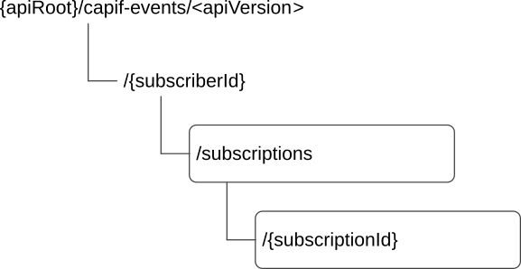

# 8.3.2 Resources

## 8.3.2.1 Overview

This clause describes the structure for the Resource URIs and the resources and methods used for the service.

Figure 8.3.2.1-1 depicts the resource URIs structure for the CAPIF_Events_API.

Figure 8.3.2.1-1: Resource URI structure of the CAPIF_Events_API

Table 8.3.2.1-1 provides an overview of the resources and applicable HTTP methods.

Table 8.3.2.1-1: Resources and methods overview

| Resource name                        | Resource URI                                   | HTTP method or custom operation | Description                                                         |
|--------------------------------------|------------------------------------------------|---------------------------------|---------------------------------------------------------------------|
| CAPIF Events Subscriptions           | /{subscriberId}/subscriptions                  | POST                            | Create a new CAPIF Events Subscription                              |
| Individual CAPIF Events Subscription | /{subscriberId}/subscriptions/{subscriptionId} | PUT                             | Update an existing "Individual CAPIF Events Subscription" resource. |
|                                      |                                                | PATCH                           | Modify an existing "Individual CAPIF Events Subscription" resource. |
|                                      |                                                | DELETE                          | Delete an existing "Individual CAPIF Events Subscription".          |

## 8.3.2.2 Resource: CAPIF Events Subscriptions

### 8.3.2.2.1 Description

The "CAPIF Events Subscriptions" resource represents all the active CAPIF Events Subscriptions managed by the CCF for a Subscriber.

### 8.3.2.2.2 Resource Definition

Resource URI: **{apiRoot}/capif-events/\<apiVersion\>/{subscriberId}/subscriptions**

This resource shall support the resource URI variables defined in table 8.3.2.2.2-1.

Table 8.3.2.2.2-1: Resource URI variables for this resource

| Name         | Data Type | Definition                                   |
|--------------|-----------|----------------------------------------------|
| apiRoot      | string    | See clause 7.5.                              |
| subscriberId | string    | Represents the identifier of the Subscriber. |

### 8.3.2.2.3 Resource Standard Methods

#### 8.3.2.2.3.1 POST

This method shall support the URI query parameters specified in table 8.3.2.2.3.1-1.

Table 8.3.2.2.3.1-1: URI query parameters supported by the POST method on this resource

| Name | Data type | P   | Cardinality | Description |
|------|-----------|-----|-------------|-------------|
| n/a  |           |     |             |             |

This method shall support the request data structures specified in table 8.3.2.2.3.1-2 and the response data structures and response codes specified in table 8.3.2.2.3.1-3.

Table 8.3.2.2.3.1-2: Data structures supported by the POST Request Body on this resource

| Data type         | P   | Cardinality | Description                                                   |
|-------------------|-----|-------------|---------------------------------------------------------------|
| EventSubscription | M   | 1           | Create a new "Individual CAPIF Events Subscription" resource. |

Table 8.3.2.2.3.1-3: Data structures supported by the POST Response Body on this resource

<table>
<colgroup>
<col style="width: 16%" />
<col style="width: 4%" />
<col style="width: 12%" />
<col style="width: 11%" />
<col style="width: 54%" />
</colgroup>
<thead>
<tr class="header">
<th>Data type</th>
<th>P</th>
<th>Cardinality</th>
<th>
Response

codes
</th>
<th>Description</th>
</tr>
</thead>
<tbody>
<tr class="odd">
<td>EventSubscription</td>
<td>M</td>
<td>1</td>
<td>201 Created</td>
<td>Successful case. The CAPIF Events Subscription is successfully created successfully and a representation of the created "Individual CAPIF Events Subscription" resource shall be returned. 
 
The URI of the created resource shall be returned in the "Location" HTTP header</td>
</tr>
<tr class="even">
<td colspan="5">NOTE: The mandatory HTTP error status codes for the HTTP POST method listed in table 5.2.6-1 of 3GPP TS 29.122 [14] shall also apply.</td>
</tr>
</tbody>
</table>

Table 8.3.2.2.3.1-4: Headers supported by the 201 Response Code on this resource

<table>
<colgroup>
<col style="width: 16%" />
<col style="width: 14%" />
<col style="width: 4%" />
<col style="width: 11%" />
<col style="width: 52%" />
</colgroup>
<tbody>
<tr class="odd">
<td>Name</td>
<td>Data type</td>
<td>P</td>
<td>Cardinality</td>
<td>Description</td>
</tr>
<tr class="even">
<td>Location</td>
<td>string</td>
<td>M</td>
<td>1</td>
<td>
Contains the URI of the newly created resource, according to the structure:

{apiRoot}/capif-events/&lt;apiVersion&gt;/{subscriberId}/subscriptions/{subscriptionId}
</td>
</tr>
</tbody>
</table>

### 8.3.2.2.4 Resource Custom Operations

There are no resource Custom Operations defined for this resource in this release of the specification.

## 8.3.2.3 Resource: Individual CAPIF Events Subscription

### 8.3.2.3.1 Description

The "Individual CAPIF Events Subscription" resource represents a CAPIF events subscription managed by the CCF for a Subscriber.

### 8.3.2.3.2 Resource Definition

Resource URI: **{apiRoot}/capif-events/\<apiVersion\>/{subscriberId}/subscriptions/{subscriptionId}**

This resource shall support the resource URI variables defined in table 8.3.2.3.2-1.

Table 8.3.2.3.2-1: Resource URI variables for this resource

| Name           | Data Type | Definition                                                                        |
|----------------|-----------|-----------------------------------------------------------------------------------|
| apiRoot        | string    | See clause 8.3.1.                                                                 |
| subscriberId   | string    | Represents the identifier of the Subscriber.                                      |
| subscriptionId | string    | Represents the identifier of the "Individual CAPIF Events Subscription" resource. |

### 8.3.2.3.3 Resource Standard Methods

#### 8.3.2.3.3.1 DELETE

This method shall support the URI query parameters specified in table 8.3.2.3.3.1-1.

Table 8.3.2.3.3.1-1: URI query parameters supported by the DELETE method on this resource

| Name | Data type | P   | Cardinality | Description |
|------|-----------|-----|-------------|-------------|
| n/a  |           |     |             |             |

This method shall support the request data structures specified in table 8.3.2.3.3.1-2 and the response data structures and response codes specified in table 8.3.2.3.3.1-3.

Table 8.3.2.3.3.1-2: Data structures supported by the DELETE Request Body on this resource

| Data type | P   | Cardinality | Description |
|-----------|-----|-------------|-------------|
| n/a       |     |             |             |

Table 8.3.2.3.3.1-3: Data structures supported by the DELETE Response Body on this resource

<table>
<colgroup>
<col style="width: 16%" />
<col style="width: 4%" />
<col style="width: 12%" />
<col style="width: 15%" />
<col style="width: 51%" />
</colgroup>
<thead>
<tr class="header">
<th>Data type</th>
<th>P</th>
<th>Cardinality</th>
<th>
Response

codes
</th>
<th>Description</th>
</tr>
</thead>
<tbody>
<tr class="odd">
<td>n/a</td>
<td></td>
<td></td>
<td>204 No Content</td>
<td>Successful case. The "Individual CAPIF Events Subscription" resource is successfully deleted.</td>
</tr>
<tr class="even">
<td>n/a</td>
<td></td>
<td></td>
<td>307 Temporary Redirect</td>
<td>
Temporary redirection.

The response shall include a Location header field containing an alternative URI of the resource located in an alternative CCF.

Redirection handling is described in clause 5.2.10 of 3GPP TS 29.122 [14].
</td>
</tr>
<tr class="odd">
<td>n/a</td>
<td></td>
<td></td>
<td>308 Permanent Redirect</td>
<td>
Permanent redirection, during resource termination. The response shall include a Location header field containing an alternative URI of the resource located in an alternative CCF.

Redirection handling is described in clause 5.2.10 of 3GPP TS 29.122 [14].
</td>
</tr>
<tr class="even">
<td colspan="5">NOTE: The mandatory HTTP error status codes for the HTTP DELETE method listed in table 5.2.6-1 of 3GPP TS 29.122 [14] shall also apply.</td>
</tr>
</tbody>
</table>

Table 8.3.2.3.3.1-4: Headers supported by the 307 Response Code on this resource

|          |           |     |             |                                                                            |
|----------|-----------|-----|-------------|----------------------------------------------------------------------------|
| Name     | Data type | P   | Cardinality | Description                                                                |
| Location | string    | M   | 1           | Contains an alternative URI of the resource located in an alternative CCF. |

Table 8.3.2.3.3.1-5: Headers supported by the 308 Response Code on this resource

|          |           |     |             |                                                                            |
|----------|-----------|-----|-------------|----------------------------------------------------------------------------|
| Name     | Data type | P   | Cardinality | Description                                                                |
| Location | string    | M   | 1           | Contains an alternative URI of the resource located in an alternative CCF. |

#### 8.3.2.3.3.2 PUT

The subscribing entity shall initiate the HTTP PUT request message and the CAPIF core function shall respond to the message.

This method shall support the request data structures specified in table 8.3.2.3.3.2-1 and the response data structures and response codes specified in table 8.3.2.3.3.2-2.

Table 8.3.2.3.3.2-1: Data structures supported by the PUT Request Body on this resource

| Data type         | P   | Cardinality | Description                                                                                          |
|-------------------|-----|-------------|------------------------------------------------------------------------------------------------------|
| EventSubscription | M   | 1           | Contains the updated representation of the existing "Individual CAPIF Events Subscription" resource. |

Table 8.3.2.3.3.2-2: Data structures supported by the PUT Response Body on this resource

<table>
<colgroup>
<col style="width: 16%" />
<col style="width: 4%" />
<col style="width: 12%" />
<col style="width: 15%" />
<col style="width: 50%" />
</colgroup>
<thead>
<tr class="header">
<th>Data type</th>
<th>P</th>
<th>Cardinality</th>
<th>Response codes</th>
<th>Description</th>
</tr>
</thead>
<tbody>
<tr class="odd">
<td>EventSubscription</td>
<td>M</td>
<td>1</td>
<td>200 OK</td>
<td>Successful case. The event subscription is successfully updated, and a representation of the updated "Individual CAPIF Events Subscription" resource is returned in the response body.</td>
</tr>
<tr class="even">
<td>n/a</td>
<td></td>
<td></td>
<td>204 No Content</td>
<td>Successful case. The event subscription is successfully updated and no content is returned in the response body.</td>
</tr>
<tr class="odd">
<td>n/a</td>
<td></td>
<td></td>
<td>307 Temporary Redirect</td>
<td>
Temporary redirection.

The response shall include a Location header field containing an alternative URI of the resource located in an alternative CCF.

Redirection handling is described in clause 5.2.10 of 3GPP TS 29.122 [14].
</td>
</tr>
<tr class="even">
<td>n/a</td>
<td></td>
<td></td>
<td>308 Permanent Redirect</td>
<td>
Permanent redirection.

The response shall include a Location header field containing an alternative URI of the resource located in an alternative CCF.

Redirection handling is described in clause 5.2.10 of 3GPP TS 29.122 [14].
</td>
</tr>
<tr class="odd">
<td colspan="5">NOTE: The mandatory HTTP error status codes for the HTTP PUT method listed in table 5.2.6-1 of 3GPP TS 29.122 [14] shall also apply.</td>
</tr>
</tbody>
</table>

Table 8.3.2.3.3.2-3: Headers supported by the 307 Response Code on this resource

|          |           |     |             |                                                                            |
|----------|-----------|-----|-------------|----------------------------------------------------------------------------|
| Name     | Data type | P   | Cardinality | Description                                                                |
| Location | string    | M   | 1           | Contains an alternative URI of the resource located in an alternative CCF. |

Table 8.3.2.3.3.2-4: Headers supported by the 308 Response Code on this resource

|          |           |     |             |                                                                            |
|----------|-----------|-----|-------------|----------------------------------------------------------------------------|
| Name     | Data type | P   | Cardinality | Description                                                                |
| Location | string    | M   | 1           | Contains an alternative URI of the resource located in an alternative CCF. |

#### 8.3.2.3.3.3 PATCH

This method shall support the request data structures specified in table 8.3.2.3.3.3-1 and the response data structures and response codes specified in table 8.3.2.3.3.3-2.

Table 8.3.2.3.3.3-1: Data structures supported by the PATCH Request Body on this resource

| Data type              | P   | Cardinality | Description                                                                                                 |
|------------------------|-----|-------------|-------------------------------------------------------------------------------------------------------------|
| EventSubscriptionPatch | M   | 1           | Contains the parameters to request the modification of the "Individual CAPIF Events Subscription" resource. |

Table 8.3.2.3.3.3-2: Data structures supported by the PATCH Response Body on this resource

<table>
<colgroup>
<col style="width: 16%" />
<col style="width: 4%" />
<col style="width: 12%" />
<col style="width: 15%" />
<col style="width: 50%" />
</colgroup>
<thead>
<tr class="header">
<th>Data type</th>
<th>P</th>
<th>Cardinality</th>
<th>Response codes</th>
<th>Description</th>
</tr>
</thead>
<tbody>
<tr class="odd">
<td>EventSubscription</td>
<td>M</td>
<td>1</td>
<td>200 OK</td>
<td>Successful case. The event subscription is successfully modified and a representation of the updated "Individual CAPIF Events Subscription" resource is returned in the response body.</td>
</tr>
<tr class="even">
<td>n/a</td>
<td></td>
<td></td>
<td>204 No Content</td>
<td>Successful case. The event subscription is successfully modified and no content was returned in the response body.</td>
</tr>
<tr class="odd">
<td>n/a</td>
<td></td>
<td></td>
<td>307 Temporary Redirect</td>
<td>
Temporary redirection.

The response shall include a Location header field containing an alternative URI of the resource located in an alternative CCF.

Redirection handling is described in clause 5.2.10 of 3GPP TS 29.122 [14].
</td>
</tr>
<tr class="even">
<td>n/a</td>
<td></td>
<td></td>
<td>308 Permanent Redirect</td>
<td>
Permanent redirection.

The response shall include a Location header field containing an alternative URI of the resource located in an alternative CCF.

Redirection handling is described in clause 5.2.10 of 3GPP TS 29.122 [14].
</td>
</tr>
<tr class="odd">
<td colspan="5">NOTE: The mandatory HTTP error status codes for the HTTP PATCH method listed in table 5.2.6-1 of 3GPP TS 29.122 [14] shall also apply.</td>
</tr>
</tbody>
</table>

Table 8.3.2.3.3.3-3: Headers supported by the 307 Response Code on this resource

|          |           |     |             |                                                                            |
|----------|-----------|-----|-------------|----------------------------------------------------------------------------|
| Name     | Data type | P   | Cardinality | Description                                                                |
| Location | string    | M   | 1           | Contains an alternative URI of the resource located in an alternative CCF. |

Table 8.3.2.3.3.3-4: Headers supported by the 308 Response Code on this resource

|          |           |     |             |                                                                            |
|----------|-----------|-----|-------------|----------------------------------------------------------------------------|
| Name     | Data type | P   | Cardinality | Description                                                                |
| Location | string    | M   | 1           | Contains an alternative URI of the resource located in an alternative CCF. |

### 8.3.2.3.4 Resource Custom Operations

There are no resource Custom Operations defined for this resource in this release of the specification.
