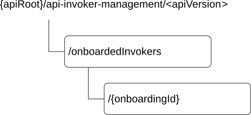

# 8.4.2 Resources

## 8.4.2.1 Overview

This clause describes the structure for the Resource URIs and the resources and methods used for the service.

Figure 8.4.2.1-1 depicts the resource URIs structure for the CAPIF_API_Invoker_Management_API.

Figure 8.4.2.1-1: Resource URI structure of the CAPIF_API_Invoker_Management_API

Table 8.4.2.1-1 provides an overview of the resources and applicable HTTP methods.

Table 8.4.2.1-1: Resources and methods overview

<table>
<colgroup>
<col style="width: 26%" />
<col style="width: 32%" />
<col style="width: 10%" />
<col style="width: 30%" />
</colgroup>
<thead>
<tr class="header">
<th>Resource name</th>
<th>Resource URI</th>
<th>HTTP method or custom operation</th>
<th>Description</th>
</tr>
</thead>
<tbody>
<tr class="odd">
<td>On-boarded API Invokers</td>
<td>
/onboardedInvokers

(NOTE)
</td>
<td>POST</td>
<td>On-boards a new API Invoker.</td>
</tr>
<tr class="even">
<td rowspan="3">Individual On-boarded API Invoker</td>
<td rowspan="3">
/onboardedInvokers/{onboardingId}

(NOTE)
</td>
<td>DELETE</td>
<td>Off-boards an existing API Invoker.</td>
</tr>
<tr class="odd">
<td>PATCH</td>
<td>Modify an existing API Invoker's onboarding details.</td>
</tr>
<tr class="even">
<td>PUT</td>
<td>Update an existing API Invoker's onboarding details.</td>
</tr>
<tr class="odd">
<td colspan="4">NOTE: The path segment "onboardedInvokers" does not follow the related naming convention defined in clause 7.5.1. The path segment is however kept as currently defined in this specification for backward compatibility considerations.</td>
</tr>
</tbody>
</table>

## 8.4.2.2 Resource: On-boarded API Invokers

### 8.4.2.2.1 Description

The On-boarded API Invokers resource represents all the collection of onboarded API Invokers and corresponding onboarding information at the CCF.

### 8.4.2.2.2 Resource Definition

Resource URI: **{apiRoot}/api-invoker-management/\<apiVersion\>/onboardedInvokers**

This resource shall support the resource URI variables defined in table 8.4.2.2.2-1.

Table 8.4.2.2.2-1: Resource URI variables for this resource

| Name    | Data Type | Definition      |
|---------|-----------|-----------------|
| apiRoot | string    | See clause 7.5. |

### 8.4.2.2.3 Resource Standard Methods

#### 8.4.2.2.3.1 POST

This method shall support the URI query parameters specified in table 8.4.2.2.3.1-1.

Table 8.4.2.2.3.1-1: URI query parameters supported by the POST method on this resource

| Name | Data type | P   | Cardinality | Description |
|------|-----------|-----|-------------|-------------|
| n/a  |           |     |             |             |

This method shall support the request data structures specified in table 8.4.2.2.3.1-2 and the response data structures and response codes specified in table 8.4.2.2.3.1-3.

Table 8.4.2.2.3.1-2: Data structures supported by the POST Request Body on this resource

| Data type                  | P   | Cardinality | Description                                        |
|----------------------------|-----|-------------|----------------------------------------------------|
| APIInvokerEnrolmentDetails | M   | 1           | Contains the enrolment details of the API Invoker. |

Table 8.4.2.2.3.1-3: Data structures supported by the POST Response Body on this resource

<table>
<colgroup>
<col style="width: 25%" />
<col style="width: 4%" />
<col style="width: 11%" />
<col style="width: 14%" />
<col style="width: 45%" />
</colgroup>
<thead>
<tr class="header">
<th>Data type</th>
<th>P</th>
<th>Cardinality</th>
<th>
Response

codes
</th>
<th>Description</th>
</tr>
</thead>
<tbody>
<tr class="odd">
<td>APIInvokerEnrolmentDetails</td>
<td>M</td>
<td>1</td>
<td>201 Created</td>
<td>
Successful case. The API Invoker was successfully on-boarded.

The URI of the created "Individual On-boarded API Invoker" resource shall be returned in an HTTP "Location" HTTP header.
</td>
</tr>
<tr class="even">
<td>n/a</td>
<td></td>
<td></td>
<td>202 Accepted</td>
<td>Successful case. The CCF accepted the request and is processing it.</td>
</tr>
<tr class="odd">
<td>ProblemDetails</td>
<td>O</td>
<td>0..1</td>
<td>403 Forbidden</td>
<td>(NOTE 2)</td>
</tr>
<tr class="even">
<td colspan="5">
NOTE 1: The mandatory HTTP error status codes for the HTTP POST method listed in table 5.2.6-1 of 3GPP TS 29.122 [14] shall also apply.

NOTE 2: Failure causes are described in clause 8.4.5.
</td>
</tr>
</tbody>
</table>

Table 8.4.2.2.3.1-4: Headers supported by the 201 Response Code on this resource

<table>
<colgroup>
<col style="width: 16%" />
<col style="width: 12%" />
<col style="width: 4%" />
<col style="width: 11%" />
<col style="width: 54%" />
</colgroup>
<tbody>
<tr class="odd">
<td>Name</td>
<td>Data type</td>
<td>P</td>
<td>Cardinality</td>
<td>Description</td>
</tr>
<tr class="even">
<td>Location</td>
<td>string</td>
<td>M</td>
<td>1</td>
<td>
Contains the URI of the newly created resource, according to the structure:

{apiRoot}/api-invoker-management/&lt;apiVersion&gt;/onboardedInvokers/{onboardingId}
</td>
</tr>
</tbody>
</table>

### 8.4.2.2.4 Resource Custom Operations

There are no resource custom operations defined for this resource in this release of the specification.

## 8.4.2.3 Resource: Individual On-boarded API Invoker

### 8.4.2.3.1 Description

The "Individual On-boarded API Invoker" resource represents an individual onboarded API Invoker and the corresponding onboarding information managed by the CCF.

### 8.4.2.3.2 Resource Definition

Resource URI: **{apiRoot}/api-invoker-management/\<apiVersion\>/onboardedInvokers/{onboardingId}**

This resource shall support the resource URI variables defined in table 8.4.2.3.2-1.

Table 8.4.2.3.2-1: Resource URI variables for this resource

| Name         | Data Type | Definition                                                                     |
|--------------|-----------|--------------------------------------------------------------------------------|
| apiRoot      | string    | See clause 7.5.                                                                |
| onboardingId | string    | Represents the identifier of the "Individual On-boarded API Invoker" resource. |

### 8.4.2.3.3 Resource Standard Methods

#### 8.4.2.3.3.1 DELETE

This method shall support the URI query parameters specified in table 8.4.2.3.3.1-1.

Table 8.4.2.3.3.1-1: URI query parameters supported by the DELETE method on this resource

| Name | Data type | P   | Cardinality | Description |
|------|-----------|-----|-------------|-------------|
| n/a  |           |     |             |             |

This method shall support the response codes specified in table 8.4.2.3.3.1-2 and the response data structures and response codes specified in table 8.4.2.3.3.1-3.

Table 8.4.2.3.3.1-2: Data structures supported by the DELETE Request Body on this resource

| Data type | P   | Cardinality | Description |
|-----------|-----|-------------|-------------|
| n/a       |     |             |             |

Table 8.4.2.3.3.1-3: Data structures supported by the DELETE Response Body on this resource

<table>
<colgroup>
<col style="width: 16%" />
<col style="width: 4%" />
<col style="width: 12%" />
<col style="width: 15%" />
<col style="width: 51%" />
</colgroup>
<thead>
<tr class="header">
<th>Data type</th>
<th>P</th>
<th>Cardinality</th>
<th>
Response

codes
</th>
<th>Description</th>
</tr>
</thead>
<tbody>
<tr class="odd">
<td>n/a</td>
<td></td>
<td></td>
<td>204 No Content</td>
<td>Successful case. The "Individual On-boarded API Invoker" resource is successfully deleted.</td>
</tr>
<tr class="even">
<td>n/a</td>
<td></td>
<td></td>
<td>307 Temporary Redirect</td>
<td>
Temporary redirection.

The response shall include a Location header field containing an alternative URI of the resource located in an alternative CCF.

Redirection handling is described in clause 5.2.10 of 3GPP TS 29.122 [14].
</td>
</tr>
<tr class="odd">
<td>n/a</td>
<td></td>
<td></td>
<td>308 Permanent Redirect</td>
<td>
Permanent redirection.

The response shall include a Location header field containing an alternative URI of the resource located in an alternative CCF.

Redirection handling is described in clause 5.2.10 of 3GPP TS 29.122 [14].
</td>
</tr>
<tr class="even">
<td colspan="5">NOTE: The mandatory HTTP error status codes for the HTTP DELETE method listed in table 5.2.6-1 of 3GPP TS 29.122 [14] shall also apply.</td>
</tr>
</tbody>
</table>

Table 8.4.2.3.3.1-4: Headers supported by the 307 Response Code on this resource

|          |           |     |             |                                                                            |
|----------|-----------|-----|-------------|----------------------------------------------------------------------------|
| Name     | Data type | P   | Cardinality | Description                                                                |
| Location | string    | M   | 1           | Contains an alternative URI of the resource located in an alternative CCF. |

Table 8.4.2.3.3.1-5: Headers supported by the 308 Response Code on this resource

|          |           |     |             |                                                                            |
|----------|-----------|-----|-------------|----------------------------------------------------------------------------|
| Name     | Data type | P   | Cardinality | Description                                                                |
| Location | string    | M   | 1           | Contains an alternative URI of the resource located in an alternative CCF. |

#### 8.4.2.3.3.2 PUT

This method shall support the URI query parameters specified in table 8.4.2.3.3.2-1.

Table 8.4.2.3.3.2-1: URI query parameters supported by the PUT method on this resource

| Name | Data type | P   | Cardinality | Description |
|------|-----------|-----|-------------|-------------|
| n/a  |           |     |             |             |

This method shall support the request data structures specified in the table 8.4.2.3.3.2-2 and the response data structures and response codes specified in the table 8.4.2.3.3.2-3.

Table 8.4.2.3.3.2-2: Data structures supported by the PUT Request Body on this resource

| Data type                  | P   | Cardinality | Description                                                                              |
|----------------------------|-----|-------------|------------------------------------------------------------------------------------------|
| APIInvokerEnrolmentDetails | M   | 1           | Contains the updated representation of the "Individual On-boarded API Invoker" resource. |

Table 8.4.2.3.3.2-3: Data structures supported by the PUT Response Body on this resource

<table>
<colgroup>
<col style="width: 25%" />
<col style="width: 4%" />
<col style="width: 11%" />
<col style="width: 15%" />
<col style="width: 44%" />
</colgroup>
<thead>
<tr class="header">
<th>Data type</th>
<th>P</th>
<th>Cardinality</th>
<th>
Response

codes
</th>
<th>Description</th>
</tr>
</thead>
<tbody>
<tr class="odd">
<td>APIInvokerEnrolmentDetails</td>
<td>M</td>
<td>1</td>
<td>200 OK</td>
<td>Successful case. The "Individual On-boarded API Invoker" resource is successfully updated and the representation of the updated resource is returned in the response body.</td>
</tr>
<tr class="even">
<td>n/a</td>
<td></td>
<td></td>
<td>202 Accepted</td>
<td>Successful case. The CCF accepted the request and is processing it.</td>
</tr>
<tr class="odd">
<td>n/a</td>
<td></td>
<td></td>
<td>204 No Content</td>
<td>Successful case. The "Individual On-boarded API Invoker" resource is successfully updated and no content is returned in the response body.</td>
</tr>
<tr class="even">
<td>n/a</td>
<td></td>
<td></td>
<td>307 Temporary Redirect</td>
<td>
Temporary redirection.

The response shall include a Location header field containing an alternative URI of the resource located in an alternative CCF.

Redirection handling is described in clause 5.2.10 of 3GPP TS 29.122 [14].
</td>
</tr>
<tr class="odd">
<td>n/a</td>
<td></td>
<td></td>
<td>308 Permanent Redirect</td>
<td>
Permanent redirection.

The response shall include a Location header field containing an alternative URI of the resource located in an alternative CCF.

Redirection handling is described in clause 5.2.10 of 3GPP TS 29.122 [14].
</td>
</tr>
<tr class="even">
<td>ProblemDetails</td>
<td>O</td>
<td>0..1</td>
<td>403 Forbidden</td>
<td>(NOTE 2)</td>
</tr>
<tr class="odd">
<td colspan="5">
NOTE 1: The mandatory HTTP error status codes for the HTTP PUT method listed in table 5.2.6-1 of 3GPP TS 29.122 [14] shall also apply.

NOTE 2: Failure causes are described in clause 8.4.5.
</td>
</tr>
</tbody>
</table>

Table 8.4.2.3.3.2-4: Headers supported by the 307 Response Code on this resource

|          |           |     |             |                                                                            |
|----------|-----------|-----|-------------|----------------------------------------------------------------------------|
| Name     | Data type | P   | Cardinality | Description                                                                |
| Location | string    | M   | 1           | Contains an alternative URI of the resource located in an alternative CCF. |

Table 8.4.2.3.3.2-5: Headers supported by the 308 Response Code on this resource

|          |           |     |             |                                                                            |
|----------|-----------|-----|-------------|----------------------------------------------------------------------------|
| Name     | Data type | P   | Cardinality | Description                                                                |
| Location | string    | M   | 1           | Contains an alternative URI of the resource located in an alternative CCF. |

#### 8.4.2.3.3.3 PATCH

This method shall support the URI query parameters specified in table 8.4.2.3.3.3-1.

Table 8.4.2.3.3.3-1: URI query parameters supported by the PATCH method on this resource

| Name | Data type | P   | Cardinality | Description |
|------|-----------|-----|-------------|-------------|
| n/a  |           |     |             |             |

This method shall support the request data structures specified in table 8.4.2.3.3.3-2 and the response data structures and response codes specified in table 8.4.2.3.3.3-3.

Table 8.4.2.3.3.3-2: Data structures supported by the PATCH Request Body on this resource

| Data type                       | P   | Cardinality | Description                                                                               |
|---------------------------------|-----|-------------|-------------------------------------------------------------------------------------------|
| APIInvokerEnrolmentDetailsPatch | M   | 1           | Contains the requested modifications to the "Individual On-boarded API Invoker" resource. |

Table 8.4.2.3.3.3-3: Data structures supported by the PATCH Response Body on this resource

<table>
<colgroup>
<col style="width: 25%" />
<col style="width: 3%" />
<col style="width: 11%" />
<col style="width: 14%" />
<col style="width: 45%" />
</colgroup>
<thead>
<tr class="header">
<th>Data type</th>
<th>P</th>
<th>Cardinality</th>
<th>
Response

codes
</th>
<th>Description</th>
</tr>
</thead>
<tbody>
<tr class="odd">
<td>APIInvokerEnrolmentDetails</td>
<td>M</td>
<td>1</td>
<td>200 OK</td>
<td>Successful case. The "Individual On-boarded API Invoker" resource is successfully modified and the representation of the updated resource is returned in the response body.</td>
</tr>
<tr class="even">
<td>n/a</td>
<td></td>
<td></td>
<td>202 Accepted</td>
<td>Successful case. The CCF accepted the request and is processing it.</td>
</tr>
<tr class="odd">
<td>n/a</td>
<td></td>
<td></td>
<td>204 No Content</td>
<td>Successful case. The "Individual On-boarded API Invoker" resource is successfully modified and no content is returned in the response body.</td>
</tr>
<tr class="even">
<td>n/a</td>
<td></td>
<td></td>
<td>307 Temporary Redirect</td>
<td>
Temporary redirection.

The response shall include a Location header field containing an alternative URI of the resource located in an alternative CCF.

Redirection handling is described in clause 5.2.10 of 3GPP TS 29.122 [14].
</td>
</tr>
<tr class="odd">
<td>n/a</td>
<td></td>
<td></td>
<td>308 Permanent Redirect</td>
<td>
Permanent redirection.

The response shall include a Location header field containing an alternative URI of the resource located in an alternative CCF.

Redirection handling is described in clause 5.2.10 of 3GPP TS 29.122 [14].
</td>
</tr>
<tr class="even">
<td>ProblemDetails</td>
<td>O</td>
<td>0..1</td>
<td>403 Forbidden</td>
<td>(NOTE 2)</td>
</tr>
<tr class="odd">
<td colspan="5">
NOTE 1: The mandatory HTTP error status codes for the HTTP PATCH method listed in table 5.2.6-1 of 3GPP TS 29.122 [14] shall also apply.

NOTE 2: Failure causes are described in clause 8.4.5.
</td>
</tr>
</tbody>
</table>

Table 8.4.2.3.3.3-4: Headers supported by the 307 Response Code on this resource

|          |           |     |             |                                                                            |
|----------|-----------|-----|-------------|----------------------------------------------------------------------------|
| Name     | Data type | P   | Cardinality | Description                                                                |
| Location | string    | M   | 1           | Contains an alternative URI of the resource located in an alternative CCF. |

Table 8.4.2.3.3.3-5: Headers supported by the 308 Response Code on this resource

|          |           |     |             |                                                                            |
|----------|-----------|-----|-------------|----------------------------------------------------------------------------|
| Name     | Data type | P   | Cardinality | Description                                                                |
| Location | string    | M   | 1           | Contains an alternative URI of the resource located in an alternative CCF. |

### 8.4.2.3.4 Resource Custom Operations

There are no resource custom operations defined for this resource in this release of the specification.
