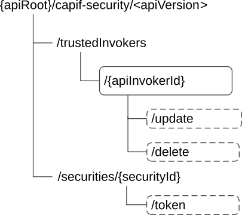

# 8.5.2 Resources

## 8.5.2.1 Overview

This clause describes the structure for the Resource URIs and the resources and methods used for the service.

Figure 8.5.2.1-1 depicts the resource URIs structure for the CAPIF_Security_API.

Figure 8.5.2.1-1: Resource URI structure of the CAPIF_Security_API

Table 8.5.2.1-1 provides an overview of the resources and applicable HTTP methods.

Table 8.5.2.1-1: Resources and methods overview

<table>
<colgroup>
<col style="width: 24%" />
<col style="width: 36%" />
<col style="width: 10%" />
<col style="width: 28%" />
</colgroup>
<thead>
<tr class="header">
<th>Resource name</th>
<th>Resource URI</th>
<th>HTTP method or custom operation</th>
<th>Description</th>
</tr>
</thead>
<tbody>
<tr class="odd">
<td>Trusted API invokers</td>
<td>
/trustedInvokers

(NOTE)
</td>
<td>n/a</td>
<td></td>
</tr>
<tr class="even">
<td rowspan="6">Individual trusted API invoker</td>
<td rowspan="3">
/trustedInvokers/{apiInvokerId}

(NOTE)
</td>
<td>GET</td>
<td>Retrieve authentication information of an API invoker</td>
</tr>
<tr class="odd">
<td>PUT</td>
<td>Create a security context for individual API invoker</td>
</tr>
<tr class="even">
<td>DELETE</td>
<td>Revoke the authorization of the API invoker</td>
</tr>
<tr class="odd">
<td>
/trustedInvokers/{apiInvokerId}/update

(NOTE)
</td>
<td>update (POST)</td>
<td>Update the security context (e.g. re-negotiate the security methods).</td>
</tr>
<tr class="even">
<td>
/trustedInvokers/{apiInvokerId}/delete

(NOTE)
</td>
<td>delete (POST)</td>
<td>Revoke the authorization of the API invoker for some APIs</td>
</tr>
<tr class="odd">
<td>
/securities/{securityId}/token

(NOTE)
</td>
<td>token (POST)</td>
<td>Obtain the OAuth 2.0 authorization information</td>
</tr>
<tr class="even">
<td colspan="4">NOTE: The path segment "trustedInvokers" does not follow the related naming convention defined in clause 7.5.1. The path segment is however kept as currently defined in this specification for backward compatibility considerations.</td>
</tr>
</tbody>
</table>

## 8.5.2.2 Resource: Trusted API invokers

### 8.5.2.2.1 Description

The Trusted API Invokers resource represents all the API invokers that are trusted by the CAPIF core function and have received authentication information from the CAPIF core function.

### 8.5.2.2.2 Resource Definition

Resource URI: **{apiRoot}/capif-security/\<apiVersion\>/trustedInvokers**

This resource shall support the resource URI variables defined in table 8.5.2.2.2-1.

Table 8.5.2.2.2-1: Resource URI variables for this resource

| Name    | Data Type | Definition     |
|---------|-----------|----------------|
| apiRoot | string    | See clause 7.5 |

### 8.5.2.2.3 Resource Standard Methods

#### 8.5.2.2.3.1 Void

### 8.5.2.2.4 Resource Custom Operations

None.

## 8.5.2.3 Resource: Individual trusted API invokers

### 8.5.2.3.1 Description

The Individual trusted API Invokers resource represents an individual API invokers that is trusted by the CAPIF core function and have received security related information from the CAPIF core function.

### 8.5.2.3.2 Resource Definition

Resource URI: **{apiRoot}/capif-security/\<apiVersion\>/trustedInvokers/{apiInvokerId}**

This resource shall support the resource URI variables defined in table 8.5.2.3.2-1.

Table 8.5.2.3.2-1: Resource URI variables for this resource

| Name         | Data Type | Definition                           |
|--------------|-----------|--------------------------------------|
| apiRoot      | string    | See clause 7.5                       |
| apiInvokerId | string    | Identifies an individual API invoker |

### 8.5.2.3.3 Resource Standard Methods

#### 8.5.2.3.3.1 GET

This method shall support the URI query parameters specified in table 8.5.2.3.3.1-1.

Table 8.5.2.3.3.1-1: URI query parameters supported by the GET method on this resource

<table>
<colgroup>
<col style="width: 16%" />
<col style="width: 17%" />
<col style="width: 2%" />
<col style="width: 11%" />
<col style="width: 33%" />
<col style="width: 18%" />
</colgroup>
<thead>
<tr class="header">
<th>Name</th>
<th>Data type</th>
<th>P</th>
<th>Cardinality</th>
<th>Description</th>
<th>Applicability</th>
</tr>
</thead>
<tbody>
<tr class="odd">
<td>authenticationInfo</td>
<td>boolean</td>
<td>O</td>
<td>0..1</td>
<td>
When set to "true", it indicates the CCF to send the authentication information of the API invoker. Set to "false" or omitted.

(NOTE)
</td>
<td></td>
</tr>
<tr class="even">
<td>authorizationInfo</td>
<td>boolean</td>
<td>O</td>
<td>0..1</td>
<td>
When set to "true", it indicates the CCF to send the authorization information of the API invoker. Set to "false" indicates the CCF not to send the authorization information of the API invoker. Default value is "false" if omitted.

(NOTE)
</td>
<td></td>
</tr>
<tr class="odd">
<td colspan="6">NOTE: The query parameters "authenticationInfo" and "authorizationInfo" do not follow the related naming convention defined in clause 7.5.1. These query parameters are however kept as currently defined in this specification for backward compatibility considerations.</td>
</tr>
</tbody>
</table>

This method shall support the request data structures specified in table 8.5.2.3.3.1-2 and the response data structures and response codes specified in table 8.5.2.3.3.1-3.

Table 8.5.2.3.3.1-2: Data structures supported by the GET Request Body on this resource

| Data type | P   | Cardinality | Description |
|-----------|-----|-------------|-------------|
| n/a       |     |             |             |

Table 8.5.2.3.3.1-3: Data structures supported by the GET Response Body on this resource

<table>
<colgroup>
<col style="width: 16%" />
<col style="width: 4%" />
<col style="width: 12%" />
<col style="width: 11%" />
<col style="width: 54%" />
</colgroup>
<thead>
<tr class="header">
<th>Data type</th>
<th>P</th>
<th>Cardinality</th>
<th>
Response

codes
</th>
<th>Description</th>
</tr>
</thead>
<tbody>
<tr class="odd">
<td>ServiceSecurity</td>
<td>M</td>
<td>1</td>
<td>200 OK</td>
<td>The security related information of the API Invoker based on the request from the API exposing function.</td>
</tr>
<tr class="even">
<td>n/a</td>
<td></td>
<td></td>
<td>307 Temporary Redirect</td>
<td>
Temporary redirection, during resource retrieval. The response shall include a Location header field containing an alternative URI of the resource located in an alternative CCF.

Redirection handling is described in clause 5.2.10 of 3GPP TS 29.122 [14].
</td>
</tr>
<tr class="odd">
<td>n/a</td>
<td></td>
<td></td>
<td>308 Permanent Redirect</td>
<td>
Permanent redirection, during resource retrieval. The response shall include a Location header field containing an alternative URI of the resource located in an alternative CCF.

Redirection handling is described in clause 5.2.10 of 3GPP TS 29.122 [14].
</td>
</tr>
<tr class="even">
<td>ProblemDetails</td>
<td>O</td>
<td>0..1</td>
<td>414 URI Too Long</td>
<td>Indicates that the server refuses to process the request because the request-target is too long.</td>
</tr>
<tr class="odd">
<td colspan="5">NOTE: The mandatory HTTP error status codes for the GET method listed in table 5.2.6-1 of 3GPP TS 29.122 [14] also apply.</td>
</tr>
</tbody>
</table>

Table 8.5.2.3.3.1-4: Headers supported by the 307 Response Code on this resource

|          |           |     |             |                                                                   |
|----------|-----------|-----|-------------|-------------------------------------------------------------------|
| Name     | Data type | P   | Cardinality | Description                                                       |
| Location | string    | M   | 1           | An alternative URI of the resource located in an alternative CCF. |

Table 8.5.2.3.3.1-5: Headers supported by the 308 Response Code on this resource

|          |           |     |             |                                                                   |
|----------|-----------|-----|-------------|-------------------------------------------------------------------|
| Name     | Data type | P   | Cardinality | Description                                                       |
| Location | string    | M   | 1           | An alternative URI of the resource located in an alternative CCF. |

#### 8.5.2.3.3.2 DELETE

This method shall support the URI query parameters specified in table 8.5.2.3.3.2-1.

Table 8.5.2.3.3.2-1: URI query parameters supported by the DELETE method on this resource

| Name | Data type | P   | Cardinality | Description |
|------|-----------|-----|-------------|-------------|
| n/a  |           |     |             |             |

This method shall support the request data structures specified in table 8.5.2.3.3.2-2 and the response data structures and response codes specified in table 8.5.2.3.3.2-3.

Table 8.5.2.3.3.2-2: Data structures supported by the DELETE Request Body on this resource

| Data type | P   | Cardinality | Description |
|-----------|-----|-------------|-------------|
| n/a       |     |             |             |

Table 8.5.2.3.3.2-3: Data structures supported by the DELETE Response Body on this resource

<table>
<colgroup>
<col style="width: 16%" />
<col style="width: 4%" />
<col style="width: 12%" />
<col style="width: 11%" />
<col style="width: 54%" />
</colgroup>
<thead>
<tr class="header">
<th>Data type</th>
<th>P</th>
<th>Cardinality</th>
<th>
Response

codes
</th>
<th>Description</th>
</tr>
</thead>
<tbody>
<tr class="odd">
<td>n/a</td>
<td></td>
<td></td>
<td>204 No Content</td>
<td>Authorization of the API invoker revoked, and a notification is sent to the API invoker as specified in clause 8.5.3.2</td>
</tr>
<tr class="even">
<td>n/a</td>
<td></td>
<td></td>
<td>307 Temporary Redirect</td>
<td>
Temporary redirection, during resource termination. The response shall include a Location header field containing an alternative URI of the resource located in an alternative CAPIF core function.

Redirection handling is described in clause 5.2.10 of 3GPP TS 29.122 [14].
</td>
</tr>
<tr class="odd">
<td>n/a</td>
<td></td>
<td></td>
<td>308 Permanent Redirect</td>
<td>
Permanent redirection, during resource termination. The response shall include a Location header field containing an alternative URI of the resource located in an alternative CAPIF core function.

Redirection handling is described in clause 5.2.10 of 3GPP TS 29.122 [14].
</td>
</tr>
<tr class="even">
<td colspan="5">NOTE: The mandatory HTTP error status codes for the DELETE method listed in table 5.2.6-1 of 3GPP TS 29.122 [14] also apply.</td>
</tr>
</tbody>
</table>

Table 8.5.2.3.3.2-4: Headers supported by the 307 Response Code on this resource

|          |           |     |             |                                                                                   |
|----------|-----------|-----|-------------|-----------------------------------------------------------------------------------|
| Name     | Data type | P   | Cardinality | Description                                                                       |
| Location | string    | M   | 1           | An alternative URI of the resource located in an alternative CAPIF core function. |

Table 8.5.2.3.3.2-5: Headers supported by the 308 Response Code on this resource

|          |           |     |             |                                                                                   |
|----------|-----------|-----|-------------|-----------------------------------------------------------------------------------|
| Name     | Data type | P   | Cardinality | Description                                                                       |
| Location | string    | M   | 1           | An alternative URI of the resource located in an alternative CAPIF core function. |

#### 8.5.2.3.3.3 PUT

This method shall support the URI query parameters specified in table 8.5.2.3.3.3-1.

Table 8.5.2.3.3.3-1: URI query parameters supported by the PUT method on this resource

| Name | Data type | P   | Cardinality | Description |
|------|-----------|-----|-------------|-------------|
| n/a  |           |     |             |             |

This method shall support the request data structures specified in table 8.5.2.3.3.3-2 and the response data structures and response codes specified in table 8.5.2.3.3.3-3.

Table 8.5.2.3.3.3-2: Data structures supported by the PUT Request Body on this resource

<table>
<colgroup>
<col style="width: 16%" />
<col style="width: 4%" />
<col style="width: 13%" />
<col style="width: 65%" />
</colgroup>
<thead>
<tr class="header">
<th>Data type</th>
<th>P</th>
<th>Cardinality</th>
<th>Description</th>
</tr>
</thead>
<tbody>
<tr class="odd">
<td>ServiceSecurity</td>
<td>M</td>
<td>1</td>
<td>Security method request from the API invoker to the CAPIF core function. The request indicates a list of service APIs and a preferred method of security for the service APIs. 
 
The request also includes a notification destination URI for security related notifications.</td>
</tr>
</tbody>
</table>

Table 8.5.2.3.3.3-3: Data structures supported by the PUT Response Body on this resource

<table>
<colgroup>
<col style="width: 16%" />
<col style="width: 4%" />
<col style="width: 12%" />
<col style="width: 11%" />
<col style="width: 54%" />
</colgroup>
<thead>
<tr class="header">
<th>Data type</th>
<th>P</th>
<th>Cardinality</th>
<th>
Response

codes
</th>
<th>Description</th>
</tr>
</thead>
<tbody>
<tr class="odd">
<td>ServiceSecurity</td>
<td>M</td>
<td>1</td>
<td>201 Created</td>
<td>Security method from the CAPIF core function to the API invoker is based on the received request. The response indicates the security method to be used for the service APIs 
 
The URI of the created resource shall be returned in the "Location" HTTP header.</td>
</tr>
<tr class="even">
<td>ProblemDetails</td>
<td>O</td>
<td>0..1</td>
<td>414 URI Too Long</td>
<td>Indicates that the server refuses to process the request because the request-target is too long.</td>
</tr>
<tr class="odd">
<td colspan="5">NOTE: The mandatory HTTP error status codes for the PUT method listed in table 5.2.6-1 of 3GPP TS 29.122 [14] also apply.</td>
</tr>
</tbody>
</table>

Table 8.5.2.3.3.3-4: Headers supported by the 201 Response Code on this resource

|          |           |     |             |                                                                                                                                        |
|----------|-----------|-----|-------------|----------------------------------------------------------------------------------------------------------------------------------------|
| Name     | Data type | P   | Cardinality | Description                                                                                                                            |
| Location | string    | M   | 1           | Contains the URI of the newly created resource, according to the structure: {apiRoot}/capif-security/v1/trustedInvokers/{apiInvokerId} |

### 8.5.2.3.4 Resource Custom Operations

#### 8.5.2.3.4.1 Overview

Table 8.5.2.3.4.1-1: Custom operations

| Operation name | Custom operation URI                   | Mapped HTTP method | Description                                                            |
|----------------|----------------------------------------|--------------------|------------------------------------------------------------------------|
| update         | /trustedInvokers/{apiInvokerId}/update | POST               | Update the security instance (e.g. re-negotiate the security methods). |
| delete         | /trustedInvokers/{apiInvokerId}/delete | POST               | Revoke the authorization of the API invoker for some APIs              |
| token          | /securities/{securityId}/token         | POST               | Obtain the OAuth 2.0 authorization information                         |

#### 8.5.2.3.4.2 Operation: update

##### 8.5.2.3.4.2.1 Description

This custom operation updates an existing Individual security instance resource in the CAPIF core function.

##### 8.5.2.3.4.2.2 Operation Definition

This method shall support the URI query parameters specified in table 8.5.2.3.4.2.2-1.

Table 8.5.2.3.4.2.2-1: URI query parameters supported by the POST method on this resource

| Name | Data type | P   | Cardinality | Description |
|------|-----------|-----|-------------|-------------|
| n/a  |           |     |             |             |

This operation shall support the request data structures specified in table 8.5.2.3.4.2.2-2 and the response data structure and response codes specified in table 8.5.2.3.4.2.2-3.

Table 8.5.2.3.4.2.2-2: Data structures supported by the POST Request Body on this resource

<table>
<colgroup>
<col style="width: 21%" />
<col style="width: 4%" />
<col style="width: 13%" />
<col style="width: 60%" />
</colgroup>
<thead>
<tr class="header">
<th>Data type</th>
<th>P</th>
<th>Cardinality</th>
<th>Description</th>
</tr>
</thead>
<tbody>
<tr class="odd">
<td>ServiceSecurity</td>
<td>M</td>
<td>1</td>
<td>Security method request from the API invoker to the CAPIF core function. The request indicates a list of service APIs and a preferred method of security for the service APIs. 
 
The request also includes a notification destination URI for security related notifications.</td>
</tr>
</tbody>
</table>

Table 8.5.2.3.4.2.2-3: Data structures supported by the POST Response Body on this resource

<table>
<colgroup>
<col style="width: 17%" />
<col style="width: 4%" />
<col style="width: 12%" />
<col style="width: 17%" />
<col style="width: 47%" />
</colgroup>
<thead>
<tr class="header">
<th>Data type</th>
<th>P</th>
<th>Cardinality</th>
<th>Response codes</th>
<th>Description</th>
</tr>
</thead>
<tbody>
<tr class="odd">
<td>ServiceSecurity</td>
<td>M</td>
<td>1</td>
<td>200 OK</td>
<td>Security method from the CAPIF core function to the API invoker is based on the received request. The response indicates the security method to be used for the service APIs</td>
</tr>
<tr class="even">
<td>n/a</td>
<td></td>
<td></td>
<td>307 Temporary Redirect</td>
<td>
Temporary redirection, during security instance modification. The response shall include a Location header field containing an alternative URI of the resource located in an alternative CAPIF core function.

Redirection handling is described in clause 5.2.10 of 3GPP TS 29.122 [14].
</td>
</tr>
<tr class="odd">
<td>n/a</td>
<td></td>
<td></td>
<td>308 Permanent Redirect</td>
<td>
Permanent redirection, during security instance modification. The response shall include a Location header field containing an alternative URI of the resource located in an alternative CAPIF core function.

Redirection handling is described in clause 5.2.10 of 3GPP TS 29.122 [14].
</td>
</tr>
<tr class="even">
<td colspan="5">NOTE: The mandatory HTTP error status codes for the POST method listed in table 5.2.6-1 of 3GPP TS 29.122 [14] also apply.</td>
</tr>
</tbody>
</table>

Table 8.5.2.3.4.2.2-4: Headers supported by the 307 Response Code on this resource

|          |           |     |             |                                                                                   |
|----------|-----------|-----|-------------|-----------------------------------------------------------------------------------|
| Name     | Data type | P   | Cardinality | Description                                                                       |
| Location | string    | M   | 1           | An alternative URI of the resource located in an alternative CAPIF core function. |

Table 8.5.2.3.4.2.2-5: Headers supported by the 308 Response Code on this resource

|          |           |     |             |                                                                                   |
|----------|-----------|-----|-------------|-----------------------------------------------------------------------------------|
| Name     | Data type | P   | Cardinality | Description                                                                       |
| Location | string    | M   | 1           | An alternative URI of the resource located in an alternative CAPIF core function. |

#### 8.5.2.3.4.3 Operation: delete

##### 8.5.2.3.4.3.1 Description

This custom operation revokes authorization for some service APIs of an existing Individual security instance resource in the CAPIF core function.

##### 8.5.2.3.4.3.2 Operation Definition

This method shall support the URI query parameters specified in table 8.5.2.3.4.3.2-1.

Table 8.5.2.3.4.3.2-1: URI query parameters supported by the POST method on this resource

| Name | Data type | P   | Cardinality | Description |
|------|-----------|-----|-------------|-------------|
| n/a  |           |     |             |             |

This operation shall support the request data structures specified in table 8.5.2.3.4.3.2-2 and the response data structure and response codes specified in table 8.5.2.3.4.3.2-3.

Table 8.5.2.3.4.3.2-2: Data structures supported by the POST Request Body on this resource

| Data type            | P   | Cardinality | Description                                                                                           |
|----------------------|-----|-------------|-------------------------------------------------------------------------------------------------------|
| SecurityNotification | M   | 1           | It includes a list of API identifiers for which authorization needs to be revoked for an API invoker. |

Table 8.5.2.3.4.3.2-3: Data structures supported by the POST Response Body on this resource

<table>
<colgroup>
<col style="width: 17%" />
<col style="width: 4%" />
<col style="width: 12%" />
<col style="width: 17%" />
<col style="width: 47%" />
</colgroup>
<thead>
<tr class="header">
<th>Data type</th>
<th>P</th>
<th>Cardinality</th>
<th>Response codes</th>
<th>Description</th>
</tr>
</thead>
<tbody>
<tr class="odd">
<td>n/a</td>
<td></td>
<td></td>
<td>204 No Content</td>
<td>
Successful case.

The CAPIF core function revoked the authorization of the API invoker for the requested APIs.
</td>
</tr>
<tr class="even">
<td>n/a</td>
<td></td>
<td></td>
<td>307 Temporary Redirect</td>
<td>
Temporary redirection, during authorization revocation. The response shall include a Location header field containing an alternative URI of the resource located in an alternative CAPIF core function.

Redirection handling is described in clause 5.2.10 of 3GPP TS 29.122 [14].
</td>
</tr>
<tr class="odd">
<td>n/a</td>
<td></td>
<td></td>
<td>308 Permanent Redirect</td>
<td>
Permanent redirection, during authorization revocation. The response shall include a Location header field containing an alternative URI of the resource located in an alternative CAPIF core function.

Redirection handling is described in clause 5.2.10 of 3GPP TS 29.122 [14].
</td>
</tr>
<tr class="even">
<td colspan="5">NOTE: The mandatory HTTP error status codes for the POST method listed in table 5.2.6-1 of 3GPP TS 29.122 [14] also apply.</td>
</tr>
</tbody>
</table>

Table 8.5.2.3.4.3.2-4: Headers supported by the 307 Response Code on this resource

|          |           |     |             |                                                                                   |
|----------|-----------|-----|-------------|-----------------------------------------------------------------------------------|
| Name     | Data type | P   | Cardinality | Description                                                                       |
| Location | string    | M   | 1           | An alternative URI of the resource located in an alternative CAPIF core function. |

Table 8.5.2.3.4.3.2-5: Headers supported by the 308 Response Code on this resource

|          |           |     |             |                                                                                   |
|----------|-----------|-----|-------------|-----------------------------------------------------------------------------------|
| Name     | Data type | P   | Cardinality | Description                                                                       |
| Location | string    | M   | 1           | An alternative URI of the resource located in an alternative CAPIF core function. |

#### 8.5.2.3.4.4 Operation: token

##### 8.5.2.3.4.4.1 Description

This custom operation obtains OAuth 2.0 authorization information from an existing Individual security instance resource in the CAPIF core function.

##### 8.5.2.3.4.4.2 Operation Definition

This method shall support the URI query parameters specified in table 8.5.2.3.4.4.2-1.

Table 8.5.2.3.4.4.2-1: URI query parameters supported by the POST method on this resource

| Name | Data type | P   | Cardinality | Description |
|------|-----------|-----|-------------|-------------|
| n/a  |           |     |             |             |

This operation shall support the request data structures specified in table 8.5.2.3.4.4.2-2 and the response data structure and response codes specified in table 8.5.2.3.4.4.2-3.

Table 8.5.2.3.4.4.2-2: Data structures supported by the POST Request Body on this resource

| Data type      | P   | Cardinality | Description                                                                 |
|----------------|-----|-------------|-----------------------------------------------------------------------------|
| AccessTokenReq | M   | 1           | This IE shall contain the request information for the access token request. |

Table 8.5.2.3.4.4.2-3: Data structures supported by the POST Response Body on this resource

<table>
<colgroup>
<col style="width: 17%" />
<col style="width: 4%" />
<col style="width: 12%" />
<col style="width: 17%" />
<col style="width: 47%" />
</colgroup>
<thead>
<tr class="header">
<th>Data type</th>
<th>P</th>
<th>Cardinality</th>
<th>Response codes</th>
<th>Description</th>
</tr>
</thead>
<tbody>
<tr class="odd">
<td>AccessTokenRsp</td>
<td>M</td>
<td>1</td>
<td>200 OK</td>
<td>This IE shall contain the access token response information.</td>
</tr>
<tr class="even">
<td>n/a</td>
<td></td>
<td></td>
<td>307 Temporary Redirect</td>
<td>
Temporary redirection, during obtaining authorization information. The response shall include a Location header field containing an alternative URI of the resource located in an alternative CAPIF core function.

Redirection handling is described in clause 5.2.10 of 3GPP TS 29.122 [14].
</td>
</tr>
<tr class="odd">
<td>n/a</td>
<td></td>
<td></td>
<td>308 Permanent Redirect</td>
<td>
Permanent redirection, during obtaining authorization information. The response shall include a Location header field containing an alternative URI of the resource located in an alternative CAPIF core function.

Redirection handling is described in clause 5.2.10 of 3GPP TS 29.122 [14].
</td>
</tr>
<tr class="even">
<td>AccessTokenErr</td>
<td>M</td>
<td>1</td>
<td>400 Bad Request</td>
<td>
See IETF RFC 6749 [23] clause 5.2.

The specific error shall be indicated in the "error" attribute of the AccessTokenErr data type, containing any of the values:

- invalid_request

- invalid_client

- invalid_grant

- unauthorized_client

- unsupported_grant_type

- invalid_scope
</td>
</tr>
<tr class="odd">
<td>AccessTokenErr</td>
<td>M</td>
<td>1</td>
<td>401 Unauthorized</td>
<td>
See IETF RFC 6749 [23] clause 5.2.

The specific error shall be indicated in the "error" attribute of the AccessTokenErr data type, containing value:

- invalid_client
</td>
</tr>
<tr class="even">
<td colspan="5">NOTE: The mandatory HTTP error status codes for the POST method listed in table 5.2.6-1 of 3GPP TS 29.122 [14] also apply.</td>
</tr>
</tbody>
</table>

Table 8.5.2.3.4.4.2-4: Headers supported by the 307 Response Code on this resource

|          |           |     |             |                                                                                   |
|----------|-----------|-----|-------------|-----------------------------------------------------------------------------------|
| Name     | Data type | P   | Cardinality | Description                                                                       |
| Location | string    | M   | 1           | An alternative URI of the resource located in an alternative CAPIF core function. |

Table 8.5.2.3.4.4.2-5: Headers supported by the 308 Response Code on this resource

|          |           |     |             |                                                                                   |
|----------|-----------|-----|-------------|-----------------------------------------------------------------------------------|
| Name     | Data type | P   | Cardinality | Description                                                                       |
| Location | string    | M   | 1           | An alternative URI of the resource located in an alternative CAPIF core function. |

#### 8.5.2.3.4.5 Void
