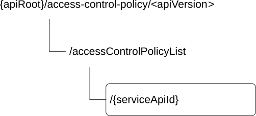

# 8.6 CAPIF_Access_Control_Policy_API

## 8.6.1 API URI

The CAPIF_Access_Control_Policy_API service shall use the CAPIF_Access_Control_Policy_API.

The request URIs used in HTTP requests from the API exposing function towards the CAPIF core function shall have the Resource URI structure as defined in clause 7.5 with the following clarifications:

\- The \<apiName\> shall be "access-control-policy".

\- The \<apiVersion\> shall be "v1".

\- The \<apiSpecificSuffixes\> shall be set as described in clause 8.6.2.

All the resource URIs and the custom operation URIs specified in the clauses below are defined relative to the above API URI.

## 8.6.2 Resources

### 8.6.2.1 Overview

This clause describes the structure for the Resource URIs and the resources and methods used for the service.

Figure 8.6.2.1-1 depicts the resource URIs structure for the CAPIF_Access_Control_Policy_API.

This resource is created by the CAPIF administrator on the CAPIF core function.

NOTE: The details of the mechanisms used to create the Access Control Policy List resource on the CAPIF core function is out of the scope of the present document.

Figure 8.6.2.1-1: Resource URI structure of the CAPIF_Access_Control_Policy_API

Table 8.6.2.1-1 provides an overview of the resources and applicable HTTP methods.

Table 8.6.2.1-1: Resources and methods overview

<table>
<colgroup>
<col style="width: 24%" />
<col style="width: 35%" />
<col style="width: 10%" />
<col style="width: 29%" />
</colgroup>
<thead>
<tr class="header">
<th>Resource name</th>
<th>Resource URI</th>
<th>HTTP method or custom operation</th>
<th>Description</th>
</tr>
</thead>
<tbody>
<tr class="odd">
<td>Access Control Policy List</td>
<td>
/accessControlPolicyList/{serviceApiId}

(NOTE)
</td>
<td>GET</td>
<td>Retrieves the access control policy list for a published service API.</td>
</tr>
<tr class="even">
<td colspan="4">NOTE: The path segment "accessControlPolicyList" does not follow the related naming convention defined in clause 7.5.1. The path segment is however kept as currently defined in this specification for backward compatibility considerations.</td>
</tr>
</tbody>
</table>

### 8.6.2.2 Resource: Access Control Policy List

#### 8.6.2.2.1 Description

The Access Control Policy List resource represents the access control information for all the service APIs per API invoker.

#### 8.6.2.2.2 Resource Definition

Resource URI: **{apiRoot}/access-control-policy/\<apiVersion\>/accessControlPolicyList/{serviceApiId}**

This resource shall support the resource URI variables defined in table 8.6.2.2.2-1.

Table 8.6.2.2.2-1: Resource URI variables for this resource

| Name         | Data Type | Definition                                     |
|--------------|-----------|------------------------------------------------|
| apiRoot      | string    | See clause 7.5                                 |
| serviceApiId | string    | Identifies an individual published service API |

#### 8.6.2.2.3 Resource Standard Methods

##### 8.6.2.2.3.1 GET

This method shall support the URI query parameters specified in table 8.6.2.2.3.1-1.

Table 8.6.2.2.3.1-1: URI query parameters supported by the GET method on this resource

<table>
<colgroup>
<col style="width: 13%" />
<col style="width: 17%" />
<col style="width: 4%" />
<col style="width: 11%" />
<col style="width: 36%" />
<col style="width: 17%" />
</colgroup>
<thead>
<tr class="header">
<th>Name</th>
<th>Data type</th>
<th>P</th>
<th>Cardinality</th>
<th>Description</th>
<th>Applicability</th>
</tr>
</thead>
<tbody>
<tr class="odd">
<td>aef-id</td>
<td>string</td>
<td>M</td>
<td>1</td>
<td>AEF identifier</td>
<td></td>
</tr>
<tr class="even">
<td>api-invoker-id</td>
<td>string</td>
<td>O</td>
<td>1</td>
<td>String identifying the API invoker</td>
<td></td>
</tr>
<tr class="odd">
<td>supported-features</td>
<td>SupportedFeatures</td>
<td>C</td>
<td>0..1</td>
<td>
Contains the list of supported feature(s) among the ones defined in clause 8.6.6.

This query parameter shall be present only when feature negotiation needs to take place.
</td>
<td></td>
</tr>
</tbody>
</table>

This method shall support the request data structures specified in table 8.6.2.2.3.1-2 and the response data structures and response codes specified in table 8.6.2.2.3.1-3.

Table 8.6.2.2.3.1-2: Data structures supported by the GET Request Body on this resource

| Data type | P   | Cardinality | Description |
|-----------|-----|-------------|-------------|
| n/a       |     |             |             |

Table 8.6.2.2.3.1-3: Data structures supported by the GET Response Body on this resource

<table>
<colgroup>
<col style="width: 28%" />
<col style="width: 3%" />
<col style="width: 11%" />
<col style="width: 10%" />
<col style="width: 46%" />
</colgroup>
<thead>
<tr class="header">
<th>Data type</th>
<th>P</th>
<th>Cardinality</th>
<th>
Response

codes
</th>
<th>Description</th>
</tr>
</thead>
<tbody>
<tr class="odd">
<td>AccessControlPolicyList</td>
<td>M</td>
<td>1</td>
<td>200 OK</td>
<td>List of the access control policy applicable for the service API requested.</td>
</tr>
<tr class="even">
<td>n/a</td>
<td></td>
<td></td>
<td>307 Temporary Redirect</td>
<td>
Temporary redirection, during resource retrieval. The response shall include a Location header field containing an alternative URI of the resource located in an alternative CAPIF core function.

Redirection handling is described in clause 5.2.10 of 3GPP TS 29.122 [14].
</td>
</tr>
<tr class="odd">
<td>n/a</td>
<td></td>
<td></td>
<td>308 Permanent Redirect</td>
<td>
Permanent redirection, during resource retrieval. The response shall include a Location header field containing an alternative URI of the resource located in an alternative CAPIF core function.

Redirection handling is described in clause 5.2.10 of 3GPP TS 29.122 [14].
</td>
</tr>
<tr class="even">
<td>ProblemDetails</td>
<td>O</td>
<td>0..1</td>
<td>414 URI Too Long</td>
<td>Indicates that the server refuses to process the request because the request-target is too long.</td>
</tr>
<tr class="odd">
<td colspan="5">NOTE: The mandatory HTTP error status codes for the GET method listed in table 5.2.6-1 of 3GPP TS 29.122 [14] also apply.</td>
</tr>
</tbody>
</table>

Table 8.6.2.2.3.1-4: Headers supported by the 307 Response Code on this resource

|          |           |     |             |                                                                                   |
|----------|-----------|-----|-------------|-----------------------------------------------------------------------------------|
| Name     | Data type | P   | Cardinality | Description                                                                       |
| Location | string    | M   | 1           | An alternative URI of the resource located in an alternative CAPIF core function. |

Table 8.6.2.2.3.1-5: Headers supported by the 308 Response Code on this resource

|          |           |     |             |                                                                                   |
|----------|-----------|-----|-------------|-----------------------------------------------------------------------------------|
| Name     | Data type | P   | Cardinality | Description                                                                       |
| Location | string    | M   | 1           | An alternative URI of the resource located in an alternative CAPIF core function. |

#### 8.6.2.2.4 Resource Custom Operations

There are no notifications defined for this API in this release of the specification.

## 8.6.2A Custom Operations without associated resources

There are no custom operations without associated resources defined for this API in this release of the specification.

## 8.6.3 Notifications

None.

## 8.6.4 Data Model

### 8.6.4.1 General

This clause specifies the application data model supported by the API. Data types listed in clause 7.2 also apply to this API.

Table 8.6.4.1-1 specifies the data types defined specifically for the CAPIF_Access_Control_Policy_API service.

Table 8.6.4.1-1: CAPIF_Access_Control_Policy_API specific Data Types

| Data type               | Section defined  | Description                                                                                           | Applicability |
|-------------------------|------------------|-------------------------------------------------------------------------------------------------------|---------------|
| AccessControlPolicyList | Clause 8.6.4.2.2 | Represents the access control policy list for a published service API.                                |               |
| ApiInvokerPolicy        | Clause 8.6.4.2.3 | Represents the policy of an API Invoker.                                                              |               |
| TimeRangeList           | Clause 8.6.4.2.4 | Represents the time range during which the invocation of a service API is allowed by the API invoker. |               |

Table 8.6.4.1-2 specifies data types re-used by the CAPIF_Access_Control_Policy_API service.

Table 8.6.4.1-2: Re-used Data Types

| Data type         | Reference             | Comments                                                                           | Applicability |
|-------------------|-----------------------|------------------------------------------------------------------------------------|---------------|
| DateTime          | 3GPP TS 29.122 \[14\] | Used to indicate start and end times.                                              |               |
| NetSliceId        | 3GPP TS 29.435 \[31\] | Represents the identification information of a network slice.                      | CAPIF_Ext1    |
| ProblemDetails    | 3GPP TS 29.122 \[14\] | Represents error related information.                                              |               |
| SupportedFeatures | 3GPP TS 29.571 \[19\] | Used to negotiate the applicability of optional features defined in table 8.6.6-1. |               |

### 8.6.4.2 Structured data types

#### 8.6.4.2.1 Introduction

This clause defines data structures to be used in resource representations.

#### 8.6.4.2.2 Type: AccessControlPolicyList

Table 8.6.4.2.2-1: Definition of type AccessControlPolicyList

| Attribute name     | Data type               | P   | Cardinality | Description                 | Applicability |
|--------------------|-------------------------|-----|-------------|-----------------------------|---------------|
| apiInvokerPolicies | array(ApiInvokerPolicy) | O   | 0..N        | Policy of each API invoker. |               |

#### 8.6.4.2.3 Type: ApiInvokerPolicy

Table 8.6.4.2.3-1: Definition of type ApiInvokerPolicy

| Attribute name                 | Data type            | P   | Cardinality | Description                                                                                     | Applicability |
|--------------------------------|----------------------|-----|-------------|-------------------------------------------------------------------------------------------------|---------------|
| apiInvokerId                   | string               | M   | 1           | API invoker ID assigned by the CAPIF core function                                              |               |
| allowedTotalInvocations        | integer              | O   | 0..1        | Total number of invocations allowed on the service API by the API invoker.                      |               |
| allowedInvocationsPerSecond    | integer              | O   | 0..1        | Invocations per second allowed on the service API by the API invoker.                           |               |
| allowedInvocationTimeRangeList | array(TimeRangeList) | O   | 0..N        | The time ranges during which the invocations are allowed on the service API by the API invoker. |               |
| netSliceInfo                   | array(NetSliceId)    | O   | 1..N        | Represents the identifier(s) of the applicable network slice(s).                                | CAPIF_Ext1    |

#### 8.6.4.2.4 Type: TimeRangeList

Table 8.6.4.2.4-1: Definition of type TimeRangeList

| Attribute name | Data type | P   | Cardinality | Description                                                                             | Applicability |
|----------------|-----------|-----|-------------|-----------------------------------------------------------------------------------------|---------------|
| startTime      | DateTime  | M   | 1           | The start time for the invocations to be allowed on the service API by the API invoker. |               |
| stopTime       | DateTime  | M   | 1           | The end time for the invocations to be allowed on the service API by the API invoker.   |               |

### 8.6.4.3 Simple data types and enumerations

None.

## 8.6.5 Error Handling

### 8.6.5.1 General

HTTP error handling shall be supported as specified in clause 7.7.

In addition, the requirements in the following clauses shall apply.

### 8.6.5.2 Protocol Errors

In this Release of the specification, there are no additional protocol errors applicable for the CAPIF_Access_Control_Policy_API.

### 8.6.5.3 Application Errors

The application errors defined for the CAPIF_Access_Control_Policy_API are listed in table 8.6.5.3-1.

Table 8.6.5.3-1: Application errors

| Application Error | HTTP status code | Description | Applicability |
|-------------------|------------------|-------------|---------------|
|                   |                  |             |               |

## 8.6.6 Feature negotiation

General feature negotiation procedures are defined in clause 7.8.

Table 8.6.6-1: Supported Features

<table>
<colgroup>
<col style="width: 16%" />
<col style="width: 23%" />
<col style="width: 60%" />
</colgroup>
<thead>
<tr class="header">
<th>Feature number</th>
<th>Feature Name</th>
<th>Description</th>
</tr>
</thead>
<tbody>
<tr class="odd">
<td>1</td>
<td>CAPIF_Ext1</td>
<td>
Indicates the support of the enhancements to the CAPIF functionality.

Within this feature, the following enhancements are covered:

- Support of the service API access control policy based on the supported network slice(s).
</td>
</tr>
</tbody>
</table>
