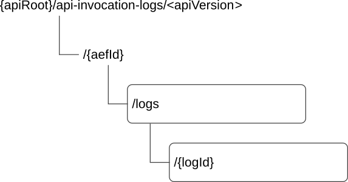

# 8.7 CAPIF_Logging_API_Invocation_API

## 8.7.1 API URI

The CAPIF_Logging_API_Invocation_API service shall use the CAPIF_Logging_API_Invocation_API.

The request URIs used in HTTP requests from the API exposing function towards the CAPIF core function shall have the Resource URI structure as defined in clause 7.5 with the following clarifications:

\- The \<apiName\> shall be "api-invocation-logs".

\- The \<apiVersion\> shall be "v1".

\- The \<apiSpecificSuffixes\> shall be set as described in clause 8.7.2

All the resource URIs and the custom operation URIs specified in the clauses below are defined relative to the above API URI.

## 8.7.2 Resources

### 8.7.2.1 Overview

This clause describes the structure for the Resource URIs and the resources and methods used for the service.

Figure 8.7.2.1-1 depicts the resource URIs structure for the CAPIF_Logging_API_Invocation_API.

Figure 8.7.2.1-1: Resource URI structure of the CAPIF_Logging_API_Invocation_API

Table 8.7.2.1-1 provides an overview of the resources and applicable HTTP methods.

Table 8.7.2.1-1: Resources and methods overview

| Resource name  | Resource URI          | HTTP method or custom operation | Description                                         |
|----------------|-----------------------|---------------------------------|-----------------------------------------------------|
| Logs           | /{aefId}/logs         | POST                            | Creates a new log entry for service API invocations |
| Individual log | /{aefId}/logs/{logId} | n/a                             | Individual log entry                                |

### 8.7.2.2 Resource: Logs

#### 8.7.2.2.1 Description

The Logs resource represents all the log entries created by a API exposing function at CAPIF core function.

#### 8.7.2.2.2 Resource Definition

Resource URI: **{apiRoot}/api-invocation-logs/\<apiVersion\>/{aefId}/logs**

This resource shall support the resource URI variables defined in table 8.7.2.2.2-1.

Table 8.7.2.2.2-1: Resource URI variables for this resource

| Name    | Data Type | Definition                              |
|---------|-----------|-----------------------------------------|
| apiRoot | string    | See clause 7.5                          |
| aefId   | string    | Identifies of the API exposing function |

#### 8.7.2.2.3 Resource Standard Methods

##### 8.7.2.2.3.1 POST

This method shall support the URI query parameters specified in table 8.7.2.2.3.1-1.

Table 8.7.2.2.3.1-1: URI query parameters supported by the POST method on this resource

| Name | Data type | P   | Cardinality | Description |
|------|-----------|-----|-------------|-------------|
| n/a  |           |     |             |             |

This method shall support the request data structures specified in table 8.7.2.2.3.1-2 and the response data structures and response codes specified in table 8.7.2.2.3.1-3.

Table 8.7.2.2.3.1-2: Data structures supported by the POST Request Body on this resource

| Data type     | P   | Cardinality | Description                                                                                           |
|---------------|-----|-------------|-------------------------------------------------------------------------------------------------------|
| InvocationLog | M   | 1           | Log of service API invocations provided by API exposing function to store on the CAPIF core function. |

Table 8.7.2.2.3.1-3: Data structures supported by the POST Response Body on this resource

<table>
<colgroup>
<col style="width: 16%" />
<col style="width: 4%" />
<col style="width: 12%" />
<col style="width: 11%" />
<col style="width: 54%" />
</colgroup>
<thead>
<tr class="header">
<th>Data type</th>
<th>P</th>
<th>Cardinality</th>
<th>
Response

codes
</th>
<th>Description</th>
</tr>
</thead>
<tbody>
<tr class="odd">
<td>InvocationLog</td>
<td>M</td>
<td>1</td>
<td>201 Created</td>
<td>
Log of service API invocations provided by API exposing function successfully stored on the CAPIF core function.

The URI of the created resource shall be returned in the "Location" HTTP header.
</td>
</tr>
<tr class="even">
<td colspan="5">NOTE: The mandatory HTTP error status codes for the POST method listed in table 5.2.6-1 of 3GPP TS 29.122 [14] also apply.</td>
</tr>
</tbody>
</table>

Table 8.7.2.2.3.1-4: Headers supported by the 201 Response Code on this resource

|          |           |     |             |                                                                                                                                               |
|----------|-----------|-----|-------------|-----------------------------------------------------------------------------------------------------------------------------------------------|
| Name     | Data type | P   | Cardinality | Description                                                                                                                                   |
| Location | string    | M   | 1           | Contains the URI of the newly created resource, according to the structure: {apiRoot}/api-invocation-logs/\<apiVersion\>/{aefId}/logs/{logId} |

#### 8.7.2.2.4 Resource Custom Operations

None.

## 8.7.2A Custom Operations without associated resources

There are no custom operations without associated resources defined for this API in this release of the specification.

## 8.7.3 Notifications

There are no notifications defined for this API in this release of the specification.

## 8.7.4 Data Model

### 8.7.4.1 General

This clause specifies the application data model supported by the API. Data types listed in clause 7.2 also apply to this API.

Table 8.7.4.1-1 specifies the data types defined specifically for the CAPIF_Logging_API_Invocation_API service.

Table 8.7.4.1-1: CAPIF_Logging_API_Invocation_API specific Data Types

| Data type     | Section defined  | Description                                                                            | Applicability |
|---------------|------------------|----------------------------------------------------------------------------------------|---------------|
| DurationMs    | Clause 8.7.4.3.2 | Represents the period of time in units of milliseconds.                                |               |
| InvocationLog | Clause 8.7.4.2.2 | Represents the set of Service API invocation logs to be stored on CAPIF core function. |               |
| Log           | Clause 8.7.4.2.3 | Represents the individual service API invocation log entry.                            |               |

Table 8.7.4.1-2 specifies data types re-used by the CAPIF_Logging_API_Invocation_API service.

Table 8.7.4.1-2: Re-used Data Types

| Data type            | Reference             | Comments                                                                           | Applicability         |
|----------------------|-----------------------|------------------------------------------------------------------------------------|-----------------------|
| DateTime             | 3GPP TS 29.122 \[14\] | Used to indicate the invocation time.                                              |                       |
| InterfaceDescription | Clause 8.2.4.2.3      | Represents the description of the API interface.                                   |                       |
| NetSliceId           | 3GPP TS 29.435 \[31\] | Represents the identification information of a network slice.                      | SliceBasedAPIExposure |
| Operation            | Clause 8.2.4.3.7      | Used to indicate the HTTP operation                                                |                       |
| Protocol             | Clause 8.2.4.3.3      | Represents a protocol and protocol version used by an API.                         |                       |
| SupportedFeatures    | 3GPP TS 29.571 \[19\] | Used to negotiate the applicability of optional features defined in table 8.7.6-1. |                       |
| Uri                  | 3GPP TS 29.122 \[14\] | Represents a URI.                                                                  |                       |

### 8.7.4.2 Structured data types

#### 8.7.4.2.1 Introduction

This clause defines the structured data types to be used in resource representations of the CAPIF_Logging_API_Invocation_API.

#### 8.7.4.2.2 Type: InvocationLog

Table 8.7.4.2.2-1: Definition of type InvocationLog

<table>
<colgroup>
<col style="width: 14%" />
<col style="width: 10%" />
<col style="width: 4%" />
<col style="width: 14%" />
<col style="width: 35%" />
<col style="width: 20%" />
</colgroup>
<thead>
<tr class="header">
<th>Attribute name</th>
<th>Data type</th>
<th>P</th>
<th>Cardinality</th>
<th>Description</th>
<th>Applicability</th>
</tr>
</thead>
<tbody>
<tr class="odd">
<td>aefId</td>
<td>string</td>
<td>M</td>
<td>1</td>
<td>Identity information of the API exposing function requesting logging of service API invocations</td>
<td></td>
</tr>
<tr class="even">
<td>apiInvokerId</td>
<td>string</td>
<td>M</td>
<td>1</td>
<td>Identity of the API invoker which invoked the service API</td>
<td></td>
</tr>
<tr class="odd">
<td>logs</td>
<td>array(Log)</td>
<td>M</td>
<td>1..N</td>
<td>Service API invocation log</td>
<td></td>
</tr>
<tr class="even">
<td>supportedFeatures</td>
<td>SupportedFeatures</td>
<td>O</td>
<td>0..1</td>
<td>
Used to negotiate the supported optional features of the API as described in clause 7.8.

This attribute shall be provided in the HTTP POST request and in the response of successful resource creation.
</td>
<td></td>
</tr>
</tbody>
</table>

#### 8.7.4.2.3 Type: Log

Table 8.7.4.2.3-1: Definition of type Log

<table>
<colgroup>
<col style="width: 25%" />
<col style="width: 15%" />
<col style="width: 4%" />
<col style="width: 12%" />
<col style="width: 29%" />
<col style="width: 13%" />
</colgroup>
<thead>
<tr class="header">
<th>Attribute name</th>
<th>Data type</th>
<th>P</th>
<th>Cardinality</th>
<th>Description</th>
<th>Applicability</th>
</tr>
</thead>
<tbody>
<tr class="odd">
<td>apiId</td>
<td>string</td>
<td>M</td>
<td>1</td>
<td>String identifying the API invoked.</td>
<td></td>
</tr>
<tr class="even">
<td>apiName</td>
<td>string</td>
<td>M</td>
<td>1</td>
<td>Contains the invoked API name set to the value of the "&lt;apiName&gt;" placeholder of the API URI as defined in clause 5.2.4 of 3GPP TS 29.122 [14].</td>
<td></td>
</tr>
<tr class="odd">
<td>apiVersion</td>
<td>string</td>
<td>M</td>
<td>1</td>
<td>Version of the API which was invoked</td>
<td></td>
</tr>
<tr class="even">
<td>resourceName</td>
<td>string</td>
<td>M</td>
<td>1</td>
<td>Name of the specific resource invoked</td>
<td></td>
</tr>
<tr class="odd">
<td>uri</td>
<td>Uri</td>
<td>O</td>
<td>0..1</td>
<td>Full URI of the API resource as defined in clause 5.2.4 of 3GPP TS 29.122 [14].</td>
<td></td>
</tr>
<tr class="even">
<td>protocol</td>
<td>Protocol</td>
<td>M</td>
<td>1</td>
<td>Protocol invoked.</td>
<td></td>
</tr>
<tr class="odd">
<td>operation</td>
<td>Operation</td>
<td>C</td>
<td>0..1</td>
<td>Operation that was invoked on the API, only applicable for HTTP protocol.</td>
<td></td>
</tr>
<tr class="even">
<td>result</td>
<td>string</td>
<td>M</td>
<td>1</td>
<td>For HTTP protocol, it contains HTTP status code of the invocation</td>
<td></td>
</tr>
<tr class="odd">
<td>invocationTime</td>
<td>DateTime</td>
<td>O</td>
<td>0..1</td>
<td>Contains the time and date at which the API was invoked.</td>
<td></td>
</tr>
<tr class="even">
<td>invocationLatency</td>
<td>DurationMs</td>
<td>O</td>
<td>0..1</td>
<td>Contains the time duration of the API invocation at the AEF, i.e., the time interval between the reception of the API invocation request and the sending of the API invocation response at the AEF, expressed in units of milliseconds.</td>
<td></td>
</tr>
<tr class="odd">
<td>inputParameters</td>
<td>
ANY TYPE

(NOTE)
</td>
<td>O</td>
<td>0..1</td>
<td>List of input parameters</td>
<td></td>
</tr>
<tr class="even">
<td>outputParameters</td>
<td>
ANY TYPE

(NOTE)
</td>
<td>O</td>
<td>0..1</td>
<td>List of output parameters</td>
<td></td>
</tr>
<tr class="odd">
<td>srcInterface</td>
<td>InterfaceDescription</td>
<td>O</td>
<td>0..1</td>
<td>Interface description of the API invoker.</td>
<td></td>
</tr>
<tr class="even">
<td>destInterface</td>
<td>InterfaceDescription</td>
<td>O</td>
<td>0..1</td>
<td>Interface description of the API invoked.</td>
<td></td>
</tr>
<tr class="odd">
<td>fwdInterface</td>
<td>string</td>
<td>O</td>
<td>0..1</td>
<td>It includes the node identifier (as defined in IETF RFC 7239 [20] of all forwarding entities between the API invoker and the AEF, concatenated with comma and space, e.g. 192.0.2.43:80, unknown:_OBFport, 203.0.113.60</td>
<td></td>
</tr>
<tr class="even">
<td>netSliceInfo</td>
<td>NetSliceId</td>
<td>O</td>
<td>0..1</td>
<td>Contains the identifier of the network slice within which API invocation took place.</td>
<td>SliceBasedAPIExposure</td>
</tr>
<tr class="odd">
<td colspan="6">NOTE: Any basic data type defined in OpenAPI Specification [3] may be used.</td>
</tr>
</tbody>
</table>

### 8.7.4.3 Simple data types and enumerations

#### 8.7.4.3.1 Introduction

This clause defines simple data types and enumerations that can be referenced from data structures defined in the previous clauses.

#### 8.7.4.3.2 Simple data types

The simple data types defined in table 8.7.4.3.2-1 shall be supported.

Table 8.7.4.3.2-1: Simple data types

| Type Name  | Type Definition | Description                                                             | Applicability |
|------------|-----------------|-------------------------------------------------------------------------|---------------|
| DurationMs | integer         | Unsigned integer identifying a period of time in units of milliseconds. |               |

## 8.7.5 Error Handling

### 8.7.5.1 General

HTTP error handling shall be supported as specified in clause 7.7.

In addition, the requirements in the following clauses shall apply.

### 8.7.5.2 Protocol Errors

In this Release of the specification, there are no additional protocol errors applicable for the CAPIF_Logging_API_Invocation_API.

### 8.7.5.3 Application Errors

The application errors defined for the CAPIF_Logging_API_Invocation_API are listed in table 8.7.5.3-1.

Table 8.7.5.3-1: Application errors

| Application Error | HTTP status code | Description | Applicability |
|-------------------|------------------|-------------|---------------|
|                   |                  |             |               |

## 8.7.6 Feature negotiation

Table 8.7.6-1: Supported Features

<table>
<colgroup>
<col style="width: 16%" />
<col style="width: 23%" />
<col style="width: 60%" />
</colgroup>
<thead>
<tr class="header">
<th>Feature number</th>
<th>Feature Name</th>
<th>Description</th>
</tr>
</thead>
<tbody>
<tr class="odd">
<td>1</td>
<td>SliceBasedAPIExposure</td>
<td>
Indicates the support of the network slice-based API exposure functionality.

Within this feature, the following enhancements are covered:

- Support the provisioning of the network slice information in the API log.
</td>
</tr>
</tbody>
</table>
