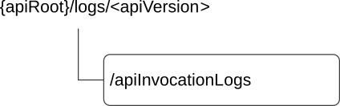

# 8.8 CAPIF_Auditing_API

## 8.8.1 API URI

The CAPIF_Auditing_API service shall use the CAPIF_Auditing_API.

The request URIs used in HTTP requests from the API management function towards the CAPIF core function shall have the Resource URI structure as defined in clause 7.5 with the following clarifications:

\- The \<apiName\> shall be "logs".

\- The \<apiVersion\> shall be "v1".

\- The \<apiSpecificSuffixes\> shall be set as described in clause 8.8.2.

All the resource URIs and the custom operation URIs specified in the clauses below are defined relative to the above API URI.

## 8.8.2 Resources

### 8.8.2.1 Overview

This clause describes the structure for the Resource URIs and the resources and methods used for the service.

Figure 8.8.2.1-1 depicts the resource URIs structure for the CAPIF_Auditing_API.

Figure 8.8.2.1-1: Resource URI structure of the CAPIF_Auditing_API

Table 8.8.2.1-1 provides an overview of the resources and applicable HTTP methods.

Table 8.8.2.1-1: Resources and methods overview

<table>
<colgroup>
<col style="width: 25%" />
<col style="width: 31%" />
<col style="width: 12%" />
<col style="width: 30%" />
</colgroup>
<thead>
<tr class="header">
<th>Resource name</th>
<th>Resource URI</th>
<th>HTTP method or custom operation</th>
<th>Description</th>
</tr>
</thead>
<tbody>
<tr class="odd">
<td>All service API invocation logs (Store)</td>
<td>
/apiInvocationLogs

(NOTE)
</td>
<td>GET</td>
<td>Query and retrieve service API invocation logs stored on the CAPIF core function</td>
</tr>
<tr class="even">
<td colspan="4">NOTE: The path segment "apiInvocationLogs" does not follow the related naming convention defined in clause 7.5.1. The path segment is however kept as currently defined in this specification for backward compatibility considerations.</td>
</tr>
</tbody>
</table>

### 8.8.2.2 Resource: All service API invocation logs

#### 8.8.2.2.1 Description

The All service API invocation logs resource represents a collection of service API invocation logs stored on the CAPIF core function. The resource is modelled as a Store resource archetype (see annex C.3 of 3GPP TS 29.501 \[18\])

#### 8.8.2.2.2 Resource Definition

Resource URI: **{apiRoot}/logs/\<apiVersion\>/apiInvocationLogs**

This resource shall support the resource URI variables defined in table 8.8.2.2.2-1.

Table 8.8.2.2.2-1: Resource URI variables for this resource

| Name    | Data Type | Definition     |
|---------|-----------|----------------|
| apiRoot | string    | See clause 7.5 |

#### 8.8.2.2.3 Resource Standard Methods

##### 8.8.2.2.3.1 GET

This method shall support the URI query parameters specified in table 8.8.2.2.3.1-1.

Table 8.8.2.2.3.1-1: URI query parameters supported by the GET method on this resource

<table>
<colgroup>
<col style="width: 10%" />
<col style="width: 18%" />
<col style="width: 2%" />
<col style="width: 11%" />
<col style="width: 35%" />
<col style="width: 21%" />
</colgroup>
<thead>
<tr class="header">
<th>Name</th>
<th>Data type</th>
<th>P</th>
<th>Cardinality</th>
<th>Description</th>
<th>Applicability</th>
</tr>
</thead>
<tbody>
<tr class="odd">
<td>aef-id</td>
<td>string</td>
<td>O</td>
<td>0..1</td>
<td>String identifying the API exposing function</td>
<td></td>
</tr>
<tr class="even">
<td>api-invoker-id</td>
<td>string</td>
<td>O</td>
<td>0..1</td>
<td>String identifying the API invoker which invoked the service API</td>
<td></td>
</tr>
<tr class="odd">
<td>time-range-start</td>
<td>DateTime</td>
<td>O</td>
<td>0..1</td>
<td>Start time of the invocation time range</td>
<td></td>
</tr>
<tr class="even">
<td>time-range-end</td>
<td>DateTime</td>
<td>O</td>
<td>0..1</td>
<td>End time of the invocation time range</td>
<td></td>
</tr>
<tr class="odd">
<td>api-id</td>
<td>string</td>
<td>O</td>
<td>0..1</td>
<td>String identifying the API invoked.</td>
<td></td>
</tr>
<tr class="even">
<td>api-name</td>
<td>string</td>
<td>O</td>
<td>0..1</td>
<td>Contains the API name set to the value of the "&lt;apiName&gt;" placeholder of the API URI as defined in clause 5.2.4 of 3GPP TS 29.122 [14].</td>
<td></td>
</tr>
<tr class="odd">
<td>api-version</td>
<td>string</td>
<td>O</td>
<td>0..1</td>
<td>Version of the API which was invoked</td>
<td></td>
</tr>
<tr class="even">
<td>protocol</td>
<td>Protocol</td>
<td>O</td>
<td>0..1</td>
<td>Protocol invoked</td>
<td></td>
</tr>
<tr class="odd">
<td>operation</td>
<td>Operation</td>
<td>O</td>
<td>0..1</td>
<td>Operation that was invoked on the API</td>
<td></td>
</tr>
<tr class="even">
<td>result</td>
<td>string</td>
<td>O</td>
<td>0..1</td>
<td>HTTP status code of the invocation</td>
<td></td>
</tr>
<tr class="odd">
<td>resource-name</td>
<td>string</td>
<td>O</td>
<td>0..1</td>
<td>Name of the specific resource invoked</td>
<td></td>
</tr>
<tr class="even">
<td>src-interface</td>
<td>InterfaceDescription</td>
<td>O</td>
<td>0..1</td>
<td>Interface description of the API invoker.</td>
<td></td>
</tr>
<tr class="odd">
<td>dest-interface</td>
<td>InterfaceDescription</td>
<td>O</td>
<td>0..1</td>
<td>Interface description of the API invoked.</td>
<td></td>
</tr>
<tr class="even">
<td>net-slice-info</td>
<td>array(NetSliceId)</td>
<td>O</td>
<td>1..N</td>
<td>Contains the identifier(s) of the network slice(s) within which the API shall be available.</td>
<td>SliceBasedAPIExposure</td>
</tr>
<tr class="odd">
<td>supported-features</td>
<td>SupportedFeatures</td>
<td>C</td>
<td>0..1</td>
<td>
Contains the list of supported feature(s) among the ones defined in in clause 8.8.6.

This query parameter shall be present only when feature negotiation needs to take place.
</td>
<td></td>
</tr>
</tbody>
</table>

This method shall support the request data structures specified in table 8.8.2.2.3.1-2 and the response data structures and response codes specified in table 8.8.2.2.3.1-3.

Table 8.8.2.2.3.1-2: Data structures supported by the GET Request Body on this resource

| Data type | P   | Cardinality | Description |
|-----------|-----|-------------|-------------|
| n/a       |     |             |             |

Table 8.8.2.2.3.1-3: Data structures supported by the GET Response Body on this resource

<table>
<colgroup>
<col style="width: 28%" />
<col style="width: 3%" />
<col style="width: 11%" />
<col style="width: 10%" />
<col style="width: 46%" />
</colgroup>
<thead>
<tr class="header">
<th>Data type</th>
<th>P</th>
<th>Cardinality</th>
<th>
Response

codes
</th>
<th>Description</th>
</tr>
</thead>
<tbody>
<tr class="odd">
<td>InvocationLogsRetrieveRes</td>
<td>M</td>
<td>1</td>
<td>200 OK</td>
<td>Result of the query operation along with fetched service API invocation log data.</td>
</tr>
<tr class="even">
<td>n/a</td>
<td></td>
<td></td>
<td>307 Temporary Redirect</td>
<td>
Temporary redirection, during resource retrieval. The response shall include a Location header field containing an alternative URI of the resource located in an alternative CAPIF core function.

Redirection handling is described in clause 5.2.10 of 3GPP TS 29.122 [14].
</td>
</tr>
<tr class="odd">
<td>n/a</td>
<td></td>
<td></td>
<td>308 Permanent Redirect</td>
<td>
Permanent redirection, during resource retrieval. The response shall include a Location header field containing an alternative URI of the resource located in an alternative CAPIF core function.

Redirection handling is described in clause 5.2.10 of 3GPP TS 29.122 [14].
</td>
</tr>
<tr class="even">
<td>ProblemDetails</td>
<td>O</td>
<td>0..1</td>
<td>414 URI Too Long</td>
<td>Indicates that the server is refusing to service the request because the request-target is too long.</td>
</tr>
<tr class="odd">
<td colspan="5">NOTE: The mandatory HTTP error status codes for the HTTP GET method listed in table 5.2.6-1 of 3GPP TS 29.122 [14] shall also apply.</td>
</tr>
</tbody>
</table>

Table 8.8.2.2.3.1-4: Headers supported by the 307 Response Code on this resource

|          |           |     |             |                                                                                   |
|----------|-----------|-----|-------------|-----------------------------------------------------------------------------------|
| Name     | Data type | P   | Cardinality | Description                                                                       |
| Location | string    | M   | 1           | An alternative URI of the resource located in an alternative CAPIF core function. |

Table 8.8.2.2.3.1-5: Headers supported by the 308 Response Code on this resource

|          |           |     |             |                                                                                   |
|----------|-----------|-----|-------------|-----------------------------------------------------------------------------------|
| Name     | Data type | P   | Cardinality | Description                                                                       |
| Location | string    | M   | 1           | An alternative URI of the resource located in an alternative CAPIF core function. |

#### 8.8.2.2.4 Resource Custom Operations

None.

## 8.8.2A Custom Operations without associated resources

There are no custom operations without associated resources defined for this API in this release of the specification.

## 8.8.3 Notifications

There are no notifications defined for this API in this release of the specification.

## 8.8.4 Data Model

### 8.8.4.1 General

This clause specifies the application data model supported by the API. Data types listed in clause 7.2 also apply to this API.

Table 8.8.4.1-1 specifies the data types defined specifically for the CAPIF_Auditing_API service.

Table 8.8.4.1-1: CAPIF_Auditing_API specific Data Types

| Data type                 | Section defined | Description                                                  | Applicability    |
|---------------------------|-----------------|--------------------------------------------------------------|------------------|
| InvocationLogs            | 8.8.4.2.2       | Contains multiple invocation logs.                           | EnQueryInvokeLog |
| InvocationLogsRetrieveRes | 8.8.4.2.3       | Contains the result of an invocation logs retrieval request. |                  |

Table 8.8.4.1-2 specifies data types re-used by the CAPIF_Auditing_API service:

Table 8.8.4.1-2: Re-used Data Types

| Data type            | Reference             | Comments                                                                             | Applicability         |
|----------------------|-----------------------|--------------------------------------------------------------------------------------|-----------------------|
| DateTime             | 3GPP TS 29.122 \[14\] | Used to indicate the start and end times.                                            |                       |
| InterfaceDescription | Clause 8.2.4.2.3      | Represents the description of the API interface.                                     |                       |
| InvocationLog        | Clause 8.7.4.2.2      | Used to represent logs of service API invocations stored on the CAPIF core function. |                       |
| NetSliceId           | 3GPP TS 29.435 \[31\] | Represents the identification information of a network slice.                        | SliceBasedAPIExposure |
| Operation            | Clause 8.2.4.3.7      | Used to indicate the HTTP operation.                                                 |                       |
| ProblemDetails       | 3GPP TS 29.122 \[14\] | Used to represent the problem details in an error message.                           |                       |
| Protocol             | Clause 8.2.4.3.3      | Represents a protocol and protocol version used by an API.                           |                       |
| SupportedFeatures    | 3GPP TS 29.571 \[19\] | Used to negotiate the applicability of optional features defined in table 8.8.6-1.   |                       |

### 8.8.4.2 Structured data types

#### 8.8.4.2.1 Introduction

This clause defines the structured data types to be used in resource representations of the CAPIF_Auditing_API.

#### 8.8.4.2.2 Type: InvocationLogs

Table 8.8.4.2.2-1: Definition of type InvocationLogs

<table>
<colgroup>
<col style="width: 18%" />
<col style="width: 19%" />
<col style="width: 4%" />
<col style="width: 11%" />
<col style="width: 33%" />
<col style="width: 12%" />
</colgroup>
<thead>
<tr class="header">
<th>Attribute name</th>
<th>Data type</th>
<th>P</th>
<th>Cardinality</th>
<th>Description</th>
<th>Applicability</th>
</tr>
</thead>
<tbody>
<tr class="odd">
<td>multipleInvocationLogs</td>
<td>array(InvocationLog)</td>
<td>M</td>
<td>1..N</td>
<td>
Contains a multiple API invocation logs.

The "supportedFeatures" attribute within the InvocationLog data type shall not be provided.
</td>
<td></td>
</tr>
<tr class="even">
<td>supportedFeatures</td>
<td>SupportedFeatures</td>
<td>C</td>
<td>0..1</td>
<td>
Used to negotiate the supported optional features of the API as described in clause 8.8.6.

This parameter shall be included in HTTP GET response, if the consumer includes "supported-features" in the GET request.
</td>
<td></td>
</tr>
</tbody>
</table>

### 8.8.4.3 Simple data types and enumerations

None.

### 8.8.4.4 Data types describing alternative data types or combinations of data types

#### 8.8.4.4.1 Type: InvocationLogsRetrieveRes

Table 8.8.4.4.1-1: Definition of type InvocationLogsRetrieveRes as a list of mutually exclusive alternatives

<table>
<colgroup>
<col style="width: 29%" />
<col style="width: 4%" />
<col style="width: 12%" />
<col style="width: 35%" />
<col style="width: 17%" />
</colgroup>
<thead>
<tr class="header">
<th>Data type</th>
<th>P</th>
<th>Cardinality</th>
<th>Description</th>
<th>Applicability</th>
</tr>
</thead>
<tbody>
<tr class="odd">
<td>InvocationLog</td>
<td>C</td>
<td>0..1</td>
<td>
Contains a single API invocation log.

(NOTE)
</td>
<td></td>
</tr>
<tr class="even">
<td>InvocationLogs</td>
<td>C</td>
<td>0..1</td>
<td>
Contains multiple (more than one) API invocation logs.

(NOTE)
</td>
<td>EnQueryInvokeLog</td>
</tr>
<tr class="odd">
<td colspan="5">NOTE: The InvocationLogs attribute shall be provided if the EnQueryInvokeLog feature is supported and requested by the API invoker, otherwise only the InvocationLog data type shall be provided.</td>
</tr>
</tbody>
</table>

## 8.8.5 Error Handling

### 8.8.5.1 General

HTTP error handling shall be supported as specified in clause 7.7.

In addition, the requirements in the following clauses shall apply.

### 8.8.5.2 Protocol Errors

In this Release of the specification, there are no additional protocol errors applicable for the CAPIF_Auditing_API.

### 8.8.5.3 Application Errors

The application errors defined for the CAPIF_Auditing_API are listed in table 8.8.5.3-1.

Table 8.8.5.3-1: Application errors

| Application Error | HTTP status code | Description | Applicability |
|-------------------|------------------|-------------|---------------|
|                   |                  |             |               |

## 8.8.6 Feature negotiation

General feature negotiation procedures are defined in clause 7.8.

Table 8.8.6-1: Supported Features

<table>
<colgroup>
<col style="width: 16%" />
<col style="width: 23%" />
<col style="width: 60%" />
</colgroup>
<thead>
<tr class="header">
<th>Feature number</th>
<th>Feature Name</th>
<th>Description</th>
</tr>
</thead>
<tbody>
<tr class="odd">
<td>1</td>
<td>EnQueryInvokeLog</td>
<td>This feature indicates support for the enhancements of query invocation log.</td>
</tr>
<tr class="even">
<td>2</td>
<td>SliceBasedAPIExposure</td>
<td>
Indicates the support of the network slice-based API exposure functionality.

Within this feature, the following enhancements are covered:

- Support the filtering based on the network slice information.
</td>
</tr>
</tbody>
</table>
