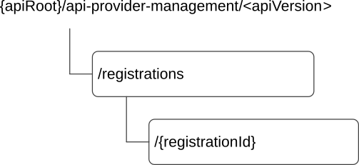

# 8.9.2 Resources

## 8.9.2.1 Overview

This clause describes the structure for the Resource URIs and the resources and methods used for the service.

Figure 8.9.2.1-1 depicts the resource URIs structure for the CAPIF_API_Provider_Management_API.

Figure 8.9.2.1-1: Resource URI structure of the CAPIF_API_Provider_Management_API

Table 8.9.2.1-1 provides an overview of the resources and applicable HTTP methods.

Table 8.9.2.1-1: Resources and methods overview

| Resource name                               | Resource URI                    | HTTP method or custom operation | Description                                                                                                           |
|---------------------------------------------|---------------------------------|---------------------------------|-----------------------------------------------------------------------------------------------------------------------|
| All API Provider Domains Registrations      | /registrations                  | POST                            | Registers a new API provider domain by creating an API provider domain with API provider domain functions profiles.   |
| Individual API Provider Domain Registration | /registrations/{registrationId} | PUT                             | Updates an individual API provider domain identified by {registrationId}                                              |
|                                             |                                 | PATCH                           | Modifies an individual API provider domain identified by {registrationId}                                             |
|                                             |                                 | DELETE                          | Deregisters an API provider domain by deleting the API provider domain and functions, identified by {registrationId}. |

## 8.9.2.2 Resource: All API Provider Domains Registrations

### 8.9.2.2.1 Description

The All API provider domains registrations resource represents all the API provider domains that are registered at a given CAPIF core function.

### 8.9.2.2.2 Resource Definition

Resource URI: **{apiRoot}/api-provider-management/\<apiVersion\>/registrations**

This resource shall support the resource URI variables defined in table 8.9.2.2.2-1.

Table 8.9.2.2.2-1: Resource URI variables for this resource

| Name    | Data Type | Definition     |
|---------|-----------|----------------|
| apiRoot | string    | See clause 7.5 |

### 8.9.2.2.3 Resource Standard Methods

#### 8.9.2.2.3.1 POST

This method shall support the URI query parameters specified in table 8.9.2.2.3.1-1.

Table 8.9.2.2.3.1-1: URI query parameters supported by the POST method on this resource

| Name | Data type | P   | Cardinality | Description |
|------|-----------|-----|-------------|-------------|
| n/a  |           |     |             |             |

This method shall support the request data structures specified in table 8.9.2.2.3.1-2 and the response data structures and response codes specified in table 8.9.2.2.3.1-3.

Table 8.9.2.2.3.1-2: Data structures supported by the POST Request Body on this resource

| Data type                   | P   | Cardinality | Description                                                                                             |
|-----------------------------|-----|-------------|---------------------------------------------------------------------------------------------------------|
| APIProviderEnrolmentDetails | M   | 1           | Enrolment details of the API provider domain including individual API provider domain function details. |

Table 8.9.2.2.3.1-3: Data structures supported by the POST Response Body on this resource

<table>
<colgroup>
<col style="width: 25%" />
<col style="width: 3%" />
<col style="width: 11%" />
<col style="width: 10%" />
<col style="width: 48%" />
</colgroup>
<thead>
<tr class="header">
<th>Data type</th>
<th>P</th>
<th>Cardinality</th>
<th>
Response

codes
</th>
<th>Description</th>
</tr>
</thead>
<tbody>
<tr class="odd">
<td>APIProviderEnrolmentDetails</td>
<td>M</td>
<td>1</td>
<td>201 Created</td>
<td>
API provider domain registered successfully

The URI of the created resource shall be returned in the "Location" HTTP header.

The list of successfully registered individual API provider domain functions, registration specific failure information of failed API provider domain function registrations, are included in APIProviderEnrolmentDetails which is provided in the response body.
</td>
</tr>
<tr class="even">
<td colspan="5">NOTE: The mandatory HTTP error status codes for the POST method listed in table 5.2.6-1 of 3GPP TS 29.122 [14] also apply.</td>
</tr>
</tbody>
</table>

Table 8.9.2.2.3.1-4: Headers supported by the 201 Response Code on this resource

|          |           |     |             |                                                                                                                                                             |
|----------|-----------|-----|-------------|-------------------------------------------------------------------------------------------------------------------------------------------------------------|
| Name     | Data type | P   | Cardinality | Description                                                                                                                                                 |
| Location | string    | M   | 1           | Contains the URI of the newly created resource, according to the structure: {apiRoot}/api-provider-management/\<apiVersion\>/registrations/{registrationId} |

### 8.9.2.2.4 Resource Custom Operations

None.

## 8.9.2.3 Resource: Individual API Provider Domain Registration

### 8.9.2.3.1 Description

The Individual API Provide Domain Registration resource represents an individual API provider domain that is registered at a given CAPIF core function.

### 8.9.2.3.2 Resource Definition

Resource URI: **{apiRoot}/api-provider-management/\<apiVersion\>/registrations/{registrationId}**

This resource shall support the resource URI variables defined in table 8.9.2.3.2-1.

Table 8.9.2.3.2-1: Resource URI variables for this resource

| Name           | Data Type | Definition                                                       |
|----------------|-----------|------------------------------------------------------------------|
| apiRoot        | string    | See clause 7.5                                                   |
| registrationId | string    | Identifies an individual registered API Provider domain resource |

### 8.9.2.3.3 Resource Standard Methods

#### 8.9.2.3.3.1 PUT

The PUT method allows updating the registered API provider domain's detail. The properties "apiProvDomId", and "suppFeat" shall remain unchanged from previously provided values. This method shall support the URI query parameters specified in table 8.9.2.3.3.1-1.

Table 8.9.2.3.3.1-1: URI query parameters supported by the PUT method on this resource

| Name | Data type | P   | Cardinality | Description |
|------|-----------|-----|-------------|-------------|
| n/a  |           |     |             |             |

This method shall support the request data structures specified in the table 8.9.2.3.3.1-2 and the response data structures and response codes specified in the table 8.9.2.3.3.1-3.

Table 8.9.2.3.3.1-2: Data structures supported by the PUT Request Body on this resource

| Data type                   | P   | Cardinality | Description                                 |
|-----------------------------|-----|-------------|---------------------------------------------|
| APIProviderEnrolmentDetails | M   | 1           | Updated details of the API provider domain. |

Table 8.9.2.3.3.1-3: Data structures supported by the PUT Response Body on this resource

<table>
<colgroup>
<col style="width: 25%" />
<col style="width: 3%" />
<col style="width: 11%" />
<col style="width: 10%" />
<col style="width: 49%" />
</colgroup>
<thead>
<tr class="header">
<th>Data type</th>
<th>P</th>
<th>Cardinality</th>
<th>
Response

codes
</th>
<th>Description</th>
</tr>
</thead>
<tbody>
<tr class="odd">
<td>APIProviderEnrolmentDetails</td>
<td>M</td>
<td>1</td>
<td>200 OK</td>
<td>
API provider domain's information updated successfully.

Updated details of the API provider domain is part of the APIProviderEnrolmentDetails, which is provided in the response body. The list of successfully updated individual API provider domain functions, registration update specific failure information of failed API provider domain function registration updates, are included in APIProviderEnrolmentDetails which is provided in the response body.
</td>
</tr>
<tr class="even">
<td>n/a</td>
<td></td>
<td></td>
<td>204 No Content</td>
<td>API provider domain's information updated successfully.</td>
</tr>
<tr class="odd">
<td>n/a</td>
<td></td>
<td></td>
<td>307 Temporary Redirect</td>
<td>
Temporary redirection, during resource modification. The response shall include a Location header field containing an alternative URI of the resource located in an alternative CAPIF core function.

Redirection handling is described in clause 5.2.10 of 3GPP TS 29.122 [14].
</td>
</tr>
<tr class="even">
<td>n/a</td>
<td></td>
<td></td>
<td>308 Permanent Redirect</td>
<td>
Permanent redirection, during resource modification. The response shall include a Location header field containing an alternative URI of the resource located in an alternative CAPIF core function.

Redirection handling is described in clause 5.2.10 of 3GPP TS 29.122 [14].
</td>
</tr>
<tr class="odd">
<td colspan="5">NOTE: The mandatory HTTP error status codes for the PUT method listed in table 5.2.6-1 of 3GPP TS 29.122 [14] also apply.</td>
</tr>
</tbody>
</table>

Table 8.9.2.3.3.1-4: Headers supported by the 307 Response Code on this resource

|          |           |     |             |                                                                                   |
|----------|-----------|-----|-------------|-----------------------------------------------------------------------------------|
| Name     | Data type | P   | Cardinality | Description                                                                       |
| Location | string    | M   | 1           | An alternative URI of the resource located in an alternative CAPIF core function. |

Table 8.9.2.3.3.1-5: Headers supported by the 308 Response Code on this resource

|          |           |     |             |                                                                                   |
|----------|-----------|-----|-------------|-----------------------------------------------------------------------------------|
| Name     | Data type | P   | Cardinality | Description                                                                       |
| Location | string    | M   | 1           | An alternative URI of the resource located in an alternative CAPIF core function. |

#### 8.9.2.3.3.2 DELETE

This method shall support the URI query parameters specified in table 8.9.2.3.3.2-1.

Table 8.9.2.3.3.2-1: URI query parameters supported by the DELETE method on this resource

| Name | Data type | P   | Cardinality | Description |
|------|-----------|-----|-------------|-------------|
| n/a  |           |     |             |             |

This method shall support the response codes specified in table 8.9.2.3.3.2-2 and the response data structures and response codes specified in table 8.9.2.3.3.2-3.

Table 8.9.2.3.3.2-2: Data structures supported by the DELETE Request Body on this resource

| Data type | P   | Cardinality | Description |
|-----------|-----|-------------|-------------|
| n/a       |     |             |             |

Table 8.9.2.3.3.2-3: Data structures supported by the DELETE Response Body on this resource

<table>
<colgroup>
<col style="width: 16%" />
<col style="width: 4%" />
<col style="width: 12%" />
<col style="width: 11%" />
<col style="width: 54%" />
</colgroup>
<thead>
<tr class="header">
<th>Data type</th>
<th>P</th>
<th>Cardinality</th>
<th>
Response

codes
</th>
<th>Description</th>
</tr>
</thead>
<tbody>
<tr class="odd">
<td>n/a</td>
<td></td>
<td></td>
<td>204 No Content</td>
<td>The individual registered API provider domain matching the registrationId is deleted. All the individual API provider domain functions of the API provider domain are deleted.</td>
</tr>
<tr class="even">
<td>n/a</td>
<td></td>
<td></td>
<td>307 Temporary Redirect</td>
<td>
Temporary redirection, during resource termination. The response shall include a Location header field containing an alternative URI of the resource located in an alternative CAPIF core function.

Redirection handling is described in clause 5.2.10 of 3GPP TS 29.122 [14].
</td>
</tr>
<tr class="odd">
<td>n/a</td>
<td></td>
<td></td>
<td>308 Permanent Redirect</td>
<td>
Permanent redirection, during resource termination. The response shall include a Location header field containing an alternative URI of the resource located in an alternative CAPIF core function.

Redirection handling is described in clause 5.2.10 of 3GPP TS 29.122 [14].
</td>
</tr>
<tr class="even">
<td colspan="5">NOTE: The mandatory HTTP error status codes for the DELETE method listed in table 5.2.6-1 of 3GPP TS 29.122 [14] also apply.</td>
</tr>
</tbody>
</table>

Table 8.9.2.3.3.2-4: Headers supported by the 307 Response Code on this resource

|          |           |     |             |                                                                                   |
|----------|-----------|-----|-------------|-----------------------------------------------------------------------------------|
| Name     | Data type | P   | Cardinality | Description                                                                       |
| Location | string    | M   | 1           | An alternative URI of the resource located in an alternative CAPIF core function. |

Table 8.9.2.3.3.2-5: Headers supported by the 308 Response Code on this resource

|          |           |     |             |                                                                                   |
|----------|-----------|-----|-------------|-----------------------------------------------------------------------------------|
| Name     | Data type | P   | Cardinality | Description                                                                       |
| Location | string    | M   | 1           | An alternative URI of the resource located in an alternative CAPIF core function. |

#### 8.9.2.3.3.3 PATCH

This method shall support the URI query parameters specified in table 8.9.2.3.3.3-1.

Table 8.9.2.3.3.3-1: URI query parameters supported by the PATCH method on this resource

| Name | Data type | P   | Cardinality | Description |
|------|-----------|-----|-------------|-------------|
| n/a  |           |     |             |             |

This method shall support the request data structures specified in table 8.9.2.3.3.3-2 and the response data structures and response codes specified in table 8.9.2.3.3.3-3.

Table 8.9.2.3.3.3-2: Data structures supported by the PATCH Request Body on this resource

| Data type                        | P   | Cardinality | Description                                  |
|----------------------------------|-----|-------------|----------------------------------------------|
| APIProviderEnrolmentDetailsPatch | M   | 1           | Modified details of the API provider domain. |

Table 8.9.2.3.3.3-3: Data structures supported by the PATCH Response Body on this resource

<table>
<colgroup>
<col style="width: 25%" />
<col style="width: 3%" />
<col style="width: 11%" />
<col style="width: 10%" />
<col style="width: 49%" />
</colgroup>
<thead>
<tr class="header">
<th>Data type</th>
<th>P</th>
<th>Cardinality</th>
<th>
Response

codes
</th>
<th>Description</th>
</tr>
</thead>
<tbody>
<tr class="odd">
<td>APIProviderEnrolmentDetails</td>
<td>M</td>
<td>1</td>
<td>200 OK</td>
<td>
API provider domain's information updated successfully.

Updated details of the API provider domain is part of the APIProviderEnrolmentDetails, which is provided in the response body. The list of successfully updated individual API provider domain functions, registration update specific failure information of failed API provider domain function registration updates, are included in APIProviderEnrolmentDetails which is provided in the response body.
</td>
</tr>
<tr class="even">
<td>n/a</td>
<td></td>
<td></td>
<td>204 No Content</td>
<td>API provider domain's information modified successfully.</td>
</tr>
<tr class="odd">
<td>n/a</td>
<td></td>
<td></td>
<td>307 Temporary Redirect</td>
<td>
Temporary redirection, during resource modification. The response shall include a Location header field containing an alternative URI of the resource located in an alternative CAPIF core function.

Redirection handling is described in clause 5.2.10 of 3GPP TS 29.122 [14].
</td>
</tr>
<tr class="even">
<td>n/a</td>
<td></td>
<td></td>
<td>308 Permanent Redirect</td>
<td>
Permanent redirection, during resource modification. The response shall include a Location header field containing an alternative URI of the resource located in an alternative CAPIF core function.

Redirection handling is described in clause 5.2.10 of 3GPP TS 29.122 [14].
</td>
</tr>
<tr class="odd">
<td colspan="5">NOTE: The mandatory HTTP error status codes for the HTTP PATCH method listed in table 5.2.6-1 of 3GPP TS 29.122 [14] also apply.</td>
</tr>
</tbody>
</table>

Table 8.9.2.3.3.3-4: Headers supported by the 307 Response Code on this resource

|          |           |     |             |                                                                                   |
|----------|-----------|-----|-------------|-----------------------------------------------------------------------------------|
| Name     | Data type | P   | Cardinality | Description                                                                       |
| Location | string    | M   | 1           | An alternative URI of the resource located in an alternative CAPIF core function. |

Table 8.9.2.3.3.3-5: Headers supported by the 308 Response Code on this resource

|          |           |     |             |                                                                                   |
|----------|-----------|-----|-------------|-----------------------------------------------------------------------------------|
| Name     | Data type | P   | Cardinality | Description                                                                       |
| Location | string    | M   | 1           | An alternative URI of the resource located in an alternative CAPIF core function. |

### 8.9.2.3.4 Resource Custom Operations

None.
