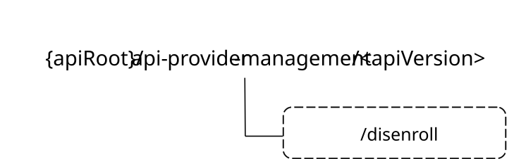

# 8.9.2A Custom Operations without associated resources

## 8.9.2A.1 Overview

The structure of the custom operation URIs of the CAPIF_API_Provider_Management_API is shown in Figure 8.9.2A.1-1.

Figure 8.9.2A.1-1: Custom operation URI structure of the CAPIF_API_Provider_Management_API

Table 8.9.2A.1-1 provides an overview of the custom operations and applicable HTTP methods defined for the CAPIF_API_Provider_Management_API.

Table 8.9.2A.1-1: Custom operations without associated resources

| Operation name | Custom operation URI                                       | Mapped HTTP method | Description                                                                |
|----------------|------------------------------------------------------------|--------------------|----------------------------------------------------------------------------|
| Disenroll      | {apiRoot}/api-provider-management/\<apiVersion\>/disenroll | POST               | Request the CCF to remove enrolled service API(s) for a given API Invoker. |

The custom operations shall support the URI variables defined in table 8.9.2A.1-2.

Table 8.9.2A.1-2: URI variables for this custom operation

| Name    | Data type | Definition        |
|---------|-----------|-------------------|
| apiRoot | string    | See clause 8.9.1. |

## 8.9.2A.2 Operation: disenroll

### 8.9.2A.2.1 Description

This custom operation is used by the AMF to request the CCF to remove enrolled service API(s) for a given API Invoker.

### 8.9.2A.2.2 Operation Definition

This method shall support the URI query parameters specified in table 8.9.2A.2.2-1.

Table 8.9.2A.2.2-1: URI query parameters supported by the POST method on this resource

| Name | Data type | P   | Cardinality | Description |
|------|-----------|-----|-------------|-------------|
| n/a  |           |     |             |             |

This operation shall support the request data structures specified in table 8.9.2A.2.2-2 and the response data structure and response codes specified in table 8.9.2A.2.2-3.

Table 8.9.2A.2.2-2: Data structures supported by the POST Request Body on this resource

| Data type    | P   | Cardinality | Description                                                                                       |
|--------------|-----|-------------|---------------------------------------------------------------------------------------------------|
| DisenrollReq | M   | 1           | Contains the parameters of the request to remove enrolled service API(s) for a given API Invoker. |

Table 8.9.2A.2.2-3: Data structures supported by the POST Response Body on this resource

<table>
<colgroup>
<col style="width: 17%" />
<col style="width: 4%" />
<col style="width: 12%" />
<col style="width: 17%" />
<col style="width: 47%" />
</colgroup>
<thead>
<tr class="header">
<th>Data type</th>
<th>P</th>
<th>Cardinality</th>
<th>Response codes</th>
<th>Description</th>
</tr>
</thead>
<tbody>
<tr class="odd">
<td>DisenrollRsp</td>
<td>M</td>
<td>1</td>
<td>200 OK</td>
<td>Contains the result of the request to remove enrolled service API(s) for a given API Invoker.</td>
</tr>
<tr class="even">
<td>n/a</td>
<td>M</td>
<td>1</td>
<td>204 No Content</td>
<td>No Content. All the requested service API(s) are removed for the targeted API Invoker.</td>
</tr>
<tr class="odd">
<td>n/a</td>
<td></td>
<td></td>
<td>307 Temporary Redirect</td>
<td>
Temporary redirection.

The response shall include a Location header field containing an alternative URI of the resource located in an alternative CCF.

Redirection handling is described in clause 5.2.10 of 3GPP TS 29.122 [14].
</td>
</tr>
<tr class="even">
<td>n/a</td>
<td></td>
<td></td>
<td>308 Permanent Redirect</td>
<td>
Permanent redirection.

The response shall include a Location header field containing an alternative URI of the resource located in an alternative CCF.

Redirection handling is described in clause 5.2.10 of 3GPP TS 29.122 [14].
</td>
</tr>
<tr class="odd">
<td colspan="5">NOTE: The mandatory HTTP error status codes for the POST method listed in table 5.2.6-1 of 3GPP TS 29.122 [14] also apply.</td>
</tr>
</tbody>
</table>

Table 8.9.2A.2.2-4: Headers supported by the 307 Response Code

|          |           |     |             |                                                                            |
|----------|-----------|-----|-------------|----------------------------------------------------------------------------|
| Name     | Data type | P   | Cardinality | Description                                                                |
| Location | string    | M   | 1           | Contains an alternative URI of the resource located in an alternative CCF. |

Table 8.9.2A.2.2-5: Headers supported by the 308 Response Code on this resource

|          |           |     |             |                                                                            |
|----------|-----------|-----|-------------|----------------------------------------------------------------------------|
| Name     | Data type | P   | Cardinality | Description                                                                |
| Location | string    | M   | 1           | Contains an alternative URI of the resource located in an alternative CCF. |
