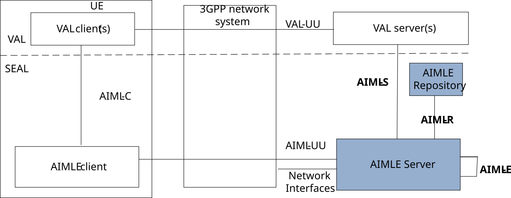

# 4 Overview

The AIMLE Layer forms part of the SEAL Enabler Layer defined in 3GPP TS 23.434 \[13\] and aims to ensure the efficient use and deployment of AIML capabilities for vertical applications. The AIMLE Layer, via the AIMLE Server and ML Repository, support for this purpose the functionalities defined in clause 6 of 3GPP TS 23.482 \[9\].

Figure 4-1 shows the reference model of the AIMLE service, with a focus on the AIMLE Server and ML Repository.

Figure 4-1: AIMLE service functional model
