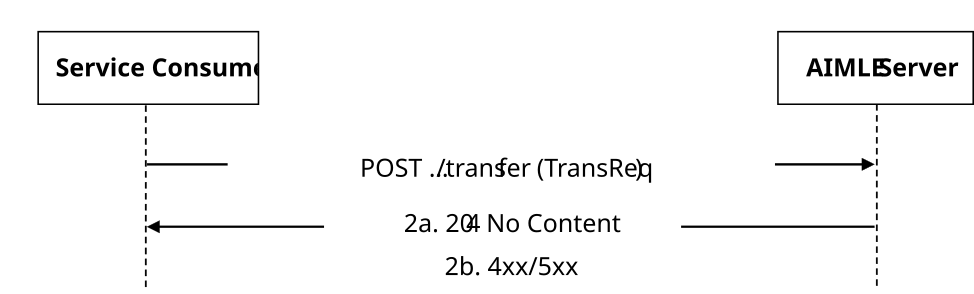

# 5.2.1 AIMLES_ContextTransfer Service

## 5.2.1.1 Service Description

The AIMLES_ContextTransfer service exposed by the AIMLE Server enables a service consumer to:

\- request AIMLE context transfer to the AIMLE Server.

## 5.2.1.2 Service Operations

### 5.2.1.2.1 Introduction

The service operations defined for AIMLES_ContextTransfer API are shown in the table 5.2.1.2.1-1.

Table 5.2.1.2.1-1: AIMLES_ContextTransfer Service Operations

| Service Operation Name         | Description                                                                                 | Initiated by       |
|--------------------------------|---------------------------------------------------------------------------------------------|--------------------|
| AIMLES_ContextTransfer_Request | This service operation is used by a service consumer to request the AIMLE context transfer. | e.g., AIMLE Server |

### 5.2.1.2.2 AIMLES_ContextTransfer_Request

#### 5.2.1.2.2.1 General

This service operation is used by a service consumer to request AIMLE context transfer to the AIMLE Server.

The following procedures are supported by the "AIMLES_ContextTransfer_Request" service operation:

\- AIMLE Context Transfer Request.

#### 5.2.1.2.2.2 AIMLE Context Transfer Request

Figure 5.2.1.2.2.2-1 depicts a scenario where a service consumer sends a request to the AIMLE Server to request AIMLE context transfer (see also clause 8.24 of 3GPP TS 23.482 \[9\]).

Figure 5.2.1.2.2.2-1: Procedure for AIMLE Context Transfer Request

1\. In order to request AIMLE context transfer, the service consumer shall send an HTTP POST request to the AIMLE Server targeting the URI of the corresponding custom operation (i.e., "Transfer"), with the request body including the TransReq data structure.

2a. Upon success, the AIMLE Server shall respond with an HTTP "204 No Content" status code to indicate that the AIMLE context transfer request is successfully received and processed.

2b. On failure, the appropriate HTTP status code indicating the error shall be returned and appropriate additional error information should be returned in the HTTP POST response body, as specified in clause 6.1.1.7.
