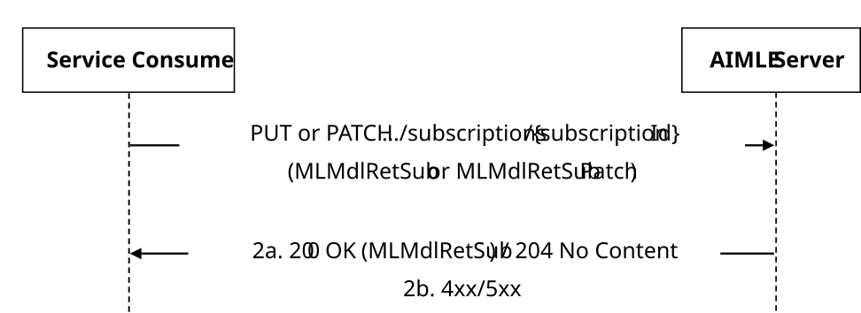
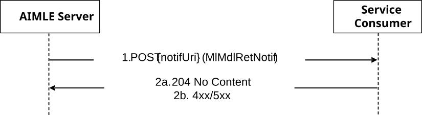

# 5.2.10 AIMLES_MLModelRetrieval Service

## 5.2.10.1 Service Description

The AIMLES_MLModelRetrieval service exposed by the AIMLE Server enables a service consumer to:

\- request AIMLE server for AIMLE ML Model retrieval according to filtering criteria;

\- request AIMLE server to create/update/delete a AIMLE ML Model retrieval subscription; and

\- receive AIMLE ML Model retrieval notifications.

## 5.2.10.2 Service Operations

### 5.2.10.2.1 Introduction

The service operations defined for the AIMLES_MLModelRetrieval API are shown in the table 5.2.10.2.1-1.

Table 5.2.10.2.1-1: Service operations of the AIMLES_MLModelRetrieval API

| Service Operation Name              | Description                                                                                                    | Initiated by                  |
|-------------------------------------|----------------------------------------------------------------------------------------------------------------|-------------------------------|
| AIMLES_MLModelRetrieval_Request     | This service operation enables a service consumer to request for AIMLE ML Model Retrieval.                     | e.g. VAL Server, AIMLE Client |
| AIMLES_MLModelRetrieval_Subscribe   | This service operation enables a service consumer to create a AIMLE ML Model Retrieval Subscription.           | e.g. VAL Server, AIMLE Client |
| AIMLES_MLModelRetrieval_Update      | This service operation enables a service consumer to update an existing AIMLE ML Model Retrieval Subscription. | e.g. VAL Server, AIMLE Client |
| AIMLES_MLModelRetrieval_Unsubscribe | This service operation enables a service consumer to delete an existing AIMLE ML Model Retrieval Subscription. | e.g. VAL Server, AIMLE Client |
| AIMLES_MLModelRetrieval_Notify      | This service operation enables a service consumer to receive AIMLE ML Model Retrieval notifications.           | AIMLE Server                  |

### 5.2.10.2.2 AIMLES_MLModelRetrieval_Request

#### 5.2.10.2.2.1 General

This service operation is used by a service consumer to request for one time AIMLE ML Model retrieval at the AIMLE server.

The following procedures are supported by the "AIMLES_MLModelRetrieval_Request" service operation:

\- AIMLE ML Model Retrieval Request.

#### 5.2.10.2.2.2 AIMLE ML Model Retrieval Request

Figure 5.2.10.2.2.2-1 depicts a scenario where a service consumer sends a request to the AIMLE Server for one time AIMLE ML Model Retrieval (see also clause 8.2 of 3GPP TS 23.482 \[9\]).

Figure 5.2.10.2.2.2-1: Procedure for AIMLE ML Model Retrieval Request

1\. In order to request for one time AIMLE ML Model Retrieval, the service consumer shall send an HTTP POST request to the AIMLE Server targeting the URI of the "Retrieve" custom operation (i.e., "{apiRoot}/aimles-mlmr/\<apiVersion\>/retrieve") as specified in clause 6.1.13.4, with the request body including the MLMdlRetReq data structure.

2a. Upon success, the AIMLE Server shall respond with an HTTP "200 OK" status code with the response body including the MLMdlRetRsp data structure.

2b. On failure, the appropriate HTTP status code indicating the error shall be returned and appropriate additional error information should be returned in the HTTP POST response body, as specified in clause 6.1.13.7.

### 5.2.10.2.3 AIMLES_MLModelRetrieval_Subscribe

#### 5.2.10.2.3.1 General

This service operation is used by a service consumer to request the creation of AIMLE ML Model Retrieval Subscription at the AIMLE server.

The following procedures are supported by the "AIMLES_MLModelRetrieval_Subscribe" service operation:

\- AIMLE ML Model Retrieval Subscription Creation.

#### 5.2.10.2.3.2 AIMLE ML Model Retrieval Subscription Creation

Figure 5.2.10.2.3.2-1 depicts a scenario where a service consumer sends a request to the AIMLE Server to request the creation of AIMLE ML Model Retrieval Subscription (see also clause 8.2 of 3GPP TS 23.482 \[9\]).

Figure 5.2.10.2.3.2-1: Procedure for AIMLE ML Model Retrieval Subscription Creation

1\. In order to subscribe to AIMLE ML Model Retrieval, the service consumer shall send an HTTP POST request to the AIMLE Server targeting the URI of the "AIMLE ML Model Retrieval Subscriptions" collection resource, with the request body including the MLMdlRetSub data structure.

2a. Upon success, the AIMLE Server shall respond with an HTTP "201 Created" status code with the response body containing a representation of the created "Individual AIMLE ML Model Retrieval Subscription" resource within the MLMdlRetSub data structure, and an HTTP "Location" header field containing the URI of the created resource.

2b. On failure, the appropriate HTTP status code indicating the error shall be returned and appropriate additional error information should be returned in the HTTP POST response body, as specified in clause 6.1.13.7.

### 5.2.10.2.4 AIMLES_MLModelRetrieval_Update

#### 5.2.10.2.4.1 General

This service operation is used by a service consumer to request the update of a AIMLE ML Model Retrieval Subscription at the AIMLE server.

The following procedures are supported by the "AIMLES_MLModelRetrieval_Update" service operation:

\- AIMLE ML Model Retrieval Subscription Update.

#### 5.2.10.2.4.2 AIMLE ML Model Retrieval Subscription Update

Figure 5.2.10.2.4.2-1 depicts a scenario where a service consumer sends a request to the AIMLE Server to request the update of AIMLE ML Model Retrieval Subscription (see also clause 8.2 of 3GPP TS 23.482 \[9\]).

Figure 5.2.10.2.4.2-1: Procedure for AIMLE ML Model Retrieval Subscription Update

1\. In order to request the update of an existing AIMLE ML Model Retrieval Subscription, the service consumer shall send an HTTP PUT/PATCH request to the AIMLE Server, targeting the URI of the corresponding "Individual AIMLE ML Model Retrieval Subscription" resource, with the request body including either:

\- the updated representation of the resource within the MLMdlRetSub data structure, in case the HTTP PUT method is used; or

\- the requested modifications to the resource within the MLMdlRetSubPatch data structure, in case the HTTP PATCH method is used.

NOTE: An alternative service consumer (i.e. other than the one that requested the creation of the targeted resource) can initiate this request.

2a. Upon success, the AIMLE Server shall update the targeted "AIMLE ML Model Retrieval Subscription" resource accordingly and respond with either:

\- an HTTP "200 OK" status code with the response body containing a representation of the updated "Individual AIMLE ML Model Retrieval Subscription" resource within the MLMdlRetSub data structure; or

\- an HTTP "204 No Content" status code.

2b. On failure, the appropriate HTTP status code indicating the error shall be returned and appropriate additional error information should be returned in the HTTP PUT/PATCH response body, as specified in clause 6.1.13.7.

### 5.2.10.2.5 AIMLES_MLModelRetrieval_Unsubscribe

#### 5.2.10.2.5.1 General

This service operation is used by a service consumer to request the deletion of AIMLE ML Model Retrieval Subscription at the AIMLE Server.

The following procedures are supported by the "AIMLES_MLModelRetrieval_Unsubscribe" service operation:

\- AIMLE ML Model Retrieval Subscription Deletion.

#### 5.2.10.2.5.2 AIMLE ML Model Retrieval Subscription Deletion

Figure 5.2.10.2.5.2-1 depicts a scenario where a service consumer sends a request to the AIMLE Server to delete an existing AIMLE ML Model Retrieval Subscription (see also clause 8.2 of 3GPP TS 23.482 \[9\]).

Figure 5.2.10.2.5.2-1: Procedure for AIMLE ML Model Retrieval Subscription Deletion

1\. In order to request the deletion of an existing AIMLE ML Model Retrieval Subscription, the service consumer shall send an HTTP DELETE request to the AIMLE Server targeting the URI of the corresponding "Individual AIMLE ML Model Retrieval Subscription" resource.

NOTE: An alternative service consumer (i.e. other than the one that requested the creation of the targeted resource) can initiate this request.

2a. Upon success, the AIMLE Server shall respond with an HTTP "204 No Content" status code.

2b. On failure, the appropriate HTTP status code indicating the error shall be returned and appropriate additional error information should be returned in the HTTP DELETE response body, as specified in clause 6.1.13.7.

### 5.2.10.2.6 AIMLES_MLModelRetrieval_Notify

#### 5.2.10.2.6.1 General

This service operation is used by a AIMLE Server to notify a previously subscribed service consumer on:

\- AIMLE ML Model Retrieval report(s).

The following procedures are supported by the "AIMLES_MLModelRetrieval_Notify" service operation:

\- AIMLE ML Model Retrieval Notification.

#### 5.2.10.2.6.2 AIMLE ML Model Retrieval Notification

Figure 5.2.10.2.6.2-1 depicts a scenario where the AIMLE Server sends a request to notify a previously subscribed service consumer on AIMLE ML Model Retrieval report(s) (see also clause 8.2 of 3GPP TS 23.482 \[9\]).

Figure 5.2.10.2.6.2-1: Procedure for AIMLE ML Model Retrieval Notification

1\. In order to notify a previously subscribed service consumer on AIMLE ML Model Retrieval report(s), the AIMLE Server shall send an HTTP POST request to the service consumer with the request URI set to "{notifUri}", where the "notifUri" variable is set to the value received from the service consumer during the creation of the corresponding AIMLE ML Model Retrieval Subscription using the procedures defined in clauses 5.2.10.2.2.2, and the request body including the MlMdlRetNotif data structure.

2a. Upon success, the service consumer shall respond to the AIMLE Server with an HTTP "204 No Content" status code to acknowledge the reception of the notification.

2b. On failure, the appropriate HTTP status code indicating the error shall be returned and appropriate additional error information should be returned in the HTTP POST response body, as specified in clause 6.1.13.7.
