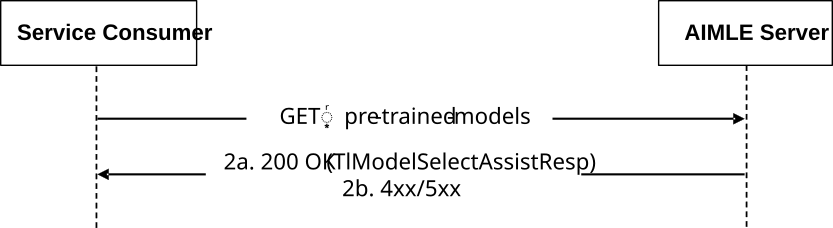

# 5.2.11 AIMLES_TLModelSelectionAssistance Service

## 5.2.11.1 Service Description

The AIMLES_TLModelSelectionAssistance Service, exposed by the AIMLE Server, enables a service consumer to:

\- request AIMLE Server to provide pre-trained ML models for a target ML task by using filter criteria.

## 5.2.11.2 Service Operations

### 5.2.11.2.1 Introduction

The service operations defined for the AIMLES_TLModelSelectionAssistance API are shown in the table 5.2.11.2.1-1.

Table 5.2.11.2.1-1: Service operations of the AIMLES_TLModelSelectionAssistance API

| Service Operation Name                    | Description                                                                                                    | Initiated by     |
|-------------------------------------------|----------------------------------------------------------------------------------------------------------------|------------------|
| AIMLES_TLModelSelectionAssistance_Request | This service operation enables a service consumer to perform an ML model training by using pre-trained models. | e.g., VAL Server |

### 5.2.11.2.2 AIMLES_TLModelSelectionAssistance_Request

#### 5.2.11.2.2.1 General

This service operation is used by a service consumer to perform AIMLE TL Model Selection Assistance Request at the AIMLE Server.

The following procedures are supported by the "AIMLES_TLModelSelectionAssistance_Request" service operation:

\- AIMLE TL Model Selection Assistance Request.

#### 5.2.11.2.2.2 AIMLE TL Model Selection Assistance Request

Figure 5.2.11.2.2.2-1 depicts a scenario where a service consumer sends a request to the AIMLE Server to request AIMLE TL Model Selection Assistance (see also clause 8.16 of 3GPP TS 23.482 \[9\]).

Figure 5.2.11.2.2.2-1: Procedure for AIMLE TL Model Selection Assistance Request

1\. In order to request to AIMLE TL model selection assistance, the service consumer shall send an HTTP GET request to the AIMLE Server targeting the URI of the "AIMLE TL Model Selection Assistance" resource.

2a. Upon success, the AIMLE Server shall respond with an HTTP "200 OK" status code with the response body containing the TlModelSelectAssistResp data structure.

2b. On failure, the appropriate HTTP status code indicating the error shall be returned and appropriate additional error information should be returned in the HTTP GET response body, as specified in clause 6.1.10.7.
