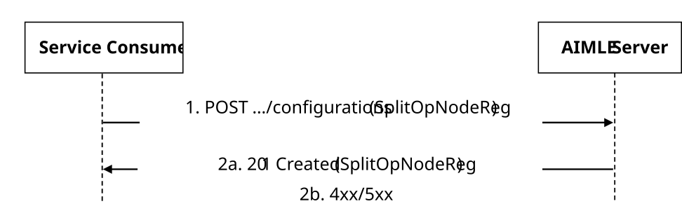
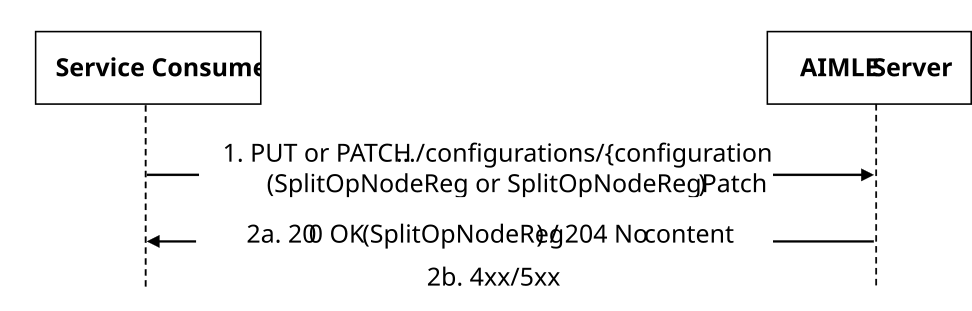
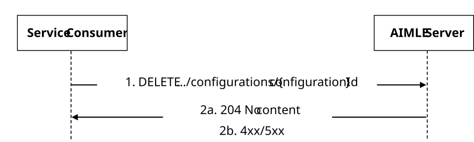

# 5.2.12 AIMLES_SplitOpNodeRegistration

## 5.2.12.1 Service Description

The AIMLES_SplitOpNodeRegistration service exposed by the AIMLE Server enables a service consumer to:

\- request, update, and deregister for split AI/ML operation node registration.

## 5.2.12.2 Service Operations

### 5.2.12.2.1 Introduction

The service operation defined for AIMLES_SplitOpNodeRegistration API is shown in Table 5.2.12.2.1-1.

Table 5.2.1.2.1-1: AIMLES_SplitOpNodeRegistration Service Operations

| Service Operation Name                    | Description                                                                                                            | Initiated by     |
|-------------------------------------------|------------------------------------------------------------------------------------------------------------------------|------------------|
| AIMLES_SplitOpNodeRegistration_Request    | This service operation is used by a service consumer to request for AIMLE Split Operation Node Registration.           | e.g., VAL server |
| AIMLES_SplitOpNodeRegistration_Update     | The service operation is used by a service consumer to update an existing AIMLE Split Operation Node Registration.     | e.g., VAL server |
| AIMLES_SplitOpNodeRegistration_Deregister | The service operation is used by a service consumer to deregister an existing AIMLE Split Operation Node Registration. | e.g. VAL server  |

### 5.2.12.2.2 AIMLES_SplitOpNodeRegistration_Request

#### 5.2.12.2.2.1 General

This service operation is used by a service consumer to request AIMLE Split Operation Node Registration with the AIMLE server.

The following procedures are supported by the "AIMLES_SplitOpNodeRegistration_Request" service operation:

\- AIMLE Split Operation Node Registration Request.

#### 5.2.12.2.2.2 AIMLE Split Operation Node Registration Request

Figure 5.2.12.2.2.2-1 depicts a scenario where a service consumer sends a request to the AIMLE Server for AIMLE Split Operation Node Registration Request (see also clause 8.14.2.4.2 of 3GPP TS 23.482 \[9\]).

Figure 5.2.1.2.2.2-1: Procedure for AIMLE Split Operation Node Registration Request

1\. In order to register a AIMLE Split Operation Node Register Configuration, the service consumershall send an HTTP POST request to the AIMLE Server targeting the URI of the corresponding custom operation, with the request body including the SplitOpNodeReg data structure.

2a. Upon reception of the HTTP POST registration request, the AIMLE server shall perform an authentication and authorization check to determine if the service consumer is permitted to register at the AIMLE server and participate in AIML operations. If the service consumeris authorized to register at the AIMLE server, the AIMLE server shall:

a\) create a new "Individual AIMLE Split Operation Node Register Configuration" resource with the received registration information; and

b\) respond with an HTTP "201 Created" status code with the response body including the SplitOpNodeReg data structure and an HTTP "Location" header field containing the URI of the created resource.

2b. If the service consumeris not authorized to register at the AIMLE server, the AIMLE server shall take proper error handling actions, as specified in clause 6.1.14.7, and respond with an appropriate error status code.

### 5.2.12.2.3 AIMLES_SplitOpNodeRegistration_Update

#### 5.2.12.2.3.1 General

The AIMLES_SplitOpNodeRegistration_Update service operation is used by the service consumer to update its registration information at the AIMLE server.

The following procedures are supported by the "AIMLES_SplitOpNodeRegistration_Update" service operation:

\- AIMLE Split Operation Node Registration Update.

#### 5.2.12.2.3.2 AIMLE Split Operation Node Registration Update

Figure 5.2.12.2.3.2-1 depicts a scenario where a service consumer sends a request to the AIMLE Server for AIMLE Split Operation Node Registration Update (see also clause 8.14.2.4.3 of 3GPP TS 23.482 \[9\]).

Figure 5.2.12.2.3.2-1: Procedure for AIMLE Split Operation Node Registration Update

1\. In order to update a "Individual AIMLE Split Operation Node Register Configuration" resource, the service consumer shall send an HTTP PUT/PATCH request to the AIMLE Server targeting the URI of the corresponding resource (i.e., "Individual AIMLE Split Operation Node Register Configuration"), with the request body including either:

\- the updated representation of the resource within the SplitOpNodeReg data structure, in case the HTTP PUT method is used; or

\- the requested modifications to the resource within the SplitOpNodeRegPatch data structure, in case the HTTP PATCH method is used.

2a. Upon reception of the HTTP PUT/PATCH request, the AIMLE server shall perform an authentication and authorization check to determine if the service consumeris permitted to update the targeted registration. If the service consumeris authorized to update the targeted registration at the AIMLE server, the AIMLE server shall:

a\) accordingly update the targeted "Individual AIMLE Split Operation Node Register Configuration" resource; and

b\) respond with either:

\- an HTTP "204 No Content" status code; or

\- an HTTP "200 OK" status code with the response body including a representation of the updated resource within the SplitOpNodeReg data structure.

2b. If the service consumeris not authorized to update the targeted registration at the AIMLE server, the AIMLE server shall take proper error handling actions, as specified in clause 6.1.14.7, and respond with an appropriate error status code.

### 5.2.12.2.4 AIMLES_SplitOpNodeRegistration_Deregister

#### 5.2.12.2.4.1 General

The AIMLES_SplitOpNodeRegistration_Deregister service operation is used by the service consumer to deregister itself from the Split AI/ML operation.

The following procedures are supported by the "AIMLES_SplitOpNodeRegistration_Deregister" service operation:

\- AIMLE Split Operation Node Deregistration

#### 5.2.12.2.4.2 AIMLE Split Operation Node Deregistration

Figure 5.2.12.2.4.2-1 depicts a scenario where a service consumer sends a request to the AIMLE Server for AIMLE Split Operation Node Deregistration (see also clause 8.14.2.4.4 of 3GPP TS 23.482 \[9\]).

Figure 5.2.12.2.4.2-1: Procedure for AIMLE Split Operation Node Deregistration

1\. To deregister itself at the AIMLE server, the service consumershall send an HTTP DELETE request to the AIMLE server targeting the "Individual AIMLE Split Operation Node Register Configuration" resource, as specified in clause 6.1.12.3.3.3.2.

2a. Upon reception of the HTTP DELETE request, the AIMLE server shall perform an authentication and authorization check to determine if the service consumeris permitted to deregister at the AIMLE server. If the service consumer is authorized to deregister at the AIMLE server, the AIMLE server shall:

a\) delete the corresponding "Individual AIMLE Split Operation Node Register Configuration" resource; and

b\) respond with an HTTP "204 Not Content" status code.

2b. If the service consumeris not authorized to deregister at the AIMLE server, the AIMLE server shall take proper error handling actions, as specified in clause 6.1.14.7, and respond with an appropriate error status code.
