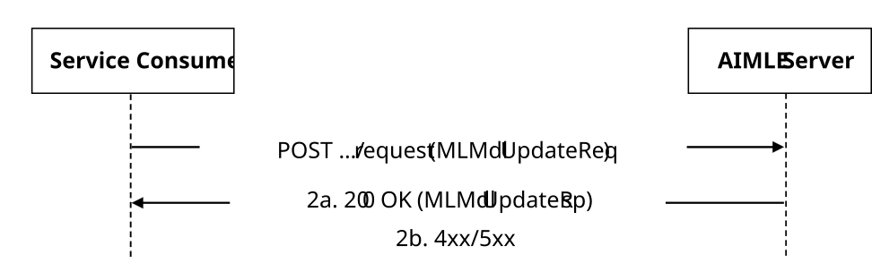

# 5.2.13 AIMLES_MLModelUpdate Service

## 5.2.13.1 Service Description

The AIMLES_MLModelUpdate service exposed by the AIMLE Server enables a service consumer to:

\- request ML model update to the AIMLE Server.

## 5.2.13.2 Service Operations

### 5.2.13.2.1 Introduction

The service operations defined for the AIMLES_MLModelUpdate API are shown in the table 5.2.13.2.1-1.

Table 5.2.13.2.1-1: Service operations of the AIMLES_MLModelUpdate API

| Service Operation Name       | Description                                                                          | Initiated by                  |
|------------------------------|--------------------------------------------------------------------------------------|-------------------------------|
| AIMLES_MLModelUpdate_Request | This service operation is used by a service consumer to request the ML model update. | e.g., VAL Server, ADAE Server |

### 5.2.13.2.2 AIMLES_MLModelUpdate_Request

#### 5.2.13.2.2.1 General

This service operation is used by a service consumer to request ML model update at the AIMLE server.

The following procedures are supported by the "AIMLES_MLModelUpdate_Request" service operation:

\- ML Model Update Request.

#### 5.2.13.2.2.2 ML Model Update Request

Figure 5.2.13.2.2.2-1 depicts a scenario where a service consumer sends a request to the AIMLE Server to request ML model update (see also clause 8.21 of 3GPP TS 23.482 \[9\]).

Figure 5.2.13.2.2.2-1: Procedure for ML Model Update Request

1\. In order to request ML model update request, the service consumer shall send an HTTP POST request to the AIMLE Server targeting the URI of the corresponding custom operation (i.e., "RequestMLMdlUpd"), with the request body including the MLMdlUpdateReq data structure.

2a. Upon success, the AIMLE Server shall respond with an HTTP "200 OK" status code including the MLMdlUpdateRsp data type to indicate that the request is successfully received and processed.

2b. On failure, the appropriate HTTP status code indicating the error shall be returned and appropriate additional error information should be returned in the HTTP POST response body, as specified in clause 6.1.15.7.
