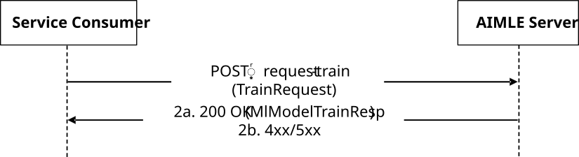
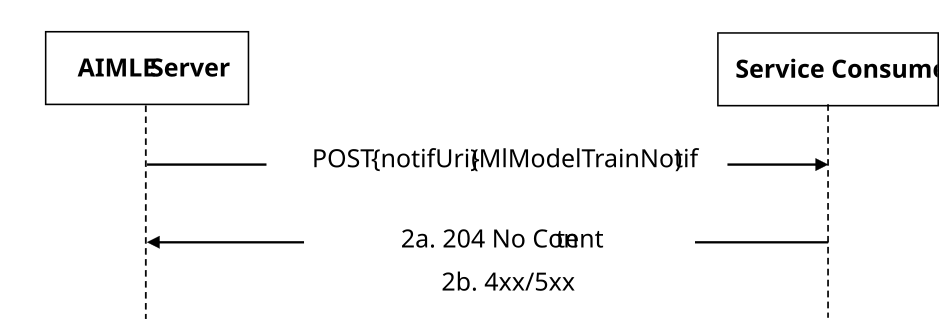

# 5.2.14 AIMLES_MLModelTraining Service

## 5.2.14.1 Service Description

The AIMLES_MLModelTraining Service, exposed by the AIMLE Server, enables a service consumer to:

\- request the AIMLE server for the ML model training.

## 5.2.14.2 Service Operations

### 5.2.14.2.1 Introduction

The service operations defined for the AIMLES_MLModelTraining API are shown in the Table 5.2.14.2.1-1.

Table 5.2.14.2.1-1: Service operations of the AIMLES_MLModelTraining API

| Service Operation Name         | Description                                                                                      | Initiated by     |
|--------------------------------|--------------------------------------------------------------------------------------------------|------------------|
| AIMLES_MLModelTraining_Request | This service operation enables a service consumer to request AIMLE server for ML model training. | e.g., VAL Server |
| AIMLES_MLModelTraining_Notify  | This service operation enables a service consumer to receive ML model training notifications.    | AIMLE Server     |

### 5.2.14.2.2 AIMLES_MLModelTraining_Request

#### 5.2.14.2.2.1 General

This service operation is used by a service consumer to perform AIMLE ML Model Training Request at the AIMLE Server.

The following procedures are supported by the "AIMLES_MLModelTraining_Request" service operation:

\- AIMLE ML Model Training Request.

#### 5.2.14.2.2.2 AIMLE ML Model Training Request

Figure 5.2.14.2.2.2-1 depicts a scenario where a service consumer sends a request to the AIMLE Server to request AIMLE ML Model Training (see also clause 8.3 of 3GPP TS 23.482 \[9\]).

Figure 5.2.14.2.2.2-1: Procedure for AIMLE ML Model Training Request

1\. In order to request to AIMLE ML model training, the service consumer shall send an HTTP POST request to the AIMLE Server targeting the URI of the custom operation "RequestTrain" in "/request-train".

2a. Upon success, the AIMLE Server shall respond with an HTTP "200 OK" status code with the response body containing the "MlModelTrainResp" data structure.

2b. On failure, the appropriate HTTP status code indicating the error shall be returned and appropriate additional error information should be returned in the HTTP GET response body, as specified in clause 6.1.8.7.

### 5.2.14.2.3 AIMLES_MLModelTraining_Notify

#### 5.2.14.2.3.1 General

This service operation is used by a AIMLE Server to notify a previously subscribed service consumer on:

\- AIMLE ML Model Training notification.

The following procedures are supported by the "AIMLES_MLModelTraining_Notify" service operation:

\- AIMLE ML Model Training Notification.

#### 5.2.14.2.3.2 AIMLE ML Model Training Notification

Figure 5.2.14.2.3.2-1 depicts a scenario where the AIMLE Server sends a request to notify a previously subscribed service consumer on AIMLE ML Model Training report(s) (see also clause 8.15 of 3GPP TS 23.482 \[9\]).

Figure 5.2.14.2.3.2-1: Procedure for AIMLE ML Model Training Notification

1\. In order to notify a previously subscribed service consumer on AIMLE ML Model Training report(s), the AIMLE Server shall send an HTTP POST request to the service consumer with the request URI set to "{notifUri}", where the "notifUri" variable is set to the value received from the service consumer during the creation of the corresponding AIMLE ML Model Training Request using the procedures defined in clauses 5.2.14.2.3.2, and the request body including the MlModelTrainNotif data structure.

2a. Upon success, the service consumer shall respond to the AIMLE Server with an HTTP "204 No Content" status code to acknowledge the reception of the notification.

2b. On failure, the appropriate HTTP status code indicating the error shall be returned and appropriate additional error information should be returned in the HTTP POST response body, as specified in clause 6.1.8.7.
