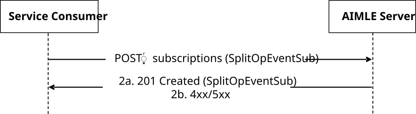
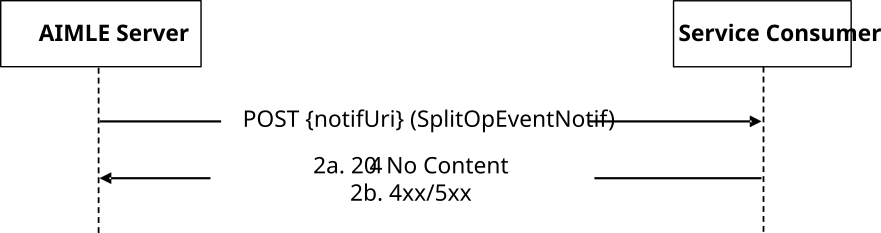
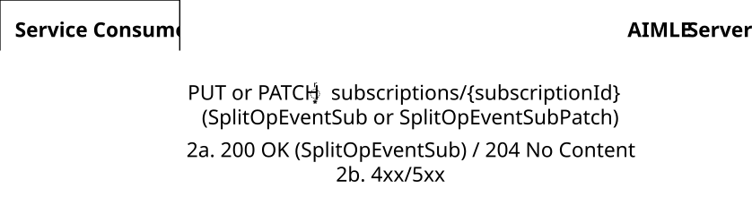
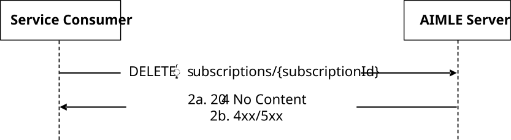

# 5.2.15 AIMLES_SplitOpEvent Service

## 5.2.15.1 Service Description

The AIMLES_SplitOpEvent Service, exposed by the AIMLE Server, enables a service consumer to:

\- subscribe, unsubscribe, update subscription and receive notifications about split AI/ML operation events.

## 5.2.15.2 Service Operations

### 5.2.15.2.1 Introduction

The service operations defined for the AIMLES_SplitOpEvent API are shown in the Table 5.2.15.2.1-1.

Table 5.2.15.2.1-1: Service operations of the AIMLES_SplitOpEvent API

| Service Operation Name          | Description                                                                                                       | Initiated by                   |
|---------------------------------|-------------------------------------------------------------------------------------------------------------------|--------------------------------|
| AIMLES_SplitOpEvent_Subscribe   | This service operation enables a service consumer to create a AIMLE Split Operation Event Subscription.           | e.g., AIMLE Client, VAL Server |
| AIMLES_SplitOpEvent_Notify      | This service operation enables a service consumer to receive AIMLE Split Operation Event notifications.           | AIMLE Server                   |
| AIMLES_SplitOpEvent_Update      | This service operation enables a service consumer to update an existing AIMLE Split Operation Event Subscription. | e.g., AIMLE Client, VAL Server |
| AIMLES_SplitOpEvent_Unsubscribe | This service operation enables a service consumer to delete an existing AIMLE Split Operation Event Subscription. | e.g., AIMLE Client, VAL Server |

### 5.2.15.2.2 AIMLES_SplitOpEvent_Subscribe

#### 5.2.15.2.2.1 General

This service operation is used by a service consumer to perform AIMLE Split Operation Event Subscription at the AIMLE Server.

The following procedures are supported by the "AIMLES_SplitOpEvent_Subscribe" service operation:

\- AIMLE Split Operation Event Subscription Creation.

#### 5.2.15.2.2.2 AIMLE Split Operation Event Subscription Creation

Figure 5.2.15.2.2.2-1 depicts a scenario where a service consumer sends a request to the AIMLE Server to request AIMLE Split Operation Event Subscription Creation (see also clause 8.14 of 3GPP TS 23.482 \[9\]).

Figure 5.2.15.2.2.2-1: Procedure for AIMLE Split Operation Event Subscription Creation

1\. In order to subscribe to AIMLE Split Operation Event Notification, the service consumer shall send an HTTP POST request to the AIMLE Server targeting the URI of the "AIMLE Split Operation Event Subscriptions" collection resource, with the request body including the SplitOpEventSub data structure.

2a. Upon success, the AIMLE Server shall respond with an HTTP "201 Created" status code with the response body containing a representation of the created "Individual AIMLE Split Operation Event Subscription" resource within the SplitOpEventSub data structure, and an HTTP "Location" header field containing the URI of the created resource.

2b. On failure, the appropriate HTTP status code indicating the error shall be returned and appropriate additional error information should be returned in the HTTP POST response body, as specified in clause 6.1.12.7.

### 5.2.15.2.3 AIMLES_SplitOpEvent_Notify

#### 5.2.15.2.3.1 General

This service operation is used by a AIMLE Server to notify a previously subscribed service consumer on:

\- AIMLE Split Operation Event report(s).

The following procedures are supported by the "AIMLES_SplitOpEvent_Notify" service operation:

\- AIMLE Split Operation Event Notification.

#### 5.2.15.2.3.2 AIMLE Split Operation Event Notification

Figure 5.2.15.2.3.2-1 depicts a scenario where the AIMLE Server sends a request to notify a previously subscribed service consumer on AIMLE Split Operation Event report(s) (see also clause 8.14 of 3GPP TS 23.482 \[9\]).

Figure 5.2.15.2.3.2-1: Procedure for AIMLE Split Operation Event Notification

1\. In order to notify a previously subscribed service consumer on AIMLE Split Operation Event report(s), the AIMLE Server shall send an HTTP POST request to the service consumer with the request URI set to "{notifUri}", where the "notifUri" variable is set to the value received from the service consumer during the creation of the corresponding AIMLE Split Operation Event Subscription using the procedures defined in clauses 5.2.15.2.2.2, and the request body including the SplitOpEventNotif data structure.

2a. Upon success, the service consumer shall respond to the AIMLE Server with an HTTP "204 No Content" status code to acknowledge the reception of the notification.

2b. On failure, the appropriate HTTP status code indicating the error shall be returned and appropriate additional error information should be returned in the HTTP POST response body, as specified in clause 6.1.12.7.

### 5.2.15.2.4 AIMLES_SplitOpEvent_Update

#### 5.2.15.2.4.1 General

This service operation is used by a service consumer to request the update of a AIMLE Split Operation Event Subscription at the AIMLE server.

The following procedures are supported by the "AIMLES_SplitOpEvent_Update" service operation:

\- AIMLE Split Operation Event Subscription Update.

#### 5.2.15.2.4.2 AIMLE Split Operation Event Subscription Update

Figure 5.2.15.2.4.2-1 depicts a scenario where a service consumer sends a request to the AIMLE Server to request the update of AIMLE Split Operation Event Subscription (see also clause 8.14 of 3GPP TS 23.482 \[9\]).

Figure 5.2.15.2.4.2-1: Procedure for AIMLE Split Operation Event Subscription Update

1\. In order to request the update of an existing AIMLE Split Operation Event subscription, the service consumer shall send an HTTP PUT/PATCH request to the AIMLE Server, targeting the URI of the corresponding "Individual AIMLE Split Operation Event Subscription" resource, with the request body including either:

\- the updated representation of the resource within the SplitOpEventSub data structure, in case the HTTP PUT method is used; or

\- the requested modifications to the resource within the SplitOpEventSubPatch data structure, in case the HTTP PATCH method is used.

2a. Upon success, the AIMLE Server shall update the targeted "Individual AIMLE Split Operation Event Subscription" resource accordingly and respond with either:

\- an HTTP "200 OK" status code with the response body containing a representation of the updated resource within the SplitOpEventSub data structure; or

\- an HTTP "204 No Content" status code.

2b. On failure, the appropriate HTTP status code indicating the error shall be returned and appropriate additional error information should be returned in the HTTP PUT/PATCH response body, as specified in clause 6.1.12.7.

### 5.2.15.2.5 AIMLES_SplitOpEvent_Unsubscribe

#### 5.2.15.2.5.1 General

This service operation is used by a service consumer to request the deletion of AIMLE Split Operation Event Subscription at the AIMLE Server.

The following procedures are supported by the "AIMLES_SplitOpEvent_Unsubscribe" service operation:

\- AIMLE Split Operation Event Subscription Deletion.

#### 5.2.15.2.5.2 AIMLE Split Operation Event Subscription Deletion

Figure 5.2.15.2.5.2-1 depicts a scenario where a service consumer sends a request to the AIMLE Server to delete an existing AIMLE Split Operation Event Subscription (see also clause 8.14 of 3GPP TS 23.482 \[9\]).

Figure 5.2.15.2.5.2-1: Procedure for AIMLE Split Operation Event Subscription Deletion

1\. In order to request the deletion of an existing AIMLE Split Operation Event subscription, the service consumer shall send an HTTP DELETE request to the AIMLE Server targeting the URI of the corresponding "Individual AIMLE Split Operation Event Subscription" resource.

2a. Upon success, the AIMLE Server shall respond with an HTTP "204 No Content" status code.

2b. On failure, the appropriate HTTP status code indicating the error shall be returned and appropriate additional error information should be returned in the HTTP DELETE response body, as specified in clause 6.1.12.7.
