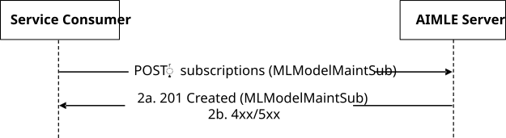
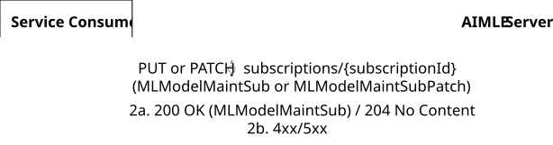
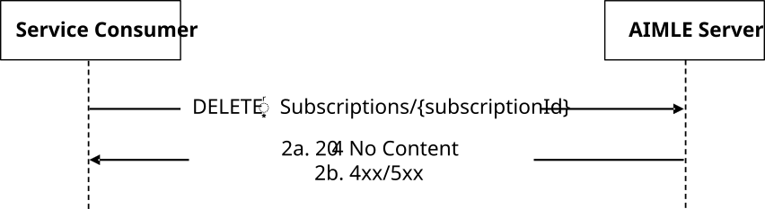
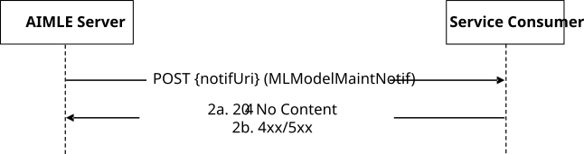

# 5.2.16 AIMLES_MLModelMaintenance Service

## 5.2.16.1 Service Description

The AIMLES_MLModelMaintenance Service, exposed by the AIMLE Server, enables a service consumer to:

\- subscribe, unsubscribe, update subscription and receive notifications about ML Model Maintenance service.

## 5.2.16.2 Service Operations

### 5.2.16.2.1 Introduction

The service operations defined for the AIMLES_MLModelMaintenance API are shown in the Table 5.2.16.2.1-1.

Table 5.2.16.2.1-1: Service operations of the AIMLES_MLModelMaintenance API

| Service Operation Name              | Description                                                                                      | Initiated by     |
|-------------------------------------|--------------------------------------------------------------------------------------------------|------------------|
| AIMLES_MLModelMaintenance_Subscribe | This service operation enables a service consumer to create a ML Model Maintenance subscription. | e.g., VAL Server |
| AIMLES_MLModelMaintenance_Notify    | This service operation enables a service consumer to receive ML Model Maintenance notifications. | AIMLE Server     |

### 5.2.16.2.2 AIMLES_MLModelMaintenance_Subscribe

#### 5.2.16.2.2.1 General

This service operation is used by a service consumer to perform ML Model Maintenance Subscription at the AIMLE Server.

The following procedures are supported by the "AIMLES_MLModelMaintenance_Subscribe" service operation:

\- ML Model Maintenance Subscription Creation.

\- ML Model Maintenance Subscription Update.

\- ML Model Maintenance Subscription Deletion.

#### 5.2.16.2.2.2 ML Model Maintenance Subscription Creation

Figure 5.2.16.2.2.2-1 depicts a scenario where a service consumer sends a request to the AIMLE Server to request ML Model Maintenance Subscription Creation (see also clause 8.XX of 3GPP TS 23.482 \[9\]).

Figure 5.2.16.2.2.2-1: Procedure for ML Model Maintenance Subscription Creation

1\. In order to subscribe to ML Model Maintenance Notification, the service consumer shall send an HTTP POST request to the AIMLE Server targeting the URI of the "ML Model Maintenance Subscriptions" collection resource, with the request body including the MLModelMaintSub data structure.

2a. Upon success, the AIMLE Server shall respond with an HTTP "201 Created" status code with the response body containing a representation of the created "Individual ML Model Maintenance Subscription" resource within the MLModelMaintSub data structure, and an HTTP "Location" header field containing the URI of the created resource.

2b. On failure, the appropriate HTTP status code indicating the error shall be returned and appropriate additional error information should be returned in the HTTP POST response body, as specified in clause 6.1.16.7.

#### 5.2.16.2.2.3 ML Model Maintenance Subscription Update

Figure 5.2.16.2.2.3-1 depicts a scenario where a service consumer sends a request to the AIMLE Server to request the update of ML Model Maintenance Subscription (see also clause 8.XX of 3GPP TS 23.482 \[9\]).

Figure 5.2.16.2.2.3-1: Procedure for ML Model Maintenance Subscription Update

1\. In order to request the update of an existing ML Model Maintenance subscription, the service consumer shall send an HTTP PUT/PATCH request to the AIMLE Server, targeting the URI of the corresponding "Individual ML Model Maintenance Subscription" resource, with the request body including either:

\- the updated representation of the resource within the MLModelMaintSub data structure, in case the HTTP PUT method is used; or

\- the requested modifications to the resource within the MLModelMaintSubPatch data structure, in case the HTTP PATCH method is used.

2a. Upon success, the AIMLE Server shall update the targeted "Individual ML Model Maintenance Subscription" resource accordingly and respond with either:

\- an HTTP "200 OK" status code with the response body containing a representation of the updated resource within the MLModelMaintSub data structure; or

\- an HTTP "204 No Content" status code.

2b. On failure, the appropriate HTTP status code indicating the error shall be returned and appropriate additional error information should be returned in the HTTP PUT/PATCH response body, as specified in clause 6.1.16.7.

#### 5.2.16.2.2.4 ML Model Maintenance Subscription Deletion

Figure 5.2.16.2.2.4-1 depicts a scenario where a service consumer sends a request to the AIMLE Server to delete an existing ML Model Maintenance Subscription (see also clause 8.XX of 3GPP TS 23.482 \[9\]).

Figure 5.2.16.2.2.4-1: Procedure for ML Model Maintenance Subscription Deletion

1\. In order to request the deletion of an existing ML Model Maintenance subscription, the service consumer shall send an HTTP DELETE request to the AIMLE Server targeting the URI of the corresponding "Individual ML Model Maintenance Subscription" resource.

2a. Upon success, the AIMLE Server shall respond with an HTTP "204 No Content" status code.

2b. On failure, the appropriate HTTP status code indicating the error shall be returned and appropriate additional error information should be returned in the HTTP DELETE response body, as specified in clause 6.1.16.7.

### 5.2.16.2.3 AIMLES_MLModelMaintenance_Notify

#### 5.2.16.2.3.1 General

This service operation is used by a AIMLE Server to notify a previously subscribed service consumer on:

\- ML Model Maintenance report(s).

The following procedures are supported by the "AIMLES_MLModelMaintenance_Notify" service operation:

\- ML Model Maintenance Notification.

#### 5.2.16.2.3.2 ML Model Maintenance Notification

Figure 5.2.16.2.3.2-1 depicts a scenario where the AIMLE Server sends a request to notify a previously subscribed service consumer on ML Model Maintenance report(s) (see also clause 8.XX of 3GPP TS 23.482 \[9\]).

Figure 5.2.16.2.3.2-1: Procedure for ML Model Maintenance Notification

1\. In order to notify a previously subscribed service consumer on ML Model Maintenance report(s), the AIMLE Server shall send an HTTP POST request to the service consumer with the request URI set to "{notifUri}", where the "notifUri" variable is set to the value received from the service consumer during the creation of the corresponding ML Model Maintenance Subscription using the procedures defined in clauses 5.2.16.2.2.2, and the request body including the MLModelMaintNotif data structure.

2a. Upon success, the service consumer shall respond to the AIMLE Server with an HTTP "204 No Content" status code to acknowledge the reception of the notification.

2b. On failure, the appropriate HTTP status code indicating the error shall be returned and appropriate additional error information should be returned in the HTTP POST response body, as specified in clause 6.1.16.7.
