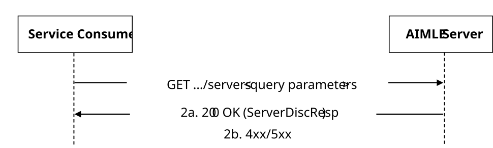

# 5.2.18 AIMLES_ServerDiscovery Service

## 5.2.18.1 Service Description

The AIMLES_ServerDiscovery service exposed by the AIMLE Server enables a service consumer to:

\- discover the AIMLE server information from the AIMLE Server.

## 5.2.18.2 Service Operations

### 5.2.18.2.1 Introduction

The service operations defined for AIMLES_ServerDiscovery API are shown in the table 5.2.18.2.1-1.

Table 5.2.18.2.1-1: AIMLES_ServerDiscovery Service Operations

| Service Operation Name         | Description                                                                                    | Initiated by     |
|--------------------------------|------------------------------------------------------------------------------------------------|------------------|
| AIMLES_ServerDiscovery_Request | This service operation is used by a service consumer to discover the AIMLE server information. | e.g., VAL Server |

### 5.2.18.2.2 AIMLES_ServerDiscovery_Request

#### 5.2.18.2.2.1 General

This service operation is used by a service consumer to request AIMLE server discovery from the AIMLE Server.

The following procedures are supported by the "AIMLES_ServerDiscovery_Request" service operation:

\- AIMLE Server Discovery Request.

#### 5.2.18.2.2.2 AIMLE Server Discovery Request

Figure 5.2.18.2.2.2-1 depicts a scenario where a service consumer sends a request to discover AIMLE Server information from the AIMLE Server (see also clause 8.x of 3GPP TS 23.482 \[9\]).

Figure 5.2.18.2.2.2-1: Procedure for AIMLE Server Discovery Request

1\. In order to discover the AIMLE Server(s), the service consumer shall send an HTTP GET request to the AIMLE Server targeting the URI of the "AIMLE Servers" resource, with the request URI query parameters including the filter criteria to discover the matching AIMLE Server(s).

2a. Upon success, the AIMLE Server shall respond with an HTTP "200 OK" status code with the response body containing a list of AIMLE Server(s) within the ServerDiscResp data structure.

2b. On failure, the appropriate HTTP status code indicating the error shall be returned and appropriate additional error information should be returned in the HTTP GET response body, as specified in clause 6.1.18.7.
