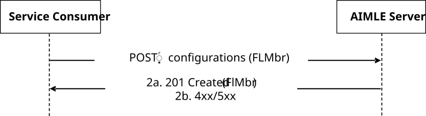
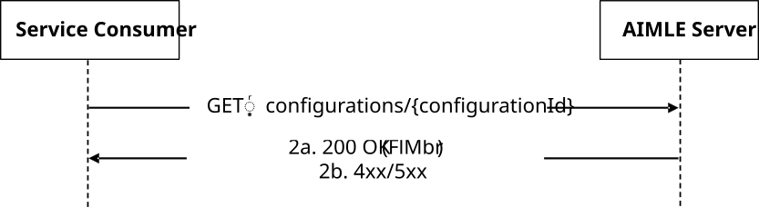
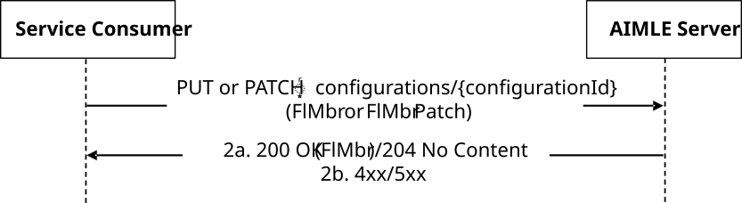
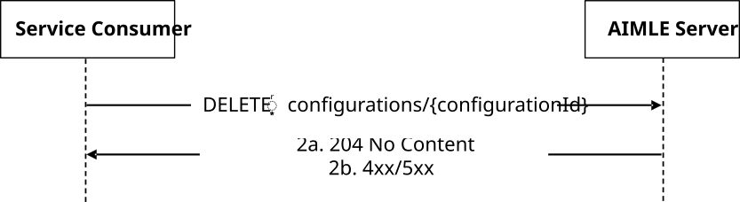

# 5.2.19 AIMLES_FLMember Service

## 5.2.19.1 Service Description

The AIMLES_FLMember Service, exposed by the AIMLE Server, enables a service consumer to:

\- register, query, update, and deregister FL members consisting of AIMLE Clients.

## 5.2.19.2 Service Operations

### 5.2.19.2.1 Introduction

The service operations defined for AIMLES_FLMember API for are shown in the table 5.2.19.2.1-1.

Table 5.2.19.2.1-1: Operations for AIMLES_FLMember API

| Service operation name              | Description                                                                                  | Initiated by                        |
|-------------------------------------|----------------------------------------------------------------------------------------------|-------------------------------------|
| AIMLES_FLMember_Registration        | This service operation is used to register an Individual FL Member.                          | Service consumer (e.g., VAL Server) |
| AIMLES_FLMember_Registration_Query  | This service operation is used to query for an Individual registered FL Member.              | Service consumer (e.g., VAL Server) |
| AIMLES_FLMember_Registration_Update | This service operation is used to update registration of an Individual registered FL Member. | Service consumer (e.g., VAL Server) |
| AIMLES_FLMember_Deregistration      | This service operation is used to deregister an Individual registered FL Member.             | Service consumer (e.g., VAL Server) |

### 5.2.19.2.2 AIMLES_FLMember_Registration

#### 5.2.19.2.2.1 General

This service operation is used by a service consumer to request the AIMLE Server to register an Individual FL Member.

The following procedure is supported by the "AIMLES_FLMember_Registration" service operation:

\- AIMLES FL Member Registration.

#### 5.2.19.2.2.2 AIMLES FL Member Registration

Figure 5.2.19.2.2.2-1 depicts a scenario where a service consumer (e.g., VAL Server) sends a request to the AIMLE Server to register an Individual FL Member. (see clause 8.4 of 3GPP TS 23.482 \[9\]).

Figure 5.2.19.2.2.2-1: Procedure for AIMLES FL Member Registration

1\. In order to register an Individual FL Member, the service consumer (e.g., VAL Server) shall send an HTTP POST request to the AIMLE Server targeting the URI of the corresponding resource (i.e., "FL Member Configurations"), with the request body including the FlMbr data structure.

2a. Upon success that the request to register the Individual FL Member is successfully received and processed, the AIMLE Server shall respond with an HTTP "201 Created" status code with the request body including the FlMbr data structure.

2b. On failure, the appropriate HTTP status code indicating the error shall be returned and appropriate additional error information should be returned in the HTTP POST response body, as specified in clause 6.1.19.7.

### 5.2.19.2.3 AIMLES_FLMember_Registration_Query

#### 5.2.19.2.3.1 General

This service operation is used by a service consumer (e.g., VAL Server) to request the AIMLE Server to query an Individual Registered FL Member.

The following procedure is supported by the "AIMLES_FLMember_Registration_Query" service operation:

\- AIMLE FL Member Registration Query.

#### 5.2.19.2.3.2 AIMLES FL Member Registration Query

Figure 5.2.19.2.3.2-1 depicts a scenario where a service consumer (e.g., VAL Server) sends a request to the AIMLE Server to query an Individual Registered FL Member. (see clause 8.4 of 3GPP TS 23.482 \[9\]).

Figure 5.2.19.2.3.2-1: Procedure for AIMLES FL Member Registration Query

1\. In order to query an Individual Registered FL Member, the service consumer (e.g., VAL Server) shall send an HTTP GET request to the AIMLE Server targeting the URI of the corresponding resource (i.e., "Individual FL Member Configuration").

2a. Upon success that the request to query the Registered FL Member is successfully received and processed, the AIMLE Server shall respond with an HTTP "200 OK" status code with the request body including the FlMbr data structure.

2b. On failure, the appropriate HTTP status code indicating the error shall be returned and appropriate additional error information should be returned in the HTTP GET response body, as specified in clause 6.1.19.7.

### 5.2.19.2.4 AIMLES_FLMember_Registration_Update

#### 5.2.19.2.4.1 General

This service operation is used by a service consumer (e.g., VAL Server) to request the AIMLE Server to update registration of an Individual Registered FL Member.

The following procedure is supported by the "AIMLES_FLMember_Registration_Update" service operation:

\- AIMLES FL Member Registration Update.

#### 5.2.19.2.4.2 AIMLES FL Member Registration Update

Figure 5.2.19.2.4.2-1 depicts a scenario where a service consumer sends a request to the AIMLE Server to update registration of an Individual Registered FL Member. (see clause 8.4 of 3GPP TS 23.482 \[9\]).

Figure 5.2.19.2.4.2-1: Procedure for AIMLES FL Member Registration Update

1\. In order to update an Individual Registered FL Member, the service consumer (e.g., VAL Server) shall send an HTTP PUT/PATCH request to the AIMLE Server targeting the URI of the corresponding resource (i.e., "Individual FL Member Configuration"), with the request body including either:

\- the updated representation of the resource within the FlMbr data structure, in case the HTTP PUT method is used; or

\- the requested modifications to the resource within the FlMbrPatch data structure, in case the HTTP PATCH method is used.

2a. Upon success that the request to update the Individual Registered FL Member is successfully received and processed, the AIMLE Server shall respond with:

\- an HTTP "200 OK" status code with the response body containing a representation of the updated "Individual Registered FL Member Configuration" resource within the FlMbr data structure; or

\- an HTTP "204 No Content" status code.

2b. On failure, the appropriate HTTP status code indicating the error shall be returned and appropriate additional error information should be returned in the HTTP PUT/PATCH response body, as specified in clause 6.1.19.7.

### 5.2.19.2.5 AIMLES_FLMember_Deregistration

#### 5.2.19.2.5.1 General

This service operation is used by a service consumer (e.g., VAL Server) to request the AIMLE Server to deregister an Individual Registered FL Member.

The following procedure is supported by the "AIMLES_FLMember_Deregistration" service operation:

\- AIMLES FL Member Deregistration.

#### 5.2.19.2.5.2 AIMLES FL Member Deregistration

Figure 5.2.19.2.5.2-1 depicts a scenario where a service consumer (e.g., VAL Server) sends a request to the AIMLE Server to deregister an Individual Registered FL Member. (see also clause 8.4 of 3GPP TS 23.482 \[9\]).

Figure 5.2.19.2.5.2-1: Procedure for AIMLES FL Member Deregistration

1\. In order to delete an Individual Registered FL Member, the service consumer (e.g., VAL Server) shall send an HTTP DELETE request to the AIMLE Server targeting the URI of the corresponding resource (i.e., "Individual FL Member Configuration").

2a. Upon success that the request to delete the Individual Registered FL Member is successfully received and processed, the AIMLE Server shall respond with an HTTP "204 No Content" status code.

2b. On failure, the appropriate HTTP status code indicating the error shall be returned and appropriate additional error information should be returned in the HTTP DELETE response body, as specified in clause 6.1.19.7.
