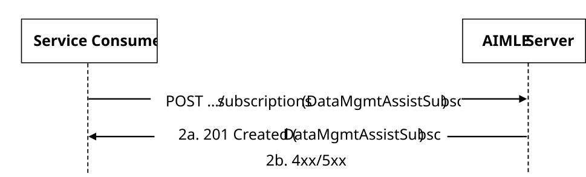
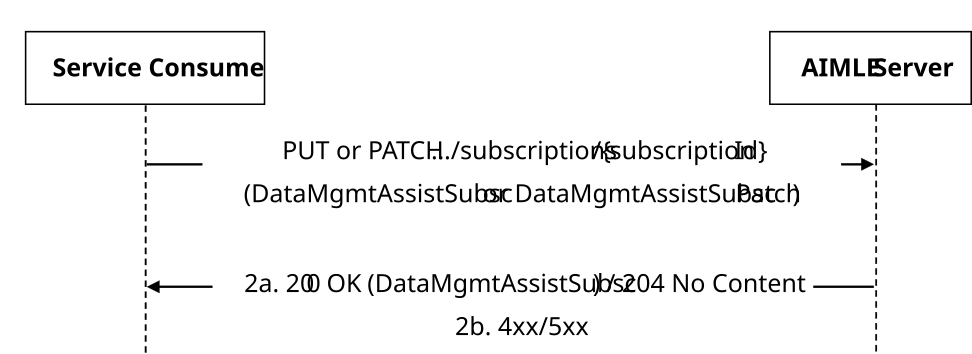
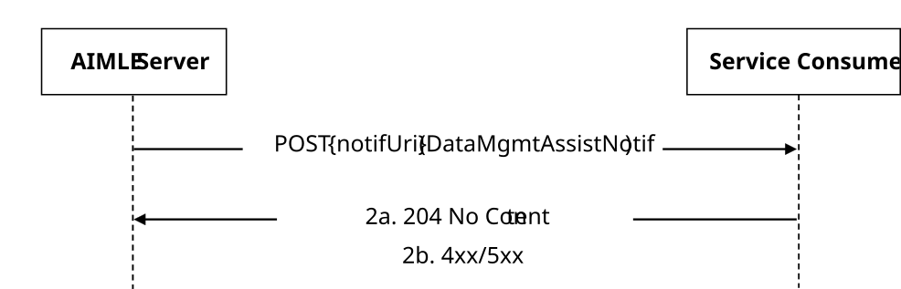

# 5.2.2 AIMLES_DataManagement Service

## 5.2.2.1 Service Description

The AIMLES_DataManagement service exposed by the AIMLE Server enables a service consumer to:

\- create/update/delete an AIMLE Data Management Assistance Subscription; and

\- receive AIMLE Data Management Assistance Notifications.

## 5.2.2.2 Service Operations

### 5.2.2.2.1 Introduction

Table 5.2.2.2.1-1: Service operations of the AIMLES_DataManagement API

| Service Operation Name          | Description                                                                                                                 | Initiated by     |
|---------------------------------|-----------------------------------------------------------------------------------------------------------------------------|------------------|
| AIMLES_DataManagement_Subscribe | This service operation enables a service consumer to create/update/delete an AIMLE Data Management Assistance Subscription. | e.g., VAL Server |
| AIMLES_DataManagement_Notify    | This service operation enables a service consumer to receive AIMLE Data Management Assistance Notifications.                | AIMLE Server     |

### 5.2.2.2.2 AIMLES_DataManagement_Subscribe

#### 5.2.2.2.2.1 General

This service operation is used by a service consumer to request the creation/update/deletion of an AIMLE Data Management Assistance Subscription at the AIMLE Server.

The following procedures are supported by the "AIMLES_DataManagement_Subscribe" service operation:

\- AIMLE Data Management Assistance Subscription Creation.

\- AIMLE Data Management Assistance Subscription Update.

\- AIMLE Data Management Assistance Subscription Deletion.

#### 5.2.2.2.2.2 AIMLE Data Management Assistance Subscription Creation

Figure 5.2.2.2.2.2-1 depicts a scenario where a service consumer sends a request to the AIMLE Server to request the creation of an AIMLE Data Management Assistance Subscription (see also clause 8.15 of 3GPP TS 23.482 \[9\]).

Figure 5.2.2.2.2.2-1: Procedure for AIMLE Data Management Assistance Subscription Creation

1\. In order to subscribe to AIMLE Data Management Assistance reporting, the service consumer shall send an HTTP POST request to the AIMLE Server targeting the URI of the "AIMLE Data Management Assistance Subscriptions" collection resource, with the request body including the DataMgmtAssistSubsc data structure.

2a. Upon success, the AIMLE Server shall respond with an HTTP "201 Created" status code with the response body containing a representation of the created "Individual AIMLE Data Management Assistance Subscription" resource within the DataMgmtAssistSubsc data structure, and an HTTP "Location" header field containing the URI of the created resource.

2b. On failure, the appropriate HTTP status code indicating the error shall be returned and appropriate additional error information should be returned in the HTTP POST response body, as specified in clause 6.1.2.7.

#### 5.2.2.2.2.3 AIMLE Data Management Assistance Subscription Update

Figure 5.2.2.2.2.3-1 depicts a scenario where a service consumer sends a request to the AIMLE Server to request the update of an existing AIMLE Data Management Assistance Subscription (see also clause 8.15 of 3GPP TS 23.482 \[9\]).

Figure 5.2.2.2.2.3-1: Procedure for AIMLE Data Management Assistance Subscription Update

1\. In order to request the update of an existing AIMLE Data Management Assistance Subscription, the service consumer shall send an HTTP PUT/PATCH request to the AIMLE Server, targeting the URI of the corresponding "Individual AIMLE Data Management Assistance Subscription" resource, with the request body including either:

\- the updated representation of the resource within the DataMgmtAssistSubsc data structure, in case the HTTP PUT method is used; or

\- the requested modifications to the resource within the DataMgmtAssistSubscPatch data structure, in case the HTTP PATCH method is used.

NOTE: An alternative service consumer (i.e., other than the ones that previously requested the creation/update of the targeted resource) can initiate this request.

2a. Upon success, the AIMLE Server shall update the targeted "Individual AIMLE Data Management Assistance Subscription" resource accordingly and respond with either:

\- an HTTP "200 OK" status code with the response body containing a representation of the updated "Individual AIMLE Data Management Assistance Subscription" resource within the DataMgmtAssistSubsc data structure; or

\- an HTTP "204 No Content" status code.

2b. On failure, the appropriate HTTP status code indicating the error shall be returned and appropriate additional error information should be returned in the HTTP PUT/PATCH response body, as specified in clause 6.1.2.7.

#### 5.2.2.2.2.4 AIMLE Data Management Assistance Subscription Deletion

Figure 5.2.2.2.2.4-1 depicts a scenario where a service consumer sends a request to the AIMLE Server to request the deletion of an existing AIMLE Data Management Assistance Subscription (see also clause 8.15 of 3GPP TS 23.482 \[9\]).

Figure 5.2.2.2.2.4-1: Procedure for AIMLE Data Management Assistance Subscription Deletion

1\. In order to request the deletion of an existing AIMLE Data Management Assistance Subscription, the service consumer shall send an HTTP DELETE request to the AIMLE Server targeting the URI of the corresponding "Individual AIMLE Data Management Assistance Subscription" resource.

NOTE: An alternative service consumer (i.e. other than the ones that previously requested the creation/update of the targeted resource) can initiate this request.

2a. Upon success, the AIMLE Server shall respond with an HTTP "204 No Content" status code.

2b. On failure, the appropriate HTTP status code indicating the error shall be returned and appropriate additional error information should be returned in the HTTP DELETE response body, as specified in clause 6.1.2.7.

### 5.2.2.2.3 AIMLES_DataManagement_Notify

#### 5.2.2.2.3.1 General

This service operation is used by an AIMLE Server to notify a previously subscribed service consumer on:

\- AIMLE Data Management Assistance related report(s).

The following procedures are supported by the "AIMLES_DataManagement_Notify" service operation:

\- AIMLE Data Management Assistance Notification.

#### 5.2.2.2.3.2 AIMLE Data management Assistance Notification

Figure 5.2.2.2.3.2-1 depicts a scenario where the AIMLE Server sends a request to notify a previously subscribed service consumer on AIMLE Data Management Assistance related report(s) (see also clause 8.15 of 3GPP TS 23.482 \[9\]).

Figure 5.2.2.2.3.2-1: Procedure for AIMLE Data Management Assistance Notification

1\. In order to notify a previously subscribed service consumer on AIMLE Data Management Assistance related report(s), the AIMLE Server shall send an HTTP POST request to the service consumer with the request URI set to "{notifUri}", where the "notifUri" variable is set to the value received from the service consumer during the creation/update of the corresponding AIMLE Data Management Assistance Subscription using the procedures defined in clauses 5.2.2.2.2.2, and the request body including the DataMgmtAssistNotif data structure.

2a. Upon success, the service consumer shall respond to the AIMLE Server with an HTTP "204 No Content" status code to acknowledge the successful reception of the notification.

2b. On failure, the appropriate HTTP status code indicating the error shall be returned and appropriate additional error information should be returned in the HTTP POST response body, as specified in clause 6.1.2.7.
