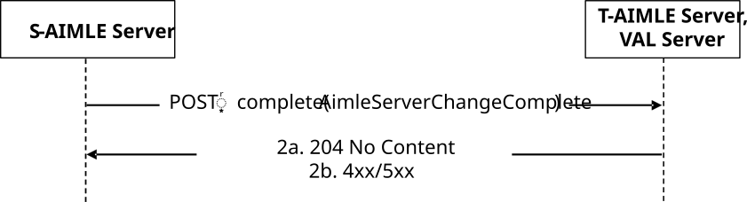

# 5.2.20 AIMLES_ServerChange Service

## 5.2.20.1 Service Description

The AIMLES_ServerChange service, exposed by the target AIMLE Server and the VAL Server, enables the source AIMLE Server to:

\- notify the target AIMLE Server and the VAL Server, completion of a cross-PLMN AIMLE Server change as defined in clause 8.32 of 3GPP TS 23.482 \[9\].

## 5.2.20.2 Service Operations

### 5.2.20.2.1 Introduction

The service operation defined for AIMLES_ServerChange service is shown in the table 5.2.20.2.1-1.

Table 5.2.20.2.1-1: AIMLES_ServerChange Service Operations

| Service operation name     | Description                                                                              | Initiated by        |
|----------------------------|------------------------------------------------------------------------------------------|---------------------|
| AIMLES_ServerChange_Notify | This service operation is used to notify completion of a cross-PLMN AIMLE Server Change. | Source AIMLE Server |

### 5.2.20.2.2 AIMLES_ServerChange_Notify

#### 5.2.20.2.2.1 General

This service operation is used by the source AIMLE Server to notify the target AIMLE Server and the VAL Server, completion of a cross-PLMN AIMLE Server change.

The following procedures are supported by the "AIMLES_ServerChange_Notify" service operation:

\- AIMLE Server Change Notify.

#### 5.2.20.2.2.2 AIMLE Server Change Notify

Figure 5.2.20.2.2.2-1 depicts a scenario where the source AIMLE Server notifies the target AIMLE Server and the VAL Server at the time of completion of a cross-PLMN AIMLE Server change (see clause 8.32 of 3GPP TS 23.482 \[9\]).

Figure 5.2.20.2.2.2-1: Procedure for AIMLE Server Change Notify

1\. To notify target AIMLE server and VAL Server, the source AIMLE Server shall send an HTTP POST request targeting the URI of the corresponding custom operation "AIMLE server change complete", with the request body including the AimleServerChangeComplete data structure as specified in clause TBD.

2a. Upon success, the target AIMLE Server and VAL Server shall respond with an HTTP "204 No Content" status code.

2b. On failure, the appropriate HTTP status code indicating the error shall be returned, and appropriate additional error information should be returned in the HTTP POST response body, as specified in clause TBD.
