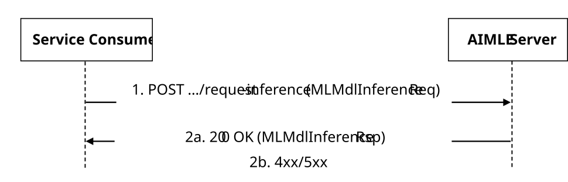

# 5.2.21 AIMLES_MLModelInference Service

## 5.2.21.1 Service Description

The AIMLES_MLModelInference service, exposed by the AIMLE Server, enables a service consumer to:

\- request the AIMLE Server to perform ML model inference.

## 5.2.21.2 Service Operations

### 5.2.21.2.1 Introduction

The service operations defined for the AIMLES_MLModelInference API are shown in table 5.2.21.2.1-1.

Table 5.2.21.2.1-1: Service operations of the AIMLES_MLModelInference API

| Service Operation Name          | Description                                                                                                  | Initiated by     |
|---------------------------------|--------------------------------------------------------------------------------------------------------------|------------------|
| AIMLES_MLModelInference_Request | This service operation enables a service consumer to request the AIMLE Server to perform ML model inference. | e.g., VAL Server |

### 5.2.21.2.2 AIMLES_MLModelInference_Request

#### 5.2.21.2.2.1 General

This service operation is used by a service consumer to perform an AIMLE ML Model Inference Request at the AIMLE Server.

The following procedure is supported by the "AIMLES_MLModelInference_Request" service operation:

\- AIMLE ML Model Inference Request.

#### 5.2.21.2.2.2 AIMLE ML Model Inference Request

Figure 5.2.21.2.2.2-1 depicts a scenario where a service consumer sends a request to the AIMLE Server to request AIMLE ML Model Inference (see also clause 8.36 of 3GPP TS 23.482 \[9\]).

Figure 5.2.21.2.2.2-1: Procedure for AIMLE ML Model Inference Request

1\. In order to request AIMLE ML Model Inference, the service consumer shall send an HTTP POST request to the AIMLE Server targeting the URI of the "AIMLE ML Model Inference Request", with the request body including the MLMdlInferenceReq data structure.

2a. Upon success, the AIMLE Server shall respond with an HTTP "200 OK" status code with the response body containing the MLMdlInferenceRsp data structure.

2b. On failure, the appropriate HTTP status code indicating the error shall be returned and appropriate additional error information should be returned in the HTTP POST response body, as specified in clause 6.1.20.7.
