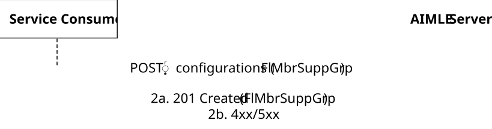
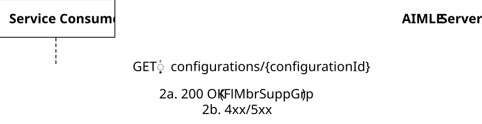
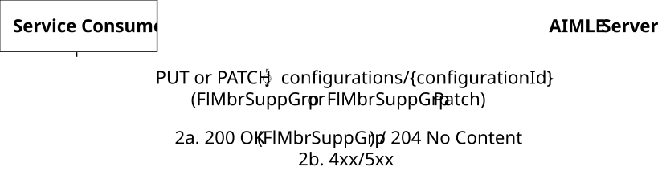
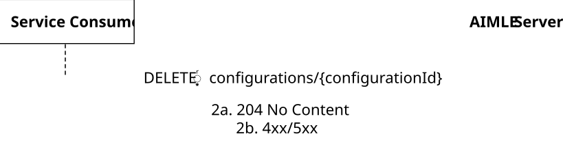

# 5.2.3 AIMLES_FLMemberGroupSupport Service

## 5.2.3.1 Service Description

The AIMLES_FLMemberGroupSupport service, exposed by the AIMLE Server, enables a service consumer to:

\- create, update, and delete an FL Member Group Support for an FL process as defined in clause 8.17 of 3GPP TS 23.482 \[9\].

## 5.2.3.2 Service Operations

### 5.2.3.2.1 Introduction

The service operations defined for AIMLES_FLMemberGroupSupport API are shown in the table 5.2.3.2.1-1.

Table 5.2.3.2.1-1: Operations for AIMLES_FLMemberGroupSupport API

| Service operation name             | Description                                                                                          | Initiated by     |
|------------------------------------|------------------------------------------------------------------------------------------------------|------------------|
| AIMLES_FLMemberGroupSupport_Create | This service operation is used to create an Individual FL Member Group Support for an FL process.    | e.g., VAL Server |
| AIMLES_FLMemberGroupSupport_Query  | This service operation is used to query for an Individual FL Member Group Support for an FL process. | e.g, VAL Server  |
| AIMLES_FLMemberGroupSupport_Update | This service operation is used to update an Individual FL Member Group Support for an FL process.    | e.g., VAL Server |
| AIMLES_FLMemberGroupSupport_Delete | This service operation is used to delete an Individual FL Member Group Support for an FL process.    | e.g., VAL Server |

### 5.2.3.2.2 AIMLES_FLMemberGroupSupport_Create

#### 5.2.3.2.2.1 General

This service operation is used by a service consumer to request the AIMLE Server to create an Individual FL Member Group Support for an FL process.

The following procedure is supported by the "AIMLES_FLMemberGroupSupport_Create" service operation:

\- AIMLES FL Member Group Support Create.

#### 5.2.3.2.2.2 AIMLES FL Member Group Support Create

Figure 5.2.3.2.2.2-1 depicts a scenario where a service consumer sends a request to the AIMLE Server to create an Individual FL Member Group Support for an FL process. (see also clause 8.17.2 of 3GPP TS 23.482 \[9\]).

Figure 5.2.3.2.2.2-1: Procedure for AIMLES FL Member Group Support Create

1\. In order to create an Individual FL Member Group Support for an FL process, the service consumer shall send an HTTP POST request to the AIMLE Server targeting the URI of the corresponding resource (i.e., "FL Member Group Support Configurations"), with the request body including the FlMbrSuppGrp data structure.

2a. Upon success that the request to create the Individual FL Member Group Support for an FL process is successfully received and processed, the AIMLE Server shall respond with an HTTP "201 Created" status code with the response body including the FlMbrSuppGrp data structure.

2b. On failure, the appropriate HTTP status code indicating the error shall be returned and appropriate additional error information should be returned in the HTTP POST response body, as specified in clause 6.1.3.7.

### 5.2.3.2.3 AIMLES_FLMemberGroupSupport_Query

#### 5.2.3.2.3.1 General

This service operation is used by a service consumer to request the AIMLE Server to query an Individual FL Member Group Support for an FL process.

The following procedure is supported by the "AIMLES_FLMemberGroupSupport_Query" service operation:

\- AIMLES FL Member Group Support Query.

#### 5.2.3.2.3.2 AIMLES FL Member Group Support Query

Figure 5.2.3.2.3.2-1 depicts a scenario where a service consumer sends a request to the AIMLE Server to query an Individual FL Member Group Support for an FL process. (see also clause 8.17.2 of 3GPP TS 23.482 \[9\]).

Figure 5.2.3.2.3.2-1: Procedure for AIMLES FL Member Group Support Query

1\. In order to query an Individual FL Member Group Support for an FL process, the service consumer shall send an HTTP GET request to the AIMLE Server targeting the URI of the corresponding resource (i.e., "Individual FL Member Group Support Configuration").

2a. Upon success that the request to query the Individual FL Member Group Support for an FL process is successfully received and processed, the AIMLE Server shall respond with an HTTP "200 OK" status code with the response body including the FlMbrSuppGrp data structure.

2b. On failure, the appropriate HTTP status code indicating the error shall be returned and appropriate additional error information should be returned in the HTTP GET response body, as specified in clause 6.1.3.7.

### 5.2.3.2.4 AIMLES_FLMemberGroupSupport_Update

#### 5.2.3.2.4.1 General

This service operation is used by a service consumer to request the AIMLE Server to update an Individual FL Member Group Support for an FL process.

The following procedure is supported by the "AIMLES_FLMemberGroupSupport_Update" service operation:

\- AIMLES FL Member Group Support Update.

#### 5.2.3.2.4.2 AIMLES FL Member Group Support Update

Figure 5.2.3.2.4.2-1 depicts a scenario where a service consumer sends a request to the AIMLE Server to update an Individual FL Member Group Support for an FL process. (see also clause 8.17.2 of 3GPP TS 23.482 \[9\]).

Figure 5.2.3.2.4.2-1: Procedure for AIMLES FL Member Group Support Update

1\. In order to update an Individual FL Member Group Support for an FL process, the service consumer shall send an HTTP PUT/PATCH request to the AIMLE Server targeting the URI of the corresponding resource (i.e., "Individual FL Member Group Support Configuration"), with the request body including either:

\- the updated representation of the resource within the FlMbrSuppGrp data structure, in case the HTTP PUT method is used; or

\- the requested modifications to the resource within the FlMbrSuppGrpPatch data structure, in case the HTTP PATCH method is used.

NOTE: An alternative service consumer (i.e. other than the one that requested the creation of the targeted resource) can initiate this request.

2a. Upon success that the request to update the Individual FL Member Group Support for an FL process is successfully received and processed, the AIMLE Server shall respond with the response body including either:

\- an HTTP "200 OK" status code with the response body containing a representation of the updated "Individual FL Member Group Support Configuration" resource within the FlMbrSuppGrp data structure; or

\- an HTTP "204 No Content" status code.

2b. On failure, the appropriate HTTP status code indicating the error shall be returned and appropriate additional error information should be returned in the HTTP PUT/PATCH response body, as specified in clause 6.1.3.7.

### 5.2.3.2.5 AIMLES_FLMemberGroupSupport_Delete

#### 5.2.3.2.5.1 General

This service operation is used by a service consumer to request the AIMLE Server to delete an Individual FL Member Group Support for an FL process.

The following procedure is supported by the "AIMLES_FLMemberGroupSupport_Delete" service operation:

\- AIMLES FL Member Group Support Delete.

#### 5.2.3.2.5.2 AIMLES FL Member Group Support Delete

Figure 5.2.3.2.5.2-1 depicts a scenario where a service consumer sends a request to the AIMLE Server to delete an Individual FL Member Group Support for an FL process. (see also clause 8.17.2 of 3GPP TS 23.482 \[9\]).

Figure 5.2.3.2.5.2-1: Procedure for AIMLES FL Member Group Support Delete

1\. In order to delete an Individual FL Member Group Support for an FL process, the service consumer shall send an HTTP DELETE request to the AIMLE Server targeting the URI of the corresponding resource (i.e., "Individual FL Member Group Support Configuration").

2a. Upon success that the request to delete the Individual FL Member Group Support for an FL process is successfully received and processed, the AIMLE Server shall respond with an HTTP "204 No Content" status code.

2b. On failure, the appropriate HTTP status code indicating the error shall be returned and appropriate additional error information should be returned in the HTTP DELETE response body, as specified in clause 6.1.3.7.
