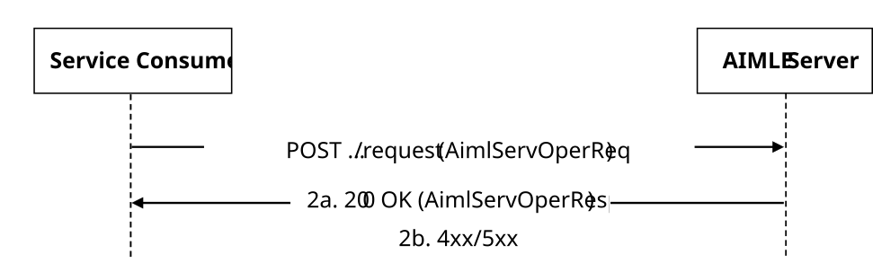

# 5.2.4 AIMLES_AIMLEServiceOperationsManagement Service

## 5.2.4.1 Service Description

The AIMLES_AIMLEServiceOperationsManagement service exposed by the AIMLE Server enables a service consumer to:

\- request AIMLE server to provide AIMLE service operation management.

## 5.2.4.2 Service Operations

### 5.2.4.2.1 Introduction

The service operation defined for AIMLES_AIMLEServiceOperationsManagement API is shown in the table 5.2.4.2.1-1.

Table 5.2.4.2.1-1: AIMLES_AIMLEServiceOperationsManagement Service Operations

| Service Operation Name                          | Description                                                                                         | Initiated by      |
|-------------------------------------------------|-----------------------------------------------------------------------------------------------------|-------------------|
| AIMLES_AIMLEServiceOperationsManagement_Request | This service operation is used by a service consumer to request AIMLE service operation management. | e.g., VAL Server. |

### 5.2.4.2.2 AIMLES_AIMLEServiceOperationsManagement_Request

#### 5.2.4.2.2.1 General

This service operation is used by a service consumer to request AIMLE Service Operations Management to the AIMLE server.

The following procedures are supported by the "AIMLES_AIMLEServiceOperationsManagement_Request " service operation:

\- AIMLE Service Operations Management Request.

#### 5.2.4.2.2.2 AIMLE Service Operations Management Request

Figure 5.2.4.2.2.2-1 depicts a scenario where a service consumer sends a request to the AIMLE Server to request AIMLE Service Operations Management (see also clause 8.20 of 3GPP TS 23.482 \[9\]).

Figure 5.2.4.2.2.2-1: Procedure for AIMLE Service Operations Management Request

1\. In order to request AIMLE service operations management, the service consumer shall send an HTTP POST request to the AIMLE Server targeting the URI of the corresponding custom operation (i.e., "RequestServOpMngt"), with the request body including the AimlServOperReq data structure.

2a. Upon success, the AIMLE Server shall respond with an HTTP "200 OK" status code including the AimlServOperResp data type to indicate that the request is successfully received and processed.

2b. On failure, the appropriate HTTP status code indicating the error shall be returned and appropriate additional error information should be returned in the HTTP POST response body, as specified in clause 6.1.4.7.
