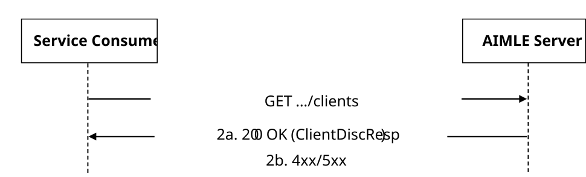

# 5.2.6 AIMLES_AIMLEClientDiscovery Service

## 5.2.6.1 Service Description

The AIMLES_AIMLEClientDiscovery service exposed by the AIMLE Server enables a service consumer to:

\- request AIMLE server to discover the AIMLE Clients according to the filtering criteria

## 5.2.6.2 Service Operations

### 5.2.6.2.1 Introduction

The service operation defined for AIMLES_AIMLEClientDiscovery API is shown in the table 5.2.6.2.1-1.

Table 5.2.6.2.1-1: AIMLES_AIMLEClientDiscovery Service Operations

| Service Operation Name              | Description                                                                         | Initiated by      |
|-------------------------------------|-------------------------------------------------------------------------------------|-------------------|
| AIMLES_AIMLEClientDiscovery_Request | This service operation is used by a service consumer to discover the AIMLE clients. | e.g., VAL Server. |

### 5.2.6.2.2 AIMLES_AIMLEClientDiscovery_Request

#### 5.2.6.2.2.1 General

This service operation is used by a service consumer to request the discovery of the AIMLE Clients.

The following procedures are supported by the "AIMLES_AIMLEClientDiscovery_Request" service operation:

\- AIMLE Clients discovery request.

#### 5.2.6.2.2.2 AIMLE Clients discovery request

Figure 5.2.6.2.2.2-1 depicts a scenario where a service consumer sends a request to the MLR to request the discovery of the ML model(s) (see also clause 8.8 of 3GPP TS 23.482 \[9\]).

Figure 5.2.6.2.2.2-1: Procedure for AIMLE Clients discovery request

1\. In order to discover the AIMLE Client(s), the service consumer shall send an HTTP GET request to the AIMLE Server targeting the URI of the "AIMLE Clients" resource.

2a. Upon success, the AIMLE Server shall respond with an HTTP "200 OK" status code with the response body containing the ClientDiscResp data structure.

2b. On failure, the appropriate HTTP status code indicating the error shall be returned and appropriate additional error information should be returned in the HTTP GET response body, as specified in clause 6.1.6.7.
