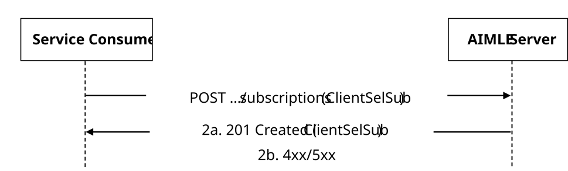
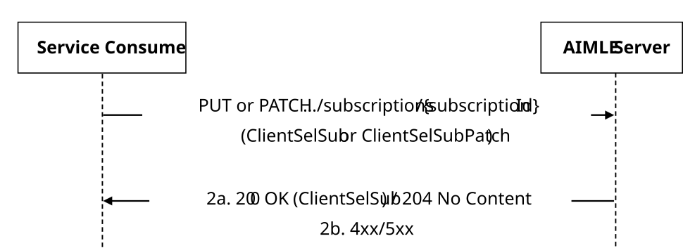
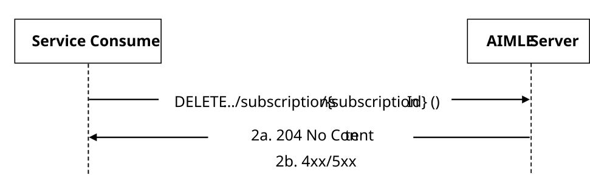
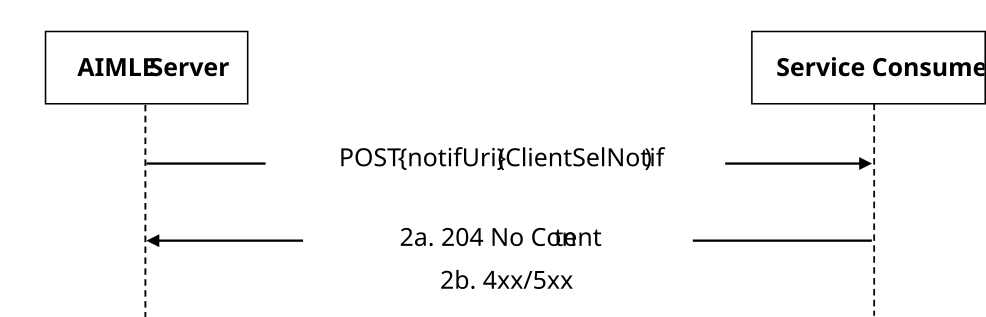
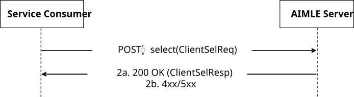

# 5.2.7 AIMLES_AIMLEClientSelection Service

## 5.2.7.1 Service Description

The AIMLES_AIMLEClientSelection service exposed by the AIMLE Server enables a service consumer to:

\- request AIMLE server to select the AIMLE Clients according to the filtering criteria; and

\- request AIMLE server to select the AIMLE Clients and subscribe to the notifications.

## 5.2.7.2 Service Operations

### 5.2.7.2.1 Introduction

The service operation defined for AIMLES_AIMLEClientSelection API is shown in the table 5.2.7.2.1-1.

Table 5.2.7.2.1-1: AIMLES_AIMLEClientSelection Service Operations

| Service Operation Name              | Description                                                                                                                                         | Initiated by      |
|-------------------------------------|-----------------------------------------------------------------------------------------------------------------------------------------------------|-------------------|
| AIMLES_AIMLEClientSelection_Request | This service operation is used by a service consumer to select the AIMLE clients.                                                                   | e.g., VAL Server. |
| AIMLES_ClientSelection_Subscribe    | This service operation is used by a service consumer to subscribe for monitoring and selection of AIMLE clients for AI/ML operations.               | e.g., VAL Server. |
| AIMLES_ClientSelection_Update       | This service operation is used by a service consumer to update the subscription for monitoring and selection of AIMLE clients for AI/ML operations. | e.g., VAL Server. |
| AIMLES_ClientSelection_Unsubscribe  | This service operation is used by a service consumer to delete the subscription for monitoring and selection of AIMLE clients for AI/ML operations. | e.g., VAL Server. |
| AIMLES_ClientSelection_Notify       | This service operation enables a service consumer to receive AIMLE client selection notifications.                                                  | AIMLE Server      |

### 5.2.7.2.2 AIMLES_ClientSelection_Subscribe

#### 5.2.7.2.2.1 General

This service operation is used by a service consumer to request the creation of AIMLE Client Selection Subscription at the AIMLE server.

The following procedures are supported by the "AIMLES_ClientSelection_Subscribe" service operation:

\- AIMLE Client Selection Subscription Creation.

This service operation is used by the analytics consumer for AIMLE Client Selection Subscription to the AIMLE Server.

#### 5.2.7.2.2.2 AIMLE Client Selection Subscription Creation

Figure 5.2.7.2.2.2-1 depicts a scenario where a service consumer sends a request to the AIMLE Server to request the creation of AIMLE Client Selection Subscription (see also clause 8.13 of 3GPP TS 23.482 \[9\]).

Figure 5.2.7.2.2.2-1: Procedure for AIMLE Client Selection Subscription Creation

1\. In order to subscribe to AIMLE Client Selection reporting, the service consumer shall send an HTTP POST request to the AIMLE Server targeting the URI of the "AIMLE Client Selection Subscriptions" collection resource, with the request body including the ClientSelSub data structure.

2a. Upon success, the AIMLE Server shall respond with an HTTP "201 Created" status code with the response body containing a representation of the created "Individual AIMLE Client Selection Subscription" resource within the ClientSelSub data structure, and an HTTP "Location" header field containing the URI of the created resource.

2b. On failure, the appropriate HTTP status code indicating the error shall be returned and appropriate additional error information should be returned in the HTTP POST response body, as specified in clause 6.1.7.7.

### 5.2.7.2.3 AIMLES_ClientSelection_Update

#### 5.2.7.2.3.1 General

This service operation is used by a service consumer to request the update of a AIMLE Client Selection Subscription at the AIMLE server.

The following procedures are supported by the "AIMLES_ClientSelection_Subscribe" service operation:

\- AIMLE Client Selection Subscription Update.

This service operation is used by the analytics consumer for AIMLE Client Selection Subscription to the AIMLE Server.

#### 5.2.7.2.3.2 AIMLE Client Selection Subscription Update

Figure 5.2.7.2.3.2-1 depicts a scenario where a service consumer sends a request to the AIMLE Server to request the update of AIMLE Client Selection Subscription (see also clause 8.13 of 3GPP TS 23 482 \[9\]).

Figure 5.2.7.2.3.2-1: Procedure for AIMLE Client Selection Subscription Update

1\. In order to request the update of an existing AIMLE Client Selection reporting, the service consumer shall send an HTTP PUT/PATCH request to the AIMLE Server, targeting the URI of the corresponding "Individual AIMLE Client Selection Subscription" resource, with the request body including either:

\- the updated representation of the resource within the ClientSelSub data structure, in case the HTTP PUT method is used; or

\- the requested modifications to the resource within the ClientSelSubPatch data structure, in case the HTTP PATCH method is used.

NOTE: An alternative service consumer (i.e. other than the one that requested the creation of the targeted resource) can initiate this request.

2a. Upon success, the AIMLE Server shall update the targeted "Individual AIMLE Client Selection Subscription" resource accordingly and respond with either:

\- an HTTP "200 OK" status code with the response body containing a representation of the updated "Individual AIMLE Client Selection Subscription" resource within the ClientSelSub data structure; or

\- an HTTP "204 No Content" status code.

2b. On failure, the appropriate HTTP status code indicating the error shall be returned and appropriate additional error information should be returned in the HTTP PUT/PATCH response body, as specified in clause 6.1.7.7.

### 5.2.7.2.4 AIMLES_ClientSelection_Unsubscribe

#### 5.2.7.2.4.1 General

This service operation is used by a service consumer to request the deletion of AIMLE Client Selection Subscription at the AIMLE Server.

The following procedures are supported by the "AIMLES_ClientSelection_Unsubscribe" service operation:

\- AIMLE Client Selection Subscription Deletion.

#### 5.2.7.2.4.2 AIMLE Client Selection Subscription Deletion

Figure 5.2.7.2.4.2-1 depicts a scenario where a service consumer sends a request to the AIMLE Server to delete an existing AIMLE Client Selection Subscription (see also clause 8.13 of 3GPP TS 23.482 \[9\]).

Figure 5.2.7.2.4.2-1: Procedure for AIMLE Client Selection Subscription Deletion

1\. In order to request the deletion of an existing AIMLE Client Selection Subscription, the service consumer shall send an HTTP DELETE request to the AIMLE Server targeting the URI of the corresponding "Individual AIMLE Client Selection Subscription" resource.

NOTE: An alternative service consumer (i.e. other than the one that requested the creation of the targeted resource) can initiate this request.

2a. Upon success, the AIMLE Server shall respond with an HTTP "204 No Content" status code.

2b. On failure, the appropriate HTTP status code indicating the error shall be returned and appropriate additional error information should be returned in the HTTP DELETE response body, as specified in clause 6.1.7.7.

### 5.2.7.2.5 AIMLES_ClientSelection_Notify

#### 5.2.7.2.5.1 General

This service operation is used by a AIMLE Server to notify a previously subscribed service consumer on:

\- AIMLE Client Selection report(s).

The following procedures are supported by the "AIMLES_ClientSelection_Notify" service operation:

\- AIMLE Client Selection Notification.

#### 5.2.7.2.5.2 AIMLE Client Selection Notification

Figure 5.2.7.2.5.2-1 depicts a scenario where the AIMLE Server sends a request to notify a previously subscribed service consumer on AIMLE Client Selection report(s) (see also clause 8.13 of 3GPP TS 23.482 \[9\]).

Figure 5.2.7.2.5.2-1: Procedure for AIMLE Client Selection Notification

1\. In order to notify a previously subscribed service consumer on AIMLE Client Selection report(s), the AIMLE Server shall send an HTTP POST request to the service consumer with the request URI set to "{notifUri}", where the "notifUri" variable is set to the value received from the service consumer during the creation of the corresponding AIMLE Client Selection Subscription using the procedures defined in clauses 5.2.7.2.2.2, and the request body including the ClientSelNotif data structure.

2a. Upon success, the service consumer shall respond to the AIMLE Server with an HTTP "204 No Content" status code to acknowledge the reception of the notification.

2b. On failure, the appropriate HTTP status code indicating the error shall be returned and appropriate additional error information should be returned in the HTTP POST response body, as specified in clause 6.1.7.7.

### 5.2.7.2.6 AIMLES_AIMLEClientSelection_Request

#### 5.2.7.2.6.1 General

This service operation is used by a service consumer to request AIMLE Client selection to the AIMLE server.

The following procedures are supported by the "AIMLES_AIMLEClientSelection_Request" service operation:

\- AIMLE Client Selection Request.

#### 5.2.7.2.6.2 AIMLE Client Selection Request

Figure 5.2.7.2.6.2-1 depicts a scenario where a service consumer sends a request to the AIMLE Server to request AIMLE Client Selection (see also clause 8.24.3.1 of 3GPP TS 23.482 \[9\]).

Figure 5.2.7.2.6.2-1: Procedure for AIMLE Client Selection Request

1\. In order to request AIMLE Client Selection, the service consumer shall send an HTTP POST request to the AIMLE Server targeting the URI of the corresponding custom operation (i.e., "Select"), with the request body including the ClientSelReq data structure.

2a. Upon success, the AIMLE Server shall respond with an HTTP "200 OK" status code including the ClientSelResp data type to indicate that the request is successfully received and processed.

2b. On failure, the appropriate HTTP status code indicating the error shall be returned and appropriate additional error information should be returned in the HTTP POST response body, as specified in clause 6.1.7.7.
